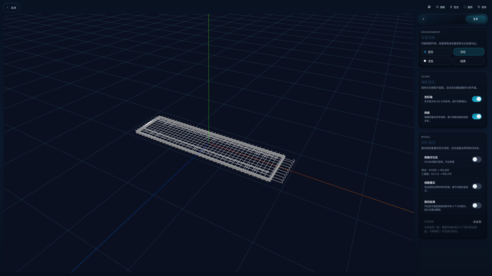
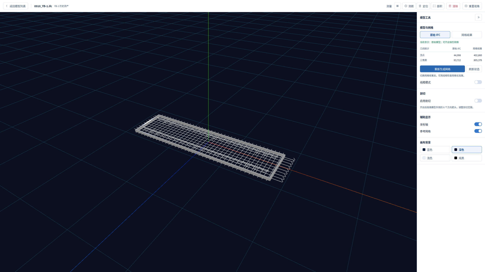
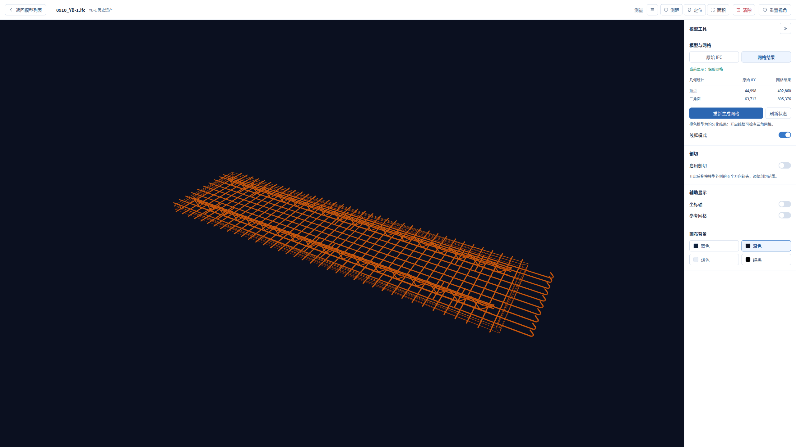
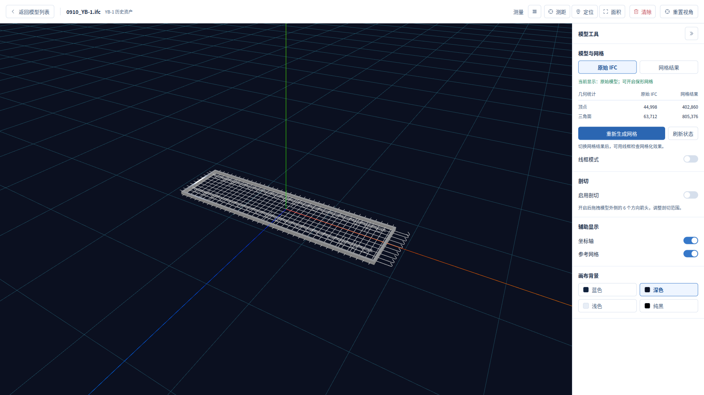

# BIM 模型预览布局改进

本次按 impeccable layout 与现有 DESIGN.md 改进模型预览，面向查看 IFC 和检查网格化效果。保留工作区现有修改及并行加入的网格自动显示逻辑，分支保持 dev-hong。

## 主要变化

- 蓝白工具界面沿用共享色彩、字体、36px 控件和间距令牌，替换深色渐变卡片、青色开关及装饰阴影。用户的四种画布背景保留。
- 顶栏提供返回模型列表、文件/项目上下文、测量和重置视角；测量与画布工具各有位置。
- 侧栏按“模型与网格 → 剖切 → 辅助显示 → 画布背景”排列。原始 IFC 与网格结果采用明确的双按钮切换，顶点/三角面采用对照表，状态和生成入口紧邻。
- 成功结果提供“重新生成网格”，使用既有接口 force:true；空闲、失败、处理中的可操作状态沿用后端门槛。提交锁避免重复提交，并使旧状态请求过期；就绪结果的自动显示/用户原始模型选择仍由已有共享状态逻辑管理。
- 画布填满剩余空间，侧栏可收起。修复窗口变小时 Canvas 仍保留初始 CSS 像素尺寸的问题。
- 修正原有 BIM 剖切调用的参数形状：向渲染器传递 { enabled }，使原有剖切手柄与裁切平面实际生效。

## 截图

以下交付图为浏览器原始 PNG，全部保留 16:9，不裁切、不拉伸。前后对照采用相同模型、背景及相机位置；网格补充图使用稍近视角并关闭坐标轴/参考网格以便检查。

修改前，2560×1440：

修改后，2560×1440：

网格结果与线框，2560×1440：

兼容视口，1920×1080：

## 验证

| 视口（CSS px） | 画布尺寸 | 结果 |
| --- | --- | --- |
| 2560×1440 | 2200×1376 | 无整页溢出，所有模型工具可见 |
| 1920×1080 | 1560×1016 | 无整页溢出，所有模型工具可见 |
| 1512×982（MacBook 常见逻辑分辨率） | 1192×918 | 320px 侧栏，所有工具可见 |
| 1440×900（MacBook 常见逻辑分辨率） | 1120×836 | 所有工具可见 |
| 1280×720（小窗口/高缩放布局压力） | 960×656 | 侧栏独立滚动，生成入口仍在首屏 |

MacBook 按原生比例检查；交付对照图仅使用上述 16:9 截图，没有把 MacBook 原生比例拉伸为 16:9。MacBook 检查使用 Linux Chrome 的视口模拟，未在 macOS Safari 实机上验证。

主视口原画布 2136×1350，现为 2200×1376，可用面积增加约 5%；收起工具栏后画布宽度为 2504px。

- `npm run build` 通过；Vite 仍提示已有大于 500kB 的分包。
- `node --experimental-strip-types --test scripts/test_bim_remesh_preview.mjs src/views/preview/bimRemeshDisplay.test.ts`：14/14 通过。覆盖真实 PLY 装卸、相机/坐标保持、旧异步结果失效、成功强制重跑、处理中禁用、重复提交保护、失败恢复、按钮幂等选择、剖切参数和裁切平面。
- 通过管理脚本确认本地栈健康；在实际页面走通项目 → IFC 列表 → 模型预览 → 返回列表 → 实测 → 配准页。没有保存配准或启动偏差分析。
- 在本地 demo 的资产 7（0910_YB-1.ifc）实际点击一次重新生成：POST 返回 200，随后 processing → succeeded；完成时间从 2026-09-12T15:22:53.476474Z 更新到 2026-09-12T15:37:26.682594Z；相机位置保持。原始模型的主动选择被保留，随后可切换到实际的 805,376 三角面网格，线框材质生效。
- 开关实际控制四种背景、坐标轴、网格和剖切；剖切显示手柄及六个裁切平面。测量选中态显示，Esc 退出有效；键盘 Tab 有 2px 可见焦点，Enter 可返回模型列表；侧栏收起具有展开状态及可访问名称。
- Impeccable 布局初检和完成后的机械检测均返回 `[]`；后续尺寸及文字对比度修正经过最终批量截图确认。小字号辅助文字使用共享次要文字色，主按钮使用共享较深蓝色；不将机械结果等同完整可访问性认证。

## 协作与范围

一个 explorer 子智能体（gpt-5.6-terra / medium）独立完成源码布局评估与重跑接口约束梳理，无源码写入或后台进程；主线程负责修改、集成与验证。子智能体已完成并停止任务；当前工具没有关闭接口，槽位释放未确认，未再复用。过程记录保存在 `.cloudbim/layout-review/agents.md`。

本任务修改 `src/views/preview/AssetPreviewView.vue` 并扩展 `scripts/test_bim_remesh_preview.mjs`，保留期间其他任务加入的 `bimRemeshDisplay` 逻辑。未修改 DESIGN.md 或全局色彩令牌。

补充边界检查：无 assetId 页面显示已有空状态与返回入口；临时使用超长中英文文件名/项目名检查，保持省略号及 64px 顶栏，无水平溢出；最终布局检测仍为 `[]`。这些边界用例未持久化到业务数据。
