# 台面移除后的设计控制网实验

当前入口为 [点云练武场](http://127.0.0.1:8766/)。选择「台面后控制网 · 粗对齐初始化」或「自动初始化」后，从源 LAS 依次执行法向量、台面移除，再进入 **01B-X 台面后控制网**。本轮止于控制网，不执行分区、分层、禁飞区、几何/投影分类或融合，也不读取旧实例。历史分层后与融合后结果仍显示原来的 01E / 03X 步骤，可从历史列表比较。

初始候选是台面移除后的全部非台面原始记录。当前沿用 v15 的分阶段归属，在同一个空间索引上，按长直筋、短筋、腹杆主体依次拟合，每阶段确认唯一归属后锁定对应点，后续拟合、位置恢复及分类只使用未锁定点；待定点继续保留。阶段内仍并行求解、统一竞争，不由单根钢筋的先后顺序决定归属。此顺序按构件类型安排，不进行底层、顶层或腹杆层点云划分。设计半径、平面拒绝和身份歧义保护继续生效；长筋及腹杆主体保持原有长度约束，短筋允许按连续管面证据延长。腹杆主体保持直线约束，弯曲连接在主体确认后单独拟合。v16 增加有独立管面证据的长筋端部和短筋姿态修正；未匹配的腹杆连接可按设计规则补接，并单独标注为推断。v17 将同一恢复机制扩展至长筋单端弯钩；v18 在失败弯钩上按旋转、上翘、偏转、半径、转角及相切尾腿长度调整，保持解析圆弧约束。v19 将尾腿测长统一应用于所有有观测支持的弯钩，结合完整局部走廊、端面和连续侧面，并修正长线段查询覆盖。v20 对成功但局部不贴合的直筋增加独立管面复核与按需扩大候选，并允许推断弯钩的稳定观测区间单独归属。v21 将原始管面复核扩展至长筋，在连续局部偏差处有界增加样条容量，并用独立点验证后重新归属。v22 补齐被整钩稳定门槛误挡的局部连续观测，并独立验证切口端面的点归属。v23 将小幅末端修正扩展到观测覆盖端部的普通直筋，通过独立管面验证后保留轻微上翘。v24 对剩余自由端增加 150–250 mm 的局部窗口，识别被正常内段平均掉的短距离偏转。

台面阶段直接复用已保存的台面掩码，未预处理的源则沿用同一台面平面检测与阈值；跳过投影栅格和临时高度层计算。共享分区、分层、禁飞区属性的全零数组仅为输出兼容占位，报告不含这些步骤；控制网没有语义层统计，界面隐藏层筛选，默认按设计单元标识。

粗对齐模式从保存的位姿开始；自动模式从非台面扫描几何估计控制网位姿。两种模式仍需要服务端设计几何快照，包括钢筋直径、长度和身份关系；“不依赖分层”不表示不依赖设计先验。

输出保留 `control-net.json`、全量 LAS、逐点状态与实例 NPY，以及钢筋、待定、局部离群 LAS。状态 0 为台面、1 为支持钢筋、2 为待定、3 为局部离群；状态 4 仅用于融合排除，本轮没有此类点。源坐标、属性、记录顺序和来源索引保持不变。

## 短距离末端弯曲复核（2026-09-15，v24）

[打开 v24 结果](http://127.0.0.1:8766/?run=20260915T043905-00772683)，重点对照 **#42 起端、#46 末端、#47 末端**。用户指出剩余遗漏仍在普通钢筋末端；本轮未扩展中段或弯钩参数。

v23 的末端修正原本就允许横截面两个方向的组合位移，既能上翘、下弯，也能侧弯。其局限在尺度：普通 1.15 m 钢筋使用约 460 mm 的末端窗口，长筋通常至少 500 mm，最后几十毫米的偏转容易被正常内段平均掉。#47 末端即使出现连续不贴合的条带，整窗口中位残差仍低于 0.5 mm，因而没有启动修正。粗采样的长筋在这一短距离内也可能没有足够节点表达局部变化。

v24 先保留原有通过验证的宽窗口修正，再仅对未修正的自由端按 250、200、150 mm 依次检查，接受第一个通过原有独立证据验证的窗口。每端仍为四个局部参数，没有全局增加样条系数；两个横截面方向都能调整，扩大的是端部局部形变的可表达范围。新窗口内插入共线采样点，准确表示窗口边界和局部衰减，窗口之外不增加弯曲参数。

当整窗口中位残差较小时，新增“靠近端部的两个相邻可靠条带均超出原管面容差”触发条件；触发不代表接受，仍需交替条带独立验证、多个弯曲截面的支持和两次求解稳定性。局部拟合的走廊半径为钢筋半径加最大修正量，即 2.5 倍半径；本批对应 10 mm，减少更远交叉筋及夹具对求解的干扰。最终归属继续检查原完整候选点，未扩大原 1.44 mm 管面分类容差。

新窗口位移上限统一为 1.5 倍半径（本批 6 mm）。沿用设计总弧长，并仅在本次修正端补偿新增弧长，避免移动另一端。由设计母筋几何识别已有曲段连接端，新窗口跳过这些连接端；原有宽窗口逻辑和弯钩求解器继续沿用。插值时合并近重合站点，防止整体旋转后的舍入误差形成零长度端段。

| 端部固定区域 | 原始点数 | 管面误差中位数 v23 → v24 | 实际归属 v23 → v24 |
| --- | ---: | ---: | ---: |
| #42 起端 | 2,135 | 1.318 → 0.475 mm | 1,140 → 1,592（53.4% → 74.6%） |
| #46 末端 | 2,184 | 0.563 → 0.121 mm | 1,728 → 2,014（79.1% → 92.2%） |
| #47 末端 | 2,426 | 0.482 → 0.142 mm | 2,010 → 2,203（82.9% → 90.8%） |

区域按旧模型端内 15–200 mm、距旧轴线小于 10 mm、原法向条件固定选取，不按新模型的内点选取。图为同一批原始点的高度投影，竖向比例放大；橙线为轴线、虚线为轴线 ±4 mm 的高度投影。灰色点仍包含未满足管面或竞争条件的观测，不宣称已经补齐所有遗漏。

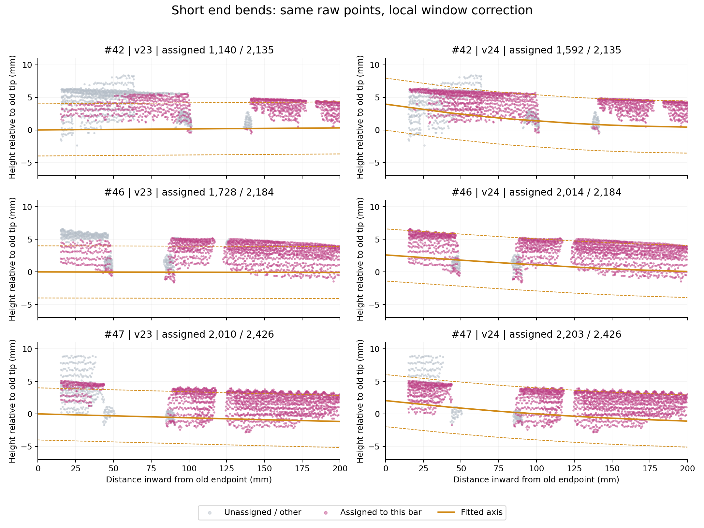

全场 **17 根普通直筋的 20 个末端**通过新增小窗口复核，其中部分钢筋另一端已有 v23 修正。匹配 **1,829,803 → 1,836,747（净增 6,944）**；8,101 个原待定点获得归属，1,157 个原归属点回到待定，155 个点在原竞争规则下改分实例。待定 2,063,597、移除仍为 29。210 个主体、125 个已确认弯段均保持确认。分阶段归属仍会影响后续短筋、腹杆和连接求解，实际共有 38 个主体几何报告变化，不能把“只增加末端参数能力”理解为全场其余输出逐项不变。新增归属数量不代表人工真值召回率。

正式全流程 27.18 s，控制网 17.33 s；上一版正式运行分别为 25.92 / 16.31 s，均为单次本机计时。115 项控制网 Python 测试、35 项 Node 页面数据测试通过。新增短距离弯曲测试在 v23 的两种长度、两端共四个案例上先失败，v24 通过；另覆盖任意旋转、共线采样去重、缺测、平面、已归属邻筋、过大偏移、弧长与内段保持、弯钩连接端保护。正式保存的全部状态、归属、主体及弯段报告与独立全量回放一致；源坐标、法向、台面掩码不变，百万点预览映射以及五份 LAS 的原始字段和来源索引均核对通过。页面实际 HTTP 加载器和 Three.js 几何构建通过；当前任务无已连接浏览器，真实 WebGL 交互未实测。

证据：[全量与局部对照](assets/rebar-local-tips-2026-09-15/audit.json)、[新增末端事件](assets/rebar-local-tips-2026-09-15/local-events.json)、[正式运行核验](assets/rebar-local-tips-2026-09-15/official-verification.json)、[LAS 核验](assets/rebar-local-tips-2026-09-15/las-verification.json)、[页面加载核验](assets/rebar-local-tips-2026-09-15/loader-verification.json)。复查脚本和基线保存在 `/tmp/cloudbim-v24/`，正式结果保存在上述 run。开发栈按 `scripts/cloudbim-dev.sh stop` / `start` 重载；分支保持 `dev-hong`。

## 普通直筋小幅翘端复核（2026-09-15，v23）

[打开 v23 结果](http://127.0.0.1:8766/?run=20260915T042057-8fa140fa)，重点查看 **#6 末端、#38 起端**，与 v22 历史结果对照。

普通长筋原本在两个横截面方向都有自由度，竖向并未锁死。漏点的一处原因是：末端局部修正只接受长度至少 2 m、轴向证据缺口大于 150 mm 的钢筋；观测已覆盖端部但被全段平滑压平的轻微上翘不会进入复核，1.15 m 普通直筋也被排除。

v23 将局部复核扩展到长度至少 0.8 m 的普通直筋，并允许证据覆盖端部的情况。继续使用每端四个参数的局部修正，沿两个横截面方向求解；新增范围的最大位移限制为 1.5 倍半径（本批 8 mm 直径对应 6 mm），并受原候选包络约束。每端影响范围不超过全长的 40%，保留中段；原长筋大缺口外推修复继续使用原位移预算。没有设置全局竖直轴，因此扫描整体旋转后仍得到相同几何修正。

仍要求分布连续的管面证据、交替轴向条带的独立验证、多截面曲率和两次求解稳定性；平面杂点、缺测、已归属邻筋及过大位移不能触发修正。设计半径、总弧长和原管面分类容差保持原规则。事件增加 `trigger`、`displacementLimitM`，区分观测末端复核与外推修正。弯钩拟合代码未调整，弯钩继续依据修正后的主体相切位置求解。

| 普通直筋 / 端部 | 同一固定区域点数 | 管面误差中位数 v22 → v23 | 区域内归属点 v22 → v23 | 端点竖向修正 |
| --- | ---: | ---: | ---: | ---: |
| #6 / 末端 | 6,240 | 0.568 → 0.210 mm | 5,672 → 5,831 | +1.735 mm |
| #10 / 起端 | 6,860 | 0.577 → 0.192 mm | 6,227 → 6,445 | −3.362 mm |
| #24 / 末端 | 5,539 | 0.487 → 0.363 mm | 5,215 → 5,368 | −1.368 mm |
| #38 / 起端 | 5,554 | 0.539 → 0.226 mm | 4,650 → 5,320 | +3.218 mm |

这些区域按旧模型的端内 15–450 mm、原管面附近和法向条件固定选取，不按新拟合的内点筛选。正号表示本数据坐标 Z 方向上移；#10、#24 也存在向下的局部修正。图为原始数据的侧向诊断投影，竖向比例放大，虚线为轴线 ±4 mm 的高度投影。

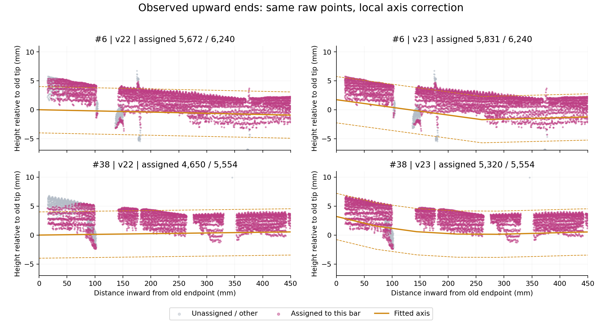

全量匹配 **1,828,242 → 1,829,803（净增 1,561）**：1,755 个原待定点获得归属、194 个原归属点回到待定，没有跨钢筋改号；待定 2,070,541，移除仍为 29。4 个末端通过新增复核。后续分阶段归属使 #51、#56 短筋也发生调整，最大节点位移分别为 3.10、0.042 mm；其余 204 个主体中心线一致。210 个主体保持拟合，原有 124 个确认弯段均保持确认，#10 的原待定弯钩新增通过原有全段检查，确认弯段变为 125 个。端面点由 687 变为 685。新增归属数量不是人工真值准确率，剩余证据不足的漏点继续待定。

正式流程 25.92 s，其中控制网 16.31 s，仅为本机单次计时。112 项控制网 Python 测试通过（首次完整运行中仅两处版本号断言需要更新，更新后两项重测通过），35 项 Node 控制网测试通过。新增回归先在旧算法失败，再验证两端上翘、1.15 m / 4 m 跨度、刚体旋转、内段与长度保持、原始输入不变、缺测、平面、已归属邻筋和过大偏移。正式输出与独立全量回放的状态、归属、主体及弯段报告逐项一致；源坐标、法向、台面掩码、百万点预览映射以及五份 LAS 原始字段和来源索引核对通过。HTTP 加载器和 Three.js 几何构建通过；CUA 无已连接浏览器，真实 WebGL 交互未实测。

证据：[全量与局部对照](assets/rebar-end-lift-2026-09-15/audit.json)、[正式运行核验](assets/rebar-end-lift-2026-09-15/official-verification.json)、[LAS 核验](assets/rebar-end-lift-2026-09-15/las-verification.json)、[页面加载核验](assets/rebar-end-lift-2026-09-15/loader-verification.json)。诊断、回放和绘图脚本在 `/tmp/cloudbim-v23/`；正式结果按上述 run 持久保存。开发栈经 `scripts/cloudbim-dev.sh stop` / `start` 重载，工作分支保持 `dev-hong`。

## 弯钩缺口与切口端面归属（2026-09-15，v22）

[打开 v22 正式结果](http://127.0.0.1:8766/?run=20260914T174204-c0094b0c)。本次只补齐有观测证据的归属，不移动中心线，不扩大管面残差门槛。输入仍为台面移除后的 9,216,369 条源记录。

漏分有两种原因。#2 弯钩的两次整钩求解在局部相差约 2–2.6 mm，超过原有 2 mm 的局部稳定门槛，因而一段连续、贴合已拟合管面的点也被整段排除。切口端面则属于平面圆盘，中心区域到轴线的距离小于半径，不能通过圆柱侧面的壳层检验；弯钩投影还明确排除轴向端外的球帽点。

v22 保留双模型验证过的连续区间作为种子。在两个已验证区间之间，只有最终管面残差、法线方向、交替轴向条带中的法线分布和观测连续性均通过，且缺口长度不超过 12 倍半径、双模型局部差异不超过一个半径，才补入已有的表面观测。真实缺测间隙、孤立圆环及平面条带不补齐。尾部不足一个完整分箱的样本可在一次有限邻域内接回，不能无限增长。完整弯钩的推断状态保持不变，报告使用 `independent-continuous-surface-intervals-v2` 区分新旧证据。

端面另走有限圆盘验证：先要求其后方已有同根钢筋的分布式圆柱侧面归属，再检查切口附近的法线、平面残差、圆盘范围、横向覆盖及两个源记录子集的一致性；周围存在较大共面表面时拒绝。不同钢筋同时竞争的端面点保持待定，已有归属及台面/排除点不动。证据写入实例的 `endFaceSupport`，全局增加 `counts.endFaceMatchedPoints`。这些端面点计入实例及全局匹配数；`curveSummary.matchedPoints` 继续仅统计曲线侧面。

与 v21 正式结果逐点比较：匹配数 **1,827,099 → 1,828,242（+1,143）**，其中局部弯钩表面 **+456**、端面 **+687**；待定 **2,072,102**，移除仍为 **29**。#2 增加 409 点（局部表面 368、端面 41），#7 增加 68，#10 增加 135。全部 210 个主体中心线、150 个弯段的拟合/推断几何、已有点归属、源坐标、法线与台面掩码逐项一致。部分仍不满足证据条件的近点继续待定；本次没有人工逐点真值，不把新增匹配数解释为准确率。

验证：109 项 `test_rebar_control*.py` 测试、35 项控制网页面数据测试通过；覆盖局部验证漂移、真实缺测、分箱端部、夹在已确认区间之间的未认证平面、切口、半球、共面夹具、无主体支持、竞争端面、排除点和刚体变换。正式运行与独立全量回放的属性数组、实例及弯段报告一致。百万点预览来源映射，以及全量/钢筋/待定/移除/排除五份 LAS 的全部原始字段与来源索引均核对通过。页面加载器及 Three.js 几何构建通过；当前 CUA 无可连接浏览器，鼠标交互未实测。

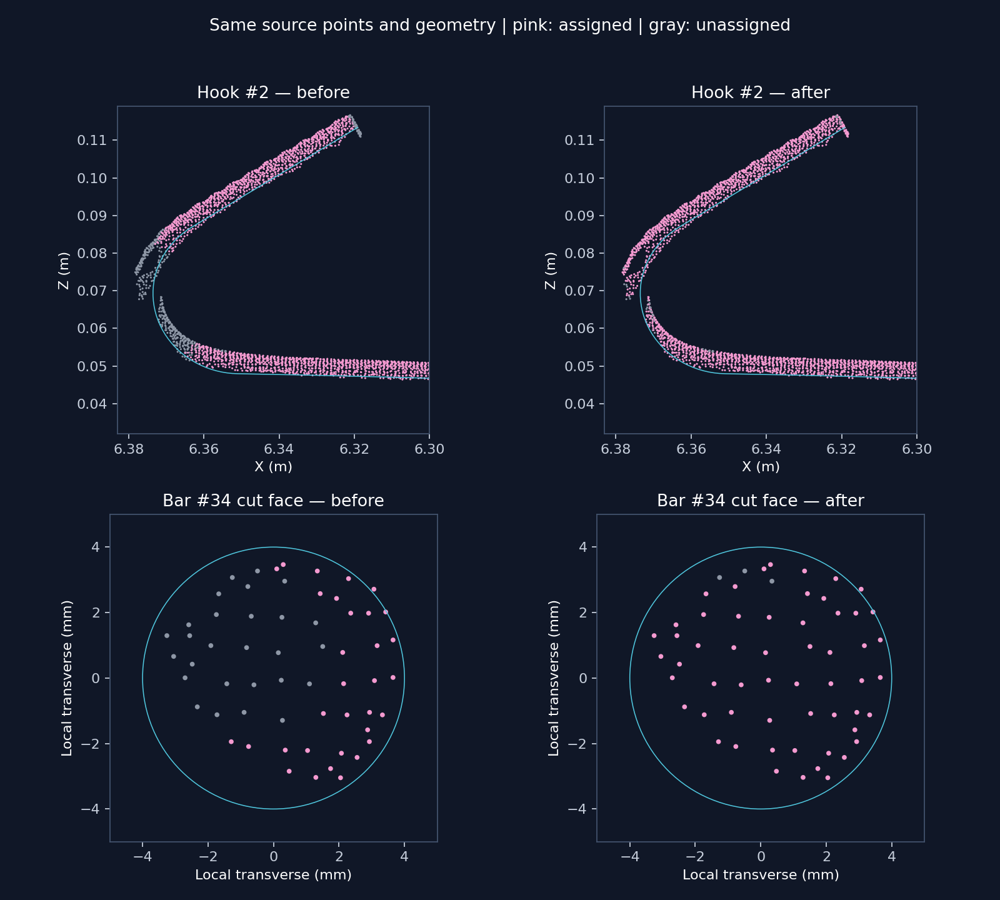

[验证记录](assets/rebar-endpoint-2026-09-15/verification.json)。复查命令：在 mesh-service 目录运行 `../../.cloudbim/mesh-venv/bin/python -m unittest discover -p 'test_rebar_control*.py'`；在仓库根目录运行 `node --test scripts/test_pointcloud_control_net*.mjs`。本轮诊断与回放脚本保存在 `/tmp/cloudbim-v22/`，正式结果保存在上述 run 对应的持久化目录。

## 长筋局部弯曲复核（2026-09-15，v21）

[打开 v21 正式结果](http://127.0.0.1:8766/?run=20260914T170543-dd48a2ce)。修复局部弯曲被低自由度样条抹平、外侧原始点成片漏分的问题；分类距离门槛未放宽。

v20 的原始管面复核跳过超过 2 m 的长筋，因为它们初始已经取 768 近邻。但采样密度不能替代曲线表达能力。v21 为长筋也检查 24 个轴向区间，只有至少 3 个连续区间同时出现较高管面残差与低支持率时才启动修复。沿原模型窄走廊取原始管面点，剔除轴向端外及法向不兼容记录；源记录按固定顺序分成互不重叠的训练、验证集合，分别限制为 12,000 / 8,000 点。

修复按 6、10、14 个样条系数依次尝试，接受第一个通过独立验证的候选，保留简单模型优先规则。至少 6 个可评价区间、至少 3 个显著改善区间、平均支持率提升至少 8 个百分点，并限制其他区间退化；同时约束轴线最大位移，保留设计直径、总长、原归属竞争与歧义拒绝。复用现有有界进程池，拟合后再对完整局部源点重新判定归属。

本批数据只有 #11 长筋通过该新复核：采用 10 系数，最大轴线修正 4.73 mm；独立验证 24 区间中 8 个改善、0 个退化，平均支持率 79.0%→95.7%。未通过验证的长筋继续保留原结果。`surfaceReview` 记录依据，`longBodyRefinedUnits` 记录数量，选中该筋时说明已按独立管面证据修正。既有 `surfaceResampledUnits` 继续表示全部管面复核修正数，本例由 5 变为 6。

| 项目 | v20 | v21 |
| --- | ---: | ---: |
| #11 固定弯曲段原始评价点 | 10,006 | 10,006 |
| 管面误差中位数 | 2.483 mm | 0.500 mm |
| 该区域实际归属 #11 | 2,508（25.1%） | 9,554（95.5%） |
| 全量归属点 | 1,815,457 | 1,827,099 |
| 待定 / 局部离群点 | 2,084,887 / 29 | 2,073,245 / 29 |
| 主体 / 全段确认弯段 | 210 / 124 | 210 / 124 |
| 推断弯钩局部确认点 | 3,304 | 3,304 |

全量净增 11,642 个归属点：11,776 个原未归属点获得归属，134 个旧归属回到待定，6 个改变实例编号。主体几何变化为 #11 及受后续归属顺序影响的 #49、#58；其余主体保持原值，已确认弯段的状态均保留。所有归属变化距相关几何不超过 6.38 mm，新归属符合原 1.44 mm 管面容差。缺少人工标签，以上不是全场景准确率承诺。

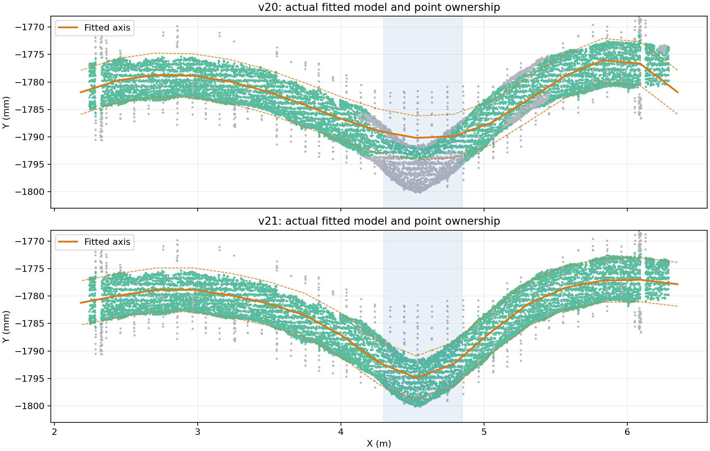

图中绿色为实际归属该筋的点，灰色为其余原始点；橙线为拟合轴线及半径投影包络。阴影区是上述固定评价区间，图为三维数据的诊断投影。

同源、8 进程顺序执行完整流程：v20 **24.91 s**，v21 **25.73 s**，控制网 **15.53 / 15.98 s**。正式页面运行 **25.59 s**，其中控制网 **16.12 s**。保留正常主体的快速路径，当前单次本机对照增加约 0.82 s，其中算法阶段增加约 0.45 s。

回归先在原算法上失败（真实局部管面误差 2.483 mm），修复后通过。待提交文件从 Git 暂存区独立导出，在隔离目录中 **117 项 Python、42 项 Node 检查通过**，不依赖其他功能的未提交代码。覆盖完整归属、固定长度、验证数据不足、训练偏差与独立证据矛盾、法向翻转、有界容量、平面/交叉/歧义、已有端部修复等。4 / 8 进程全量回放的状态、归属及全部主体/弯段报告逐项一致。正式输出与独立回放逐点一致，源坐标、法向、台面掩码不变，100 万点预览映射及所有 LAS 原字段/记录索引通过核验。HTTP 实际加载器与 Three.js 几何构建通过；CUA 没有可用浏览器，真实 WebGL 交互未验证。

证据汇总：[local-bow-v21-verification.json](assets/rebar-control-net-2026-09-14/local-bow-v21-verification.json)。前期单变量诊断见 [v20 弯曲排查](../research/rebar-bow-audit-2026-09-15.md)。快照、完整回放与耗时对照保存在 `/tmp/cloudbim-v21/`。


## 成功模型管面复核与弯钩局部归属（2026-09-15，v20）

[打开 v20 结果](http://127.0.0.1:8766/?run=20260914T163600-043c4c6a)。本轮修复“模型显示成功，但局部偏轴”和“推断弯钩有可靠局部观测却无法分点”两类问题；v19 历史结果保留。前期证据见 [专项诊断](../research/rebar-fit-audit-2026-09-15.md)。

**直筋成功后增加独立管面复核。** 原先 1.15 m 等普通直筋每个查询站只取最近 192 点，可能只看到截面一侧；偏轴模型可以在这批点上得到低残差，又因为已被判为成功而跳过扩大候选重试。现在复用完整局部候选，按 24 个轴向区间检查管面；至少 3 个区间明显不贴合时才扩大到 768 近邻。新模型必须在未进入新候选拟合的原始记录上改善至少 3 个区间，同时限制其他区间退化，才替换旧模型。仍使用原固定半径拟合器、原距离门槛、平面拒绝和身份竞争，不按单元编号特判，也不把所有查询全局扩大。

实际有 5 根通过复核并修正：#28、#29、#30、#32、#34。#28 / #29 / #30 在同一批端部原始点上的管面误差中位数分别由 3.776 / 3.887 / 3.924 mm 降至 0.145 / 0.172 / 0.168 mm；前端可看到“管面复核修正”数量。后续阶段因候选归属变化还更新了 #156 腹杆主体，其余主体几何保持原值。

**弯钩局部确认与全形状推断分开。** #2、#7、#10 仍保留完整形状的推断状态，但局部点可以在两个独立求得的姿态上同时通过距离、有限侧面、法向、局部位置稳定性、截面法向变化和连续观测检查后参与唯一归属。缺测间隙、平面、稀疏截面环、端点外球形包络和不稳定区间均不能补成确认表面。纯设计补接不获得点归属。

局部确认保存到 `localSupport`：新增点数、沿完整推断曲线的观测区间和局部稳定性。整段仍为 `pending`，整段 `pointCount` 保持 0；`curveSummary.matchedPoints` 包含单独记录的局部新增点。前端校验版本、观测来源、区间边界/重叠、父筋点数和稳定性，显示“补接中的局部确认”及橙色区间；青色虚线仍表示完整形状包含推断。旧版本数据仍按原规则加载。

| 项目 | v19 | v20 |
| --- | ---: | ---: |
| 全量支持点 | 1,782,728 | 1,815,457 |
| 待定点 | 2,117,615 | 2,084,887 |
| 局部离群点 | 30 | 29 |
| 主体拟合 / 全段确认弯段 | 210 / 124 | 210 / 124 |
| 含推断的弯段 | 26 | 26（其中 3 段有局部确认） |
| 三个推断弯钩的局部新增归属 | 0 | 3,304 |

#2 / #7 / #10 分别新增 1,227 / 726 / 1,351 个局部归属点。全量共 34,213 个原未归属点获得归属；1,484 个旧归属回到待定，176 个点调整实例编号，匹配净增 32,729。所有归属变化都在受影响几何 13.7 mm 范围内；新增归属满足原管面误差门槛。匹配数量增加不是无标注数据的准确率证明，保留身份冲突和缺测处的待定点。

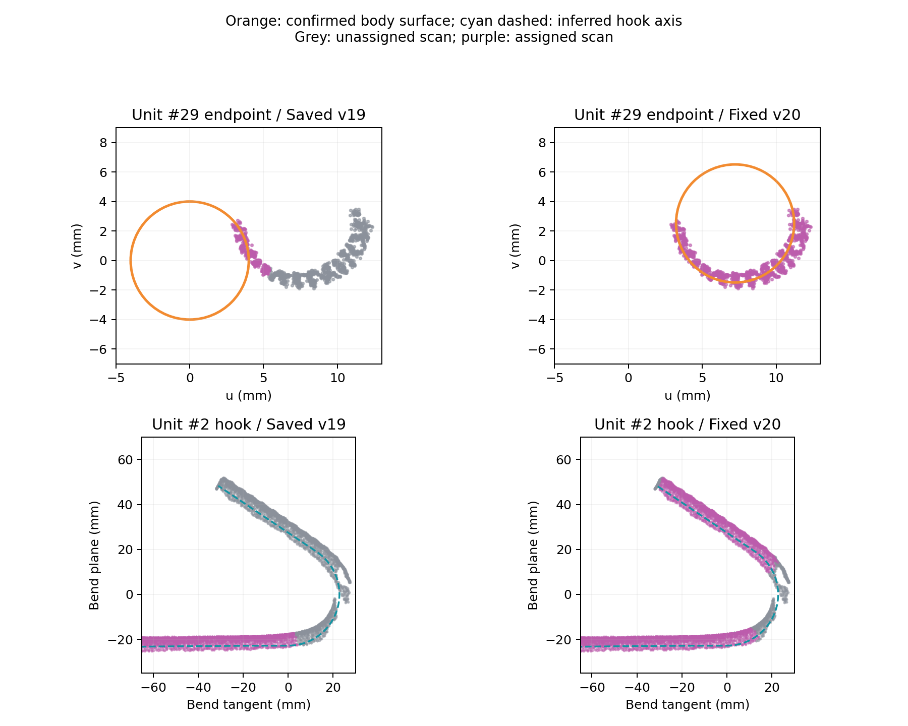

图中灰色为未归属点、紫色为已归属点。上排比较 #29 同一批端部点与圆柱截面；下排比较 #2 弯钩，完整解析姿态仍保持推断，只有通过局部验证的区域新增归属。图是原始数据的诊断投影，不是真实浏览器截图。

同源、8 进程完整流程连续对照：v19 **24.71 s**、v20 **25.31 s**，增加约 **0.60 s（2.4%）**；控制网约 14.83 / 15.73 s。正式页面运行耗时 25.83 s、其中控制网 16.02 s。对照在无并行测试争用时执行，含源 LAS 读取、法向、台面、控制网、保存和预览；单次本机结果不作为固定延时承诺。

验证：88 项 Python、42 项 Node 检查通过；真实回归先在原版本失败后通过，另核对同一真实输入 1 / 2 进程的逐点与几何一致性。反例覆盖平面、稀疏截面环、缺测间隙、不稳定验证姿态、法向翻转/刚体变换、纯设计补接、身份冲突及非法前端观测区间。正式输出与独立完整回放逐点一致，坐标、法向和台面掩码与 v19 完全一致，所有 LAS 原字段及记录索引、100 万点预览源映射通过核验。实际 HTTP 加载器与 Three.js 几何构建确认 210 个主体、124 个确认弯段、26 个推断弯段和 7 个局部确认区间；CUA 返回无可用浏览器且 in-app browser 不可用，真实 WebGL 交互未验证。

汇总：[surface-v20-verification.json](assets/rebar-control-net-2026-09-14/surface-v20-verification.json)。隔离回放、原版本副本、归属变化审计、完整耗时对照和导出核验在 `/tmp/cloudbim-v20/`。服务通过 `scripts/cloudbim-dev.sh stop` / `start` 重载，再由练武场 `/api/run` 正式生成新版；分支保持 `dev-hong`。

## 弯钩尾腿统一测长（2026-09-15，v19）

[打开 v19 结果](http://127.0.0.1:8766/?run=20260914T155930-098fe029)。本次只修正尾腿的轴向长度：10 个弯钩的全部圆弧顶点、半径、转角、旋转、上翘、偏转和连接点与 v18 完全一致；210 个主体拟合及 140 个腹杆连接几何不变。

此前的长度偏差来自三个机制问题。原先成功的 6 个弯钩直接返回，尾腿仍固定为约 40 mm；失败弯钩的测长只看侧面法向，忽略端面，且受设计种子附近的局部搜索范围限制。另外，分类仅在曲线顶点周围查询：一条尾腿只有两个端点，延长后中间会漏查。

现在所有已有观测支持的参数化弯钩在姿态确认后，统一进行一次标量测长：复用全量点云空间索引，在末端切线方向的细走廊里查询，保留先前的钢筋归属约束。连续圆柱侧面先建立尾腿身份；邻近端面必须满足法向、二维展开、平面残差及轴线穿过截面等条件，再将端面与尾腿轴线的交点作为长度。两个不相交的点子样本需给出一致结果。有连续侧面但无可靠端面时，只记录观测范围，不因缺测而缩短已有尾腿。搜索触边、断开的同轴片段、稀疏端点或邻近平面均不能作为可靠端部。主体和圆弧不重拟合，不增加自由控制点，也没有按设计单元编号特调。

分类改为沿完整线段补充空间查询站点，覆盖不再依赖几何顶点间距；此规则同样用于其他参数化弯段。查询只增加候选，仍须通过原有管面证据和唯一归属竞争。

| 设计单元 | v18 尾腿 / mm | v19 尾腿 / mm | 长度依据 |
| --- | ---: | ---: | --- |
| #2 | 50.5 | 52.7 | 端面定位 |
| #3 | 40.0 | 58.9 | 端面定位 |
| #4 | 40.0 | 54.0 | 端面定位 |
| #5 | 40.0 | 45.4 | 端面定位 |
| #6 | 40.0 | 50.6 | 连续侧面，端面未确认 |
| #7 | 45.0 | 48.5 | 端面定位 |
| #8 | 40.0 | 42.7 | 端面定位 |
| #9 | 40.0 | 50.0 | 端面定位 |
| #10 | 49.3 | 51.4 | 端面定位 |
| #11 | 15.6 | 49.6 | 端面定位 |

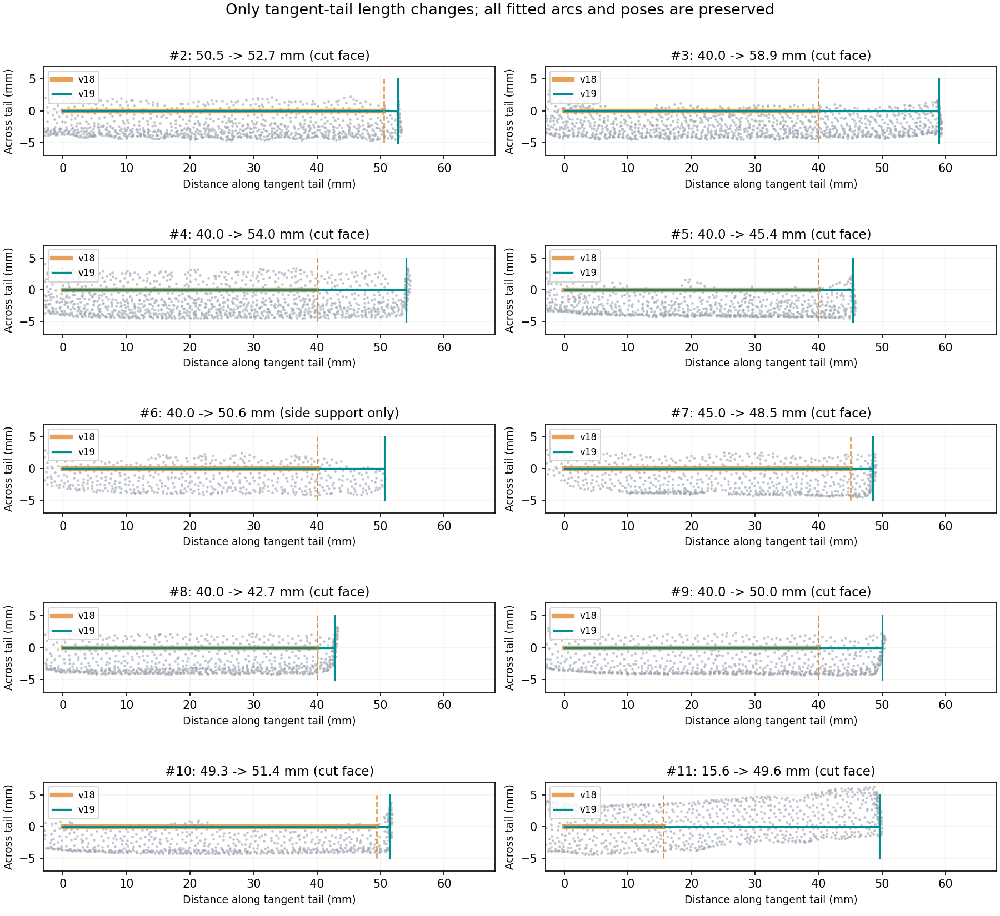

灰点为原始扫描在尾腿局部坐标中的投影；橙色为 v18，青色为 v19，竖线表示尾腿终点。#11 原局部候选只支持约 15.6 mm，在完整查询走廊内找到了连续侧面及约 49.6 mm 处的端面。#6 仍只有侧面观测，50.6 mm 不能解释为端面已确认。#2、#7、#10 虽已测得端面，完整弯曲形状仍保留 v18 的推断状态，不取得点归属。端面子样本一致性只衡量该拟合姿态下的测量重复性，不代表全局绝对精度。

全量 9,216,369 点正式结果：匹配 1,782,728，待定 2,117,615，移除 30，台面 5,315,996；比 v18 新增 5,201 个归属点，原有全部归属保留。124 个曲段仍为点云确认，26 个保留推断，未恢复几何为 0。原始坐标、法向量、台面掩码完全一致；100 万预览点映射、实际 HTTP 加载、Three.js 几何构造、全量及分类 LAS 的所有原始字段和记录索引均通过检查。未进行真实浏览器 WebGL 交互验收。

在没有并行测试争用的同源、8 进程完整对照中，v18 / v19 总耗时为 24.16 / 24.97 s，控制网为 14.83 / 15.39 s；本次增加约 0.81 s（3.4%），不宣称提速。正式 v19 总耗时 24.99 s，控制网 15.39 s。一次与单元测试同时执行的计时仅作正确性回放，未用于性能结论。

110 项 Python、39 项 Node 检查通过。新增回归覆盖端面补齐侧面缺口、成功弯钩统一测长、斜切端面与刚体变换、稀疏/偏置假端面、侧面缺测不缩短、超出初始搜索范围、搜索触边、断开的同轴片段及长线段查询覆盖。汇总证据见 `assets/rebar-control-net-2026-09-14/terminal-v19-verification.json`；基线副本、失败复现、完整回放、耗时和导出核验脚本位于 `/tmp/cloudbim-v19/`。

## 弯钩按物理参数调整（2026-09-14，v18）

[打开 v18 结果](http://127.0.0.1:8766/?run=20260914T152022-70f63cad)。#2、#7、#10、#11 改为按实际观测调整弯钩参数；原先已确认的弯段保持原结果。

v17 对未确认弯钩直接使用设计参数补齐，所以有完整几何仍可能不贴合。原局部模型可平移、绕杆轴转动、改变半径和转角，但弯钩入口切向被固定到杆身方向；上翘或侧偏只能由其他参数补偿。v18 保留有明确物理含义的参数：三个接点偏移量、弯曲平面旋转、入口上翘与偏转、圆弧半径、转角，以及相切尾腿的长度。圆弧始终共面、等半径；尾腿始终为其切线。与杆身的过渡由固定接点及两端切向生成，不增加自由控制点，不使用任意变形或样条控制网调整弯钩。

已有六参数模型通过确认时直接保留；仅失败时才启用额外姿态参数。新增求解复用上一阶段初值，分组验证也复用该组独立求得的初值，避免重复搜索。上翘和偏转各限制在约 ±34°，平面旋转约 ±90°；位移、半径和转角有独立边界，钢筋截面半径不变。尾腿只沿相切方向改变一个长度参数：以连续管面及法向支持测量，检查断点、搜索截断和两组端点一致性；无可靠观测时保持设计长度。

完整扫描确认继续要求连续弧面覆盖、分组复拟合稳定性和尾腿支持。局部观测能约束姿态但缺测或全形状不稳定时，允许输出“参数拟合补接”：独立验证组至少支持 3 个弧面区间、24 点，观测处两次中心线的差异 P90 不超过一个钢筋截面半径。该结果仍为推断，保留原失败原因、零归属点，不能冒充完整扫描确认。它区别于直接使用设计参数的补接，报告保存实际参数、验证量和解析圆弧坐标框架。

本次 #2、#7、#10 为含推断的参数拟合补接；#11 的尾腿按连续观测缩短后通过完整确认。全量 150 段中，124 段点云确认，26 段含推断补接，未恢复为 0。原先 123 段确认曲线、210 个主体拟合，以及所有原有点归属保持不变。

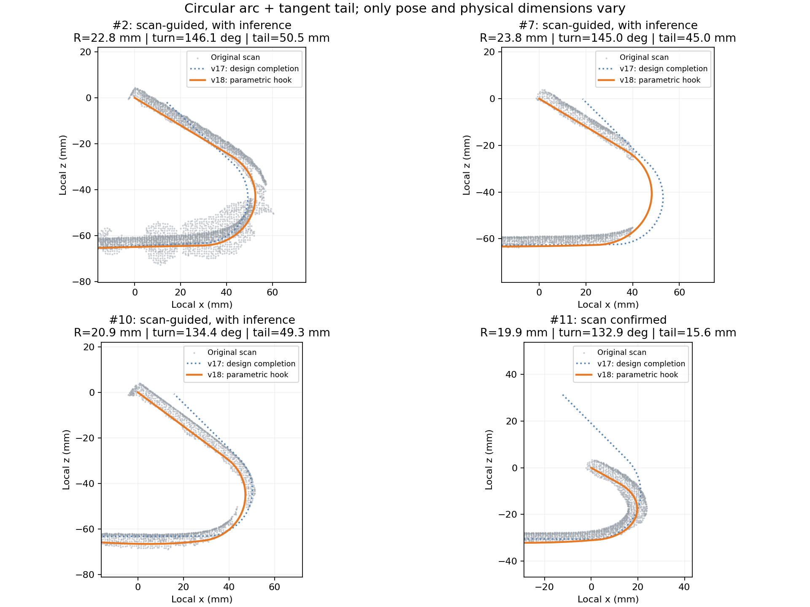

灰色是原始扫描，蓝色虚线是 v17 直接按设计补齐，橙色是 v18 参数化结果。轴线应处于钢筋内部。#7 缺测的弯曲区仍由参数模型推断；#2 / #10 的完整形状稳定性仍不足，不能把图上的改善解释为全长实测精度。

同源 9,216,369 点、8 进程完整流程连续对照为 v17 27.21 s、v18 26.99 s，总体持平；控制网阶段为 15.73 / 16.41 s，额外姿态求解增加约 0.68 s。保存耗时存在波动，不能把全流程的微小下降归因于算法提速。正式页面这次保存为 28.72 s，其中控制网 15.42 s、保存 4.58 s。此次优先修正参数模型，未宣称纯计算耗时减少。

102 项 Python 和 39 项 Node 检查通过；新增上翘正例、参数变化下的圆弧共面/等半径/相切约束、尾腿断点与搜索截断、缺测参数补接不占点、前端拒绝任意顶点变形等检查。正式输出与独立完整回放逐点相同，全部接点连续；源坐标、法向、台面、原始 LAS 字段、来源索引、100 万点预览映射、实际 HTTP 加载器及 Three.js 几何构建核验通过。WebGL 交互本轮未实测。

汇总证据见 `assets/rebar-control-net-2026-09-14/terminal-v18-verification.json`，实验、完整精度回放与日志位于 `/tmp/cloudbim-v18/`；被否决的自由变形试验只留在该目录的 `rejected-freeform-experiment/`，未接入生产流程。

## 单端弯钩按设计恢复（2026-09-14，v17）

[打开 v17 结果](http://127.0.0.1:8766/?run=20260914T144525-00f0cd5f)。长筋 #2、#7、#10、#11 的端部弯钩已全部补齐；当前 150 个弯段中，123 个点云确认，27 个按设计补接（23 个腹杆连接、4 个长筋弯钩），未恢复几何为 0。

上一版只接入双端腹杆连接的设计恢复，单端弯钩仍完全依赖六参数局部拟合及观测验证。正式 v16 报告中 #2 未通过分组复拟合稳定性验证，#7 / #10 缺少连续弧面覆盖，#11 缺少远端尾腿观测。因此它们不能被标记为点云确认，但可以在已有杆身与解析设计规则下恢复完整几何。核对前后候选索引后，4 处候选均未因其他弯段获得归属而变化；不把它们归因于抢点。

新增规则使用已确认且身份唯一的长直筋主体，确定实际接点与切向；设计弯曲平面确定绕杆轴的方向，解析圆弧半径、转角和相切尾腿确定其余形状。这 4 处均为 20 mm 弯曲半径、135° 转角、约 40 mm 尾腿。恢复曲线从主体可靠区间平滑接到端部弯钩，仅裁剪显示用主体线，不改变主体基线、设计长度和逐点归属。正反路径均支持；主体身份或方向不兼容、解析路径不连续、尾腿不相切、半径不合理或接点已被占用时拒绝补接，不按具体编号特判。

界面分别显示“点云确认”“按设计补接”和“未恢复”。设计恢复使用独立推断曲线与依据，保留原始观测失败原因及零支持点；未知扫描形状不被标记为实测。若局部拟合在最后的唯一归属检查中失败，也会清除拟合长度，允许同样的设计恢复规则接手。

同源 9,216,369 点、8 进程完整流程对照：v16 **25.26 s**，v17 **25.05 s**；其中控制网为 15.52 / 15.32 s，未观察到明显变慢。新增恢复只计算解析曲线，无额外点云搜索或参数优化。此为本机单组连续对照，计时存在波动。

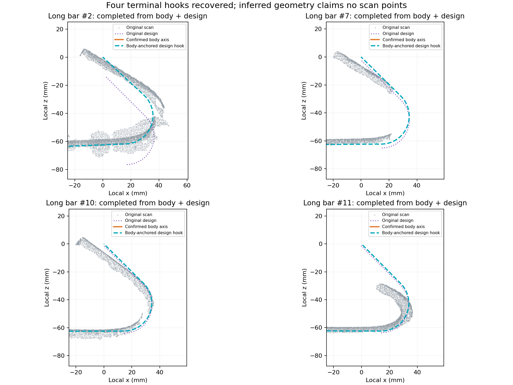

灰色为原始扫描，紫色为原设计轴线，青色虚线为依附实际杆身恢复的弯钩；轴线位于钢筋内部，不要求穿过表面点。图中缺测部分由设计给出，仍可存在实际制造偏差。

验证：98 项 Python 算法/流程检查、37 项 Node 加载/显示检查通过。正式结果与独立完整回放的源坐标、法向、台面和全部逐点状态/归属一致；相比 v16，210 个主体拟合结果和其余 146 个弯段报告保持不变，仅这 4 个端部增加推断几何。所有接点间隙小于 1e-8 m；全量及子集 LAS 原始字段、来源索引、100 万点预览映射、实际 HTTP 加载器及 Three.js 几何构建通过。WebGL 交互本轮未实测。

汇总证据见 `assets/rebar-control-net-2026-09-14/terminal-v17-verification.json`，复现、对照与详细日志在 `/tmp/cloudbim-v17/`。本轮由主智能体完成，未重用已完成的子智能体。

## 端部贴合与腹杆设计补接（2026-09-14，v16）

[打开 v16 结果](http://127.0.0.1:8766/?run=20260914T120236-67f3aadd)。截图所述“特别长的钢筋中最外侧”已定位到 #2；可在设计单元筛选中选 #2 查看两端，腹杆补接可选 #68 / #69。v15 历史结果保留。

**仍然不贴合的原因是局部证据与评分范围不一致。** 圆心投票先挑选一层近似管面，再拟合连续轴线；已有归属只能减少邻筋竞争，不能保证未进入可靠区间的端部也贴合。#2 长约 4.166 m，两端约 0.321 m 和 0.556 m 没进入可靠拟合范围，原模型沿内部切线外推；这些位置其实仍有点云，外推轴线因此偏离实际表面。短筋此前只调整长度，原轴线的小幅位置及倾斜误差也会保留。

v16 对有独立表面证据的长直筋外推端部增加局部修正，每端仅四个横向参数，修正量在接入主体的内部锚点归零。保留锚点以内的主体顶点、钢筋直径和设计总长，只微调两端线段以维持精确总长。使用法向排除横穿表面、分段密度、截面曲率、交错轴向验证区间及复拟合稳定性检查；已贴合或缺少可靠端部观测的区域不触发修正。复用现有候选与内部距离，仅重新投影受影响端部附近的点。

短筋先用完整局部管面修正位置及倾斜，再测量连续端点。另对错位恢复中存在多个近似候选的情况，补做完整局部有限长度检查：检查中发现 #51 的一个替代位置实际上是较长表面的局部片段，限量采样可能把它误认为短筋；因此出现恢复歧义时，才用完整点云检查有限跨度，真实双短筋歧义仍保留。本次最终结果中 #51 正常恢复，未触发这项额外复核。各项检查均按几何条件触发，没有按编号特判。

| 同源结果 | v15 | v16 |
| --- | ---: | ---: |
| 主体拟合 | 210 / 210 | 210 / 210 |
| 有连续延长证据的短筋 | 12 / 12 | 12 / 12 |
| 点云确认弯段 | 123 / 150 | 123 / 150 |
| 待定腹杆连接按设计补接 | 0 | 23 / 23 |
| 全量支持点 | 1,762,206 | 1,775,810 |
| 局部离群点 | 30 | 30 |
| 控制网独立回放，两轮均值 | 15.18 s | 14.90 s |
| 完整流程连续对照 | 24.92 s | 24.93 s |

长筋 #2 两端在未参与训练的验证点上，管面偏差中位数分别由 1.716 / 1.726 mm 降至 0.312 / 0.275 mm；#3、#4 也各修正一端。短筋 #54 由 0.648 降至 0.472 mm，#57 由 0.288 降至 0.209 mm。这些是固定候选上的局部管面残差，不是真值精度。其余 51 条长直筋轴线与 v15 完全相同。原有 123 个确认弯段全部保留；支持点增量来自主体更贴合后的完整分类，补接曲线不产生支持点。

**23 处腹杆连接按设计补接，仍不标为点云确认。** 对两侧主体均已确认、属于同一物理母筋的未匹配连接，使用解析设计弯曲规则和半径先验，把连接接到实际主体的端点及切向。逐端比较设计与实际方向，避免两侧小幅相反旋转累加成较大的总转角差后误拒绝。冲突、错误身份、不兼容方向或无有效解析设计时不补接；两侧显示裁剪原子校验，不能覆盖已有连接或倒置主体。

补接使用 `inferredCenterlineM`、`connectionStatus: design-inferred` 和独立数量统计，保留原 `pending` 状态、失败原因和 `pointCount: 0`，不写入拟合专用 `centerlineM`，也不修改扫描点的归属。练武场默认以青色虚线和半透明管显示“按设计补接”，支持局部定位。尚有 #2、#7、#10、#11 的四个端部弯钩待定，终端弯钩没有套用腹杆双端连接的补接规则。

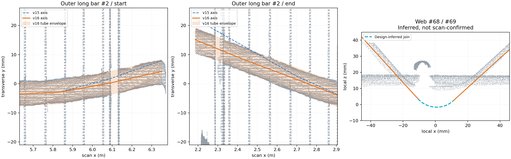

左、中图灰点为实际扫描，蓝色虚线为 v15 轴线，橙线及半透明包络为 v16 轴线及钢筋半径；右图青色虚线为设计推断连接，不能视作扫描已确认。所有确认及补接连接与显示主体的端点间隙均为零。

性能复用主体与弯段的进程池，省去弯段阶段重复启动；若弯段预算更小，先回收主体池再建立小池，避免两个池叠加。相同源、粗对齐、8 进程预算及输出设置下，控制网计时基本持平并略快，未靠减少完整源记录、预览或保存内容换取速度。正式页面首次保存全流程 24.82 s，具体阶段与连续对照记录在验证 JSON 中；本机计时有波动，不作固定延时保证。

验证：91 项 Python 算法/流程检查与 35 项 Node 加载/显示检查通过；追加检查覆盖真实设计生成器的补接路径、端部回正、平面与交叉筋、已确认邻筋隔离、缺失端部和截断长杆伪短筋。后台线程启动的共享池通过正常完成、弯段工作进程异常、8→4 与 4→8 预算切换核验：最多 8 个计算工作进程、每个进程一个数值线程，父进程输入不变，退出后全部回收。源坐标、法向、台面、设计清单、状态守恒、所有 LAS 原始字段与来源索引、100 万点预览映射及独立回放逐点一致性核验通过；实际 HTTP 加载器与 Three.js 几何构建通过。CUA 无可连接浏览器，WebGL 交互未实测。

汇总证据见 `assets/rebar-control-net-2026-09-14/surface-v16-verification.json`，详细脚本与日志位于 `/tmp/cloudbim-v16/`。本轮 sol high 子智能体分别完成补接算法、显示、真实设计兼容修正和并发独立审查，主智能体完成端部修正、短筋复核、性能集成和全量验证；均已完成并停止写入，无遗留计算任务。环境未提供关闭子智能体的工具，未声称会话已关闭或名额已释放；生命周期记录见 `/tmp/cloudbim-v16/team.md`。

## 分阶段归属与短筋观测端点（2026-09-14，v15）

[打开 v15 结果](http://127.0.0.1:8766/?run=20260914T111127-14504a62)。短筋可使用「定位短筋：延长 / 错位 / 待定」逐根查看，例如 #50、#59；新增弯段可查看腹杆 #116 / #117、#134 / #135、#198 / #199。旧 [v14](http://127.0.0.1:8766/?run=20260914T103758-6e25d4cf) 保留。

本轮把“确认后带走点”应用到所有控制网钢筋类型：长直筋 → 短筋（含错位恢复和长度调整）→ 腹杆主体 → 局部弯段。每阶段在有限候选上并行拟合，随后统一检查重复身份、唯一支持及支持点数量，只有确认点才能锁定；后续候选检索、补充拟合、短筋恢复、全量分类都排除已锁定点。当前阶段存在歧义的假设也不能在短筋恢复时提前占点。点只从后续候选中排除，原始记录仍完整保留。不同类型的设计单元若指向同一条重叠平行轴线，会共同保留待定，不能靠阶段顺序抢到身份。

短筋先用设计长度建立位置和固定半径轴线，再沿轴线两端检索连续管面。端点证据同时检查法向一致性、轴向密度、截面变化、间隙和搜索边界；断开的尾段、稀疏杂点、交叉筋以及被搜索范围截断的长杆不能触发延长。观测跨度必须确实超过当前长度 2 mm，等长但错位的点云不算超长。接受后按观测区间定位两端，保持半径、方向和设计清单不变，单独输出拟合长度与端点变化。总长不缩短，局部搜索上限为设计长的 1.5 倍；这是候选范围，不是验收允许偏差。遮挡导致证据不足时仍保留原长度或待定。

| 同源结果 | v14 | v15 |
| --- | ---: | ---: |
| 源点数 | 9,216,369 | 9,216,369 |
| 主体拟合 | 210 / 210 | 210 / 210 |
| 有连续延长证据的短筋 | 0（固定长度） | 12 / 12 |
| 已确认弯段 | 121 / 150 | 123 / 150 |
| 全量支持点 | 1,743,286 | 1,762,206 |
| 局部离群点 | 30 | 30 |
| 控制网独立回放，两轮均值 | 18.43 s | 16.83 s |
| 完整流程连续对照 | 27.46 s | 27.21 s |

12 根短筋的设计长度均为 280 mm，拟合长度为 297.0–384.0 mm；例如 #50 为 384.0 mm，#59 为 381.1 mm。已确认弯段新增 3 处，同时 #156 / #157 因分组复拟合不稳定由已确认转为待定，净增 2 处；仍有 27 处待定。已确认弯段的表面 RMSE 中位数为 0.536 mm，v14 为 0.558 mm；两版接受集合不同，残差和支持数不能替代真值精度。

速度对照使用相同源、粗对齐、8 进程预算和完整保存/预览设置。空间索引与主体进程池跨阶段复用，错位短筋的独立位置搜索也使用同一进程池，并按设计顺序消费结果。独立控制网回放约快 8.7%；完整流程基本持平，未观察到明显回退。正式页面保存的首次运行为 30.46 s，其中法向量 8.00 s、控制网 18.52 s；完整连续对照的法向量约 5.91 / 6.09 s，说明整机计时有波动，不作固定延时保证。连续对照另存在 `/tmp/cloudbim-v15/pipeline-v14/` 与 `pipeline-v15/`，没有替换页面结果。

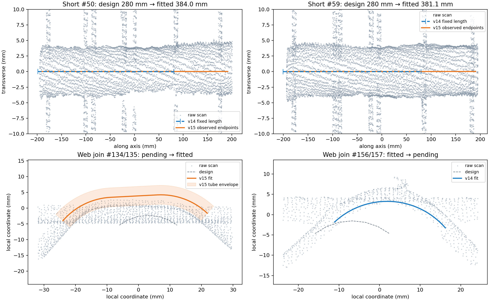

灰点为原始扫描，蓝色为 v14 拟合，橙色为 v15 拟合；轴线位于钢筋内部，不要求穿过可见表面点。右下图保留了由已确认转为待定的反例，未隐藏结果退回。

验证：73 项 Python 算法/流程检查、21 项 Node 显示及加载检查通过；包含旋转与偏移短筋、过长实测区间、断尾、噪点、交叉筋、重复身份及串行/并行逐点一致性。后台线程启动的共享进程池在正常完成和故意触发恢复任务异常后均全部回收，最多 8 个进程、每个进程一个数值线程，父进程输入未被修改。54 条长直筋轴线与 v14 完全相同；全量源坐标、法向、台面、设计清单、状态守恒、来源映射和所有 LAS 原始字段核验通过，正式输出的全部逐点归属与独立回放相同。100 万点实际 HTTP 加载器及 Three.js 几何构建通过；CUA 无可连接浏览器，WebGL 交互未实测。

汇总证据见 `assets/rebar-control-net-2026-09-14/progressive-v15-verification.json`，脚本与详细日志在 `/tmp/cloudbim-v15/`。主智能体完成算法、集成和全量验证；两名 sol high 子智能体分别完成独立反例测试、练武场显示接入，均已完成并停止写入，无后台任务。运行环境未提供子智能体关闭接口，未声称会话已关闭或并发名额已释放；生命周期记录在 `/tmp/cloudbim-v15/team.md`。

## 主体拟合继续提速（2026-09-14，v14）

[打开 v14 结果](http://127.0.0.1:8766/?run=20260914T103758-6e25d4cf)。同一份 **9,216,369 点**源 LAS、相同粗对齐、8 个工作进程预算，完整流程由 **46.49 s 降到 27.44 s**，耗时再减少 **41.0%**。控制网由 **36.85 s 降到 17.79 s**。该计时从源 LAS 重跑法向量、台面处理、主体及弯段拟合，并包含结果保存和预览生成。

| 指标 | v13 | v14 |
| --- | ---: | ---: |
| 控制网整体 | 36.85 s | 17.79 s |
| 其中弯段阶段 | 8.43 s | 8.03 s |
| 全流程 | 46.49 s | 27.44 s |
| 主体 / 已确认曲段 | 210 / 121 | 210 / 121 |
| 曲段新增支持点 | 33,781 | 33,781 |
| 全量支持点 | 1,743,286 | 1,743,286 |

本轮只调整执行方式：圆心候选的径向、法向和覆盖评分批量计算，有限候选组的中位数用选取算法求解；钢筋对先用包围盒距离下界筛掉不可能重复的远距离组合，再执行原来的精确歧义判定；初始主体拟合改用最多 8 个进程，每个任务仅传入至多 30,000 个局部候选点，每批最多 4 倍工作进程数。主进程按原设计顺序消费结果，保留重试、短杆恢复及最终唯一归属顺序。弯段的固定角度基函数预计算一次。模型自由度、采样上限、初值、稳健损失和所有确认阈值保持不变。

独立全量回放与正式结果逐项相同；相对 v13，210 根主体及 121 处弯曲的几何、全部 921 万点状态和实例归属也完全相同。76 项算法与流程测试通过。后台线程启动的进程测试验证了 8 进程上限、每进程一个数值线程、父进程输入隔离，以及正常完成和故意触发工作进程异常后的全部回收。全量及各子集 LAS 的原始字段、来源索引、状态与归属，100 万点预览映射，HTTP 加载器及 Three.js 几何构建均通过。WebGL 交互本轮未实测。

当前余下主要耗时为弯段约 8.03 s、法向量约 5.80 s；本机单次运行是性能参考。汇总证据见 `assets/rebar-control-net-2026-09-14/curved-v14-verification.json`，局部实测图见 `assets/rebar-control-net-2026-09-14/curved-v14.png`，剖析及回放日志在 `/tmp/cloudbim-v14/`。本轮由主智能体完成，前轮已结束的 sol high 子智能体未重新占用。

## 弯段求解提速（2026-09-14，v13）

[打开 v13 结果](http://127.0.0.1:8766/?run=20260914T102108-bad40603)。同一份 9,216,369 点源数据、相同粗对齐和 8 个上游工作进程预算，全流程由 **190.46 s 降到 46.49 s**。曲段阶段由 **152.43 s 降到 8.43 s**。尚未加入弯段的 v11 约 38.78 s，因此目前完整弯段处理增加约 7.7 s，而非原先约 152 s。

瓶颈是求解器用参数差分估计梯度时，反复执行整批点的最近曲线搜索。v13 保持相同模型、采样上限、初值集合、稳健损失和全部确认条件，改为复用最近线段及投影位置计算距离梯度；仅对几十个曲线顶点求小规模参数导数。法线轴线候选也预先计算，目标函数与梯度共享同一次投影。另将互不依赖的局部拟合按调用方预算分配给最多 8 个进程，每个进程只用一个数值计算线程；源点、主体状态均只读，最后仍由主进程按设计顺序执行唯一归属。

| 指标 | v12 | v13 |
| --- | ---: | ---: |
| 曲段阶段 | 152.43 s | 8.43 s |
| 控制网整体 | 180.64 s | 36.85 s |
| 全流程 | 190.46 s | 46.49 s |
| 已确认曲段 | 120 / 150 | 121 / 150 |
| 曲段新增支持点 | 33,610 | 33,781 |
| 曲段表面 RMSE 中位数 | 0.555 mm | 0.558 mm |

旧版确认的 120 个曲段全部保留，新增确认连接 #180 / #181。主体 210 条轴线、已有归属及台面和源坐标继续逐项相同。优化后的独立串行与 4 / 8 进程重放结果逐项一致；单进程曲段约 50.85 s，四进程约 14.63 s，八进程约 8.53 s，说明收益同时来自减少重复计算及有界并行。计时为本机同源运行参考，不是跨设备性能保证。

76 项算法与流程测试通过，新增梯度检查将复用投影的导数与独立参数差分比较；原有真实弯曲正例和噪声反例继续通过。sol high 独立审查验证了从后台线程启动、工作进程数量上限、每进程数值线程限制、父进程状态隔离，以及正常完成和工作进程异常后的全部回收；审查已完成，无遗留计算进程。正式输出的全量及子集 LAS、100 万点 HTTP 加载器及 Three.js 几何构建核验通过；使用与生产入口一致的 float64 法向重放后，曲段报告和逐点状态、归属与发布结果逐项相同。证据目录 `/tmp/cloudbim-curves-speed/`，汇总见 `assets/rebar-control-net-2026-09-14/curved-v13-verification.json`。v12 历史结果仍可打开比较。

## 局部参数化弯段（2026-09-14，v12）

[打开 v12 结果](http://127.0.0.1:8766/?run=20260914T100125-752684c6)，选择 **01B-X 台面后控制网**。可先看长筋弯钩 #3，以及腹杆 #64、#65、#66；#2 的弯钩仍待定。亮橙色曲线和管体表示已确认拟合，打开「初始化 / 设计」才显示未确认的设计弯曲线。旧 [v11 结果](http://127.0.0.1:8766/?run=20260914T084630-1abadfc7) 保留。

本次把原先未进入求解的曲段纳入控制网：从 IFC 保留有序直线、圆心、半径、法平面和转角，按已有设计单元之间的间隙、母筋两端生成 140 个连接弯段及 10 个弯钩。仍为 70 根物理母筋、210 个主体单元，曲段不另造母筋身份。设计弧线按 0.1 mm 弦误差重新采样，旧主体单元的编号和设计几何不变。

机制只有三个部分：

1. **主体先稳定，局部形状后调整。** 腹杆连接使用两段同半径圆弧及中间相切短直段，以切点范围、圆角比例两个参数表达；中间直段为零时退化为普通圆弧。它能表达扫描中略平的谷底。弯钩调整三个位置参数、弯曲平面转角、圆弧半径和转角，共六个参数；末端直腿保持设计长度。接入主体的过渡段由固定主体点和切向确定，不增加自由控制点。
2. **点云决定参数，设计限制形状。** 有效法线将表面点反推为两个轴线候选，以较近者形成不依赖法线正负的残差；缺少法线时使用固定钢筋半径的管面距离。弱尺寸先验、有界参数和稳健损失抑制离群点。局部裁剪内的直杆点由原有杆身共同解释，避免短弯段为了吸收两侧直杆观测而被错误撑大。
3. **确认曲段后才分配点。** 曲段必须具有连续轴向覆盖、截面变化、法向支持，并通过有间隔的空间分组复拟合；训练组独立选取初值和权重。还要检查尾段观测、形状歧义及唯一归属。已有主体归属不改，新增点沿用相邻单元身份；不足的曲段保留待定。

| 指标 | v12 正式运行 |
| --- | ---: |
| 主体拟合 | 210 / 210 |
| 腹杆连接弯段 | 114 / 140 |
| 长筋弯钩 | 6 / 10 |
| 曲段新增支持点 | 33,610 |
| 全量支持点 | 1,743,115 |
| 已确认曲段表面 RMSE：最小 / 中位数 / 最大 | 0.31 / 0.56 / 0.70 mm |
| 曲段求解 / 全流程耗时 | 152.43 / 190.46 s |

30 个待定曲段中，21 个缺少连续曲面支持，4 个分组复拟合不稳定，3 个存在相近形状候选，1 个尾段观测不足，1 个无法可靠连接主体。没有为了补齐设计数量放宽这些条件。早期较强尺寸先验试算为 124 个确认；最终降低先验对真实局部形状的偏置后，确认数为 120，以上均按正式保存结果统计。

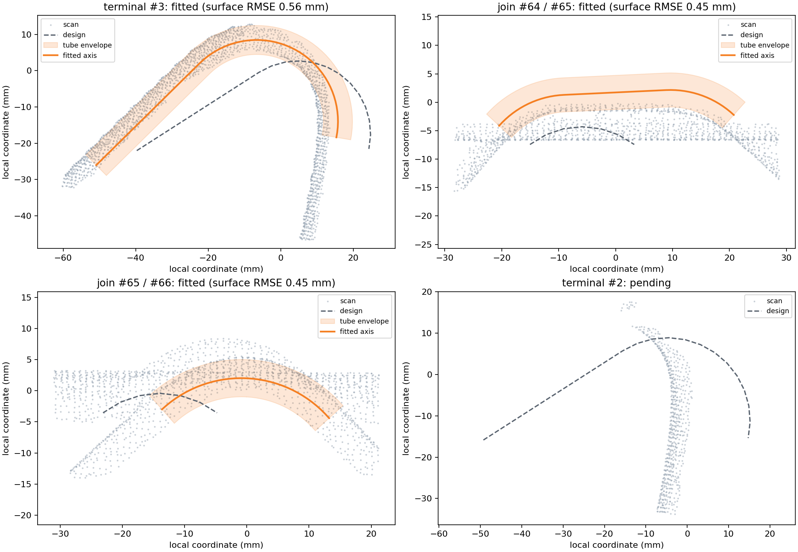

图中灰点为实际扫描、灰色虚线为设计轴线、橙线为拟合轴线、淡橙范围为钢筋半径包络。扫描往往只覆盖可见侧，因此轴线不会穿过表面点。RMSE 是已接受表面点的拟合残差，不是真值精度，也不能单凭支持点增加判定去噪质量。

主体的 `centerlineM`、设计长度和已有点归属与 v11 逐项相同；`bodyDisplayCenterlineM` 只用于连接处的显示裁剪，所有已确认曲段与显示主体的端点间隙为零。`curvedPieces` 单独记录确认状态、原因、设计曲线、拟合曲线和支持证据。弯钩的 `fittedLengthM` 包含接入主体的过渡段，不能直接与设计弯段长度相减当作超长量；界面明确提示遮挡处含模型插值。这里没有生成新扫描点，也未把过渡段全长宣称为实测。

验证：75 项算法、设计几何、主体及流程测试，13 项 HTTP 测试，24 项 Node 界面检查通过。独立反例覆盖平面、孤立截面簇、邻筋错接、竞争母筋、端球伪支持及特殊状态保护；新增正例覆盖真实偏移弯钩、带两侧直杆观测的平底弯段。921 万点的源坐标、法向、台面、旧归属和全部主体几何一致性检查通过。全量及各子集 LAS 的全部原始字段、来源索引与新归属核验通过；100 万点预览映射、真实 HTTP 加载器和 Three.js 曲段几何构建通过。本次 CUA 没有可连接浏览器，WebGL 页面交互未实测。

本轮按用户要求使用 sol high 子智能体分别完成精确设计几何、显示接入和独立反例检查，均已完成并停止写入；主智能体完成求解、集成和最终核验。保留的边界是单弯曲设计片段和有界局部变形，复杂多弯片段暂不自动降为单圆弧。当前优先保证弯段可靠性，尚未据此改动主体中部的自由度。可复核数据见同目录的 `assets/rebar-control-net-2026-09-14/curved-v12-verification.json`；详细运行脚本与日志位于 `/tmp/cloudbim-curves-v12/`。

## 腹杆的法向补充判别（2026-09-14，v11）

[打开 v11 结果](http://127.0.0.1:8766/?run=20260914T084630-1abadfc7)，仍在 **01B-X 台面后控制网**，不执行分区或分层。可与 [v10](http://127.0.0.1:8766/?run=20260914T083235-4819efb2) 比较。原先待定的 #78、#82、#84、#86、#88、#92、#106、#108、#122 全部恢复，拟合数量由 201/210 变为 210/210。

这九段的设计直段约 103.15 mm、半径 3 mm，局部扫描与设计初始方向存在差异，端部还叠有接头或相交结构。原始点投影到初始截面后，仅用径向距离计分会出现两个分数接近的圆心候选，在连续轴线求解前触发 `ambiguous-parallel-support`。实际候选快照每段约 3,300–4,300 点，可独立重放这个失败。增加到 768 近邻/站只恢复 8/9；加入径向法向证据，9/9 局部重放都通过。

v11 的机制是**歧义后的补充判别**：

1. 正常的固定半径拟合先照常执行。只有腹杆初始圆柱候选存在歧义，且至少有 24 个有效投影法向时，才额外判别一次。
2. 在完全相同的候选点和搜索边界内，圆柱候选的支持点同时满足径向残差与法向一致性。具体使用投影法向与圆心径向的绝对余弦不小于 0.8；法向不要求统一朝向。阈值沿用既有几何评分规则，不是工程验收容差。
3. 全局圆心假设和沿轴分段的连续证据使用同一法向条件，再执行既有固定半径、截面曲率、平面拒绝、有效轴向跨度、固定设计长度以及全量唯一归属检查。仍有歧义则保留待定。

补充判别没有改大候选范围、增加分层规则、放宽平行歧义阈值或按编号特判。统一对所有腹杆强制法向约束的试验会影响另外九段，因此最终只对未解决的歧义调用补充判别。缺少有效法向时保持原几何判定，不从设计数量推断成功。

报告的 `instances[].webEvidence` 记录补充判别方法、触发原因、有效法向点数和范围，练武场单元详情显示“经表面法向补充判别后通过拟合检查”。

| 指标 | 台面后 v10 | 台面后 v11 |
| --- | ---: | ---: |
| 拟合成功 | 201 / 210 | 210 / 210 |
| 支持点 | 1,698,616 | 1,709,505 |
| 待定点 | 2,201,727 | 2,190,838 |
| 局部离群点 | 30 | 30 |
| 短筋长度待核查 | 4 | 4 |
| 控制网耗时 | 27.35 s | 28.86 s |
| 全流程耗时 | 36.76 s | 38.78 s |

新恢复九段的径向 RMSE 为 0.100–0.173 mm；与历史分层后轴线最大端点差约 0.55 mm。原有 201 段中 199 段轴线逐项相同；错位短筋 #49、#58 的恢复过程使用未归属点，新增腹杆支持改变了这部分候选，轴线分别变化约 1.58、1.23 mm，设计长度仍为 280 mm，长度待核查标记保留。新增支持数、低残差及接近旧轴线均不等于真值精度；计时仅为本机参考。

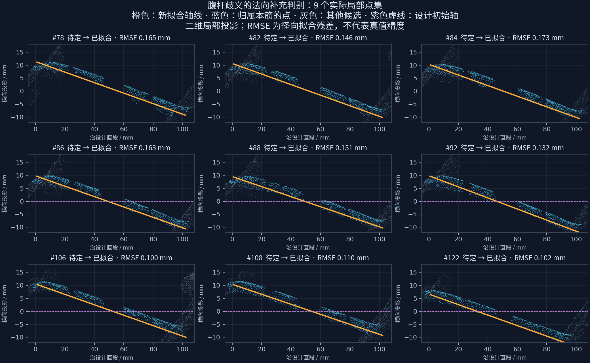

验证：41 项 Python 算法/流程检查、15 项 Node 检查通过。新增反例覆盖斜腹杆的部分圆弧与密集切向杂点、法向符号翻转、真实双平行腹杆、平面夹具以及缺少法向。正例在 v10 被拒绝，v11 保留全部 1,512 个真实圆柱样本且不归属 2,016 个杂点；其余反例仍保留待定。

921 万点集成运行的台面掩码、未分层边界、状态守恒、唯一归属、固定长度、预览索引和实际 HTTP 加载器检查通过。发布的逐点状态/归属与独立全量试算完全相同；全量 LAS 和所有子集逐字段、逐来源索引核验。本次没有可连接的浏览器，未新增 WebGL 交互验证；上图来自实际拟合数据。证据目录 `.cloudbim/control-net-web-v11/`。sol high 子智能体完成独立反例测试并已停止写入，无后台进程；主智能体完成机制、全量验证、界面说明与结果保存。

## 台面后无分层试跑（2026-09-14，v10）

[打开本次结果](http://127.0.0.1:8766/?run=20260914T083235-4819efb2)，在 **01B-X 台面后控制网** 查看，或从历史记录切回 [分层后 v9](http://127.0.0.1:8766/?run=20260914T073939-934a0870)。本次使用保存的粗对齐、8 个上游线程、1 个拟合线程；自动初始化路径保留并经算法回归检查，本次全量比较未运行自动模式。

| 指标 | 分层后 v9 | 台面后 v10（无分层） |
| --- | ---: | ---: |
| 源点数 | 9,216,369 | 9,216,369 |
| 非台面候选点 | 3,900,373 | 3,900,373 |
| 拟合成功单元 | 210 / 210 | 201 / 210 |
| 支持点 | 1,692,624 | 1,698,616 |
| 待定点 | 2,207,719 | 2,201,727 |
| 局部离群点 | 30 | 30 |
| 短筋长度待核查 | 4 | 4 |
| 拟合耗时 | 29.43 s | 27.35 s |
| 全流程耗时 | 40.15 s | 36.76 s |

#78、#82、#84、#86、#88、#92、#106、#108、#122 由已拟合变为待定，均触发 `ambiguous-parallel-support`。无层约束时空间邻域内的候选组成发生变化；当前保持歧义保护，不以目标数量强行确认身份。可以在「设计单元」中逐个查看其原始邻域，打开「显示初始化控制网」辅助定位。

支持点增加 5,992 不表示精度提高：旧待定中有 26,439 点成为支持点，旧支持中有 20,447 点转为待定。两版均拟合成功的单元中，同采样位置的轴线最大变化出现在 #64（11.42 mm）、#105（8.79 mm）、#51（6.49 mm）；这是版本间几何变化，不是真值误差。#49、#51、#56、#58 仍需核查短筋可见长度。计时为本机同源试跑，非严格性能基准。

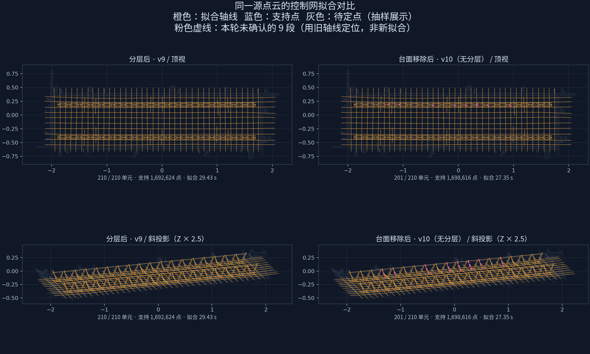

验证：48 项 Python 算法、流程及台面/共享场景检查，13 项 HTTP 检查，15 项 Node 检查通过。全量台面掩码与 v9 逐项一致，未产生分区、层、禁飞区或分类融合报告；全量状态守恒、唯一归属、设计长度及预览来源映射通过。实际 HTTP 结果通过练武场加载器（210 个报告单元、100 万预览点），无分层筛选。全量 LAS 与各子集按每个原始字段和来源索引核验。

本次没有可用的 CUA 浏览器，未实测 WebGL 页面渲染与交互；上图是从真实结果数据生成的静态对比图。sol high 子智能体负责算法与回归，已停止写入且无后台进程；其余流程、界面与集成验证由主智能体完成。证据目录 `.cloudbim/control-net-post-table/`，包含比较、加载器验证、LAS 验证和子任务交接记录。

## #33 的采样歧义误拒绝修正（2026-09-14，v9）

[查看修正结果](http://127.0.0.1:8766/?run=20260914T073939-934a0870)，选择设计单元 #33。该单元为底层横向直筋，直径 8 mm、设计长度 1.15 m。拟合轴线和半透明圆柱使用亮橙色，便于与蓝色点云区分。

v8 的 `ambiguous-parallel-support` 表示初步圆柱候选存在歧义，并不证明现场有两根钢筋竞争。#33 在设计轴线每站最近 192 点的采样下，只获得偏向近侧的截面证据：5,184 个候选经轴向/法向筛选剩 3,380 点，前两组投影圆心相距约 6.08 mm、评分分别为 462.86 和 459.63，触发早期拒绝。它们的支持点几乎全部原已被融合识别为钢筋，不能把这一现象简单归因于夹具误分类。该钢筋轴线相对设计位置约偏移 16–18 mm，仍在原 100 mm 搜索范围内。

以同一半径、同一层和同一空间范围增加候选后，384、768、1,536 点/站均能恢复连续拟合；仅开启法向一致性或直接跳过歧义检查，分别出现证据不足或仅约 0.33 m 的局部支持，故未采用这些方案。v9 只对原先因平行候选歧义失败、尚未使用较多采样的普通直筋，追加一次 768 点/站的求解；仍限制每单元最多 30,000 个拟合候选，保留全部圆面、连续性、平面、歧义、重复身份和全量唯一归属检查。成功报告的 `candidateSampling` 记录这次补充取样。不按 #33 编号特判，不扩大设计位置搜索范围，也不放宽拟合验收阈值。

全量 9,216,369 点重跑后，#33 由待定转为已拟合，支持 13,268 点、径向 RMSE 0.442 mm、连续观测范围约 0.994 m；控制网恢复 210/210 个单元。其他 209 个单元的中心线逐项相同，#4/#6/#10/#11 各有 1/3/11/30 个交叉附近支持点重新归属给 #33；另外 13,223 点来自原待定集合。支持点总量为 1,692,624，待定 2,207,719，局部离群仍为 30。台面、分区、分层和原始数据完全相同，未执行禁飞区或融合。控制网 29.43 s，全流程 40.15 s，均为本机参考计时。拟合数量、残差以及与旧轴线接近均不是人工真值精度。

验证包含先失败后通过的“16 mm 偏移、半圆弧、轻微弯曲、密集采样”回归，以及三种间距的真实双平行候选持续待定检查。47 项 Python 算法/轴线/流程/导出测试、14 项界面回归通过；全量状态、实例归属、预览来源索引和全部 LAS 原始属性逐项核验。浏览器验证 #33 橙色拟合、点集切换与 v8 历史加载，无页面错误。排查脚本、数值证据和截图位于 `.cloudbim/control-net-33-task/`，未向生产代码添加调试日志。

## 前移试跑（2026-09-14）

[查看新结果：01E 分层后控制网](http://127.0.0.1:8766/?run=20260914T072309-18d46aba)，可用历史下拉框切回 [原融合后 v8](http://127.0.0.1:8766/?run=20260914T065844-07a7193c)。本次实测使用粗对齐模式、8 个上游线程、1 个拟合线程；拟合算法均为 v8，仅改变输入阶段。

| 指标 | 原融合后 | 分层后、禁飞区前 |
| --- | ---: | ---: |
| 源点数 | 9,216,369 | 9,216,369 |
| 非台面拟合候选 | 2,009,509 | 3,900,373 |
| 已拟合设计单元 | 210 / 210 | 209 / 210 |
| 底层 / 顶层 / 腹杆 | 64 / 2 / 144 | 63 / 2 / 144 |
| 已归属支持点 | 1,674,954 | 1,679,401 |
| 待定点 | 334,548 | 2,220,942 |
| 局部离群点 | 7 | 30 |
| 融合排除点 | 1,890,864 | 不执行融合 |
| 短筋长度待核查 | 4 | 4 |
| 拟合耗时 | 28.31 s | 28.90 s |
| 全流程耗时 | 55.37 s | 39.43 s |

#33 从拟合成功变为待定，原因为 `ambiguous-parallel-support`（邻近钢筋匹配歧义）；其他单元的拟合状态不变。新支持点中 19,474 点原被融合标为夹具，1,659,927 点原为钢筋；这些差异用于定位复核，原分类不是人工真值，支持点数量不能作为准确率。候选范围扩大后，待定点包含原先被融合排除的夹具等记录，所以待定数量不宜直接解释为钢筋漏检增加。

全流程加快主要因为省去禁飞区和分类融合，拟合本身没有加快。该计时是本机同源观察，非严格性能基准。可在「设计单元」选择 #33 检查其邻域，并用短筋定位按钮复核 #49、#51、#56、#58。

验证：62 项 Python 算法/边界回归、13 项 HTTP 检查、15 项 Node 检查通过。新旧台面、分区、分层的全部原始记录逐项相同；新结果无禁飞区/分类/融合报告，全量状态守恒、实例归属与预览来源映射通过。浏览器检查了分层筛选、点集切换、短筋定位、手机宽度以及新旧历史切换，无页面错误。全量 LAS 和各子集的每条原始属性、来源索引已逐项核验。证据目录为 `.cloudbim/control-net-layering-task/`。

首次保存因磁盘不足失败，未发布不完整结果；清理两份旧 pip HTTP 下载缓存后重新运行成功，源数据与历史运行未删除。

## 长度核查与噪声弯曲保护（2026-09-14，v8）

最新结果：[20260914T065844-07a7193c](http://127.0.0.1:8766/?run=20260914T065844-07a7193c)。v7 为恢复错位短筋，允许将模型加长至设计长度的 150%。这是候选搜索规则，不是构件长度验收容差；仅凭圆柱邻域点的 1%–99% 投影跨度，不能认定实际钢筋超长。遮挡、相交钢筋、端部杂点和设计身份不一致均可能影响这个数值。

**v8 撤回自动加长。** 四根找回短筋的 `designLengthM`、`fittedLengthM` 均为 280 mm。`observedLengthM` 保留观测跨度，差值超过 `max(10 mm, 10% 设计长度)` 时写入 `lengthCheck: review-observed-span`。该阈值用于提醒复核，不是工程允许偏差。界面显示“位置已匹配，长度待核查”，不会把位置拟合成功当作尺寸合格。短筋尾部未归属点继续保留。

跨度估计增加径向法向一致性检查和 10 mm 轴向分箱密度检查，稀疏、恰好靠近圆柱的散点不能撑长端部。当前四根的观测跨度约为 #49 315 mm、#51 336 mm、#56 377 mm、#58 359 mm，均需核查实际端点与设计身份，不作为已确认的真实长度。

普通长筋的轴线拟合增加以下约束，腹杆和短筋主体继续使用直线圆柱：

1. 按轴向窗口平衡证据时，设置样本数下限，避免少量端部噪点被放大到与密集主体等权。
2. 可靠端部范围要求至少三个相邻窗口有足够支持；范围外仅延续端部切线，禁止三次样条自由外推。
3. 依次比较直线、二次曲线、三次样条。用各窗口的中位残差和支持率衡量改进；局部密集杂点不能靠数量支配整根轴线。简单模型已足够时保留简单模型，连续观测支持的真实弯曲继续保留。

共享 `fit_prior_axis` 的新选项 `guard_bending` 仅由控制网普通长筋启用，其他既有调用默认保持原路径。报告使用 `axisModel` 区分直线、简单弧形和受观测约束的样条，`axisEvidenceRangeM` 记录轴向证据范围；这不是测量置信区间。

| 指标 | v7 | v8 |
| --- | ---: | ---: |
| 有拟合支持的单元 | 210 / 210 | 210 / 210 |
| 短筋长度待核查 | 未单列 | 4 |
| #1 轴线相对端点连线的最大偏离 | 25.03 mm | 9.25 mm |
| #6 同一指标（连续实测弯曲） | 16.22 mm | 16.18 mm |
| 已归属原始点 | 1,710,087 | 1,674,954 |
| 待定点 | 299,415 | 334,548 |

#1 的端部有大量无观测区域和少量离散点，旧样条被拉弯；v8 减小了这一影响。9.25 mm 是模型几何指标，不是真实偏差或准确度证明，剩余外推仍属推断。#6 的连续弯曲有密集表面支持，不能仅为视觉平直而抹去。54 个普通长筋中，10 个选择直线、24 个选择二次曲线、20 个保留受约束样条。

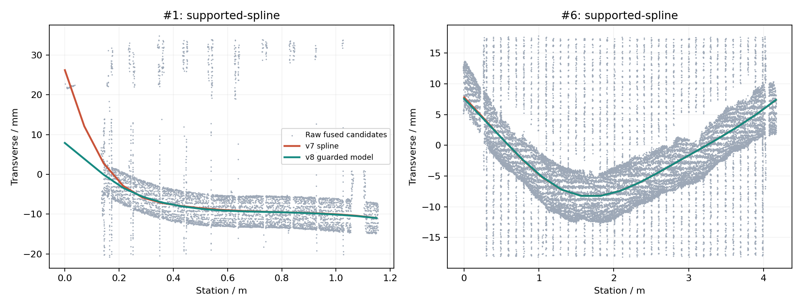

此次 9,216,369 条源记录的台面、分层、融合数组与 v7 完全一致。局部离群仍为 7 点，融合排除仍为 1,890,864 点；归属减少的点保留待定。控制网 28.31 s，全流程 55.37 s，为本机参考计时。拟合数量不代表人工真值准确率，也不代表四根短筋尺寸已通过核查。

验证：43 项 Python 算法/共享求解/流程/导出测试，22 项 Node 界面/几何回归，13 项 HTTP 测试通过。新增测试覆盖稀疏端部杂点、密集中段污染、连续真实弯曲、切线外推、超长短筋固定模板和长度核查。全量状态、归属、预览、四类 LAS 及全量 LAS 的原始字段和顺序已逐项核验；浏览器验证了四根短筋的 280 mm 模型、长度待核查提示、定位循环、144 个腹杆直段与移动端。证据目录 `.cloudbim/control-net-robust-task/`。

## 错位短筋找回与腹杆直段约束（2026-09-14，v7，长度规则已被 v8 替代）

最新运行：`20260914T063735-daf91abf`，入口 [练武场结果](http://127.0.0.1:8766/?run=20260914T063735-daf91abf)。进入 **03X 分层控制网**，点击 **定位错位 / 未拟合短筋**，依次检查 #49、#51、#56、#58。按钮同时显示设计初始化和实际拟合，并把两者纳入视野；重复点击循环定位。详情分别显示中心错位、观测长度、设计长度与拟合长度。

原搜索沿设计直段取近邻，且短筋轴向中心必须落在原设计区间内。这四根实际偏移约 0.4 m，原局部窗口主要取到相交长筋与平面点。x≈2.9 m / 5.5 m 处已有短筋不能再次借给缺失单元；从已拟合表面以外的点中，才找到 x≈3.1 m / 5.3 m 处的实际候选。

- 先完成原分层拟合，再只对未确认短筋搜索。候选限于融合钢筋，排除已有模型的支持点；横向范围 0.50 m、轴向端部余量 0.18 m，每段求解最多 30,000 点。
- 从观测线特征估计平移和方向，固定设计半径拟合直线圆柱。检查连续有限区间、平面/法向证据、可见跨度、搜索边界、候选竞争与最终唯一归属。近似候选评分达到最优的 90% 时保留待定；不能从长筋截取一段来凑数。
- 找回短筋的连续可见跨度超过设计长度 110% 时，以独立字段 `fittedLengthM` 记录实测拟合长度，最大接受设计长度的 150%；`designLengthM` 和设计库存不变。普通段仍使用设计长度。该阈值为实验搜索范围，不是工程验收容差。
- 腹杆设计直段改为直线圆柱参数模型，固定半径和设计直段长度，只求位置、倾角；用轴向 12%–88% 的主体点估计轴线，避免末端弯曲、接头和交叉筋把主体拉弯。最终全部邻域原始点仍参加归属判断。自由样条仍用于普通长筋。

| 指标 | v6 | v7 |
| --- | ---: | ---: |
| 已拟合单元 / 设计单元 | 206 / 210 | 210 / 210 |
| 腹杆直段 | 144 / 144 | 144 / 144（主体直线） |
| 已归属原始点 | 1,667,474 | 1,710,087 |
| 待定候选点 | 342,028 | 299,415 |
| 控制网阶段 | 29.71 s | 27.59 s |

| 找回短筋 | 中心错位 | 设计长度 | 拟合长度 | 径向 RMSE | 支持点 |
| --- | ---: | ---: | ---: | ---: | ---: |
| #49 | 399.7 mm | 280 mm | 320.1 mm | 0.457 mm | 5,478 |
| #51 | 405.9 mm | 280 mm | 364.8 mm | 0.548 mm | 5,435 |
| #56 | 407.6 mm | 280 mm | 378.4 mm | 0.262 mm | 6,623 |
| #58 | 388.6 mm | 280 mm | 363.5 mm | 0.239 mm | 5,885 |

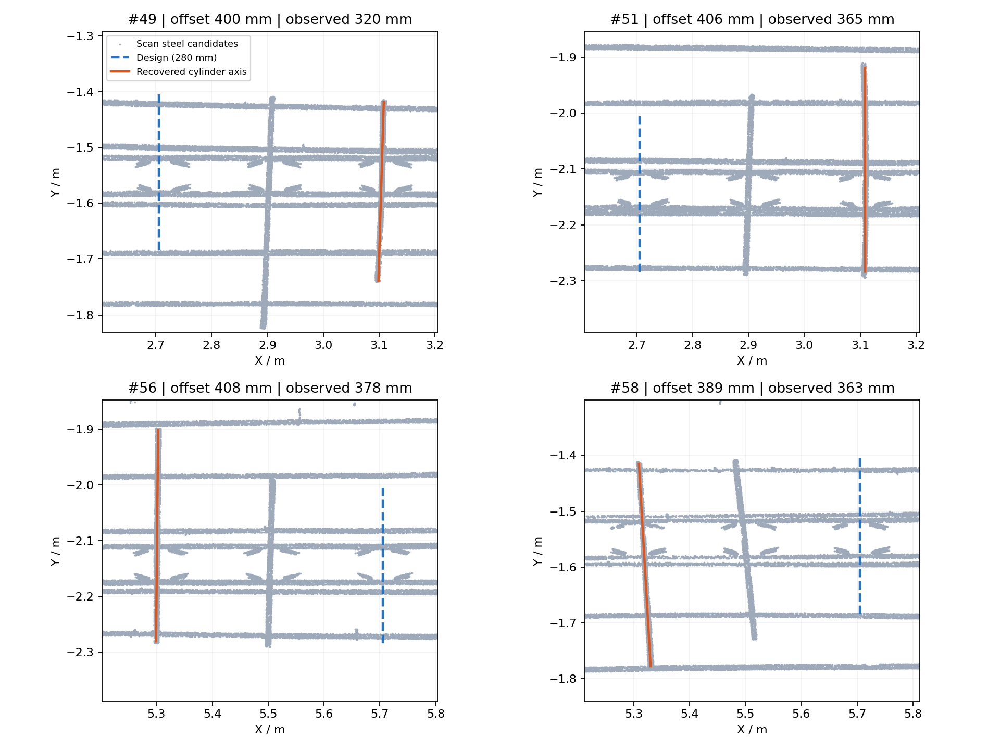

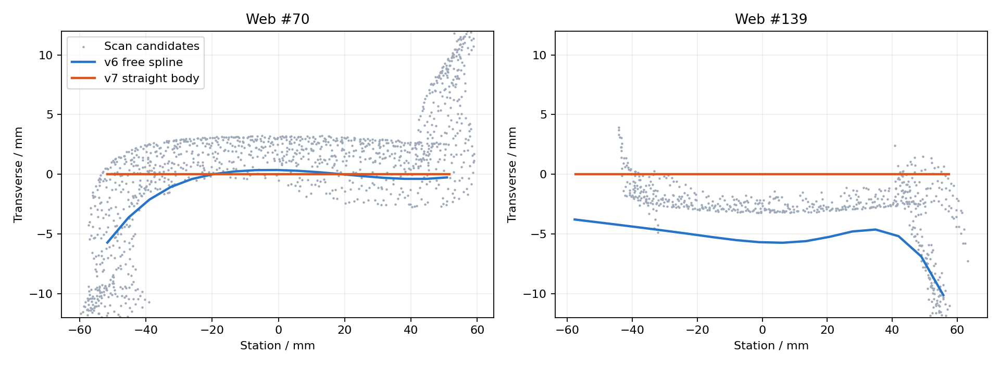

同源 9,216,369 条记录，上游台面、分层、融合数组与 v6 逐项相同；融合排除 1,890,864 点、局部离群 7 点不变。全流程 64.17 s，包含上游阶段和持久化；控制网耗时是同机参考，不代表跨机器性能。210/210 是约束检查后的拟合数量，不是人工真值准确率。

本版实现腹杆主体直线约束，**尚未联合求解相邻腹杆的圆弧接头**。曲端和未建模接头的稠密点继续保留，不会仅因偏离直线而删除，也不把设计圆弧显示成已测得的拟合。短筋完整可见区间来自点云；遮挡端点仍可能影响长度估计，设计身份也应结合实际装配复核。

验证记录在 `.cloudbim/control-net-short-task/`：38 项 Python 算法/共享轴线/流程/导出测试、12 项控制网界面测试及相邻界面回归、13 项 HTTP 测试；包括 100 mm 轴向错位、400 mm 横向错位、已匹配邻筋保护、实测超长、长筋截段拒绝、多候选歧义和弯端不拉弯主体。全量状态、逐点实例、预览来源索引、四类非台面 LAS 与全量 LAS 的每条源属性均已核对。真实浏览器通过四根短筋循环定位、两处几何同时入镜、144 段腹杆直线、点集切换及移动端检查，无页面运行错误。历史 v6 和早期报告继续按其原有长度契约加载。

## 中间漏检与邻筋混拟合修正（2026-09-14，v6）

运行 `20260914T024209-3487f12c`，同一源文件、同一融合与分层结果。中间缺失长筋为单元 #6；腹杆下方重点检查 #3/#61 和 #4/#63。v5 中 #4 与 #63 在共同长度内拟合到同一条可见圆弧；长筋多出的端部还掩盖了单向平均距离的重复判断。

本版采用以下修正：

- 每个轴向窗口保留至多 8 个不同圆心，通过连续路径选择支持点；横筋法线干扰与长筋截面的法线/圆面一致性参与筛选。
- 长于 2 m 的直筋，每个查询站候选从 192 增至 768，总候选仍限制为每单元 30,000 点，防止较近的筋占满候选集。
- 对长度不同、近乎平行且主要范围重叠的邻筋，以较短筋已经拟合出的观测表面排除长筋拟合中的借点，再拟合长筋。此排除仅用于求解，所有原始候选点仍参加最终归属竞争。
- 将窗口中测得的圆心作为额外 B 样条初值，按真实表面残差择优，避免弯曲钢筋的局部可见圆弧落入镜像圆心。Scan-vs-BIM 的原有调用不传该可选初值，原求解路径保持不变。
- 平行重复轴线从两个方向检查，较长筋的伸出部分不能掩盖共同长度内的重复。

| 指标 | v5 | v6 |
|---|---:|---:|
| 确认直段 / 设计直段 | 203 / 210 | 206 / 210 |
| 确认原始点 | 1,301,845 | 1,667,474 |
| 待定候选点 | 707,657 | 342,028 |
| 单元 #6 | 未拟合 | 59,803 点，径向 RMSE 0.482 mm |
| 控制网阶段 | 23.72 s | 29.71 s |
| 全流程 | 50.88 s | 56.82 s |

剩余 #49、#51、#56、#58 保持待定（平面法线/短筋区间证据问题），不补造观测。融合排除 1,890,864 点、台面 5,315,996 点、局部离群 7 点；上游台面、分层及融合数组逐行相同。更充分的候选与连续求解增加约 6 s，属于质量修正的实际代价。

在 X=3.91–3.93 m 的原始截面中，分别对四条可见圆弧独立进行二维圆拟合，用于局部诊断。#3、#61、#4 的连续轴线与局部圆心距离由 7.31、10.42、15.66 mm 降至 0.257、0.872、0.312 mm；#63 由 0.695 变为 0.836 mm，仍贴合原圆弧。这些是局部截面检查，不是全钢筋人工真值精度。

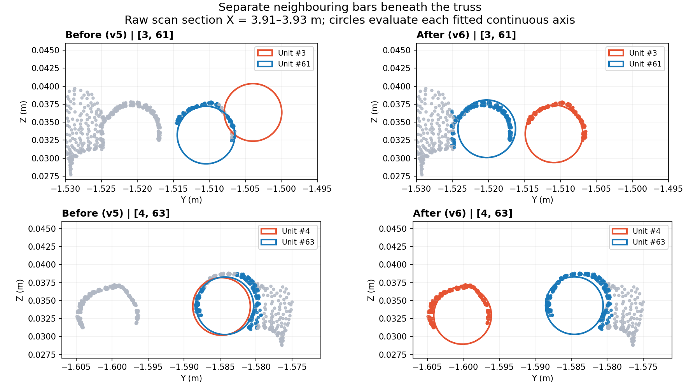

验证：控制网、共享轴线求解、流水线及 LAS 单元测试共 34 项通过；包含不等长邻筋点归属、长端部掩盖重复、弯曲部分圆弧镜像解的回归。全部 9,216,369 行状态与预览映射、四个非台面 LAS 以及全量 LAS 的所有源属性及来源索引均逐项核对。练武场粗对齐运行、分层筛选、单元切换、各点集视图和手机宽度检查通过，页面无运行错误。

## 性能优化（2026-09-14，v5，历史）

`design-control-net-v5` 保持 v4 的候选、搜索次数、局部窗口、验收阈值和点归属规则，优化圆心投票的数组组织与分组。没有跳过弯曲检查或改用近似圆心。投票改为整块数组拼接；二维整数量化网格编码成保持字典序的一维整数，替代较慢的二维行排序；投票同分时的候选顺序保持一致。极端整数范围回退到原二维分组，避免溢出。

同源缓存分项实测：圆心搜索仍为 5,178 次，但耗时从 27.24 s 降到 10.72 s；整个控制网从 40.39 s 降到 23.63 s。整段轴求解仍约 5.62 s。原 Scan-vs-BIM 的 23.24 s 是约 184 万已分簇点的求解计时，不能与包含候选搜索、重复检查和全量归属的控制网阶段视为完全相同工作。

最终通过练武场 HTTP 串行完整运行：

| 模式 | 最终运行 | 控制网 v4 → v5 | 全流程 v4 → v5 |
| --- | --- | ---: | ---: |
| 粗对齐 | `20260914T020850-e925e3ab` | 40.21 → 23.72 s | 67.42 → 50.88 s |
| 自动初始化 | `20260914T020719-60d77711` | 26.22 → 16.77 s | 53.24 → 43.83 s |

粗对齐控制网耗时减少约 41.0%，全流程减少约 24.5%。这仍是同机参考数据，使用 8 个上游工作线程、1 个拟合线程，OS 缓存未清空。

两条新运行均逐项对照各自 v4：全部 9,216,369 行台面、分层、融合类别、控制网状态与实例编号完全相同；逐段模型、中心线、库存和配准报告也完全相同。粗对齐仍为 203/210 段、1,301,845 个确认点、707,657 个待定候选、7 个局部离群点及 1,890,864 个融合排除点。自动模式仍保留网格歧义，不写确定编号。

24 项算法/流程/导出测试通过，包括投票负坐标、计数并列顺序、极端整数范围及原有弯曲/平面/邻筋/源记录保护回归。两条最终运行都通过完整四类 LAS 原始属性、来源索引、预览、状态守恒和中心线弧长校验，并通过真实浏览器分层/逐段/导出/移动端检查。证据在 `.cloudbim/control-net-speed-task/`：`compared-aligned.json`、`compared-auto.json`、`verified-aligned.json`、`verified-auto.json`。

## 分层版本验证（2026-09-14，v4，历史）

最终从原始 LAS 经本轮 03 融合运行，两条路径串行，通过练武场 HTTP 提交。源文件为同一份 9,216,369 点；台面 5,315,996 点，03 融合钢筋候选 2,009,509 点，融合排除 1,890,864 点。旧完整流程末端的 1,858,032 个钢筋点不是 03 融合候选数量。

| 路径 | 运行 | 确认直段 | 支持点 | 待定候选点 | 局部离群 | 控制网 / 全流程 |
| --- | --- | ---: | ---: | ---: | ---: | ---: |
| 粗对齐、分层 | `20260913T174532-66060cae` | 203/210 | 1,301,845 | 707,657 | 7 | 40.21 / 67.42 s |
| 自动初始化、分层 | `20260913T174349-570fffd3` | 0/210 | 0 | 2,009,509 | 0 | 26.22 / 53.24 s |

粗对齐：底层 58/64，顶层 2/2，腹杆 143/144。相较 v3 的腹杆 138/144，增加 5 段；全部单元有 7 段新确认、2 段从已拟合转为未确认，净增 5 段。底层仍有 6 段未确认，数量未改善，不应声称已经消除底层漏检。剩余单元编号 6、31、49、51、56、58、139，分别涉及设计半径不一致、邻筋竞争、平面法向证据和短筋区间歧义。已编号支持点增加不是独立真值召回率；旧版本曾支持的第 6 段，在诊断中需要混入融合排除的点才能拟合，故新版本保留不确定性。

自动初始化保留 141 条待确认候选轴线；不同候选相差约 100 mm，评分接近，所以仍不写确定身份。其输入已经经过使用保存对齐先验的上游分层和融合，不能当作完全无配准的实验。

性能对照：同一缓存源数据、单线程 BLAS，原 v3 后台面拟合复测 95.745 s；最终 v4 完整流程中的拟合 40.209 s，减少约 58.0%。这是本机同源测试，OS 缓存未清空，服务仍运行；并非跨硬件性能保证。全流程 67.42 s 包含新增的融合前处理，不能仅以拟合阶段降幅代表整体降幅。

加速来自分层候选索引、向量化圆心投票、仅在模型候选并集上竞争以及一次直方图统计归属。分层初拟合不通过时，仅在原有设计直段邻域对融合钢筋候选进行一次重试，所有半径、平面、歧义和唯一归属检查不变。8 个逐筋拟合线程反而变慢，已停止该试验；生产控制网固定单线程，界面线程选项继续用于上游法向量/分类。

离群点的原始邻域保护仍使用全部非台面点，包括融合排除点；最终复核让 54 个稠密邻域边缘点保留待定，仅有 7 点满足稀疏局部离群条件。所有融合排除点都保存在全量文件和独立 LAS 中。

根代理验证 22 项算法/流程/导出测试、13 项 HTTP 检查、11 项重点界面测试通过；相邻界面 13 项通过。两条最终运行的全量状态守恒、实例归属、设计弧长、逐条 LAS 原始属性和预览索引通过校验。浏览器检查了两条最终运行与旧 v3 历史，包括语义层、排除点、逐段查看、下载入口及移动端布局。证据在 `.cloudbim/control-net-fusion-task/`，最终全量报告为 `verified-aligned.json`、`verified-auto.json`。

## 早期版本验证记录（台面移除后，v3）

2026-09-14 北京时间，最终算法 `design-control-net-v3`，源数据 9,216,369 点；台面移除 5,315,996 点，候选 3,900,373 点。两个运行独立从原始 LAS 开始，以各 8 个法向量线程并行离线计算；下列耗时不代表经过控制变量的性能基准。

| 路径 | 运行 | 已确认拟合直段 | 待确认候选轴线 | 已编号支持点 | 待定点 | 局部离群点 | 全流程 |
| --- | --- | ---: | ---: | ---: | ---: | ---: | ---: |
| 已有粗配准 | `20260913T171858-40a82207` | 198/210 | 0 | 1,229,008 | 2,671,335 | 30 | 108.08 s |
| 自动初始化 | `20260913T171858-4cc539d2` | 0/210 | 182 | 0 | 3,900,373 | 0 | 103.35 s |

粗配准路径尚有 12 段未确认：2 根长直筋、4 根短筋、6 个腹杆直段，主要因为邻筋竞争、截面/法向证据不足和短筋区间不一致。所有未确认点保留。自动路径检出 32 个线特征，最优位姿有 17 个一一对应支持；与另一位移约 100 mm 的候选评分只差约 3.3%，所以没有强行把候选轴线的身份写成确定编号。

与旧流程 `20260913T165730-72d3cf2c` 的分类仅作差异定位：早期支持点中 1,202,685 点旧标为钢筋、17,702 点旧标为夹具、8,621 点旧标为噪声；另有 655,341 个旧钢筋点仍待定。旧结果不是独立真值，这些数量不能当作准确率、召回率或确认误差。当前结果仍需要检查错位短筋、端部弯钩以及夹具附近的邻筋竞争，不能据此直接替换正式流程。

全量验证检查了两个运行的状态分区守恒、台面掩码完全一致、实例只指向可靠拟合、所有拟合/候选中心线弧长等于设计长度、预览与原始记录对齐，以及三个 LAS 子集的每条原始属性逐项不变。确认拟合的弧长最大误差约 1.8e-15 m；这只是约束满足程度，不是实测准确度。

回归命令：

```bash
cd services/mesh-service
../../.cloudbim/mesh-venv/bin/python -m unittest test_rebar_control_net.py test_control_net_pipeline.py test_cylinder_denoise_artifacts.py
cd ../..
.cloudbim/mesh-venv/bin/python scripts/test_pointcloud_debug.py
node --test scripts/test_pointcloud_control_net_viewer.mjs scripts/test_pointcloud_cylinder_viewer.mjs scripts/test_pointcloud_shared_scene_viewer.mjs scripts/test_pointcloud_floating_noise_viewer.mjs
```

15 项 Python 算法/流程/导出检查、13 项 HTTP 检查、16 项 Node 界面/几何检查通过。浏览器另外验收真实百万点预览、可见控件、逐段附近原始点、候选轴线、三类导出链接、历史切换和移动端布局。证据与截图位于忽略目录 `.cloudbim/control-net-task/`，全量校验为 `verified-final.json`。

协作使用三名 `gpt-5.6-sol/high` 子智能体，分别实现核心、界面并独立审查。三者均完成且停止写入/后台任务；运行时未提供关闭子智能体工具，未宣称会话槽位已经释放。根代理接管后修复审查发现的问题并完成真实数据和浏览器验收，详见 `lifecycle.md`。

## 实现范围与判读

当前使用“整体几何定位 → 分类型固定半径拟合 → 未归属点中的短筋位姿搜索 → 全量点归属与重复/歧义检查”。腹杆和短筋主体使用直线圆柱，普通长筋使用平滑轴线。设计直段之间的整体相对关系用于位姿候选评价，局部允许偏移和缓慢弯曲；尚未实现所有母筋节点共同参与的弹性拓扑优化。弯钩当前不被强制拉到设计方向，也没有把钩部滚转当作已经测出的量；没有可靠直段支持的钩部点保留待定。

拟合采样与最终点归属严格分离：限制候选数仅用于求模型，模型建立后对其附近全部原始点重新判断，不把采样点数当作钢筋全量点数。局部离群点还需缺少原始邻域支撑；相邻密集表面、未建模交叉筋和旋转钩部不能仅凭圆柱残差被移除。

自动定位的一条观测线只能支持一个设计单元。若另一明显不同的位姿候选评分达到最优的 90%，则身份待定，不写确定实例编号。这个分数间隔是保守实验阈值，不是统计置信概率。仍可查看橙色虚线候选轴线（`candidateCenterlineM`），但它们不计入 `fittedUnits`，不生成已编号钢筋点，也不用于删点。

初步实测相近候选相差约一个网格间距，说明规则钢筋网仅靠整体几何可能无法唯一确定位置和身份。此时已有粗配准能提供有用的初始位置约束，但最终编号仍需检查短筋错位、邻筋竞争等情况。
