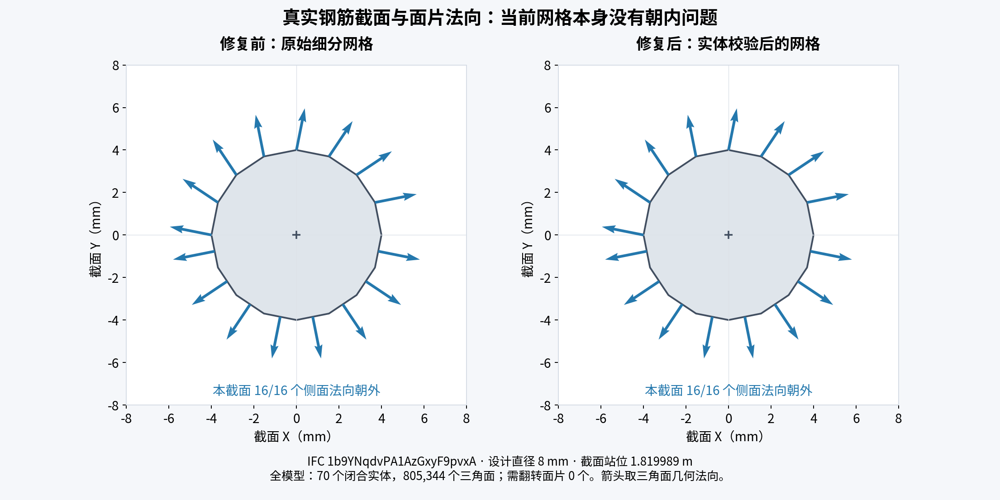
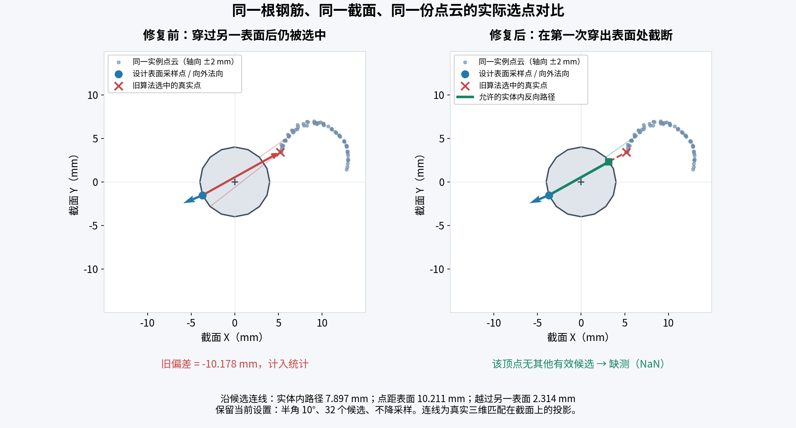

# Scan-vs-BIM：钢筋外法向与反向捕获实体边界

日期：2026-09-13。实现版本：`c2m-rebar-instance-v2`。

## 结论

当前钢筋细分模型的法向本身正确：70 个闭合钢筋实体、805,344 个三角面，逐实体绕序与有符号体积检查未发现需翻转的面。问题是旧双向法向圆锥只限制夹角与 0.2 m 搜索距离，未限制反向路径必须留在钢筋实体内。因此，即使同一实例归属正确，仍可能穿过钢筋另一表面捕获点云。

最小复现：直径 20 mm，设计点在 x=+10 mm，外法向为 +X。候选在 x=−15 mm，旧函数选中并输出 −25 mm；新函数拒绝。x=+5 mm、0 mm、−5 mm 的内部点仍允许，x=−10 mm 的边界点允许。这是实体边界限制，允许穿过轴心后仍留在实体中的点。

## 实现

- 按同一钢筋的源 part 重组分析瓦片，仅对查询副本做完全同坐标焊接；校正每个连通实体的面片绕序和朝向，再由修正后的三角面计算顶点法向。顶点位置、顺序、逐筋距离区间和原始 GLB 文件不变。
- 当前 trimesh 在整块反转后可能保留旧法向缓存。修复后重新从面片绕序构造几何，避免“面已翻转、法向仍旧”的不一致；测试覆盖全部反转和部分面反转。
- 查询时保留原先的局部横向法向圆锥及横向有符号距离口径。对每个反向候选，沿设计点到候选点的**实际三维连线**与完整钢筋三角网格求交；候选必须位于第一次穿出表面之前或边界上。
- 斜向路径使用实际弦长，弯折、多段、端部都使用三角面，既不简单套用直径，也不只判断候选终点是否在实体内。穿出后进入另一段钢筋的点也被拒绝。
- 求交在平移到局部原点的坐标中执行，自交偏移与边界数值容差为 1e−7 m（0.0001 mm）。首次命中必须是出射面，避免把锐角附近从外部射入的路径误当内部路径。
- 无有效候选记 NaN。最近点回退也不能绕过实体边界。无法形成可信闭合实体的 part 清空可信法向，在法向约束模式下缺测，并在逐筋 `solid.invalidPartCount` 诊断中记录；不猜测内外。未新增自相交网格修复功能。
- 输出保持逐顶点距离绑定：面片有各自的外法向，顶点使用相邻面片的法向插值。纵向端盖采样仍按原规则排除。
- Python 服务与 Go 输入指纹一起升级至 v2，旧结果会被标为过期。逐筋新增 `solid` 诊断，记录闭合 part 数、无效 part 数、翻转面数及反向候选检查/阻止次数。

## 真实输入前后重放

使用用户当前数据：1,840,398 个扫描点、402,812 个设计顶点、70 根钢筋；去噪版本 `fca5fd70084036e2a01d82d2`。保留当前 10° 半角、k=32、不降采样、±5 mm 工程容差与 ±20 mm 色域，并使用原计算矩阵。输入文件与 SHA256 见 [summary.json](assets/rebar-solid-2026-09-13/summary.json)。

| 指标 | 修复前 | 修复后 |
| --- | ---: | ---: |
| 有效匹配顶点 | 90,054 | 67,063 |
| 缺测顶点 | 312,758 | 335,749 |
| 最小有符号偏差 | −199.833 mm | −10.793 mm |
| 平均绝对偏差（仅有效顶点） | 6.888 mm | 5.183 mm |
| 同机离线完整重放耗时 | 5.578 s | 7.435 s |

22,991 个原有效顶点失去匹配，44 个保留有效值的顶点改选候选，未新增覆盖顶点。检查了 332,586 次反向候选，阻止 202,426 次；这是候选查询次数，同一个扫描点可以出现多次，不能当作独立点云数量。有效顶点减少是排除无效穿透匹配的结果；均值和容差内比例的分母已经改变，不能单凭变小的均值宣称整体精度提升。正向仍沿用 0.2 m 距离上限。

下面的前后图均取真实原始网格和实际计算选点，未人为反转原始模型来制造问题。

### 面片法向与截面



### 反向穿透匹配



示例为 IFC `1b9YNqdvPA1AzGxyF9pvxA` 的直径 8 mm 直筋，设计顶点索引 929。沿候选连线的实体内长度为 7.896607 mm，候选距离为 10.210914 mm，越过另一侧表面 2.314307 mm。旧算法记录横向偏差 −10.178391 mm；新算法没有其他合法候选，记录缺测。完整坐标与外法向见 [sample.json](assets/rebar-solid-2026-09-13/sample.json)。图中连线是三维匹配在横截面上的投影；距离数字使用三维实际路径，偏差数值使用原有横向口径。

## 验证与本地状态

- Python 50 项定向测试通过。包括穿透、内部/边界、斜弦、跨另一段、最近点回退、反转/混合绕序、瓦片重组与接缝法向、大坐标，以及“反转并切成多个 GLB 瓦片→真实实例比较→输出外法向和距离”的完整调用链。
- Go `go test ./...` 通过。
- 另以独立 float64 Möller–Trumbore 求交检查修复后的分层抽样反向匹配，结果见 [independent-verification.json](assets/rebar-solid-2026-09-13/independent-verification.json)。该检查不调用生产 Open3D 边界函数。
- 已通过 `scripts/cloudbim-dev.sh start` 更新本地服务，并通过实际 Go→Python 计算接口重算当前结果。原保存的各根钢筋统计与旧算法重放一致；新接口下载的逐顶点距离与修复后离线重放一致（含 NaN）。70 根钢筋报告均已保存；计算参数、显示参数和矩阵保留。服务端本次耗时 6.732 s。
- 已确认 v1 输入指纹过期，新结果为 v2 且 `fresh=true`。结果版本：`13de619010dbb413ea8aa711a36bf2ee8baaf05d215e00cdf4d41f82c778d963`。
- 本次未改动前端界面；证据图是可复现的科学绘图，不是浏览器截图。已目视检查两张 PNG 的箭头、连线、坐标和中文标签。

复现脚本：[replay.py](assets/rebar-solid-2026-09-13/replay.py)、[plot.py](assets/rebar-solid-2026-09-13/plot.py)、[verify_rays.py](assets/rebar-solid-2026-09-13/verify_rays.py)。保留的旧选择函数：[before_rebar_deviation.py](assets/rebar-solid-2026-09-13/before_rebar_deviation.py)。完整本地输入、NPZ 逐顶点匹配轨迹、前后报告和测试日志位于忽略目录 `.cloudbim/normal-solid-audit/`。

```bash
.cloudbim/mesh-venv/bin/python docs/development/assets/rebar-solid-2026-09-13/replay.py \
  --inputs .cloudbim/normal-solid-audit/inputs.json \
  --output .cloudbim/normal-solid-audit/replay
.cloudbim/mesh-venv/bin/python docs/development/assets/rebar-solid-2026-09-13/plot.py
.cloudbim/mesh-venv/bin/python docs/development/assets/rebar-solid-2026-09-13/verify_rays.py
```
