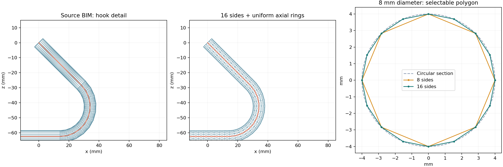

# 钢筋保形网格均匀化

## 实现结果

均匀化统一使用 `rebar_sweep`。界面可设置截面边数（8–128，默认 16）、轴向最大间距（默认 10 mm）和轴线弦高误差（默认 0.1 mm）。旧 Isotropic 算法及兼容分支已按用户要求移除。界面只保留钢筋保形参数，重新上传或重新处理即可生成新网格。

原流程的近点合并、边收缩和平滑会改变细钢筋及弯钩形状。新流程从原始 BIM 三角网格的圆形端面出发，沿拓扑恢复完整截面环，拟合环中心、半径和截面法向。利用截面法向约束各段中心线，以弧长等距采样，再用平行移动标架生成多边形截面，相邻环分成三角形并封口。

轴向设置是最大间距：若弯曲处达不到弦高误差约束，整根钢筋统一缩小间距，因此直段和弯段仍按同一弧长步长划分。总长通常不是目标间距的整数倍，会采用 `总长 / ceil(总长 / 允许间距)`，两端完整保留。

截面是内接正多边形，直径不会被平滑收缩，但面中点到理想圆面的误差为 `r × (1 − cos(π/n))`。这个误差与轴线弦高误差分开记录。输出在原模型坐标系内，构件 GlobalId、partId 和层级关系保留。

## 支持范围

支持保留完整等半径圆截面环拓扑、具有两个圆端面的钢筋实体，包括直筋、弯钩和空间多段弯筋。当前真实模型的 70 根钢筋全部符合此条件。非圆构件、缺面、分支、变半径、闭合环或无法可靠恢复的任意重三角化网格保留输入几何，并在构件 `metrics.json` 的 `remeshDiagnostics` 中记录原因；不会退回可能变形的 Isotropic。

PLY 输出接口逐个连通实体处理；GLB 输入按节点处理。自动构件级分析网格使用 `rebar-sweep-component-v1`，因此预览和后续 C2M 不会再误用旧 Isotropic 生成器。

增加了法向与弦方向一致性检查，稀疏尖角不能被插值成额外弯曲。完全重叠或非流形实体在拆分前整体保留，避免碎成三角形。整个模型共享 2,000,000 顶点预算，超过预算会明确报错。

## 验证结果

真实输入：`backend/data/assets/88d5ff2f0b10c8507273a309/model.glb`。

- 71 个构件：70 根钢筋重建，1 个非圆构件保留。
- 三角面数：63,712 → 805,376；增加面片用于沿轴细分。
- 70 根重建钢筋均封闭且面朝向一致。
- 几何处理：3.45 秒；构件构建及分块写出：5.06 秒（不同运行负载会有波动）。
- 真实模型抽样双向表面距离上界最大约 0.180 mm，包含原 BIM 和输出各自多边形化的差异；这不是连续曲面的严格 Hausdorff 保证。
- 分块验证：71 个构件、123 个块，每块不超过 10,000 面；原始模型范围和构件标识保留。
- 本地运行服务 `/remesh` 返回 HTTP 200，PLY 为 402,860 顶点、805,376 面，与离线结果面数一致。
- 几何与分析网格测试通过。移除旧算法后，另执行了 48 项几何、分析网格和 C2M 测试，以及 3 项入口与默认值测试，全部通过。
- `go test ./...`、`vue-tsc --noEmit`、`npm run build` 和 `git diff --check` 通过。

抽样距离采用 Open3D 查询候选面后，以 float64 重新计算候选面和相邻面的最近距离。原模型直段有极细长三角形，直接使用 Open3D float32 距离曾产生约 0.47 mm 的数值误差；相同点用 float64 精确计算约为 0.029 mm。候选面距离是实际最近距离的上界，避免把数值误差误报为几何变形。



原始数据及逐构件耗时见 [validation.json](assets/rebar-remesh-2026-09-12/validation.json)。从仓库根目录复现本模型验证：

```bash
.cloudbim/mesh-venv/bin/python docs/development/assets/rebar-remesh-2026-09-12/validate.py
cd services/mesh-service
../../.cloudbim/mesh-venv/bin/python -m unittest test_rebar_sweep.py test_analysis_mesh_shared_remesh.py test_analysis_mesh_contracts.py test_analysis_mesh_artifact.py test_analysis_mesh_api.py test_remesh_api.py test_c2m_reference_core.py
```

本地栈通过 `scripts/cloudbim-dev.sh start` 更新。当前没有可连接的浏览器，未声称完成人工式页面点击验收；已完成前端类型检查、生产构建和运行服务接口验证。未覆盖用户当前资产的既有均匀化产物。

## 工作时间

- 开始：2026-09-12 22:53:39（北京时间）。
- 结束：2026-09-12 23:10:06（北京时间）。
- 总耗时：16 分 27 秒（含实现、子智能体检查、修复、测试和本地服务更新）。
- 子智能体：两名，均为 `gpt-5.6-sol` / `high`；一名负责界面与 Go 接入，一名负责独立几何检查。主智能体负责几何实现、真实模型验证及集成。两名子智能体均已完成任务并停止工作；独立检查发现的三项问题均已修复并复验通过。

## 后续清理（2026-09-12）

用户确认会从头运行，无需兼容旧算法。已移除旧实现、构件适配器、旧算法专用基准脚本、PyMeshLab 依赖和启动预热；统一文件接口及构件接口的算法选择和默认值。测试覆盖旧算法 ID 和旧参数被拒绝，以及两个新入口的输出一致性。保留算法身份及文件指纹校验，防止把旧产物冒充新结果。源模型、点云和用户资产文件不在清理范围。

本次清理验证：Go 全量测试、前端类型检查及生产构建通过；运行镜像确认不再安装 PyMeshLab；两个算法目录分别仅返回 `rebar_sweep` 和 `rebar-sweep-component-v1`。真实 GLB 未指定算法的请求返回 HTTP 200，耗时 3.92 秒；旧算法请求返回 HTTP 400。旧产物仅标记为不可用于当前分析并允许重新生成，不删除文件。单名 sol high 子智能体完成 Go/UI 清理和测试，已结束工作。

后续清理计时记录：2026-09-12 23:12:16–23:22:01（北京时间），9 分 45 秒。最终本地栈全部健康，工作分支保持 `dev-hong`。

## 全屏预览显示修复

用户反馈 BIM 全屏预览仍像旧结果。核查资产 7：新算法任务已于 2026-09-12 23:22:53 完成，产物为 402,860 顶点、805,376 面。原因是全屏预览默认关闭均匀化显示，且任务完成后没有自动切换，因此实际仍显示原始 GLB。

全屏预览现在等源场景及保形网格均就绪后自动加载新网格，并明确显示当前是“保形网格（橙色）”还是“原始模型”。手动切回原模型的选择会保留；切换资产恢复自动显示。产物指纹或完成时间变化会重新加载，重复状态查询不会重复下载。下载失败会显示错误并保持原模型，允许手动重试；失效的异步请求不能把旧结果挂回场景。最新 PLY 请求增加缓存重新验证。

验证：6 项状态测试、4 项实际 Vue 组件及 Three.js 场景测试通过，覆盖自动加载、两种加载顺序、坐标与相机保持、线框、恢复原模型、下载失败及异步失效。`npm run build`（含类型检查）与 `git diff --check` 通过。本地 5173 服务已返回修复后的组件；服务栈健康。没有可连接的浏览器，未进行浏览器画面验收。

显示修复实施及验证计时：2026-09-12 23:30:14–23:32:55（北京时间），2 分 41 秒；不包含此前定位及等待用户确认显示位置的时间。
