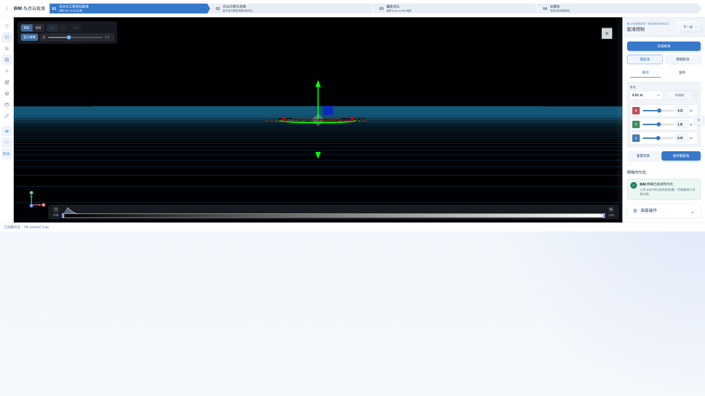
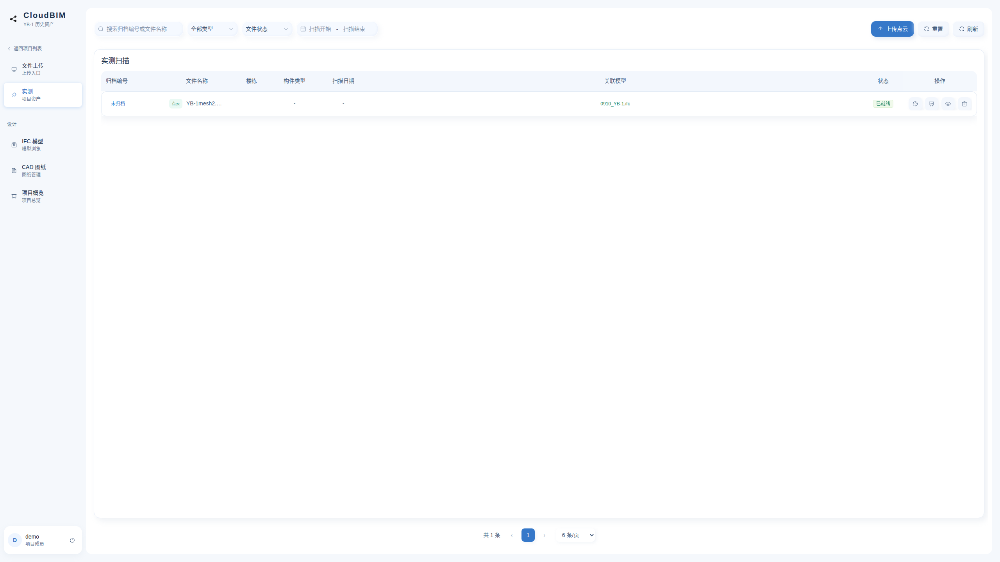
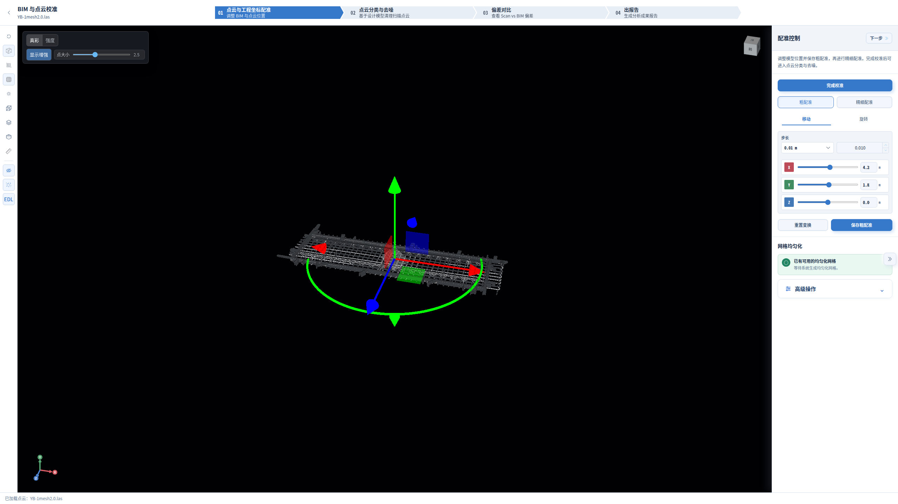
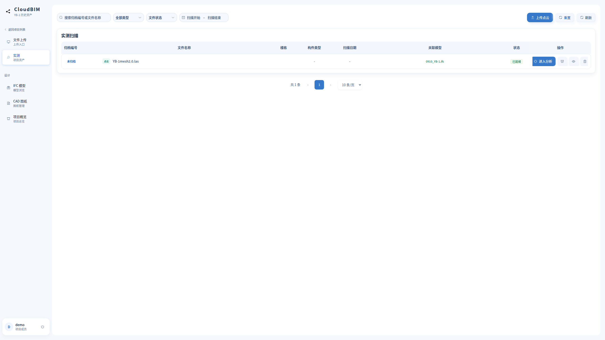
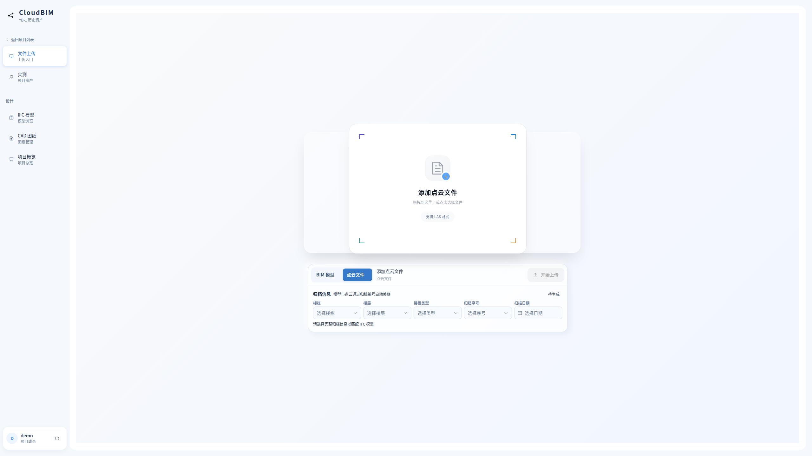
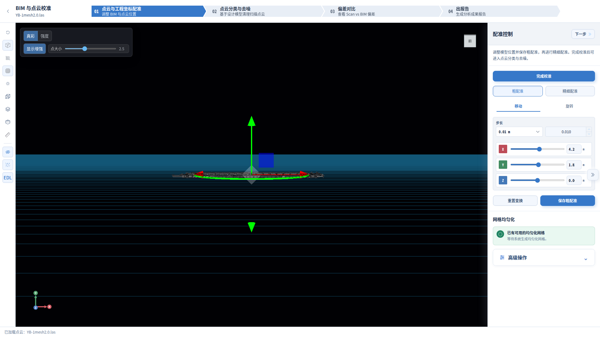

# CloudBIM UI/UX 检查与改进

## 范围与方法

目标是改善现有 Vue 3 / Element Plus / Three.js 桌面软件的操作路径、布局与一致性。
按用户确认，以 **2560×1440、16:9** 为主视口，**1920×1080、16:9** 为兼容视口。
早期的 1440×1000 与 768px 截图仅用于发现问题，不作为最终设计比例。

Impeccable 4.3.1 已安装到 `/home/hong/.agents/skills/impeccable`，来源为
`pbakaus/impeccable` 的提交 `cb56ed6c19a07329a9fa0cd4e657bee040156593`，使用仓库
`.agents/skills/impeccable` 的 Codex 版本。补齐启动器执行权限后，运行引擎验证返回
`impeccable-engine 0.1.5`。初次上下文启动因执行权限失败，按技能回退说明直接读取
项目现有样式；没有重新运行上下文命令。

使用 Product Design audit 的流程截图方法和 Impeccable Operate/layout/polish 原则。
两个 `gpt-5.6-sol / high` 子智能体分别负责界面结构/布局评估与独立机械检查。
机械检查结果在独立布局评估完成后才用于综合判断；这不是完整的 Impeccable
critique 评分流程，也不宣称完整 WCAG 合规。

内置浏览器不可用，用户明确同意 Playwright 后，因 MCP 浏览器配置被占用，使用
独立的 headless Chrome / Playwright 会话。应用仍使用已运行的开发栈管理器服务。
本地测试会话沿用仓库现有开发测试的认证方式，不修改用户浏览器、账户或登录配置。

## 流程观察

| 步骤 | 实际检查 | 初始状态 / 问题 |
| --- | --- | --- |
| 1. 项目入口 | 项目列表、进入项目、导航结构 | 入口偏弱；卡片嵌套操作的 Enter 事件可冒泡触发进入项目 |
| 2. 上传准备 | BIM 上传页、归档字段与点云类型切换 | 大量装饰堆叠；主文件选择区缺少键盘入口；类型切换依赖小图标 |
| 3. 资产发现 | 实测列表、IFC 列表、筛选与预览入口 | 常用操作仅图标；文件名空间不足；分页与记录距离过大 |
| 4. 点云预览 | 加载真实点云、进入测量模式、显示设置与返回 | 测量工具遮挡视角立方体；无效色带选项常驻；选择状态不完整 |
| 5. 配准工作区 | 真实 BIM/点云加载、流程导航、控制面板 | 2560×1440 下根容器只有842px高，底部约598px空白；控制区仅300px |
| 6. 后续步骤 | 检查去噪/偏差/报告入口与前置状态 | 数据就绪状态会变化；未为外观测试提交配准、启动去噪或生成报告 |

## 优先问题与处理

1. **P1：工作区未填满显示器。** 后置 `height:100%` 覆盖 `100vh`，而父节点只有
   最小高度。改为明确的 `100vh` / `100dvh`，保留面板内部滚动与收起逻辑。
2. **P1：键盘入口与嵌套事件不可靠。** 上传、项目卡片、侧栏及视角导航使用可访问
   操作语义；防止卡片截获子按钮 Enter。视角立方体的 Home/旋转按钮从仅
   pointerdown 改为原生 click 激活，并补充方向键操作。
3. **P2：主要操作不易发现。** 资产主操作增加可见文字，保留次要操作名称；显示
   当前项目/文件上下文，改善空列表和无筛选结果的下一步。
4. **P2：控制区拥挤与互相遮挡。** 配准控制区统一为360px，流程标题/说明增大；
   点云测量工具避开视角立方体；仅强度模式显示色带与区间控件。
5. **P2：排版规范不一致。** 添加 Linux 中文无衬线字体回退，统一字号、间距和
   控件尺寸，减轻重复控件阴影，保留蓝白界面及用户选择的场景背景。
6. **P2：窄屏侧栏规则失效。** 768px时文本已隐藏但侧栏仍220px；修复后为真实
   紧凑导航。此项是兼容检查，主设计仍为桌面16:9。

## 视觉证据

以下原始截图均为2560×1440。图内中文文件名为本地开发数据。

### 配准页：修改前

### 资产列表：修改前

### 修改后：桌面 2560×1440

补充截图：[项目列表](assets/uiux-2026-09-12/projects-after.png)、[IFC 列表](assets/uiux-2026-09-12/bim-after.png)、[点云预览](assets/uiux-2026-09-12/preview-after.png)。

### 1920×1080 兼容检查

[资产列表 1920×1080](assets/uiux-2026-09-12/assets-after-1920.png)

## 验证结果

- 构建：最终 `npm run build` 通过（vue-tsc + Vite）；保留已有的大包警告。
- 配准页：根容器分别为2560×1440和1920×1080；2560下无整页横向溢出。
  主画布为2150×1334，收起360px面板后为2510×1334，恢复后回到2150×1334。
- 预览页：立方体位于y=80至164，展开测量工具位于y=240至438，互不遮挡。
  1280×480下工具底部438px，仍在416px高、起点y=64的场景区域内。
- 键盘：项目编辑按钮按空格打开编辑框且不进入项目；取消后按Enter进入项目。
  BIM和点云选择区均可按Enter打开文件选择器，未选择或上传文件。
- 测量：全局测距选中状态为true，Escape退出后为false；立方体方向键可改变观察方向，
  内部按钮获得焦点时opacity为0.95，可见。
- 条件控件：点云预览强度模式显示色带与区间，切换真彩后隐藏。
- 资产列表：筛选无结果可重置恢复记录；修正旧margin-top:auto冲突后，分页与表格间隔16px。
  IFC列表刷新后记录、文字预览按钮与就近分页正常。
- 窄窗口：768px下侧栏实测宽64px；此项仅检查稳健性。
- 独立源码复核发现的短窗口裁切和键盘焦点透明问题已修复。最终增加三处ref<number>
  类型声明，使同时更新的网格参数回填代码通过类型检查，不改变运行时取值和算法。
- 检查期间后端/mesh服务被其他开发任务重启，IFC加载发生一次502；服务健康后刷新恢复。
  当前IFC空状态仍会把首次请求失败呈现为暂无模型，这是已有错误反馈不足，后续应专门补充。
  IFC网格状态也随并行开发从成功变为处理失败；这次UI检查没有运行网格任务。

原始日志在本地忽略目录 `.cloudbim/uiux-2026-09-12/`，包括最终构建日志和机械扫描。
截图是浏览器原始视口截图，没有拉伸。两档尺寸均为16:9，deviceScaleFactor为1；
27寸表示物理对角线，本次未模拟操作系统125%或150%缩放。

## 已知边界

- 仓库在任务开始前已有大量后端、算法和预览/配准功能修改，过程中也有其他开发
  改动。此次按具体上下文修改 UI，不回滚既有工作，不调整坐标、几何或分析算法。
- 未执行上传、删除、保存配准、去噪计算或报告发布；外观检查不证明这些业务链路
  的结果准确性。
- 初始 Impeccable 布局检测输出为空，但实际截图和源码发现了明确问题；机械
  扫描不是视觉质量或无障碍合规证明。
- 仅验证当前可用的本地 Chrome 环境；屏幕阅读器、其他浏览器和系统缩放需要
  后续专门验收。

后续界面改动应遵守仓库根目录 `DESIGN.md`。
