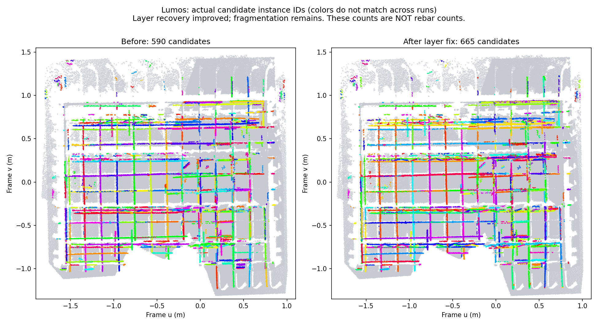

# Lumos 无设计模型实例分割质量排查（2026-09-27）

## 结论

用户要求每根钢筋一个实例，弯钩与主体连续。当前结果尚未达到这个标准。此次修复了漏掉上层的分层错误，以及直径上限被当成真实测量值的错误；已经重跑并更新项目 3 / 实测资产 8 的预览。665 是候选数量，不能当作钢筋根数。没有引入设计模型，也没有将台面、夹具、钢筋拆成三个资产。



## 可复现证据

- 原始点数：3,039,739；所有源点均参与计算。浏览器采用原有瓦片及 LOD，瓦片总点数 760,054。
- 上传 LAS SHA256：`5799e0acdb897ae35ecd430a3280ef44ba173b79ef6e94822ec8b210577ce08c`。
- 原结果：`20260927T104046-10e69427`。
- 更新结果：`20260927T115027-634ad064`，`priorMode=off`、`controlNetMode=off`。
- 管线：`shared-segmentation-v31-measured-layer-mass+workbench-design-inputs-v1`。
- 两次源坐标和记录顺序一致，预览发布逐点验证刚体变换后最大误差 8.65 微米。

| 检查项 | 原结果 | 修正后 |
| --- | ---: | ---: |
| 检出的高度层 | 只有底层 | 底层约 19.2 mm、上层约 95.6 mm |
| 上层实例归属点数 | 0 | 66,539 |
| 腹杆实例归属点数 | 0 | 40,701 |
| 上层抽查区域中有实例归属的比例 | 4.88% | 91.71% |
| 全场有实例归属的点数 | 382,854 | 452,075 |
| 候选数量 | 590 | 665 |
| 短于 20 cm 的候选数量 | 450 | 519 |

**点归属比例不是识别准确率。** 抽查区域包含上弦筋和腹杆接头，没有逐根人工真值；不能用此比例证明整根实例正确。短候选也可能包含真实短筋，不能直接全部删除。图中部分长筋连续性改善，但重叠拟合、端部碎片和腹杆碎片仍明显。

抽查区域在已保存夹具坐标轴下：`-1.35 < u < 0.6`、`0.25 < v < 0.32`、`z > 0.085`，共 25,055 点。快速复现命令：

```bash
.cloudbim/mesh-venv/bin/python docs/research/assets/lumos-instance-quality-2026-09-27/probe.py \
  backend/data/imports/lumos_1/pointcloud-steps/20260927T115027-634ad064
```

同一命令换成旧结果目录，会在“可见上层缺失”处失败。新结果通过上层存在和抽查区域归属比例检查；这些检查不代表整根钢筋质量通过。

## 已确认并修复的问题

1. **高度峰的筛选量纲不一致。** `_height_bands` 用几个峰值格的点数，与整幅直方图总量的 1.2% 比较。Lumos 的上层峰明显存在，但峰高约 2,963，小于阈值约 3,658，因此被删除。改为统计峰周边高度带内的支持点数，保留原有显著性筛选。增加了“密集底网＋稀疏上弦”的失败回归。
2. **半径受限的拟合被当成直径观测。** `diameter_priors` 只在寻找次要直径时排除触及半径边界的拟合，主直径仍使用全部拟合，制造出 18 mm 上限峰。主、次直径现统一只使用可靠测量；缺少可靠测量时不生成直径先验。增加了边界拟合占多数、全部受限两种回归。单独修正直径时，候选仅从 666 降至 665，因此不能把它夸大为碎片问题的解决办法。
3. **预览含义需要明确。** “查看分类”按台面/夹具/钢筋/噪点显示，“查看实例”按候选 ID 显示。现在实例图例明确说明包含断裂片段、弯钩尚未拼接、不能据此统计钢筋根数。

## 尚未解决的根因及下一步

当前 `_horizontal_models` 分段拟合约 20 cm 局部圆柱，再按轴向、半径和中心线距离合并；`_web_models` 的实例单位明确是一个腹杆直段。它没有在无 BIM 模式下把完整弯钩、连续折线腹杆重建为一根实体钢筋。局部截面稀疏、肋纹、遮挡或坐标扰动可导致相邻拟合的直径/轴心不同，随后被分成不同实例。

不建议直接放大聚类半径或将所有相连点合并：交叉钢筋会被连成一张网，与用户要求冲突。下一步应增加独立的**整根钢筋重建阶段**，仍只使用实测点云：

1. 先用少量人工标注的长筋、交叉筋、弯钩和折线腹杆建立逐根对照。记录每根的覆盖、被切成几段、是否混入邻筋，避免以候选总数和点归属率验收。
2. 用沿程截面和空间邻域提取中心线；优先稳定长直主体。不同高度、不同方向的交叉筋分别跟踪。
3. 对端部做有观测支撑的曲线延伸；在弯钩及腹杆转折处用位置、切线、截面和实际连通证据连接。无支撑或多个解释同样合理时保留待定，不强行串筋。
4. 一根实例允许多个直段和弯段，最后统一竞争源点归属，并检查相邻平行筋和焊接交点的误合并。

夹具分类也有待复核：本次推定的一侧夹具带宽约 1.064 m，区域先验仍会影响类别。此次没有凭截图强改夹具阈值；需要将真实夹具面、贴近夹具的钢筋和扫描杂点分别标注后验证。

## 验证与边界

- 相关 Python 回归共 42 项通过（41 项初次套件＋新增“全部受限”回归；后续完整重跑轨迹模块 10 项通过）。
- `npm run build` 通过，包括 TypeScript 检查。
- 对原始 3,039,739 点完整重跑，结果与隔离末阶段回放一致。
- 真实浏览器打开新结果、切换实例，确认新提示和候选着色；场景仍只有一个点云包装对象。
- 发布为新的不可变派生目录，旧结果和原始源文件保留。预览仍需登录。
- 尚无逐根真值，整根准确率、弯钩归并率、误合并率未验证；当前结果不用于根数验收。
