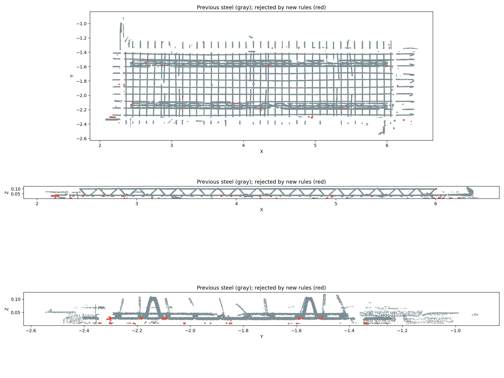

# 02A 悬浮团块误判修复

02A 的局部 PCA 使用 35 mm 邻域，附近小团块可能借用真实钢筋的空间主轴和法向量分布，直接成为钢筋种子。后续 12 mm 近邻扩张、50 mm 轴向补回又缺少独立连通形状检查，进一步保留了悬浮点。这些点来自原始扫描；分类过程没有生成点。

合成复现：在直径 8 mm、长度 180 mm 的钢筋附近加入直径 4 mm、600 个点的球状团块。测试位置包括侧方 10/13 mm、端部外 25/40 mm 和靠近端部的侧方。旧算法在五种场景中均将整个小球标为钢筋，新版全部排除，钢筋主体全部保留。

## 实现

- 在已有 3 mm 支撑体素上，以 5.4 mm 距离构建连通分量；点团自身必须有至少 6 个占用体素、20 mm 空间跨度，才能借助原有局部圆柱判别成为种子。
- 为保护扫描断段，另允许具有独立细长形状的碎片：PCA 长度至少 10 mm、长宽比至少 1.5、宽度小于 25 mm。这里长度、宽度采用 `4√λ`，不是精确直径或端点测量。
- 近邻扩张、轴向补回只能在同一分量内，或通过符合上述细长条件的片段跨越扫描空隙。孤立小球即使有大量重复回波，也不能借旁边钢筋通过判定。
- 03 融合的轴线恢复复用同一约束；投影候选作为恢复种子也须通过连通支撑检查。
- 不要求整张钢筋网、弯钩或交叉钢筋具有单一全局直线方向。保留原有端帽、交叉点恢复逻辑。

02A 继续使用三分类。被排除的钢筋候选进入类别 2（夹具及场景剩余点），不是新增的“噪音”类别，也不会删除源点。02B 的独立分类不受该规则直接否决。

版本：`normal-geometry-v5-component-support`、`geometry-projection-fusion-v2-component-support`、`shared-segmentation-v5-component-support`；生产 `geometric-v6` 描述符版本升为 `3`，避免复用旧算法缓存。

## 实际扫描验证

基线：`20260910T163330-08ec0443`。新版：`20260910T164009-0ff165be`。

从同一源 LAS 完整重跑至页面第 06 步，使用原有 topology 模式；总耗时 41.28 秒，02A 耗时 4.09 秒。02A 使用 14 个工作线程，与单独使用 16 线程的分类标签逐元素一致。

| 02A 类别 | 基线 | 新版 |
| --- | ---: | ---: |
| 台面 | 5,209,994 | 5,209,994 |
| 夹具及剩余点 | 2,211,888 | 2,214,799 |
| 钢筋候选 | 1,794,487 | 1,791,576 |

共 2,911 个点退出钢筋候选，没有新增钢筋候选或台面标签变化。在同一份点坐标与法向量上进行单独 16 线程对照，分类耗时由 3.68 秒变为 3.93 秒；新增连通分析约 0.26 秒。此为本机单组测量。

源文件 SHA-256、全部 LAS 原始字段及点数一致；01 法向量与相关属性逐元素一致；02A 的 NPY、LAS、预览属性一致。验证记录见 [verification.json](assets/pointcloud-02a-component-support-2026-09-11/verification.json)。

验证工具：`scripts/pointcloud-02a-noise-check.py BASELINE_RUN NEW_RUN`，通过项目 `.cloudbim/mesh-venv/bin/python` 执行。工具同时核对源数据、01 属性、LAS 和预览，不把分类变化自动当作噪音真值。

95 项 mesh-service 测试及 6 项调试服务测试通过。新增覆盖侧方/端部悬浮球、独立短钢筋、扫描空隙两侧的细长片段、90° 弯折钢筋，以及融合恢复不得重新吸入已排除的小球。原有端帽、交叉钢筋、方管、旋转及法向量符号测试通过。

本地服务已通过 `scripts/cloudbim-dev.sh stop/start` 更新，健康检查通过，运行中生产描述符确认版本 3。练武场已发布上述新运行，保留旧运行以便对照。没有做浏览器手动点击验收；已验证 HTTP 状态和实际预览二进制内容。

## 范围

实际扫描没有人工逐点真值，2,911 是候选标签变化量，不能称为真实噪音检出数或准确率。与钢筋粘连的噪点、大尺寸但形状相似的物体，以及严重稀疏或尺度不同的扫描仍可能误判。这次主要解决孤立团块借用邻近钢筋证据的问题；阈值按当前米制扫描尺寸设置。
