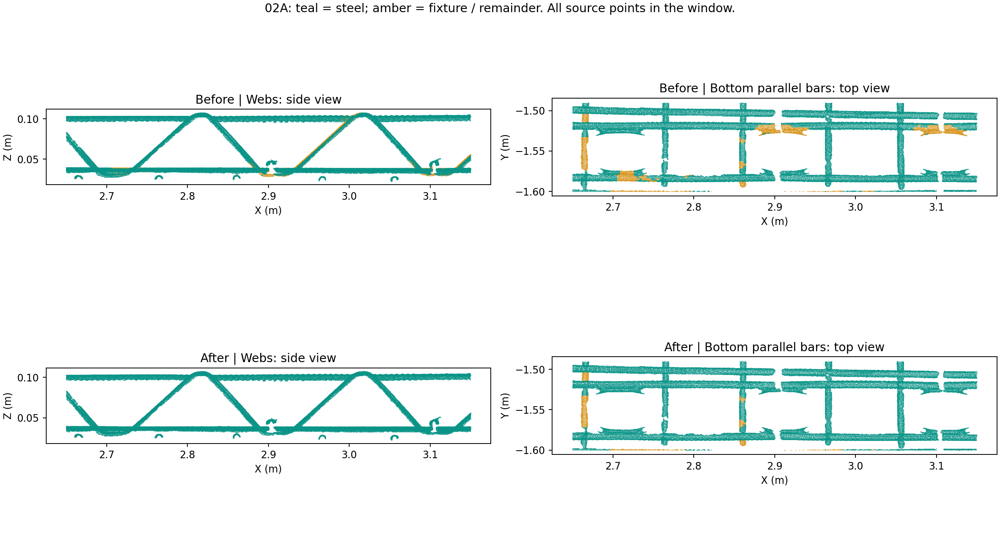

# 02A：恢复腹杆与紧邻底部双筋

新运行：[练武场](http://127.0.0.1:8766/?run=20260911T053731-04d92d19)，选择 **02A 法向量几何分类**。完整结果已计算至第 06 步。

## 问题与修改

紧邻两根钢筋会占满原有 96 个体素邻居，局部空间 PCA 缺少沿杆长方向的范围，误把合并后的截面当成宽块。合成复现中，两根直径 12 mm、表面间隔 2 mm 的平行圆柱全部被归为夹具。

腹杆还会遇到另一种否决：稀疏的表面条带被平面聚类拼成狭窄夹具面。实际窗口里的两处错误平面宽约 19–20 mm、长约 150 mm，但填充率只有 25%–27%，其内及周边点被跳过圆截面检查。

本次增加两项复核，均在原分类完成后进行，保留原先所有钢筋标签：

1. 对宽度小于 25 mm、填充率低于 50% 的狭窄平面重新检查。只有通过原有法向、粗细、轴向和圆截面规则的点才能成为新种子，再以原有连通性约束补回相邻点。低填充率本身不等于钢筋。
2. 对仍待恢复的点检查局部圆柱壳。使用最多 256 个体素邻居，从法向分布求轴向，检查圆柱表面距离、法向与径向的一致性、轴向跨度及截面法向变化。圆角附近的实体夹具面继续受保护；不完整截面还需已有钢筋提供方向、中心线及直径一致的接续证据。

既有悬浮点约束仍适用：小孤岛不能借用旁边钢筋的形状；新恢复点不递归充当扩张种子。实体平面、方管相邻垂直面及宽面附近的体积保护继续保留。复核只变更原始点的类别，不生成或删除点。

实现为 `normal_geometry_classifier.py` 和新增 `normal_cylinder_recovery.py`。版本为 `normal-geometry-v6-crowded-cylinders`；共享流程升至 `shared-segmentation-v10-crowded-cylinders-height-fixtures`，沿用既有高度带夹具规则；生产 `geometric-v6` 描述符版本为 `4`。

## 全量结果

比较基线 `20260911T052043-541d4813` 与新运行 `20260911T053731-04d92d19`，源点数均为 9,216,369。

| 02A 类别 | 基线 | 新版 |
| --- | ---: | ---: |
| 台面 | 5,209,994 | 5,209,994 |
| 夹具及剩余点 | 2,214,799 | 2,149,966 |
| 钢筋候选 | 1,791,576 | 1,856,409 |

新增 64,833 个钢筋候选，原有钢筋候选新增删除 **0** 个。其中 54,389 点通过稀疏平面复核与轴向恢复，10,444 点通过圆柱壳复核。所有新增点均设置恢复标志，可用已有“仅恢复点”筛选查看。

局部窗口：X 2.65–3.15 m，Y −1.60–−1.49 m，Z 0.018–0.12 m。表中是窗口内标为钢筋的点数，不是人工真值准确率。

| 窗口 | 原始点数 | 基线钢筋候选 | 新版钢筋候选 |
| --- | ---: | ---: | ---: |
| 腹杆与上弦，Z > 0.05 m | 21,571 | 20,142 | 21,571 |
| 底部双筋，Z < 0.041 m | 34,099 | 30,001 | 32,926 |

图片使用窗口内全部原始点。可见腹杆表面的缺条已补回，底部双筋及接触处仍有部分黄色区域保留。

## 验证

- 119 项 mesh-service 算法、流程及接口测试通过，另有 6 项练武场接口测试通过。
- 新增覆盖直径 10/12 mm 的水平或竖向紧邻双筋，两根筋分别保留超过 99% 的合成真值点；另覆盖稀疏错误平面下的斜杆、法向符号和线程一致性。
- 既有悬浮球、紧邻方管、圆角方管、端帽、交叉点、短筋和弯折钢筋测试通过。
- 源文件哈希、所有原始 LAS 字段、原始点数、01 法向及相关属性一致。02B 类别及高度层逐点一致。
- 所有原有 02A 钢筋保留、新恢复标志、NPY/LAS/预览一致性通过。独立 16 线程分类与完整流程中的 14 线程分类逐点一致。
- 完整重跑耗时 44.72 秒；本次流程内 02A 耗时 5.71 秒。独立对照约为 3.93 → 5.57 秒，新增约 1.64 秒，为本机单组测量。
- 本地栈通过管理脚本更新，运行中的生产描述符确认版本 4。已验证 HTTP 完成状态和预览数据，未进行真实浏览器点击验收。

全量核对记录：[verification.json](assets/pointcloud-02a-crowded-recovery-2026-09-11/verification.json)。复核及绘图工具：`scripts/pointcloud-02a-recovery-check.py BASELINE_RUN NEW_RUN OUTPUT_DIR`，使用 `.cloudbim/mesh-venv/bin/python`。

实际扫描没有逐点人工真值，64,833 是新增候选标签数。严重遮挡、方管接触区和只呈现很小一段截面的钢筋仍可能漏检。上游体素和平面分组也仍受姿态影响；旋转后的紧邻大直径双筋合成场景仍观察到较多漏点，本次结果不能视为任意姿态下的完整召回保证。
