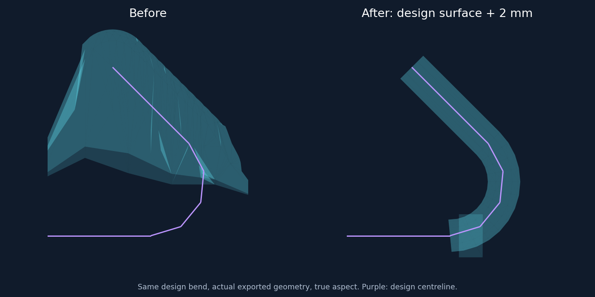

# 练武场：贴设计表面的三维弯头保护

> 后续更新：用户要求同排弯头共用布面，逐根管壳已由 [平整主体与共用弯头布面](pointcloud-vacuum-cloth-2026-09-12.md) 替代。本文记录上轮结果。

用户进一步明确：贴合不好指保护层没有贴好**设计模型弯头**。本轮以设计几何为目标，不使用实测点云偏差撑大边界，也不做实测弯头的局部配准。

## 构建方式

此前把弯头也编码成 XY 上、下高度场，不能表达回弯内侧空隙；缩小余量后仍会有填平、压扁的形状问题。现在将弯头从主体布面输入中分离，生成独立闭合三维管壳，再与主体布面的允许体积取并集。

`rebar_curve_envelope.py` 清除近重复点，对可验证的连续短圆弧拟合、加密，保留相邻直线和原始端点。单次转角超过 45°、拟合残差不合格或不能确认圆弧时保留原折线，避免擅自圆化尖角。真实模型的 10 条弯头均识别出短圆弧，中心线由 6 点加密至 14 点；首个 40 mm 直线尾不参与圆弧拟合。

管壳采用沿曲线移动的截面环，共享相邻环顶点，只封闭两个真实端面。点级判定直接计算显示三角面的绕数，并单独接受面上点，避免射线穿过共享边时的重复计数。主体仍按显示三角形插值判定。允许区域是各封闭组件的并集，回弯内侧空隙不会因 XY 投影而被填入。组件连接处可能存在重叠，显示保留组件面，没有另做布尔重网格化。

主体横向余量由 40 mm 收到 12 mm，高度余量由 10 mm 收到 4 mm；外露直段长度余量为 12 mm。弯头实际钢筋半径之外仅留 2 mm。停止向外平滑；主体目标网格步长 8 mm，当前模型受节点预算约束实际为 10.125 mm。同一 XY 位置的钢筋合并上下高度支撑，避免最近邻并列时漏掉上层。

主体与弯头的整体对照见 [comparison.png](assets/pointcloud-3d-bend-envelope-2026-09-11/comparison.png)。这些图均由实际导出的几何生成。

## 实际运行和验收

运行 `20260911T154430-b25ed409`，9,216,369 点，重跑至第五步，耗时 33.09 秒。开发服务通过统一脚本重启，局域网 `10.0.0.4:8766` 页面和新预览均正常加载。

| 指标 | 结果 |
| --- | ---: |
| 主体布面体积 | 0.093194 m³ |
| 主体与弯头组件体积合计 | 0.093287 m³ |
| 上轮体积 | 0.231439 m³ |
| 相比上轮的组件体积缩减 | 59.69% |
| 实际圆弧拟合数 | 10 |
| 圆弧拟合最大残差 | 小于 10⁻¹² m |
| 设计物理表面采样未覆盖 | 0 / 77,760 |
| 硬禁飞命中 | 574,894 |
| 05 残余复核候选 / 新增去噪 | 194,400 / 19,482 |
| 上轮已拟合点被新硬规则命中 | 82,300 / 1,727,875 |

组件体积合计是并集体积的上界，连接重叠没有扣除。实测钢筋可能偏离设计；本轮是按用户澄清严格贴设计的规则，不能将设计采样全部覆盖等同于所有真实钢筋均保留。上轮拟合标签只是回归对照，不是人工真值。原始记录和红色命中点继续保留，硬删除不改变源坐标。

验收通过：172 项相关算法测试、10 项练武场服务测试、7 组前端协议和筛选检查，实际 300,000 点预览加载，以及四场景共用 97,568 顶点的合成包络构造、灯光、显隐和销毁测试。所有组件均验证了每条边恰有两个邻面、有向边相反、正体积；实际弯头所有三角面中心及内外 1 μm 偏移的判定通过。发布 JSON 重建的全量硬掩码与 NPY 完全一致，02A、02B、融合及 05 均保留硬删除。

机器可读证据见 [validation.json](assets/pointcloud-3d-bend-envelope-2026-09-11/validation.json)。当前没有可连接的 CUA 浏览器，几何图不是浏览器截图。

根智能体负责主体、集成和全量验收；两位 `gpt-5.6-terra / medium` 子智能体分别完成三维弯头模块及显示适配，均已完成。既有工作区改动保留，未提交 Git。
