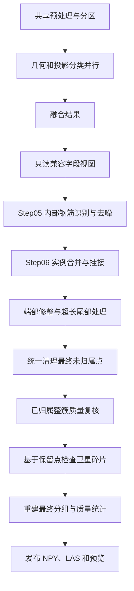
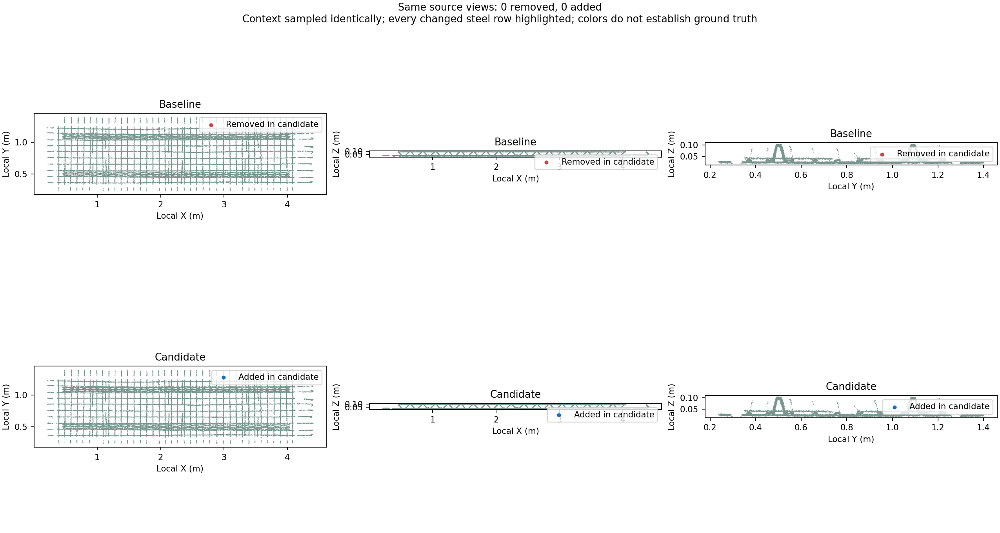

# 点云去噪架构优化与前后验收

2026-09-12。分支：`codex/denoise-architecture-20260912`。基准：`6d78b3a5361383ae6dd5292dbd5ed68b8670780b`。

本次完成了最终去噪决策的合并、执行顺序调整及兼容字段的延迟物化。在当前 9,216,369 点源文件上，默认版本没有改变任何点的最终类别、钢筋实例或分段归属。Step06 三轮中位耗时减少约 6.9%，完整调用减少约 1%。这说明本次主要收益是减少重复决策、明确模块职责；不能据此宣称整体速度大幅提升。

**实际采用的架构**



- `design_guided_instances.py`：删除最终必然清理的未归属点所经历的额外外部支持扫描；把未归属点清理统一放在所有挂接机会结束之后。原扫描在本样本中仅复核 588 点，却引入 1,781,524 个观察支撑点。
- 端部与尾部处理、未归属点清理先于最后的整簇及卫星碎片复核，避免即将删除的点保护其他碎片。所有删除结束后重新构建实例分组，供最终统计使用。
- `rebar_final_filter.py`：调用方显式设置 `review_unassigned=False`，最终整簇复核只负责已归属实例；保留该模块其他调用方的原默认行为。
- `region_refinement.py` / `pointcloud_segmentation.py`：兼容步骤直接提供融合结果的只读视图和广播零值，不再创建五个中间 memmap。`pointcloud_step_pipeline.py` 在发布阶段生成原有兼容文件，NPY、LAS 和预览字段仍可使用。
- 清单采用真实的 Step06 版本号；新版为 `design-guided-instances-v16-final-unassigned-disposition`，共享流水线为 `shared-segmentation-v29-evidence-finalization`。

生产路径止于 Step05，因此 Step06 的耗时收益主要适用于完整工作台流程；共享兼容字段视图也用于生产路径。此次未改动默认 Step05 算法。

**全量前后对比**

固定同一源文件、设计快照、参数 `k=32 / workers=16 / topology / throughStep=7`。源 SHA256 为 `eb229b7c514e918c03534184eb56ceabdfd850c57b1b3503172bd8f290ebab52`；快照指纹为 `fbafd9c433dc31533e86e7bf034e34d43a067d4bb3ef23db4806998ec798f479`。基准脚本冻结两份代码，以独立新进程按 AB、BA、AB 顺序运行三轮；测试时开发栈暂停，保留操作系统页缓存。

| 指标 | 基准 | 默认优化版 |
|---|---:|---:|
| 源点数 | 9,216,369 | 9,216,369 |
| 保留钢筋点 | 1,857,478 | 1,857,478 |
| 噪声点 | 152,031 | 152,031 |
| 钢筋实例 | 210 | 210 |
| 新增 / 删除钢筋点 | — | 0 / 0 |
| 钢筋点集 IoU | — | 1.0 |
| 形态待复核数量 | 21 | 21 |
| Step06 中位耗时 | 8.486 秒 | 7.903 秒 |
| 算法阶段合计中位耗时 | 37.476 秒 | 37.195 秒 |
| 完整流水线调用中位耗时 | 42.663 秒 | 42.251 秒 |
| 进程峰值 RSS 中位数 | 3,663.99 MiB | 3,631.52 MiB |

全部 35 个逐点输出列中，34 列逐点精确一致，包括类别、实例、分段、置信度、所有上游分类与坐标。唯一差异是 `complete_cluster`：12,774 个**两版均为噪声**的点，其诊断分组/簇编号随清理职责迁移而改变；保留钢筋的簇编号也精确一致。这不是全文件字节等价，依赖噪声簇诊断 ID 的消费方需要识别新版清单。最终过滤报告相应改变，例如整簇复核删除计数从 12,774 转为 8,816，其余删除由统一未归属清理记账，总过滤点数仍为 52,127。

三次候选运行之间，全部输出列及去除运行时间等信息后的语义报告一致。没有 Step05 噪声复活、硬否决钢筋残留、最终未归属钢筋或带实例归属的噪声。

首轮基准写盘耗时 18.64 秒，后两轮为 2.59 / 2.71 秒，因此没有拿首轮 58.84 秒的完整调用与候选单轮相比来宣称收益。完整调用六次实测值及各阶段中位数均保存在 [benchmark.json](assets/pointcloud-architecture-optimization-2026-09-12/benchmark.json)。三轮只支持本场景的趋势判断。

旧速度脚本要求所有列和语义报告完全一致，因预期的噪声簇诊断变化返回 `allOutputsEqual=false`、退出码 1；未改动脚本来隐藏差异。逐点差异见 [comparison.json](assets/pointcloud-architecture-optimization-2026-09-12/final/comparison.json)，本次明确的行为验收与重复性检查见 [acceptance.json](assets/pointcloud-architecture-optimization-2026-09-12/acceptance.json)。



**未采用的 Step05 实验**

另一个子智能体尝试让被设计硬否决的点不再参与观察支撑、连续性及多视角组件证据。单元测试通过，但完整样本暴露出偏差：新增 829 个钢筋点、删除 163 个，共 992 点改变，约占基准钢筋的 0.0534%。实例 87 的观察横向宽度从约 12.72 mm 增至 25.21 mm，形态待复核数量由 21 增至 22，局部图中出现更宽的端部散点。

该结果说明支撑证据与多视角组件分组存在耦合，直接排除证据不能保证保留结果单调收缩。默认分支已撤出这部分算法改动和实验专用测试；[实验补丁](assets/pointcloud-architecture-optimization-2026-09-12/experimental-design-support.patch)、[逐点结果](assets/pointcloud-architecture-optimization-2026-09-12/experiment/comparison.json)、[差异点 CSV](assets/pointcloud-architecture-optimization-2026-09-12/experiment/changed-points.csv) 与 [局部对比图](assets/pointcloud-architecture-optimization-2026-09-12/experiment/detail.png) 保留供审核。后续若继续，应拆开“禁止作为支撑”和“维持组件拓扑”两个职责后重新验收。

**验证与人工审核入口**

默认实现的 235 项测试通过，覆盖分类与融合、共享场景、内部去噪、实例归属、整簇复核、卫星碎片、钩部、尾部、端部、兼容字段及原有速度等价回归。新增真实 `refine_instances` 调用的顺序回归，验证未归属高分点不会保护低分卫星；独立复核者确认它在旧实现上失败。兼容字段验证包含只读共享和 NPY / LAS / 预览往返。另完成 `git diff --check`。

根智能体负责兼容视图、整合、全量基准与最终取舍；`final_decisions`（terra / medium）完成最终决策调整，`design_support`（terra / medium）完成后撤出的实验，`verify_architecture`（sol / high）完成独立代码及回归复核，三者均已结束。独立复核未代替根智能体的全量样本验收。

开发栈已通过 `scripts/cloudbim-dev.sh start` 恢复。三个离线运行已加入本地工作台历史，保留原来的 latest 指针：

- [基准结果](http://127.0.0.1:8766/?run=20260912T113646-c34c9605)
- [默认优化结果](http://127.0.0.1:8766/?run=20260912T113748-23c11a16)
- [未采用的实验结果](http://127.0.0.1:8766/?run=20260912T113214-aa9fc17f)

人工审核可在两个窗口使用同一显示步骤、相机和显隐设置，重点观察端部、钩部、夹具附近和卫星碎片。实验版请对照局部图；它不代表当前默认代码。完整 9,216,369 点用于数值比较；工作台展示采用源文件已有的 354 个瓦片、2,302,885 个采样点，不应把屏幕采样当作全量验收。

HTTP 检查覆盖页面、运行列表、三个清单、瓦片及 PCTA 属性数据，详见 [http-validation.json](assets/pointcloud-architecture-optimization-2026-09-12/http-validation.json)。当前会话没有可用浏览器，未完成交互式浏览器渲染验收；已检查静态对比图。原有 21 项形态提示仍需人工判断；本次证明的是当前样本没有新增分类或归属偏差，不是已有算法已达到人工标注真值。

可复用比较命令：

```bash
.cloudbim/mesh-venv/bin/python scripts/pointcloud-architecture-compare.py \
  BASELINE_RUN_DIRECTORY CANDIDATE_RUN_DIRECTORY --output COMPARISON_DIRECTORY
```

比较工具要求源文件、参数和冻结设计身份一致，按源行比较点集与归属，同时输出差异点 CSV、JSON 及固定视角图。基准运行目录和冻结代码哈希记录在 `benchmark.json`；大体积 NPY / LAS 留在本机忽略目录中。
