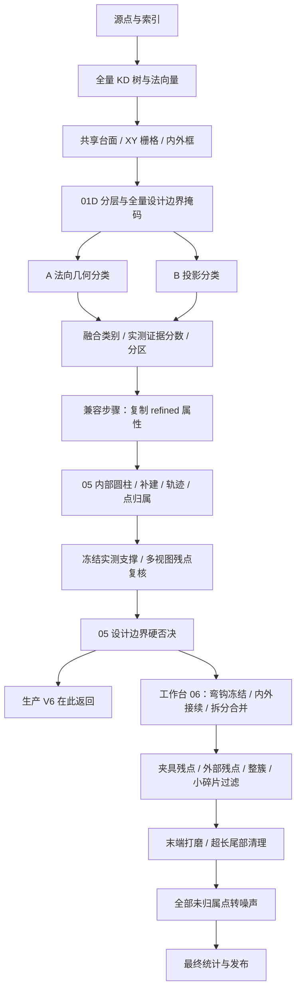
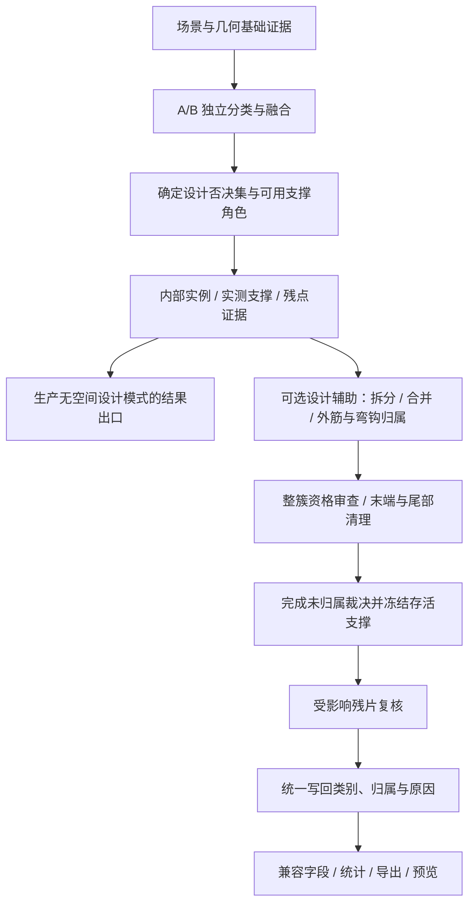

# 点云去噪流水线架构审查

审查基点：`6d78b3a`，2026-09-12。范围是当前共享分类/去噪主链及工作台设计辅助第 06 步，不把旧版 V5 或已经移除的实验分支当成当前实现。

结论：前半段共享场景、A/B 独立分类、再融合的方向合理。最值得调整的是后半段的**支撑证据有效期、未归属点的最终裁决，以及重复几何测量的职责**。不建议把整个第 05/06 步粗暴合并，或把全部去噪提前到分类前。

本次只增加审查报告和隔离探针，未修改生产算法、阈值或服务状态。

## 1. 当前真正执行的流程

来源：`algorithms/pointcloud_segmentation.py:30`、`internal_rebar.py:391`、`design_guided_instances.py:438`、`pointcloud_step_pipeline.py:304`，均位于 `services/mesh-service/`。

需要区分执行范围：生产 `GeometricV6Adapter.analyze_source` 只调用 `segment_points(... through_step=6)`，对应页面第 05 步，且不接受空间 BIM prior；工作台才在 `through_step=7` 时追加设计辅助第 06 步。两者共享主干，但不是相同的完整算法产品。调整第 06 步不会自动改善生产入口；设计边界当前也不是由生产入口传入的。见 `rebar_geometric_v6.py:117–153`。

## 2. 首要顺序问题：即将删除的点仍能保护其他点

**已复现，建议优先修正。**

`rebar_cluster_quality.py:20–55` 把已归属实例和未归属点一起用于碎片复核，最后以 `retained & ~candidate_mask` 构建支撑点。未归属的高分点不会进入低分碎片候选，因此能够成为支撑。

但是 `design_guided_instances.py:875–885` 随后无条件删除全部未归属钢筋，包括高分点。于是可能出现：

1. 一团未归属点保护了附近某实例的孤立小残片；
2. 未归属点在最后被删除；
3. 被保护的小残片留在最终结果里，没有再次按最终支撑点复核。

隔离复现包含一根主杆、距其 50 mm 的 10 点低分小残片，以及距离残片 1 mm 的 30 个高分未归属点。当前次序留下全部 10 个残片点；先确定未归属点不保留，再复核碎片，10 个残片点全部移除。主杆保持不变。

建议：在所有实例接续结束后先确定最终未归属裁决，再冻结可作为保留依据的支撑集合。若因诊断需要延迟写入类别，也应显式排除 `will_remove`，而不是把当前 `class==3` 等同于可靠支撑。第 06 步目前在碎片检查之后还执行末端和尾部清理，这些改变支撑点的操作也应先完成，或对受影响邻域重新复核。

这是最终裁决内部的顺序调整，不是把实例归属之前的所有残点提前删除。弯钩验证与完整性检查仍须尊重原有约束。

## 3. 最有依据的合并候选：未归属点的多轮去噪

**真实缓存消融支持精简，但不是所有输出等价。**

第 06 步至少有三类针对未归属点的计算，随后又有统一兜底：

- `design_guided_instances.py:825–844`：外部、低于保护分数、尚无实例的点，做一次 `floating_noise_mask`；
- `rebar_final_filter.py:20–30`：未归属点重新聚类，再参加设计长度/点数复核；
- `rebar_cluster_quality.py:20–55`：未归属点再次参加小碎片及距离复核；
- `design_guided_instances.py:875–885`：所有仍未归属点统一转成噪声。

在现有 9,216,369 点缓存上，仅跳过第一项，重放整个第 06 步：

| 指标 | 原流程 | 跳过外部未归属点复核 |
|---|---:|---:|
| 第 06 步单次缓存重放 | 8.422 s | 7.894 s |
| 被跳过模块的原耗时 | 0.553 s | — |
| 该模块检查 / 删除 | 588 / 198 点 | 588 / 0 点 |
| 最终钢筋点 | 1,857,478 | 1,857,478 |
| 最终噪声点 | 152,031 | 152,031 |
| 最终实例数 | 210 | 210 |

全部源点的 `complete_class`、`complete_instance`、`complete_segment`、`complete_confidence` 差异均为 0。但是 `complete_cluster` 有 **9,154 行不同**，其他模块的删除数与删除原因分配也发生变化。原流程重放的五列均与历史缓存完全一致。

这说明当前至少存在一段“不同步骤提前处理同一最终淘汰集合”的工作。建议收敛为一个最终未归属裁决；若保留细分原因有调试价值，将原因分析作为可选诊断，或让规则返回原因位集而不逐轮改变簇身份。稳定的原始簇 ID 应与“第几个过滤器生成的审计簇 ID”分开。

不能直接删除整个整簇过滤器：历史样例中它还删除 **4 个已归属实例，共 8,816 点**；另有 3,958 个未归属点在此删除。已归属实例的质量判断仍有独立职责。小碎片过滤也能移除已归属实例的分离残片，不能因为这个扫描上删点为 0 就整体删除。

此外，未归属点会影响支撑和连通性，所以一份扫描上最终四列不变，不证明所有扫描均等价。该消融只验证第 06 步，使用固定第 05 步缓存；建树在计时外，无读取、落盘、HTTP 或渲染耗时，不是新的全链性能基准。

## 4. 设计边界应与实测支撑有明确先后关系

**代码证实存在依赖风险；本次未量化真实扫描上的影响。**

设计边界掩码在 `shared_floating_noise.py:28–65` 已经产生，但第 05 步先拟合圆柱并建立 observed support / continuation，随后 `review_floating_noise` 先做多视图复核，再把 hard mask 并入删除集合（`shared_floating_noise.py:96–105`）。

这允许随后被设计边界否决的点，在同一轮较早时参与拟合或支撑其他点。仅在最后将它们的实例 ID 清零，并不能撤回已经发生的支撑影响。这里与上一项是相似的证据有效期问题，但本项目前是代码层面的风险，不宣称已经造成真实误判。

建议把融合后钢筋候选区分为“可保留候选”“设计硬否决”“仅用于环境几何参考”。对于当前明确要求硬边界的模式，先冻结否决集，再构建用于证明钢筋保留的可靠支撑；保留原始点和 A/B 证据用于回看。

不能把这当作输出等价优化：改变圆柱拟合输入和邻域支持会改变结果，必须对边界、粗配准偏差、细杆、交叉和弯钩做质量验收。也不建议把该空间先验提前写入 A/B 分类票数。

## 5. 可以直接收敛的步骤和接口

### 融合后分区兼容步骤

`region_refinement.py:191–211` 的 `reuse_fusion_partition` 只复制三个数组并写两列零值；报告明确标记 `fusion-pass-through`。当前主链没有再运行旧的 `refine_regions`。

建议把它从算法步骤中移除，在内部直接使用融合类别与共享分区；旧 `refined_*` 字段交由输出兼容层生成。内部只读别名可减少五列 N 长数组的常驻/写入需求，但若继续发布旧 NPY 列，兼容导出成本仍存在。

921 万点时五个 uint8 列约 46 MB。这一步历史耗时只有约 **0.036 s**，主要价值是明确流程语义，不应包装成主要提速来源。

### A/B 的伪去噪包装

`shared_floating_noise.py:121–128` 的 `denoise_branch` 明确不改变分类，调用 `observed_review=False` 只生成报告。`pointcloud_segmentation.py:79–115` 围绕它再补计数和图像。

建议归入分类诊断/报告生成模块，名称应反映“记录后续复核候选”。不要在算法图上呈现为 A/B 各自执行一次实际去噪。完整删除包装之前，要保留依赖它的工作台字段，并检查后续图像重建是否有其他用途。

### 显式阶段标识

主链 `through_step=6` 对应页面第 05 步，外层的 `7` 才是第 06 步，且内部结果始终返回 `complete_rebar=None`。建议在共享算法层使用具名阶段与显式执行计划，输出层再映射页面编号。保留现有数字入口作兼容，避免让 UI 步骤编号承担算法依赖关系。

## 6. 第 05/06 步适合共享几何证据模块，不适合直接拼成一个函数

第 05 步主要从 A 分支体素特征构建内部圆柱、恢复遗漏实例并做源点归属；第 06 步重新按归属点分组、抽样拟合、检查相邻杆拆分、接续外筋、匹配设计单元。`refine_instances` 已经跨越约 500 行，并持有归属、保护、候选、删除、统计等多种可变状态。

建议把共享职责收敛为：

| 模块 | 负责内容 | 不由它决定的内容 |
|---|---|---|
| 场景证据 | 台面、坐标框架、分区、索引与设计输入指纹 | 钢筋最终类别 |
| 几何测量 | 点集分组、采样、圆柱/截面/末端测量 | 是否淘汰某实例 |
| 实例求解 | 拆分、合并、内外接续、设计关联、归属更新 | 落盘与页面编号 |
| 最终裁决 | 硬否决、未归属政策、整簇与残片质量、原因 | 偷改上游分类证据 |

复用几何测量必须绑定**源点集合、归属版本、采样规则、坐标系和拟合参数**。拆分、删点或归属变化后只失效受影响实例。

不要把第 05 步圆柱直接当作第 06 步完整质量证据：前者主要用体素支撑且拟合跨度为 0.20 m，后者按归属源点抽样、默认最多 2,048 点且拟合跨度为 0.18 m；样本和验证目的不同。现有 `_early_exterior_support` 已通过 `evidence_cache` 复用一部分测量，后续应扩展同一机制，而不是在它外面再叠一层不清楚失效条件的缓存。

两个末端打磨模块也不宜简单去掉其中一个：弯钩模块专门处理受保护整簇里的直段，通用末端模块避开受保护弯钩；可以共享候选查询、截面拟合和存活点分组，但应保留不同保护策略。

## 7. 前半段哪些顺序值得保留，哪些可以解耦

**保留：**

- A/B 并行独立提证据，再融合。B 的证据如果被 A 的最终标签替代，融合不再提供独立判断。
- 台面和框架在 A/B 之前共享；当前已避免两路重复检测。
- 先补建缺失模型，再做严格/宽松归属；只延后“类别裁决”，不能删掉模型恢复。
- 先完成内外筋接续，再按整根统计过滤，避免把有真实连接的外露短片提前删掉。
- 先冻结弯钩整簇，再拆分和竞争；设计匹配不能直接创造不存在的实测支撑。

**解耦而非简单换序：**

- 当前台面拟合 `_table_plane` 使用法向量。因此不能直接把“去台面”挪到法向量前。可另外实验“固定抽样点对全源支持查询法向量 → 拟合台面 → 其余所需法向量”，但需明确全量法向量导出契约，不能拿改变邻域点集的结果冒充等价。
- B 的四角度、60 mm 侧视切片与去噪的六角度、20 mm 支撑切片使用不同输入和判据。可共享投影/查询基础实现，不能直接复用同一张分类图当独立去噪证据。
- A 的 3 mm 网格、B 的非台面 3 mm 网格以及去噪的 2 mm 网格，点集、原点和统计含义不同。统一索引接口有价值，强行统一结果会改变算法。

01D 当前把语义分层、设计包络准备和全源边界查询串在 A/B 前。历史样例中它共 **5.718 s**，但该时间包含多项工作，不能全算在一个算子上。A/B 的分类票数不依赖设计掩码，所以可以拆成“语义分层”“设计包络构造”“边界源点查询”，分别计时；按阶段需求惰性计算或在固定线程预算内调度。工作台若请求显示该边界，则仍须生成相关产物。单纯延后到第 05 步不会降低完整流程总计算量。

## 8. 推荐目标流程与实施顺序

其中“先否决后建支撑”及碎片次序属于行为修改，需要分开验收；不是建议一次性替换全链。

1. **先修证据有效期。** 针对未归属点保护残片的已复现问题补回归；明确硬否决点是否允许作为保留支撑。
2. **再收敛最终裁决。** 清理未归属点的重复路径，保持已归属实例质量检查；把原始簇身份与规则执行序号分开。
3. **移除算法空步骤。** `refined_*` 与 `denoise_branch` 下沉到兼容/诊断层，计算结果先做到逐点等价。
4. **拆分测量和策略。** 统一实例点集分组、测量缓存与失效；末端和尾部处理完成后刷新受影响统计。
5. **最后优化调度。** 拆开 01D 耗时，按生产/工作台所需阶段调度；不要为了并行增加过量线程或共享可变标签。

每一步记录墙钟、候选点数、真正改变的点/实例、最终独有贡献，以及误删样例。对等价重构比较全部输出属性和非计时报告；对行为改动使用人工标注的小杆、短筋、弯钩、交叉、夹具边缘、扫描缺失及配准偏差样例。实例 ID 或簇 ID 变化要独立报告，不能只看类别总数。

## 验证与限制

- 项目 Python 3.11 虚拟环境运行共享场景、共享去噪、最终整簇、小碎片质量、生产 V6 五组回归，**28 项通过**。输出中有一次 ifcopenshell 析构 `KeyError`，被解释器忽略，测试退出码为 0；未把它当成本次算法问题处理。
- 本次真实数据实验是读取既有第 05 步缓存，重放当前第 06 步；没有重新估计全量法向量或运行完整服务链。
- 已验证原流程重放与历史五列逐点相同；消融只有四列相同，簇列和原因报告不同。
- 顺序问题使用构造几何复现。没有人工真值，不能将本次消融或历史输出等价当作绝对精度证明，也不承诺跨扫描加速比例。
- 历史全链优化数据来源：[既有性能报告](pointcloud-speed-optimization-2026-09-12.md)。没有沿用另一已删除实验分支的“多轮设计验收”等发现。

复现产物：

- [真实缓存消融脚本](assets/pointcloud-architecture-review-2026-09-12/probe.py) 与 [结果](assets/pointcloud-architecture-review-2026-09-12/probe.json)。脚本默认使用本机已有缓存路径，不下载数据、不修改算法；计时外重建完整源点 KD 树。
- [支撑顺序最小复现](assets/pointcloud-architecture-review-2026-09-12/support_order_probe.py) 与 [结果](assets/pointcloud-architecture-review-2026-09-12/support-order.json)。

在仓库根目录使用 `.cloudbim/mesh-venv/bin/python` 执行上述脚本即可。它们是隔离算法探针，不启动开发服务。
