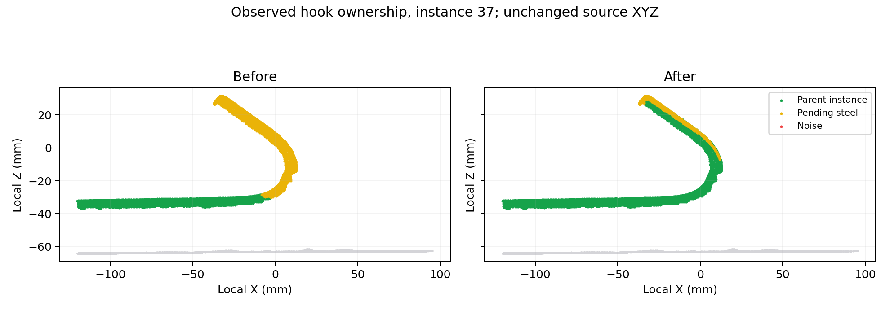

# 第六步：弯钩归属保护与末尾数量、形态复核

第六步原本收到 `fused_steel_score`，高分保护用于阻止改判噪音；圆柱拆分、归属竞争主要依靠直线几何，高分不保证弯钩与主体保持同一实例。当前数据没有触发 `split` 操作，但实测弯钩有大量点停留在待定类别，因此不能把视觉上的拆散全部归因于平行圆柱拆分。

本次保留工作区已有的第五步保守去噪修改，仅增加第六步处理、界面指标及验证材料。第六步版本为 `design-guided-instances-v8-hook-cluster-quality`。

## 实现

对设计已明确为“主体加弯钩”、只有一个匹配单元的非腹杆，先从可靠实测主体确定归属，再沿完整设计弯钩提供的候选范围检查保留点。用实测主体修正横向偏移；候选点需要高分或径向法向支持，并与主体实测点连接。设计表面保留 6 mm 的形态偏差容差，不按设计线硬裁点。已有其他实例归属的点不被抢占，多个主体同时提出归属的点保持原状。

接上的弯钩继承主体编号，退出后续直圆柱重新分组和碎片过滤。只处理第五步保留的点，不恢复第五步已判定的噪音。分段编号用于追溯主体的实测拟合，未输出合成弯钩中心线。

最后检查待定簇和已有实例的小型离散残片。候选必须全部分数不高于 0.5、尺寸不超过 20 mm 且不超过实测实例典型尺寸的 8%，并与冻结的保留点至少间隔 12 mm。已有实例的最大连通部分保留。规则同时覆盖“已有编号但悬浮”的小残片，删除后清空归属并重算点数。没有分数时跳过这项过滤。

最终数量和形态从最后保留的源点计算：

- 普通钢筋与弯钩按整根匹配，腹杆按每个直斜段计算。当前模型为 66 根普通/弯钩钢筋，加 144 个腹杆直段，共 210 个目标簇。
- 同时核对总数与逐根设计关联，避免“数量相等但有漏配和多余实例”被判为通过。
- 默认允许实测长度缩短到设计的 65%；低于此值标记明显过短。长度超过设计的 115% 加 20 mm、宽度超过设计的 160% 加 8 mm 时标记异常。阈值是当前工程默认值，需要按扫描条件继续校准。
- 宽度使用实测主轴，消除整体倾斜被放大成长杆宽度的误报。设计弯钩宽度包括完整折线路径；实测只剩主体时可标记弯钩宽度不足。仅有部分设计几何时不判断整根长度缺失。
- 数量、长度、宽度异常是复核依据，不自动删除有实测支持的钢筋，也不补齐遮挡处。

## 全量验证

对照 `20260911T104228-3ff3b250`，最终运行 `20260911T111752-953ecb6b`；同一份 9,216,369 点 LAS，32 邻点、16 workers、topology 模式。

| 指标 | 结果 |
| --- | ---: |
| 设计目标簇数 / 最终实例数 | 210 / 215 |
| 未关联设计的额外实例 | 5 |
| 长度或宽度异常实例 | 25 |
| 明显过短 / 弯钩宽度不足 | 0 / 4 |
| 新弯钩保护分支接续点 | 1,350 |
| 相比旧结果，最终从待定变为已归属的点 | 1,196 |
| 原有归属变为待定的点 | 0 |
| 避免原第六步删除的点 | 5 |
| 新增删除点 / 新增删除高分点 | 0 / 0 |
| 末尾统计复核的连通部分 / 新增过滤 | 1,096 / 0 |
| 第六步 / 全流程耗时 | 9.51 s / 38.50 s |

1,350 是新增保护分支的接续量；其中有些点旧流程随后也能接续，因此最终新增归属为 1,196。末尾过滤在这份数据上没有命中足够证据，不能据此宣称噪音去除率提高。目标数量尚未达到一致，5 个额外实例仍保留，25 个形态异常仍需核对。额外实例中有可靠内部圆杆片段，也有靠近夹具的外部片段，不能按总数一并删除。



图中绿色为主体实例、黄色为待定钢筋、红色为噪音。弯钩主体已接回原编号，边缘仍有待定点，不能把本次结果描述为全部弯钩问题已解决。

102 项相关 Python 测试通过，覆盖混合分数弯钩、断开的弯钩、第五步噪音继承、适度缩短与严重短缺、腹杆逐段计数、等数量但错配、整体倾斜、低分悬浮点、实例内孤立残片及既有第五/六步行为。第五/六步界面逻辑测试通过，真实产物 300,000 点预览通过加载校验。

重新计算源 LAS 的 SHA-256 一致；坐标、法向、分数、类别及第五步归属等 12 个上游数组逐点一致；最终类别、实例、分段之间的归属和点数一致；第五步噪音没有复活。开发栈通过统一管理器重启，练武场当前结果已更新。浏览器工具无可用连接，未完成真实浏览器交互验收；视觉验证采用保存的全量点云科学投影。

[全量审计](assets/pointcloud-cluster-quality-2026-09-11/validation.json) · [逐实例形态指标](assets/pointcloud-cluster-quality-2026-09-11/cluster-shapes.json)

复现审计：

```bash
.cloudbim/mesh-venv/bin/python scripts/pointcloud-cluster-quality-check.py \
  backend/data/assets/95b6b41c5857d9eb3407b155/pointcloud-steps/20260911T104228-3ff3b250 \
  backend/data/assets/95b6b41c5857d9eb3407b155/pointcloud-steps/20260911T111752-953ecb6b \
  --output docs/research/assets/pointcloud-cluster-quality-2026-09-11
```
