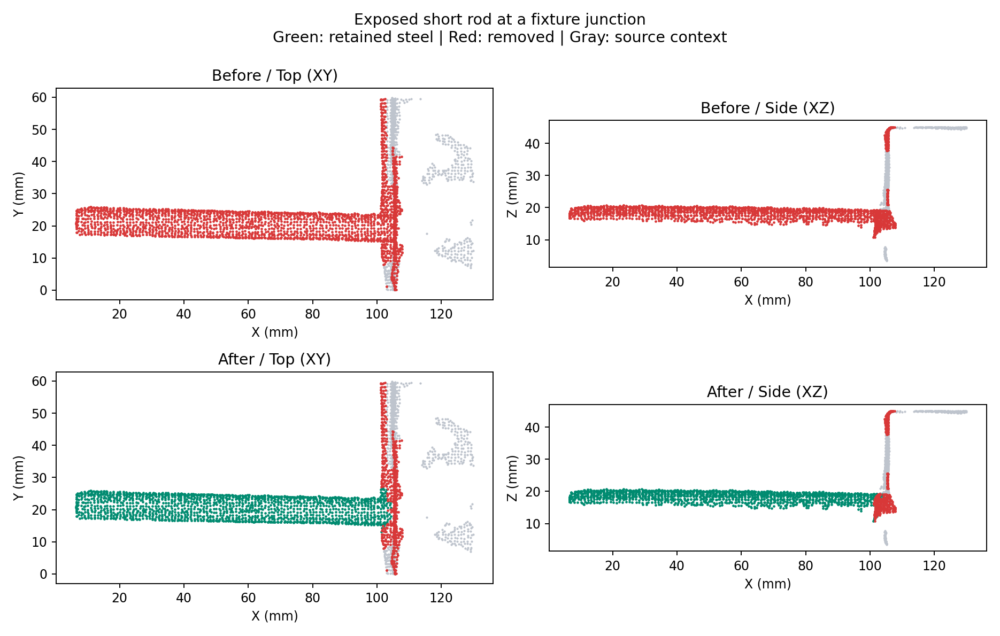
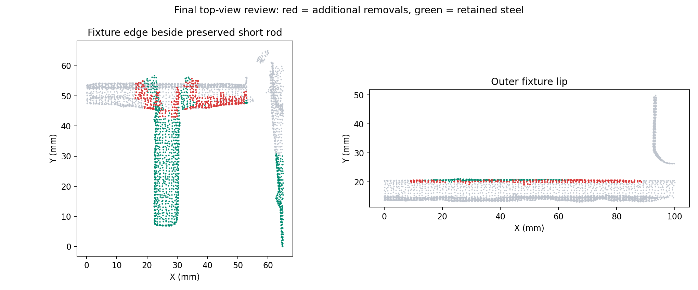

# 第五步：高分短杆保护与俯视外部残片复核

修改前已将全部已有工作提交并推送至 `origin/dev-hong`，回退点为 `36bd878`。本次全量运行 `20260911T104228-3ff3b250`，对照为 `20260911T103120-b48aa1d5`，同一份 9,216,369 点源 LAS，32 邻点、16 workers，运行至第六步，设计辅助模式 topology。

## 定位与处理

原实现把“三维组件不符合完整圆杆形状，且多个侧视方向孤立”当作高分点的删除依据。短杆与夹具边缘连接成混合组件时，钢筋表面只占部分组件，整簇圆截面检查失败，真实短杆随整簇删除。截面不完整、法向不足的高分片段也有同类风险。

新规则对高分点要求明确的球状、宽平片或充分夹具表面证据。仅有孤立视图、缺少圆截面、缺少法向，不能推翻高分。仍保留充分夹具密度反证，不把所有高分点无条件恢复为钢筋支撑。

对混合组件逐个局部检查实测圆柱表面，以 14 mm 邻域、至少 8 mm 轴向跨度、0.8 mm 表面误差及法向径向一致性验证；邻域内高分占据体素比例至少 25%。只保护通过检查的局部点，不给整个混合组件豁免。真实圆柱接续保护同时适用于孤立分支。



图为同一原始点云重建的俯视、侧视投影，绿色是保留钢筋，红色是去噪点，灰色是源点上下文。确认的左端外露短杆核心区域为 X 2.186–2.274、Y −1.419–−1.399、Z 0.031–0.044 m：其中 1,464 点原来全部删除，本次全部保留，进入第六步后仍全部保留。图中的邻接夹具边缘仍有被过滤部分。

## 俯视复核

末尾增加 XY 俯视范围检查。范围取自冻结的内部实测钢筋，以及高分占比至少 50%、夹具表面支持低于 10% 的独立圆杆组件；用凸包包围，预留 12 mm。不能用刚被保留的歧义高分点扩张范围，也不能按设计框或内部矩形直接裁掉外露短杆。

新增删除必须同时满足：外部候选；组件至少 75% 的占据体素位于范围余量之外；组件至少 25% 有独立夹具表面证据；待删点自身也在范围之外且有夹具表面支持。高分点、局部圆杆及实测接续点不被这条规则删除。缺少二维范围或夹具证据时跳过。



新增过滤集中在外部夹具板边/圆角；红色仅表示本次新增删除，绿色表示保留钢筋。复核时收紧为逐点夹具表面支持，防止组件中真实钢筋的中低分点被一并裁切。

## 全量结果与验证

| 指标 | 修改前 | 本次 |
| --- | ---: | ---: |
| 第五步删除点 | 70,534 | 60,329 |
| 其中高分点 | 6,435 | 110 |
| 本次恢复保留 | — | 10,746 |
| 其中高分点恢复保留 | — | 6,325 |
| 俯视复核额外删除 | — | 541 |
| 新增删除中的高分点 | — | 0 |

全流程 35.95 秒。恢复点包含保守保留的歧义片段，不等于全部已确认为真实钢筋；删除数量也不是准确率。俯视规则有意只处理证据充分的外部残片，仍可能保留疑似夹具上的高分碎片。

109 项相关 Python 测试通过，覆盖高分残缺短杆、混合组件中的高/中分圆杆、球状和宽片噪音、夹具密度、俯视补充过滤、旋转/大坐标偏移、退化范围、生产适配及第六步衔接。第五步界面过滤检查和真实 HTTP manifest/300,000 点预览加载检查通过。

完整审计确认 13 个上游数组逐点不变，源 LAS 哈希和所有原始维度、记录顺序不变；实例/分段点数、NPY、LAS 与预览源索引对应；所有第五步噪音进入第六步后仍为噪音。练武场已由开发管理器重启并完成本次运行。本轮视觉验证采用全量源点生成的科学投影图，没有完成真实浏览器交互验收。

版本：`floating-multiview-v3-conservative-top-view`、`internal-rebar-tracks-v9-conservative-top-view`、`shared-segmentation-v17-conservative-top-view`、生产 geometric-v6 `11`。界面指标新增俯视额外过滤、局部圆杆保护及孤立证据不足而保留的高分点数。

[全量审计](assets/pointcloud-conservative-denoise-2026-09-11/validation.json) · [短杆坐标检查](assets/pointcloud-conservative-denoise-2026-09-11/roi-check.json)

```bash
.cloudbim/mesh-venv/bin/python scripts/pointcloud-conservative-denoise-check.py \
  backend/data/assets/95b6b41c5857d9eb3407b155/pointcloud-steps/20260911T103120-b48aa1d5 \
  backend/data/assets/95b6b41c5857d9eb3407b155/pointcloud-steps/20260911T104228-3ff3b250
```
