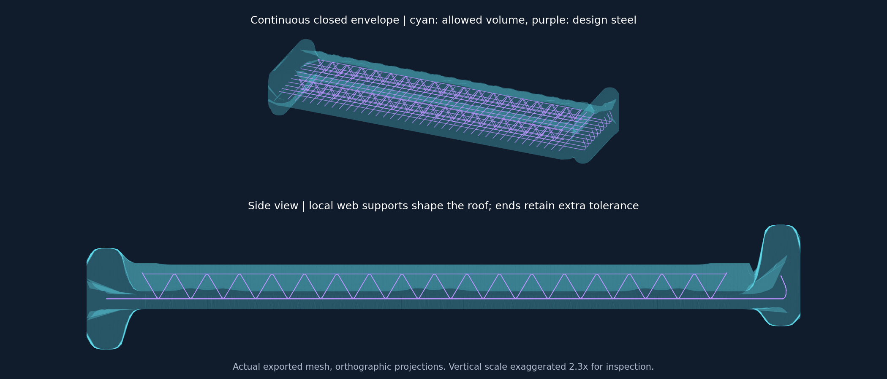

# 练武场：连续钢筋外包络

> 后续用户要求进一步收紧并沿弯筋表面保护，当前参数与验证见 [收紧外包络与弯筋表面保护](pointcloud-tight-envelope-2026-09-11.md)。

本轮按用户反馈，将分块禁飞区改为包住整个设计钢筋区域的连续外壳。旧结果见 [前一轮记录](pointcloud-floating-zones-2026-09-11.md)，其小方块显示和层带并集判定已由本实现替代。

## 实际行为

`algorithms/rebar_outer_envelope.py` 根据已配准的钢筋中心线生成连续上、下曲面，并封闭四周。上下曲面取局部钢筋支撑高度，随腹杆和末端变化；层间空隙属于壳内允许空间。直线顶筋连续支撑的地方，布面自然不会下陷到腹杆谷底。

曲面使用共享顶点的三角网格，平滑只向外扩展，避免削掉支撑钢筋。XY 外轮廓为带余量的凸包，内部上下高度保留局部变化。这是适用于当前平放钢筋笼的 2.5D 外包络，不是物理布料仿真；也不将笼内空隙重新挖成禁飞洞。

保护余量保留横向摆放偏差、实际钢筋半径、16 mm 配准高度余量、腹杆高度余量和弯筋末端圆滑保护。外露直筋的 120 mm 长度余量与横向偏移允许同时出现，防止圆形端帽误切叠加偏差的角落。

点级硬去噪直接对显示网格的三角面做插值。有限审查域内、排除台面和夹具边带后，壳外点为禁飞点。02A、02B 和 05 共享该掩码。05 的残余多视角规则沿用上一轮设置。

## 调试显示

01D、02A、02B 和 05 默认显示青色半透明外壳和紫色设计中心线，取消小方块与三角网格线。包络截面开关默认关闭；开启后显示三个竖直切平面与壳面的真实交线。红色点表示实际硬删除命中。旧报告缺少连续曲面时提示重跑，不再重建旧方块。

## 全量验证

发布运行：`20260911T150658-1cbf6a3c`。9,216,369 个源点完整运行至外部钢筋阶段，耗时 44.394 秒。练武场已由统一开发管理脚本重启并加载本轮实现。

| 检查 | 结果 |
| --- | ---: |
| 连续外壳顶点 | 21,490 |
| 硬禁飞命中 | 228,144 |
| 05 残余复核候选 | 250,050 |
| 05 新增去噪 | 33,468 |
| 上轮已拟合内部钢筋被硬删除 / 被 05 判噪 | 0 / 0 |
| 上轮最终内部钢筋 1,729,942 点被硬删除 | 0 |
| 上轮最终外部钢筋 134,324 点被硬删除 | 0 |

以上对照来自上一轮 `20260911T143955-750c7a5a`，是回归检查，不是人工真值。硬命中计数包含此前已归为其他非钢筋类别的点，不能解读成新增消除了同等数量的误识别钢筋。

验证通过：165 项相关算法测试、10 项练武场服务测试、7 组前端协议及筛选检查；实际 300,000 点预览完整加载；四个 Three.js 场景的外壳、法线、灯光、截面和销毁检查。另验证了实际网格的封闭边关联、正向体积、16,200 个设计中心线采样点位于壳内，以及从发布 JSON 重建的全量硬掩码与输出 NPY 完全一致。

当前没有可连接的 CUA 浏览器，未做真实浏览器截图验收；上图由实际导出网格生成。机器可读结果见 [validation.json](assets/pointcloud-continuous-envelope-2026-09-11/validation.json)。

根智能体负责连续几何、流水线整合与验收；`gpt-5.6-terra / medium` 子智能体负责显示改造，另一位同配置子智能体只读复核几何。两项委派均已完成。未来切换 SciPy/Qhull 版本时应验证持久化三角剖分重建顺序；当前实现遇到不一致会明确报错，避免悄悄改变显示与判定边界。
