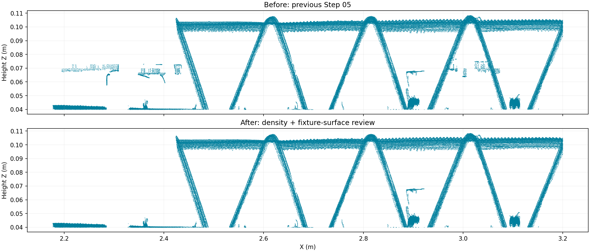
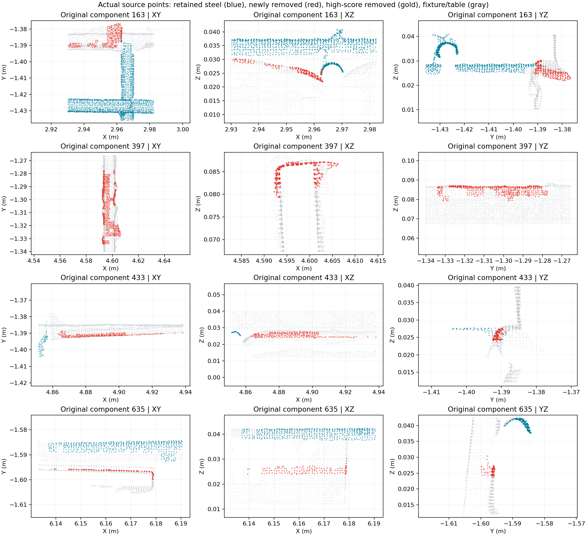
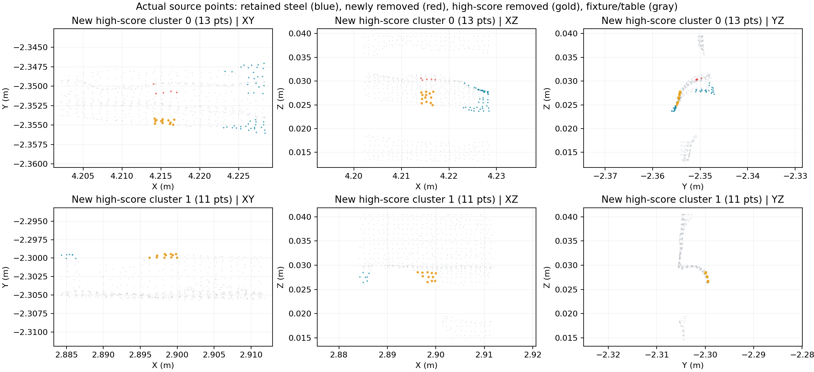
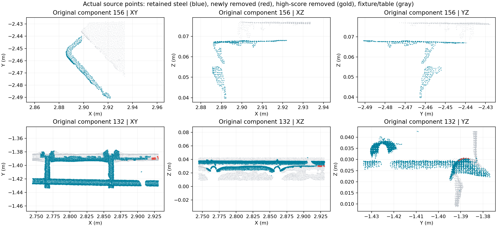

# 第 5 步：结合钢筋得分的侧视密度复核

2026-09-11。最终完整运行：`20260911T090514-65922647`；比较基线：`20260911T083621-0d00d2be`。输入为同一份 9,216,369 点 LAS，16 workers，运行至 UI 第 6 步（`throughStep=7`，`priorMode=topology`）。

第 5 步剔除量从 59,433 增至 70,534：新增 11,101 点，其中外部区域 11,063 点、内部 38 点。此前定位的四处上方板边残片共 2,388 点已全部移除。这里的剔除点数是算法行为统计，不是有人工真值支持的准确率。



## 漏检机制与修改

部分夹具板边、倒圆角也有局部圆截面，之前会通过 `_round_fragment`、`_round_geometry` 或局部弯曲片段检查，获得整片保护。仅靠增加孤立视图数量，无法推翻这种形状保护。

现在保留已有的多侧视孤立检查，并增加独立的夹具密度反证：

- 六个水平观察角度：0、30、60、90、120、150 度；每个方向使用 20 mm 深度切片，以 10 mm 重叠。
- 将 2 mm 三维占据体素投影到侧视平面，在 13×13 像素窗口内比较钢筋与夹具的空间占据量。统计体素而非原始回波数量；重复采样不会制造密度优势。两片重叠切片都必须满足条件。
- 只以 `refined_class=2` 的夹具作为背景反证，不使用台面。还要在三维中找到至少三个独立夹具体素，满足距离不超过 6 mm、法向绝对点积至少 0.9、双方切平面残差不超过 1.5 mm。
- 密度多数与夹具表面连续性同时成立，才可推翻单纯的圆截面保护。低密度、低钢筋分数都不能单独触发这条删除规则。

| 夹具密度复核条件 | 普通得分点 | 高分点（≥0.9） |
| --- | ---: | ---: |
| 局部夹具占据比例 | ≥50% | ≥65% |
| 支持反证的视角数 | ≥3 | ≥4 |
| 满足视角数的组件体素比例 | ≥75% | ≥75% |
| 组件中与夹具表面连续的体素比例 | ≥65% | ≥90% |

原有孤立分支仍要求独立钢筋参考，普通/高分分别需要至少 3/4 个反对视角。新增密度分支使用正面的夹具实测证据，不会在没有独立参考时因“什么都看不到”而删除全部候选。

## 真实接续与高分保护

原有实测钢筋支撑及其 3 mm 邻域继续受保护。另增加 `observed_cylinder_continuation`：新点须靠近已观测钢筋样本（10 mm 内），与其圆柱表面半径误差不超过 1 mm，且法向与径向绝对一致度至少 0.85，才能阻止密度分支修剪露筋端部。距离以真实观测样本计算，不使用拟合端点，不会填补空的拟合跨度。

复核时发现单靠夹具密度会误剪接触边界，最终版本已用上述接续证据修正。两个被定位到的真实钢筋端部新增剔除量均为 0；九组检查过的右端外露弯筋共 35,869 点全部保留。混合组件 163 中，真实圆弧恢复保留，随夹具斜面分布的 231 点被移除，不能将这类混合组件整片当作钢筋或噪音。

最终比基线新增剔除的高分点为 24，落在两处夹具圆角；已检查其 XY、XZ、YZ 原始点上下文。全部钢筋分数与融合证据数组保持原值。`densityReview.observedContinuationProtectedPointCount=1460` 表示得到接续保护的密度候选数，不等于相对上一版恢复的点数。





## 完整源点验收

[机器审计](assets/pointcloud-density-denoise-2026-09-11/integrated-audit.json) 和 [参数、目标片段及保留样本](assets/pointcloud-density-denoise-2026-09-11/final-summary.json) 记录最终结果。

- 输入 LAS SHA-256：`eb229b7c514e918c03534184eb56ceabdfd850c57b1b3503172bd8f290ebab52`。
- 上游 XYZ、法向、两路分类、融合类别/得分/证据、分区共 13 个数组逐项相等。
- 基线已经剔除的 59,433 点没有重新进入钢筋；第 6 步没有恢复任何第 5 步噪音。
- 所有噪音点的实例、分段与拟合置信度归零；实例/分段统计与最终数组逐项匹配。
- 导出 LAS 的所有原始维度保持不变；额外维度及 `source_record_index` 与源数组匹配；预览二进制及分离 LAS 的源点索引一致。
- 104 项相关 Python 测试通过，覆盖普通分数/高分阈值差异、充分证据推翻高分、密集夹具旁的真实圆杆、真实接续、空拟合区间、缺失法向、内外分区、后续高分恢复路径和生产适配器。
- Node 的第 5 步过滤/噪音展示测试通过；真实 HTTP 加载最终 manifest 及 300,000 点预览数据的渲染前检查通过。
- 完整运行 35.24 秒，第 5 步悬浮复核（含准备）3.93 秒。通过 `scripts/cloudbim-dev.sh` 重建并启动集成栈。

视觉核查基于完整源点生成的科学投影图，不是浏览器交互截图。未使用设计模型做这一轮点级删除：当前问题有直接的实测几何解释；后续设计模型若参与，也应提供辅助证据，不能仅因点位于设计范围外而否决真实露筋。

## 保留边界

尚不能宣称悬浮物已经全部清零。约 x=2.90、y=-2.46 附近仍保留一个弯曲片段（历史组件 156）：它有圆形/弯曲形状证据，附近夹具与其没有足够的表面连续证据。单靠这幅侧视图不足以确定它就是噪音，当前规则保留这一歧义。



实现位于 `services/mesh-service/algorithms/multiview_floating_noise.py` 与 `internal_rebar.py`，练武场和生产入口共用。版本：`floating-multiview-v2-density`、`internal-rebar-tracks-v8-fixture-density-denoising`、`shared-segmentation-v16-fixture-density-denoising`、生产 `geometric-v6` 版本 `10`。

复现相关测试：

```bash
cd services/mesh-service
../../.cloudbim/mesh-venv/bin/python -m unittest test_multiview_floating_noise test_internal_rebar test_floating_noise test_rebar_tracks test_design_guided_instances test_rebar_geometric_v6 test_pointcloud_fusion test_rebar_v5_debug_contract
```

```bash
node scripts/test_pointcloud_floating_noise_viewer.mjs
node scripts/test_pointcloud_manifest_loading.mjs http://127.0.0.1:8766/runs/20260911T090514-65922647/manifest.json
```
