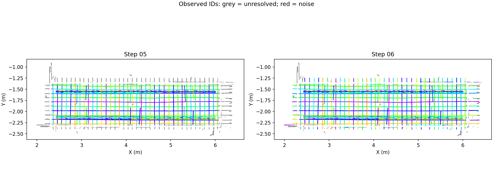
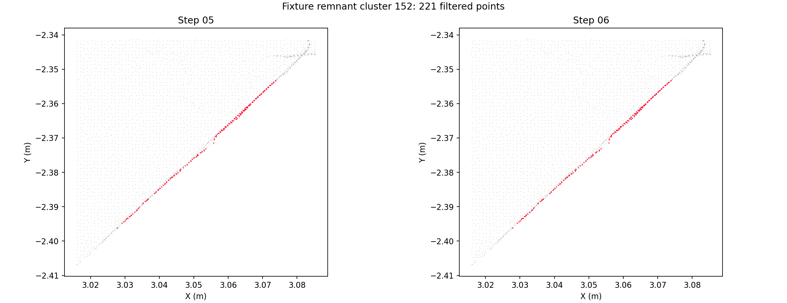

# 第六步：设计辅助的钢筋实例整理

本轮在练武场新增可运行的第 06 步，直接接收当前第 05 步结果。入口是 `http://127.0.0.1:8766/`（外部访问 `http://10.0.0.4:8766/`），选择“06 设计辅助实例整理与去噪”和“几何 + 邻接拓扑”。主应用生产分割仍止于第五步；这次新增计算与查看入口属于练武场。

当前结果已经包含内外实例、设计关联、合并/拆分/过滤原因、数量异常清单及分别导出的已编号实例与待定候选。**它仍是需要复核的结果，不能认定为全场景已经干净、数量已经正确的最终真值。**

## 数量与偏差的处理

每次运行从服务端读取点云资产 5 当前关联的 BIM 和已保存的粗配准，通过源文件路径及 SHA-256 校验设计快照。当前模型 `0910_YB-1.ifc` 有 70 根设计整筋，其中 4 根连续腹杆包含 144 个直线斜段；因此应对照 66 + 144 = **210 个匹配单元**。母筋编号只用于追溯，同母筋的不同斜段不会自动合并。

位置、方向、直径、可见长度和相邻构件关系参与候选评分。短筋允许更大的位置偏移；可见长筋帮助判断相邻钢筋的位置关系。设计数量只触发检查，不作为删除、合并、复制点或强制补齐实例的配额。未观测单元也不等于现场缺筋。

## 第六步的实测证据

- **断裂合并**：先对点云拟合局部圆柱，再检查同一设计单元下的端点与局部切线。当前上限为 350 mm 间隙（同时受设计段长度限制）、12° 方向差、4 mm 横向差和 2 mm 半径差。整个合并组再检查轴向重叠、总跨度与单元冲突，避免沿邻筋连续串错。间隙处不补点。
- **近邻拆分**：两个独立圆柱须比一个圆柱更能解释实测点；法向量不仅要垂直轴线，还要符合各自的径向。至少三个局部截面、且不少于 70% 的检查区间都须支持两个分离的拟合中心。通长钢筋也适用，弯曲钢筋两侧表面不因整体拟合而自动拆成两根。
- **外部实例**：先在保留的外部簇中寻找圆柱证据，再与已有实例接续。不同实例的圆柱表面评分接近时保留待定；只有独占支持充分的簇才允许连同弯钩整体归属。被拆分或过滤后失去源点归属的旧拟合段会从搜索模型中移除。
- **夹具残留**：当前只删除法向高度共面、紧邻实测夹具、且圆截面拟合退化的残留。不是“设计没匹配上就删”。不满足这些证据的可疑簇继续保留，源点和前五步标签均可追溯。

实现位于 `services/mesh-service/algorithms/design_guided_instances.py`。原内部圆柱分配器增加了可选的跨实例评分差检查；默认关闭，保持第五步原有行为。`pointcloud_step_pipeline.py` 使用 `throughStep=7` 表示页面第 06 步，必须有服务端模型快照并启用设计辅助；第 07 步历史实验继续撤回。

## 查看和导出

页面默认显示已编号实例。可以切换第五步对照、按原实例或最终实例选择、使用统一的内外/分层/腹杆类别筛选，并查看本步过滤或合并/拆分范围。

| 文件 | 内容 |
| --- | --- |
| `resolved-steel.las` | 已编号钢筋实例，带最终实例和拟合段编号；包含设计对应关系仍待核对的实测实例 |
| `pending-steel.las` | 保留为钢筋候选、尚未分配实例的点 |
| `complete-steel.las` | 第六步全部保留钢筋候选，包含前两项 |
| `noise-only.las` | 第五步噪音与第六步新过滤点 |
| `complete-instances.json` | 实例、实测拟合段、设计清单、关联异常及操作记录 |
| `pointcloud-with-classes.las` | 全部原始记录、原有字段和各步骤属性 |

`designReview.components` 保存输入簇/片段的几何证据，后续外部竞争可能把一个输入簇分配到不同实例；最终逐点归属以 `complete_instance`、`complete_segment` 及 `instances`/`segments` 汇总为准。设计待核对实例和“没有实例编号的候选点”是两个不同概念。

## 最终全量结果

源点云为 9,216,369 条原始记录。最终运行 [`20260910T162643-bcad9c43`](http://10.0.0.4:8766/?run=20260910T162643-bcad9c43)，同服务版本的第五步基线 `20260910T162557-8103de74`。前一轮相同算法运行 `20260910T162444-767c981e` 的五列最终输出与最终运行逐元素相同。当前投影分类也包含工作区同期更新，因此早先第五步历史快照不作为本轮差异基线。

| 项目 | 最终值 |
| --- | ---: |
| 全流程 / 第六步 | 41.18 s / 6.45 s |
| 原内部实例 | 240 |
| 新建外部实例 / 合并操作 / 拆分操作 | 79 / 60 / 0 |
| 最终已编号内外实例 | 259 |
| 本步过滤点 | 1,967 |
| 已编号实例点 | 1,895,871 |
| 无实例编号的保留候选点 | 79,476 |
| 设计关联待核对的已编号实例 | 43 |
| 未观测 / 多实例对应的设计单元 | 9 / 9 |

240 + 79 − 60 = 259；原内部数量和最终内外数量并非相同范围。60 次合并中，原内部实例之间为 `30 + 76` 一次，其余包含外部片段。不能把“60 次合并”解读为修复了 60 处内部断筋，也不能将 259 当作现场真值。最终在真实样本上没有通过全部局部截面验证的自动拆分，近邻双筋拆分能力由独立合成测试验证。

原 12 根短筋及其 74,746 个源点全部保留，原实例编号未变。台面 5,310,049 点、夹具 1,922,828 点、保留钢筋候选 1,975,347 点、噪音 8,145 点，总和与源记录数一致。

完整指标见 [最终结果记录](assets/design-guided-step06-2026-09-11/result.json)。全局及过滤局部视图由实测源行生成；红色标记本次过滤点，前后图都保留其位置以供检查。





## 验证与已知限制

14 个新增行为测试覆盖长筋缺口、腹杆缺口、不同斜段保护、近邻双筋拆分、通长双筋、弯曲单筋不误拆、位置偏移的短筋、未观测设计、无噪音找回、外部实例、平面残留以及交叠圆柱的归属歧义。相关 mesh-service 回归共 101 项通过，调试 HTTP 测试 6 项通过，四个 Node/Three.js 预览和筛选检查通过。

第一轮局部复核拦下了两类误拆：把夹具边缘解释成两个圆柱，以及把一根弯曲通长筋的两侧解释成两个圆柱。已分别加入径向法向检验和重复局部截面检验。因此试跑中报告的拆分数量不应当作最终结果。

独立同版本第五步基线用于检查前五步数组未变；完整 LAS 验证逐字段原始记录保留、源记录索引、最终属性、实例/拟合段点数和四类子集一致性。绘图只选择原始源行，使用一致坐标和比例，不移动或插值点。当前没有可连接的浏览器自动化会话，HTTP、实际百万点预览和 Three.js 筛选验证不代替真实浏览器点击验收。

仍有设计对应关系不明确的实测钢筋、无法分配实例的外部残留，以及多个实例对应一个设计单元的情况。尤其短筋实际长度和位置可能偏离模型，不能通过数量约束删除；被第五步错误过滤的真实钢筋也不会由本步找回。全场景尚无逐根人工标注，不能给出全局误合并/漏分率，也不能把接近设计总数当成精度验收。

复核工具：

```bash
.cloudbim/mesh-venv/bin/python scripts/pointcloud-guided-instances-check.py \
  --baseline <同版本第五步运行目录> \
  --result <第六步运行目录> \
  --output .cloudbim/design-prior/step06-final-verified
```

集成服务始终由 `scripts/cloudbim-dev.sh` 管理。本轮没有提交 Git、推送远端或改动生产算法默认步骤。
