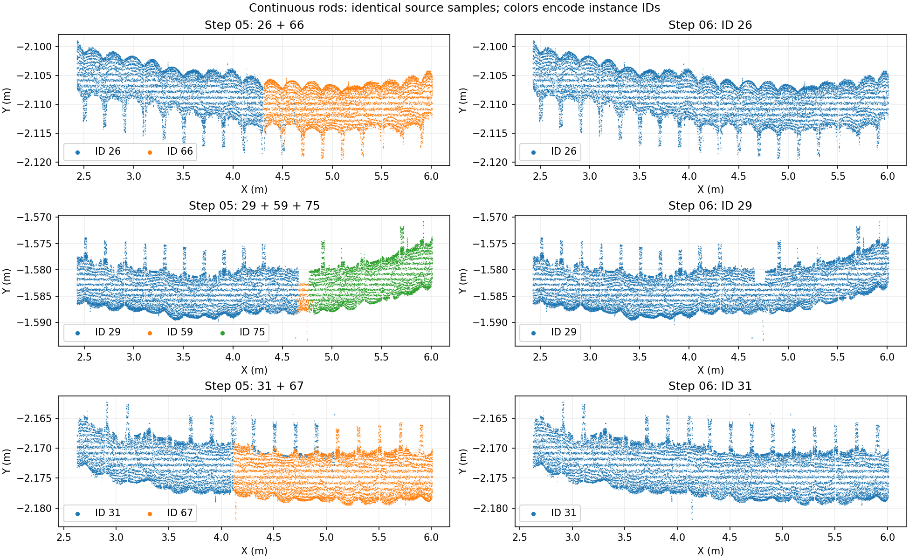

# 第六步设计约束加强：v2（2026-09-11）

当前结果：[打开第六步](http://10.0.0.4:8766/?run=20260910T165314-ec13ed03)。版本 `design-guided-instances-v2`。

用户指出，上一版仍有同向断片、夹具遮挡两侧分属不同实例，以及夹具边缘伪钢筋。这次修改了断片合并、设计关联和残留清理三个环节。

## 处理变化

- 用局部圆柱的点密度和拟合质量确定可信端点，避免少量腹杆连接点把钢筋长度拖长。部分轴向重叠可以合并，但必须通过局部圆柱中心的一致性检查；长距离重叠的相邻钢筋仍分开。
- 位置、方向、可见长度、直径共同限制候选。邻近平行钢筋提供实测位置偏差，用于容纳粗配准误差和局部弯曲。小碎片不能提前锁定一个相邻设计单元、阻止后续长钢筋接续。
- 对设计直段进行一对一竞争分配，未对应实例有显式代价（默认 3）；有充分圆柱证据的额外实物可以保留为待核对。数量本身不构成删除实物的证据。
- 同杆内外片段统一编号。最大候选断口为 650 mm，同时受设计长度、端点横向误差、方向和组内几何约束。旧实例编号不再保护弱圆柱拟合；弱碎片重新竞争已有钢筋的归属。
- 结合夹具距离、同表面法向、截面形状及设计竞争，删除夹具边缘残留。删除发生在外部接续之前，避免伪钢筋作为种子继续吸收点。外部接续仅使用可信实测局部圆柱。
- 页面增加“跨夹具接续实例”筛选，默认显示已编号实例。待定候选与已编号钢筋分别导出。

算法文件：`services/mesh-service/algorithms/design_guided_instances.py`。本次修改的是工作台第六步。

## 当前全量结果

独立第五步基线：`20260910T164718-8a4a2a4a`；最终结果：`20260910T165314-ec13ed03`。原始输入为 9,216,369 点。

| 项目 | 结果 |
| --- | ---: |
| 第五步内部实例 | 239 |
| 第六步内外统一实例 | 209 |
| 最终保留的合并操作 | 64 |
| 其中内外接续 | 60 |
| 本步过滤点 | 93,786 |
| 已编号钢筋点 | 1,863,176 |
| 单独保留的待定候选点 | 19,591 |
| 未观测设计直段 | 1 |
| 多实例竞争同一设计直段 | 0 |
| 第六步耗时 | 7.15 s |
| 完整流程耗时 | 41.73 s |

设计有 70 根物理钢筋，对连续腹杆按方向分解后共有 210 个直段匹配单元。因此当前 209 个实例应与 210 个直段比较，不能直接与 70 根物理构件比较。缺少观测的 1 个腹杆直段没有补造点。

当前输入中，26 + 66、29 + 59 + 75、31 + 67 三组通长筋已分别共用一个编号。12 根短筋的原有 74,746 个点全部保持钢筋类别和原编号，容纳了实物偏位与名义长度差异。

## 验证与限制

- 106 项 Python 算法及集成回归通过；后续局部拟合修正后，相关 39 项再次通过（其中第六步 19 项）。新增场景覆盖大遮挡间隙内外接续、同一圆柱重叠碎片、稀疏横向尾点、设计数量竞争、已编号夹具边缘清理。
- 6 项工作台接口测试通过；Node/Three.js 检查了真实 100 万点预览、已编号/待定/过滤/合并/跨夹具筛选及下载入口。
- 离线第六步与完整流程的 5 个最终数组逐项完全一致。
- 全量审核检查源点位置、前五步数组、实例与分段计数及引用、原始 LAS 字段、最终附加字段和各个 LAS 子集。结果见 `audit.json`。
- 已检查通长筋及夹具残留局部图。尚无整份点云的人工实例真值，不能据此声称所有点均已正确分类。19,591 个尚不能可靠归属的候选单独保存，不进入 `resolved-steel.las`。

详细机器结果：[result.json](assets/design-guided-step06-v2-2026-09-11/result.json)；审计：[audit.json](assets/design-guided-step06-v2-2026-09-11/audit.json)。
