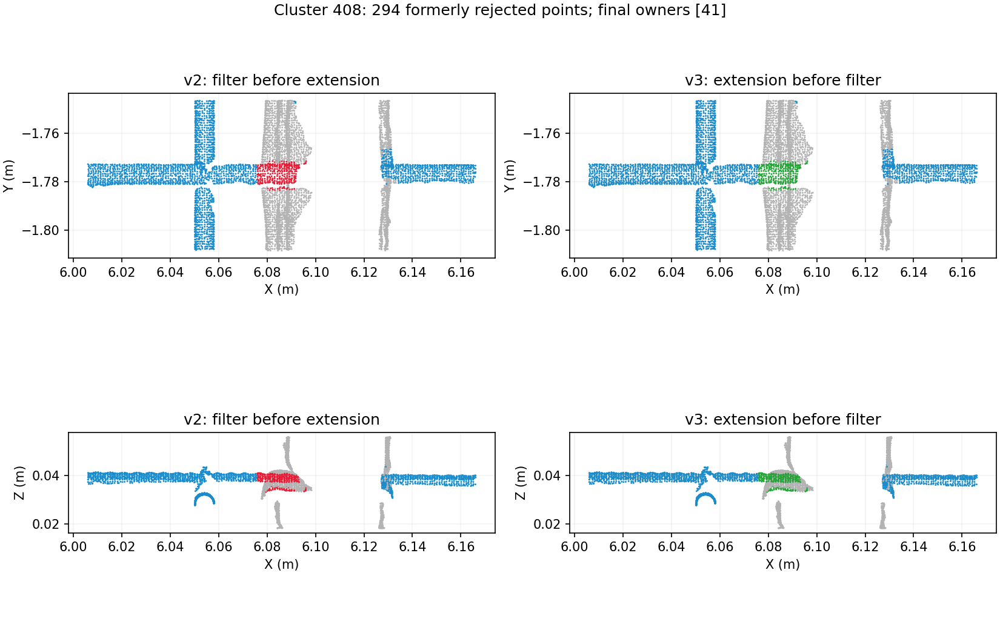
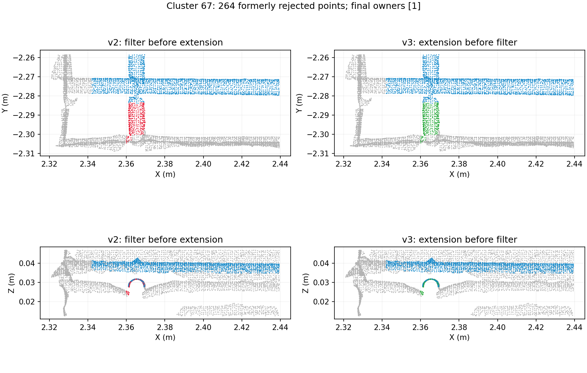
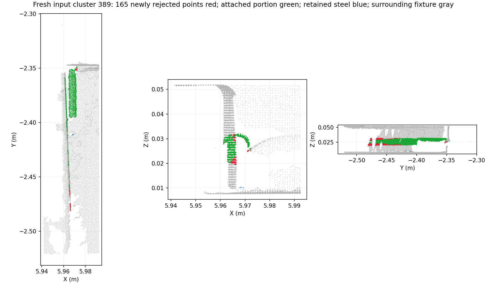

# 第六步短外露钢筋保护：v3（2026-09-11）

最新全量结果：[打开第六步](http://10.0.0.4:8766/?run=20260911T031047-85d3442c)。

用户指出短外露钢筋仍被删成噪音，建议先延伸内部实例的实测轴线，接续同杆外露点，再执行设计约束和残留清理。检查确认旧版存在处理顺序问题：两轮外露候选过滤先于最终轴向接续；较早的实例合并又要求两侧都具备可靠圆柱证据。短段只有一小片可见表面时，可能在继承内部钢筋证据之前被删除。

## 修复后的顺序

1. 从原有内部实例的实测点提取可靠局部圆柱，在端部向外做有限搜索。潜在混合实例、弱拟合和紧贴夹具的可疑实例不能作为种子。
2. 外露点先竞争内部实例归属，检查圆柱表面距离、法向、外露簇方向及相邻钢筋竞争。外露短段不再必须独立拟合出可靠圆柱。同方向仍需横向位置吻合；当前端部搜索范围为 500 mm，表面容差为 2.5 mm。
3. 同一连通外露簇若有至少 55% 的几何支持来自唯一内部钢筋，且至少 12 个点通过法向检查、没有相邻实例竞争，可作为整体接续。这保护接续短段的端头和弯钩，避免只取走轴线附近点后又删除其余部分。
4. 已接续部分继承内部实例编号，然后继续原有的设计关联、断片合并、相邻钢筋分离和夹具残留清理。后续内部实例合并时同步更新外露点与分段的归属。

新接续点不能成为本轮搜索种子，防止沿夹具残留反复扩张。只使用前五步仍保留为钢筋的源点；不会复活前五步已删除的噪音，不生成缺口点，也不改变 XYZ。存在归属竞争的点保留为待定候选。

实现：`services/mesh-service/algorithms/design_guided_instances.py`，版本 `design-guided-instances-v3`。工作台显示“优先接续外露簇/点”统计，“跨夹具接续实例”筛选包含这些提前接续的实例。

## 同一历史输入的受控比较

第五步基线为 `20260910T164718-8a4a2a4a`，旧 v2 结果为 `20260910T165314-ec13ed03`。两版使用同样的点、法向、类别、内部实例和设计快照。

| 项目 | v2 | v3 |
| --- | ---: | ---: |
| 最终实例数 | 209 | 209 |
| 第六步过滤点数 | 93,786 | 88,137 |
| 待定钢筋点 | 19,591 | 19,562 |
| 提前接续外露簇 | — | 153 |
| 提前接续外露点 | — | 113,598 |

旧版过滤的 5,649 个点在 v3 中保留为钢筋；旧版已保留钢筋没有新增删除，旧版已编号钢筋没有降为待定。提前接续量包含旧版最终也能接续的点，不能把 113,598 解释为新增恢复点数。

下面两处局部图采用上述受控输入。X 向短外露段有 294 个点由旧版过滤改为保留；Y 向短外露段有 264 个点改为保留。图中的绿色点与内部钢筋轴向及截面接续，灰色为邻近夹具。

## 回归覆盖

- 110 项 Python 算法和接口回归通过，其中第六步 23 项。
- 新增用例重现了旧版误删：与内部钢筋同轴、紧邻夹具、仅露出 25 mm 长窄表面的外露段，共 279 点。v3 保留全部点并继承内部编号。
- 同方向但横向偏离 40 mm 的夹具样条仍被过滤。
- 端头多数法向不可靠时，通过有效表面支持保留整体；存在多个内部种子时，分段引用仍指向正确父实例。
- 内部断片后续合并时，提前接续的外露点和分段同步归并。

## 当前工作台全量验证

重新运行当前前五步后，独立基线为 `20260911T030958-836f8ee8`，第六步结果为 `20260911T031047-85d3442c`。当前前序分类与历史输入存在差异，不能直接把两次总过滤量之差算作本次修复效果。另将保存的 v2 算法运行在这份新基线上，与 v3 作同输入比较。

| 项目 | 当前结果 |
| --- | ---: |
| 原始点数 | 9,216,369 |
| 最终实例数 | 209 |
| 提前接续外露簇 / 点 | 155 / 113,716 |
| 第六步过滤点 | 94,841 |
| 已编号钢筋点 | 1,868,102 |
| 待定候选点 | 15,796 |
| 原有短筋 / 点完整保留 | 12 / 74,746 |
| 第六步 / 全流程耗时 | 6.59 s / 41.82 s |

与新输入上的 v2 比较，5,475 个原本过滤点改为保留，165 个原本保留点改为过滤，净增加 5,310 个钢筋点。最终实例数仍为 209，原先已编号的钢筋没有变成待定候选。

165 个新增过滤点均位于外露簇 389 的钢筋与夹具交界。其钢筋主体 1,338 个点已接续到实例 89；剩余混合部分的圆柱拟合误差为 5.33 mm，约 60% 采样点贴近夹具，因此进入原有夹具边缘过滤。局部图显示交界残留与钢筋截面混杂，未用“旧版曾保留”作为全簇恢复理由；这 165 个点的逐点真值仍需人工核对。

完整 LAS 审计通过：源点顺序、原始 XYZ 和 LAS 字段不变，前五步数组与独立基线一致，实例与分段计数及引用正确，各导出子集与最终分类一致。Node/Three.js 通过真实 100 万点预览加载、筛选、编号选择及下载入口检查；工作台页面和固定结果接口返回成功。未进行真实浏览器交互验证。

机器结果：[result.json](assets/design-guided-step06-v3-2026-09-11/result.json)；全量审计：[audit.json](assets/design-guided-step06-v3-2026-09-11/audit.json)；同输入比较：[same-input-comparison.json](assets/design-guided-step06-v3-2026-09-11/same-input-comparison.json)。

没有整份点云的人工实例真值，数量稳定和回归通过不等于每个点都已正确分类。当前修改针对第六步的误删顺序；前五步已丢失的点不在本次恢复范围内。
