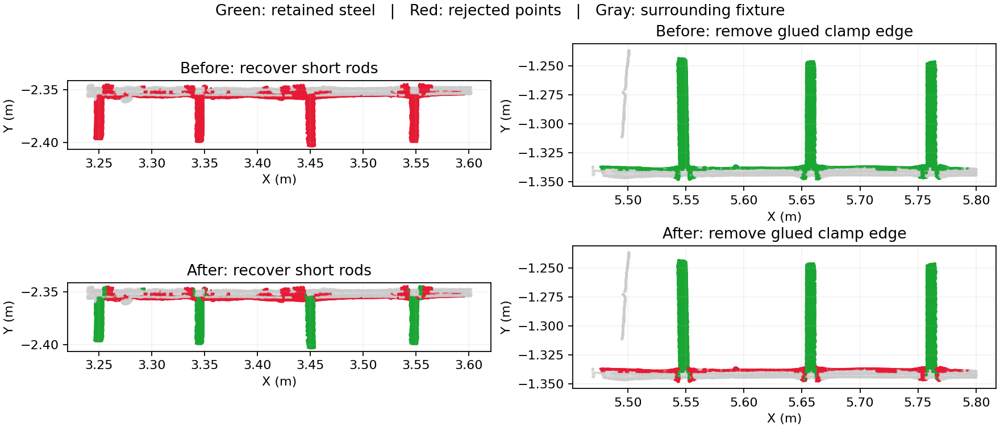

# 第六步：拆开外露短筋与夹具边缘的粘连（2026-09-11）

最新结果：[打开第六步](http://10.0.0.4:8766/?run=20260911T035324-07fd9917)，选择“粘连簇拆分对照”。

用户观察到，短外露钢筋与垂直的夹具边缘会形成同一个连通簇；其中短筋仍与内部钢筋同轴。v3 虽已把轴向接续提前，但还存在两处整簇判断：整簇主方向可以否决同轴候选，整簇多数支持又可能把夹具边缘一并带入钢筋。因此，连通性不能直接代表同一根实物。

## v4 处理顺序

1. 保留可靠内部钢筋实测圆柱的有限端部搜索，找出有同轴支持的外露点。
2. 在外露连通簇内估计局部方向，识别轴向分支与横向夹具分支。先以 1.5 mm 体素均衡采样密度，再在 12 mm 邻域估计局部主方向；只使用方向可靠的邻域。
3. 横向分支需要有至少 20 mm 的横向跨度及明确夹具邻近或同表面证据。同轴分支还需至少 12 个方向一致点、至少 12 mm 轴向跨度，以及原有表面距离、法向和相邻实例竞争检查。只有夹具边缘穿过搜索圆柱，不能成为钢筋。
4. 对确认的粘连簇解除整簇主方向否决，也禁止多数点把整簇一并带入钢筋；按局部支持接续同轴分支。新接续点不再充当扩张种子。
5. 提取轴向分支后，对剩余点重新做连通聚类，各残余分支分别拟合、关联设计及清理。最终接续阶段同样遵守已识别的横向分离边界。

弯钩也可能横向转弯并靠近夹具，因此另检查横向部分的圆柱拟合、法向变化、与主筋的直径一致性和局部长度。有可靠圆截面的小段弯钩沿用原有整体保护，不因转向而被当成平边。

修改文件：`services/mesh-service/algorithms/design_guided_instances.py`，版本 `design-guided-instances-v4`。源 XYZ、前五步结果与原始连通簇编号不改；原簇编号用于追溯来源，处理单元可以进一步拆分。只处理前五步仍保留的钢筋候选，不复活此前被删除的点。

工作台新增“粘连簇拆分对照”筛选，同时显示这些源簇里保留的钢筋与移除的边缘，可切换处理前后。摘要显示发生分离的粘连簇数量。

## 可重复的回归场景

- 构造一段仅露出 25 mm 的窄圆柱表面，粘连在 120 mm 长的垂直夹具边缘上。v3 将离开接触区的 198 个短筋点全部误删；v4 保留并接回内部实例，横向远端仍删除。
- 只有夹具边缘横穿内部轴线、没有外露短筋时，不产生钢筋实例。
- 两根平行短筋通过同一夹具边缘相连时，各自继承对应内部编号。
- 场景整体旋转、法向符号翻转、使用两个工作线程后仍正确接续。
- 圆截面的真实转向弯钩靠近夹具时，钢筋及其父实例完整保留。

115 项 Python 算法和接口回归通过；弯钩长度保护补充后，28 项第六步测试再次通过。Node/Three.js 检查了粘连簇筛选在处理前后都包含完整源簇、预览加载、编号选择、下载入口和语义筛选。

## 全量结果与局部对照

原始点数 9,216,369；独立第五步基线 `20260911T035222-d3525f2e`，最终 v4 结果 `20260911T035324-07fd9917`。同输入比较使用 v3 结果 `20260911T033445-1e713bc9`，已逐项确认位置、法向、前序类别、分区和内部实例数组完全一致。

| 项目 | 结果 |
| --- | ---: |
| 拆开钢筋与夹具的粘连簇 | 31 |
| 提取钢筋后重新聚类的残余分支 | 88 |
| 相对 v3 新保留的钢筋候选点 | 6,396 |
| 相对 v3 新过滤的点 | 6,027 |
| 原已编号点改为待定 | 35 |
| 最终实例数（前 / 后） | 209 / 209 |
| 已编号钢筋点 | 1,865,917 |
| 待定候选点 | 31,410 |
| 第六步过滤点总数 | 116,083 |
| 原有短筋建族记录及点完整保留 | 12 根 / 74,746 点 |
| 第六步 / 完整流程耗时 | 8.56 s / 43.49 s |

新增保留和新增过滤是逐点差异，不代表有整份人工真值。原有 12 根短筋的统计用于检查既有建族结果未被破坏，与新增恢复的外露短片段分别统计。

- 左图为源簇 145：原先整体过滤的 4 段外露短筋分别接续到内部实例 21、24、25、28，新增保留 2,860 个点，横向边缘仍被过滤。
- 右图为源簇 305：保留实例 79、81、84 的三段外露钢筋，移除原先误随簇保留的横向夹具边缘等 2,026 个点。
- 源簇 357：同轴短筋保持为实例 90，原来一起保留的两侧翼状夹具残留有 522 个点被过滤。
- 源簇 390：两根钢筋与夹具边缘拆开后，弯钩和端头等 1,507 个点重新保留，同时过滤 211 个原先保留的交界点。完整多视图见 [弯钩与边缘](assets/design-guided-step06-v4-2026-09-11/hook-and-edge.png)。

全量审核通过：源点位置、点顺序和原始 LAS 字段不变，前五步数组与独立基线一致，实例和分段数量及引用正确，完整 LAS 与各子集的最终属性一致。离线执行与工作台完整流程的五个最终数组逐项完全相同。6 项工作台接口测试通过，真实 100 万点预览加载与筛选通过，页面提供新筛选项，三个钢筋 LAS 下载返回正确文件。未进行真实浏览器交互验证。

尚无整份人工实例真值；接触处法向混杂或不足 12 mm 的粘连短段仍可能无法可靠判断。待定候选单独保存，不进入已编号钢筋导出。

机器结果：[result.json](assets/design-guided-step06-v4-2026-09-11/result.json)；全量审计：[audit.json](assets/design-guided-step06-v4-2026-09-11/audit.json)；同输入比较：[same-input-comparison.json](assets/design-guided-step06-v4-2026-09-11/same-input-comparison.json)。
