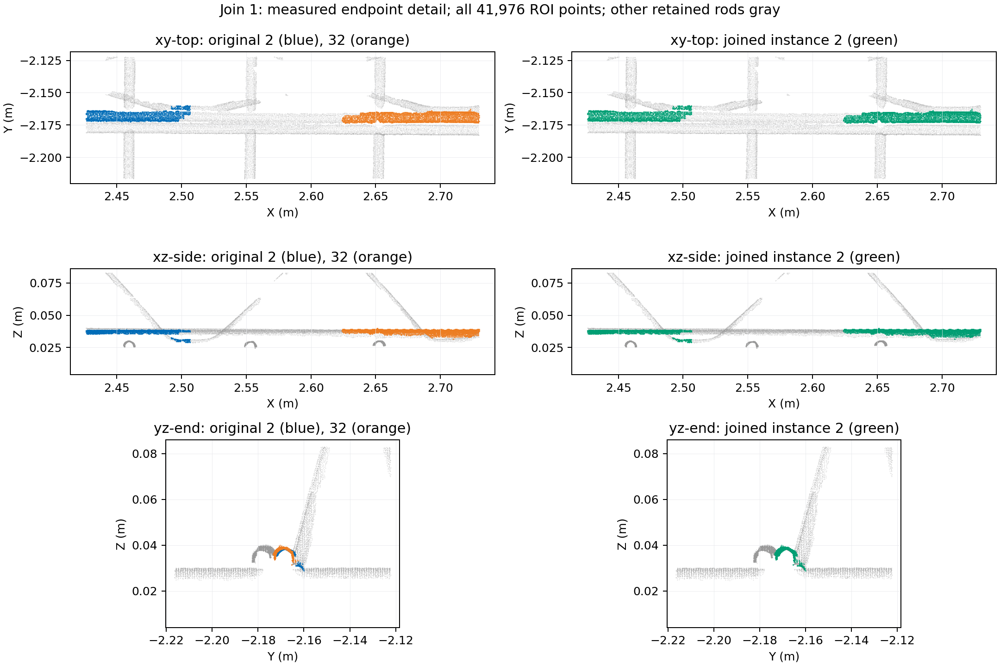
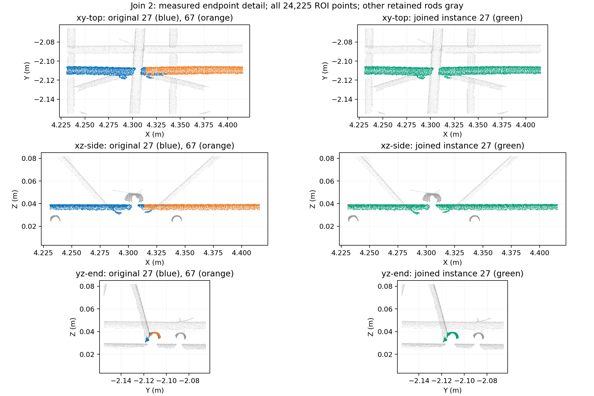
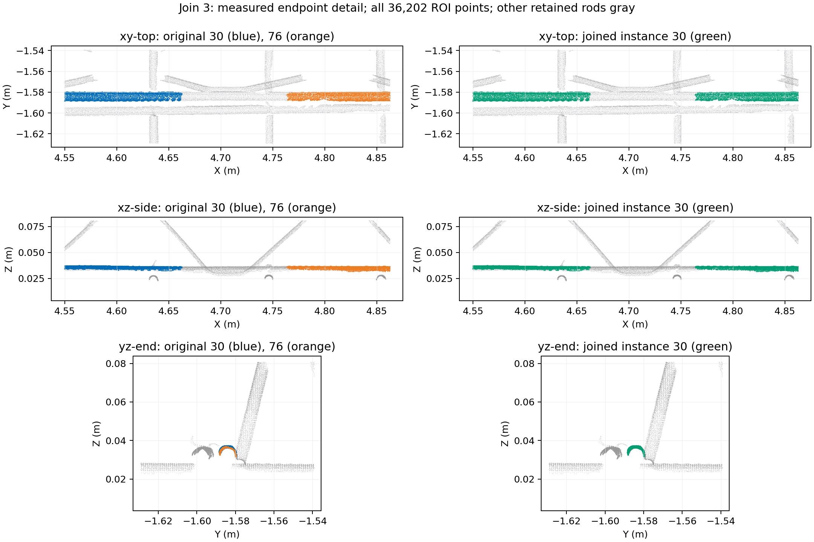
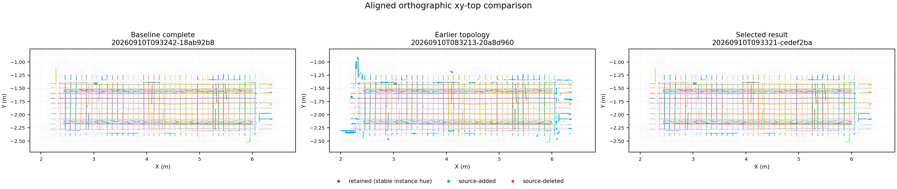
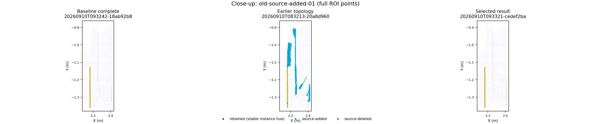

# 设计先验第二轮复核：只串联最终保留簇

本轮修复了用户指出的退化：设计先验不再把已剔除的候选重新纳入钢筋。新步骤只接收上一阶段最终保留的钢筋点，逐点保持类别与坐标，只在实测几何支持充分时统一断片的实例编号。版本为 `design-prior-linking-v3`，仍限于练武场，默认关闭。

## 退化原因

1. 旧规则把“不确定的已过滤候选”作为待定钢筋保留。在用户看到的 `20260910T083213-20a8d960` 中，它重新纳入了 **64,478 点**，仅新过滤 193 点，没有完成任何实例串联。待定不代表真实钢筋，这个入口违背了用户希望用设计辅助已有分类的意图。
2. 练武场服务端配置仍固定指向旧 IFC、BIM asset 4 和旧配准。主应用已关联新 BIM asset 7，练武场没有随之更新。现在每次运行读取点云 asset 5 当前关联的 BIM 及其已保存配准，页面和结果记录实际模型名、资产编号、指纹和矩阵；缺少关联/配准时明确失败，不回退到旧路径。
3. 新 IFC 的扫掠体明确填写完整参数范围，并使用角度制圆弧。原提取器拒绝所有显式扫掠范围，且按弧度解释参数，不能正确提取腹杆。现按 IFC 的平面角单位处理，并核对扫掠范围覆盖完整曲线；真正的局部裁剪仍降级处理。

复合曲线的参数长度是子曲线参数区间之和，不是物理长度；角度制的线—圆弧—线可以具有 `1 + 135 + 1 = 137` 的参数范围。这些处理依据 buildingSMART 的 [IfcCompositeCurve](https://standards.buildingsmart.org/IFC/RELEASE/IFC4_3/HTML/lexical/IfcCompositeCurve.htm)、[IfcSweptDiskSolid](https://standards.buildingsmart.org/IFC/RELEASE/IFC4_3/HTML/lexical/IfcSweptDiskSolid.htm) 和[角度制裁剪参数示例](https://standards.buildingsmart.org/IFC/RELEASE/IFC4_3/HTML/annex_e/trimmed-curve-parameters/curve-parameters-in-degrees.html)。

## 新模型的数量口径

当前 `0910_YB-1.ifc` 有 70 个可解析的 `IfcReinforcingBar`：66 根普通筋和 4 根连续腹杆。每根腹杆有 36 个可靠直线斜段，共 144 个腹杆匹配单元。普通筋中包括 12 根 280 mm 短筋，长筋的短弯钩腿不计为额外腹杆。

因此按“每个腹杆斜向一个实例”的约定，应比较 **66 + 144 = 210 个匹配单元**，不能将扫描斜段实例数量与 70 根设计整筋直接比较。`designBarId` 只分组；同父编号、相邻斜段接触均不允许跨单元合并。

理想完整扫描中，真实钢筋实例与设计匹配单元数量、拓扑应接近。数量差异只产生复核线索：漏扫、多放、错放和仍未串联的碎片不能通过强制配额处理。12 根短筋放宽到 350 mm 的位置搜索范围，设计位置不是其存在与否的判据。

## 当前串联规则

- 输入严格为 `complete_class == 3`；`prior_class` 与原数组逐点相等，过滤/找回动作恒为零。已有正编号实例作为整体，未编号外部簇也作为整体，不拆分、不抢点。
- 复用法向、圆柱轴线、拟合残差及体素；先判断实测钢筋证据，再按方向、长度族、位置生成少量设计候选。长实例提供邻接支持，拓扑模式最多更新两轮。
- 只有对应同一个 `designUnitId`，方向偏差不超过 8°、横向偏差不超过 4 mm、实测轴向间隙不超过 200 mm、半径差不超过 3 mm，且无超过 5 mm 的轴向重叠，才进入串联。更长的实测轴线作为稳定参照；整个合并组还须通过方向、横向和重叠冲突检查。
- 间隙表示可以统一实例归属，不表示补齐扫描数据；缺失处不插点。孤立未编号簇即使匹配设计，也保持未编号，只有实际接续成功才形成实例归属。
- 本模型有相距约 4 mm 的不同设计长筋中心线，单纯选最近设计线不足以辨别。匹配加入实测长度及已有长实例支持；仍不明确的保留待定。

页面默认按观测实例着色、关闭设计线叠加，避免参考线掩盖实测断口。“设计母筋分组”仅改展示颜色。合并筛选同时显示被接入片段和目标实例，可切换原编号/结果编号核对。

## 实测结果与图像复核

同一份 9,216,369 点源 LAS，三轮 A/B/C 的 B、C 都串联相同三组：

| 原实例 | 测得端点间距 | 局部图像判断 |
| --- | ---: | --- |
| 2 + 32 | 144 mm | 俯视同一条筋，侧视高度一致；端面截面重合，邻筋在不同横向位置 |
| 27 + 67 | 25 mm | 两片在交叉遮挡两侧相续，截面位置一致，邻近上层交叉筋能区分 |
| 30 + 76 | 153 mm | 两侧片段在同一横向和高度位置，附近平行筋截面分离；间隙仍保留 |

已编号实例 **240 → 237**；未编号保留簇 **128 → 128**，两者合计 **368 → 365**。73,995 点仅改变实例归属。12 根原短筋实例及其全部点保持不变，147 个原腹杆斜段实例保持独立。设计腹杆单元为 144，差异仍需进一步辨别，不能因此把任意三个斜段并掉。

本轮三组串联的 9 个正交局部视图均已由主智能体查看，未看到串到相邻筋的证据。这只支持这三组改动；尚未建立整幅点云的完整人工实例真值，不能声称全局误合并率为零或数量已经正确。







对照图从左到右是原流程、发生退化的旧先验、新串联步骤。青色表示相对原流程重新加入的源点，红色表示删除点。新版两类动作均为零。





可复用工具为 `scripts/pointcloud-design-prior-views.py`：全局固定源行步长取样，局部保留 ROI 内全部源点，不对点云进行插值或移动；统一视角、物理比例和坐标范围。产出四个全局视角、全部 12 个短筋区域（向外扩 350 mm）、腹杆/交叉/旧找回簇局部图，以及每次串联的局部三视图和全实例四视图。

子智能体 `prior_visual_review`（`gpt-5.6-terra`，medium）负责初版绘图工具及对照图，已结束。主智能体负责算法、整合及最终图像判断，并补充了断口特写；不能仅凭空隙仍可见就判定串联失败，因为本功能只统一编号。

## 性能与验证

性能采用用户更新后的 **120 秒全流程预算**，保留原有 A/B/C 各三次、同机 16 线程、交替启动独立进程的方式。读取、分类及所有 LAS/NPY/预览/JSON 导出计入；模型准备单列，未清空系统文件缓存。完整指标及运行编号见 [本轮基准记录](assets/design-prior-v3/final-benchmark.json)。

| 模式 | 全流程中位数 | 含进程启动/退出 | CPU 时间中位数 | 峰值 RSS 中位数 | 串联步骤中位数 |
| --- | ---: | ---: | ---: | ---: | ---: |
| A 原流程 | 19.058 s | 19.470 s | 136.266 s | 2796.7 MiB | — |
| B 几何串簇 | 19.675 s | 20.234 s | 137.074 s | 2878.6 MiB | 0.277 s |
| C 几何 + 拓扑串簇 | 19.675 s | 20.175 s | 136.074 s | 2920.0 MiB | 0.300 s |

新模型首次准备 0.322 s，其中提取阶段约 0.275 s；重复准备命中两级缓存约 0.038 s，包含读取当前数据库关联。B、C 都通过 120 秒门槛，且当前三组串联完全相同，尚未观察到拓扑模式带来额外串联收益。

第三轮目录为 A `20260910T093242-18ab92b8`、B `20260910T093301-6522a66d`、C `20260910T093321-cedef2ba`。源 SHA-256 为 `eb229b7c514e918c03534184eb56ceabdfd850c57b1b3503172bd8f290ebab52`；基准逐次核对源文件和模型/配准快照一致。

最终验证通过 105 项 mesh-service 相关测试、4 项调试接口测试、7 项复核评分测试，以及 Node/Three.js 预览加载与筛选检查。实际 B/C 全量核对原有 29 列 NPY、源坐标与字段、唯一源行索引、384 个外部整簇，以及完整 LAS、钢筋/噪声子集和百万点预览一致性。还通过 HTTP 验证 8766 已加载新 BIM、当前 C 结果及百万点先验预览；本轮没有将 HTTP/Node 检查表述为真实浏览器交互验收。

最终生成 45 张对照图，三个断口特写与先前逐一查看的图像字节一致；主智能体另查看了最终全局俯视、斜视、旧找回区域和腹杆局部图。完整图集在 `.cloudbim/design-prior/review-v3/final/visuals/`，选图和产出清单保存于本文的 `assets/design-prior-v3/`。

质量门槛仍保持 `unverified`，生产未开启：本轮证明退化入口已关闭，三组碎裂得到局部图像支持，但未证明所有保留簇都是真实钢筋，亦未达到 210 个真实实例一一对应。新增步骤保留原分类中的误保留点，后续若要继续去噪，应单独处理原分类器的证据，而不是重新打开设计找回入口。

## 复现与使用

练武场入口：[http://10.0.0.4:8766/](http://10.0.0.4:8766/)。选择“几何先验串簇”或“几何 + 拓扑串簇”；最新结果支持前后比较、合并筛选、短筋筛选、设计线及母筋分组。新旧结果均保留，检查页面显示的模型和运行编号，避免把历史结果当成当前模型的输出。

服务端配置为 `.cloudbim/design-prior/config.json`，其中 `databaseBinding` 绑定点云资产与主栈数据库；浏览器仅能提交模式，不能提供模型路径或矩阵。固定文件配置仍可用于离线复现。

```bash
.cloudbim/mesh-venv/bin/python scripts/pointcloud-design-prior-benchmark.py \
  --config .cloudbim/design-prior/config.json \
  --output backend/data/assets/95b6b41c5857d9eb3407b155/pointcloud-steps \
  --report .cloudbim/design-prior/review-v3/repeat/benchmark.json \
  --workers 16 --rounds 3 --budget-seconds 120
```

绘图使用本轮基准 JSON 中第三轮 `off` 和 `topology` 的目录作为 `BASELINE_RUN`、`RESULT_RUN`，旧退化目录为 `20260910T083213-20a8d960`：

```bash
.cloudbim/mesh-venv/bin/python scripts/pointcloud-design-prior-views.py \
  --baseline "$BASELINE_RUN" --old "$OLD_RUN" --result "$RESULT_RUN" \
  --output .cloudbim/design-prior/review-v3/repeat/visuals --no-design-lines
```

主应用继续由 `scripts/cloudbim-dev.sh` 管理；8766 是本次任务范围内的独立练武场进程。
