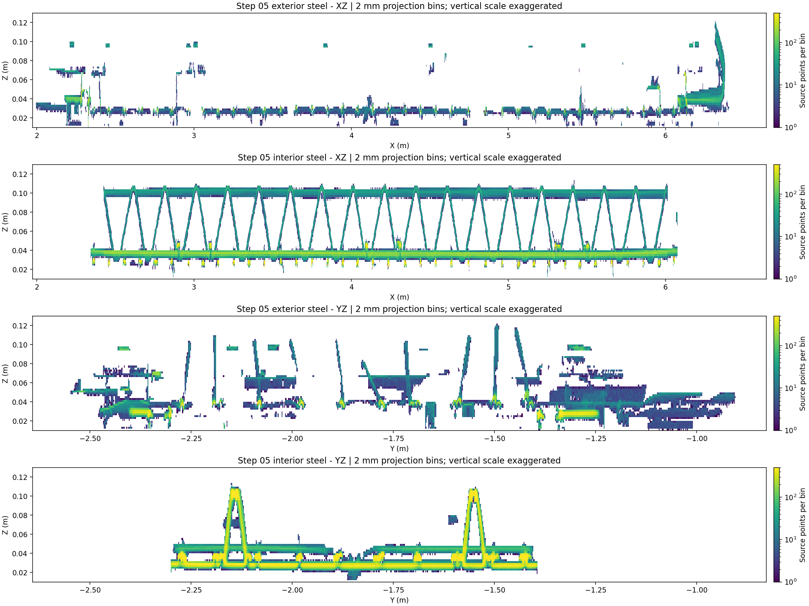
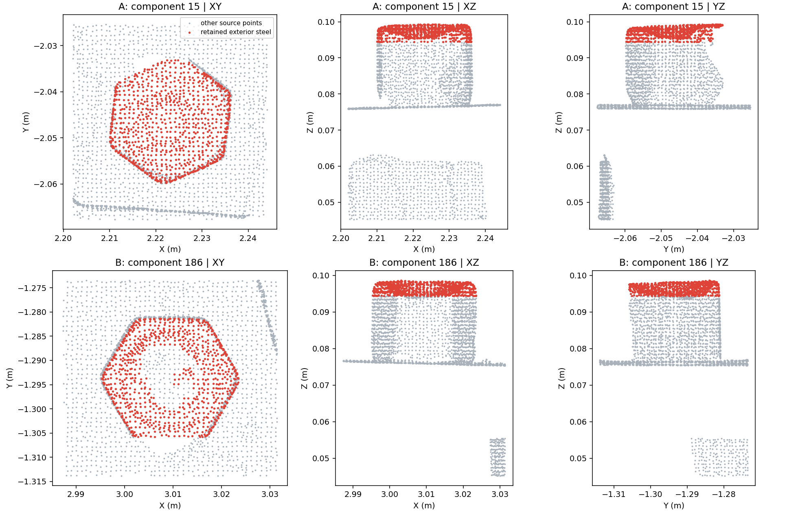
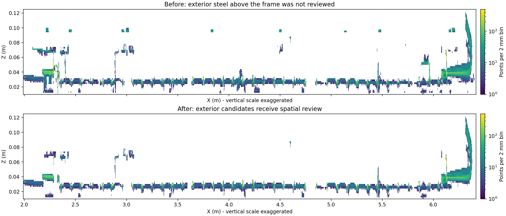

# 第 5 步外部钢筋上方残留的定位与修正

用户反馈新算法仍未清除外部钢筋上方的悬浮物，并提出侧视投影需要密度分层。本次直接从用户最新运行 `20260911T082059-4d085168` 的全量点云重建 XZ/YZ 密度投影，再回查原始点云上下文。浏览器连接不可用，以下是数据重建图，不是用户浏览器截图。

## 已确认的残留

投影采用 2 mm 网格、统一对数色标。纵轴放大，不能从图中长宽比直接判断三维杆形。

外部上方存在多个分离横片。追溯其中两处到原始数据，它们呈六角形顶部、下方接夹具主体，符合夹具螺栓头形状，并非稀疏随机点团：

- A：X 2.210–2.236 m、Y −2.060–−2.033 m、Z 0.0944–0.0993 m，994 个保留钢筋点。
- B：X 2.995–3.023 m、Y −1.306–−1.281 m、Z 0.0944–0.0986 m，941 个保留钢筋点。

两块融合分数均为 0.65。02B 上层保留高度带从 Z=0.09438180864619158 m 开始，两块钢筋标签的下缘恰好对应此阈值。下方主体为夹具，顶部因高度规则被回收到钢筋类别，因此在钢筋视图中形成“悬浮薄片”。第 6 步原有整理已将这两块移除，第 5 步却仍全部显示。

## 本轮修正

第 5 步原实现的 `review_mask` 只包含内框内部，外部高分点还直接进入冻结支撑。这是明确的覆盖遗漏：外部噪音无法被第 5 步删除。

现将全部融合钢筋候选纳入第 5 步空间审查，移除外部高分自动成为支撑点的规则。实测圆截面、弯钩和内部可靠表面仍提供保护；外部被剔除的点记为 `internal_type=5`，原始坐标、融合分数与上游分类保持可追溯。内框仍限定内部实例拟合，外部审查不为其伪造内部实例。

报告新增内外候选与删除点数；页面分别显示内外噪音，并修正“外部钢筋沿用旧结果”的提示。生产 `geometric-v6` 适配器版本更新为 9，共享流程为 `shared-segmentation-v15-exterior-multiview-denoising`。

96 项相关 Python 检查通过。新增调用层回归先复现“外部高分球状噪音全部被放过”，修复后噪音删除、真实外部圆柱保留。页面测试验证无内部实例的外部噪点从保留视图移除，仍能通过噪音/删除前筛选检查。

完整重跑 `20260911T083621-0d00d2be` 已完成，全流程 34.98 秒，第 5 步去噪 2.19 秒。内部仍删除 4,291 点；新增外部删除 55,142 点，合计 59,433 点，其中高分 6,411 点。全部第 5 步噪点在第 6 步仍为噪音。上游 12 个数组及内部标签逐点不变，源文件 SHA-256 不变；完整 LAS、子集和预览与源索引对应，实例点数一致。实际 HTTP 预览加载检查通过。详见 [审计结果](assets/pointcloud-exterior-denoise-2026-09-11/integrated-audit.json)。

两处顶部残片完整删除；13 处抽查露筋/弯起段在第 5 步保持保留，检查记录见 [局部点数](assets/pointcloud-exterior-denoise-2026-09-11/roi-checks.json)。删除点数仍不是精度指标，这些局部检查不能代表全场真值。

上下图使用相同范围和色标。上方约 0.097 m 的横片已消失；0.07 m 附近仍有残余片段，不能声明所有上方噪音已清除。

## 密度分层的判断

本轮密度投影用于定位和对照，**尚未新增密度阈值删除算法**。这两块顶部本身密度较高；它们首先是分类与审查范围问题，不能把它们的删除归功于密度滤波。

对于沿钢筋上方的细碎薄雾，值得继续测试局部密度峰、层间谷值及多方向的持续性。应相对同一深度切片内的实测主干判断，结合三维截面与接续证据；不能因密度低就删除，也不能把整个低密度高度层切掉，因为遮挡端部、背面和短露筋也可能稀疏。目前尚未获得用户对“顶部横片”与“细碎薄雾”目标的进一步区分，不把本次两块确认样本代表成全部残留。
