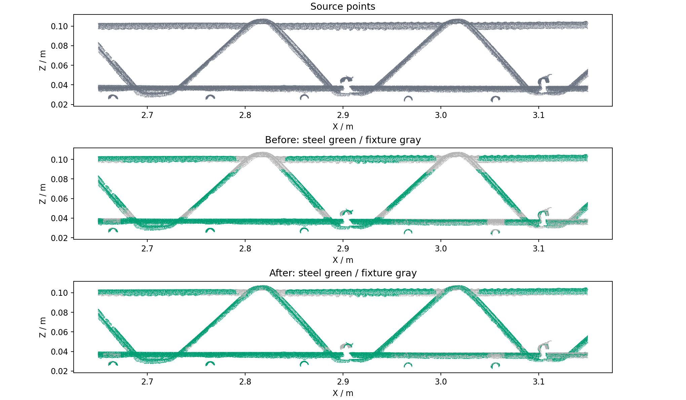
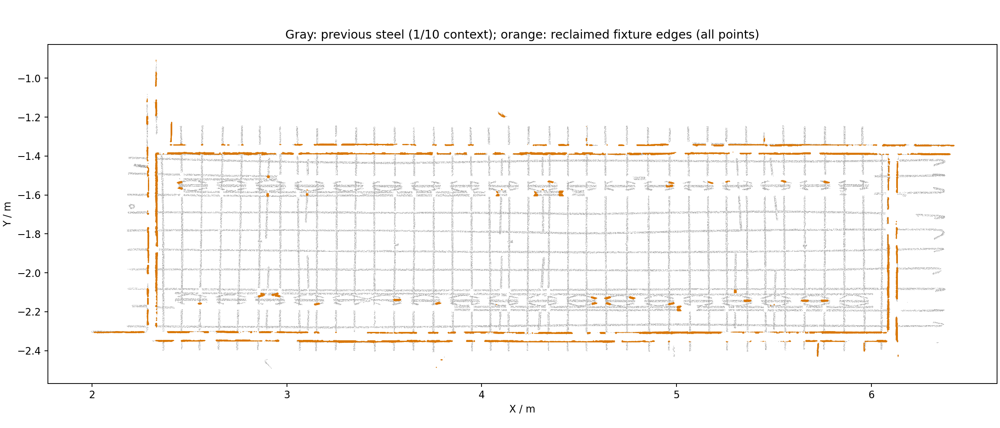

# 02B 弯头恢复与夹具贴边回收

在上一版多视角腹杆保留基础上，升级为 `projection-geometry-v4-bends-fixture-edges`。本轮同时放宽腹杆弯头、上下连接处的保留范围，并将沿夹具面延伸的薄边改回夹具。仍只修改原始点类别，不生成额外坐标。

## 弯头与连接处

原先腹杆每个位置都必须有明显竖向分量、线性度至少 0.78，导致弯头顶部切线变平时失去钢筋资格。本轮保留该严格规则作为腹杆种子，再允许种子周围 35 mm 范围内的实测弯头和连接点恢复：

- 弯头局部无需保持斜向；15 mm 邻域线性度放宽到 0.40，横向宽度放宽到 22 mm。
- 只通过相邻实测体素连通到原始种子的区域生长，邻接最大间隔 8 mm，且始终受原始种子 35 mm 包络限制。不会反复扩大范围，也不会仅凭距离把悬空小碎段接上。
- 上下恢复范围由腹杆种子的三维包络放宽；原来的 Z 峰值层 ID 继续保留，避免改变高度筛选语义。

## 夹具贴边回收

对 3 mm 占用体素的 25 mm 邻域，仅使用原 02B 夹具占比至少 80% 的体素拟合夹具面。锚点至少需要 35 个夹具体素、两个方向均有足够面宽，平面残差和两个面内特征值的比例也必须达标。附近已识别的真实钢筋不参与夹具面拟合。

每个非台面源点搜索最多 8 个邻近夹具面锚点。距离锚点不超过 18 mm、距实测平面不超过 2.5 mm 的钢筋候选改回夹具。判断使用三维点到面的距离；俯视重叠但位于夹具上方的钢筋不会仅因 XY 接近而被回收。夹具面证据同时约束严格腹杆和弯头恢复。

`source_fixture_edge` 记录原 XY 钢筋及上一版严格腹杆规则中被夹具面否决的点；`source_bend_recovered` 记录本轮弯头/连接恢复；`source_recovered` 在最终改类后清除已回收夹具点。工作台新增“夹具贴边回收”图及两项计数，黄色显示回收点。

## 验证

全量基线为 `20260910T162056-3ca3322c`，最终结果为 `20260910T162814-2aa3a4d4`，均来自同一份 9,216,369 点源 LAS。

| 项目 | 结果 |
| --- | ---: |
| 新恢复弯头、接头等原始点 | 82,327 |
| 从钢筋改回夹具的贴边点 | 158,904 |
| 02B 钢筋总点数 | 1,736,419 → 1,659,842 |
| 台面点数 | 5,315,996，未变 |
| 02B 分支耗时 | 19.761 s |
| 包含当前后续步骤的完整运行耗时 | 41.390 s |

已核对源 SHA-256、XYZ、法向量、有效标记、02A 类别和恢复标记、02B 高度层 ID 未变；导出 LAS 全部原始字段按源记录一致，LAS/NPY/预览分类一致。新增钢筋与回收夹具两种变化均有逐点证据掩码对应。

62 项相关 Python 测试通过，新增覆盖弯头顶部恢复、同面夹具薄边回收、其上方钢筋保护、邻近悬空碎段不接续。原有四向腹杆、宽斜板、竖墙、源记录乱序、线程一致性、LAS 往返、融合与内部钢筋测试继续通过。工作台 6 项 Python 测试、Node 语义筛选/去噪视图检查及 JavaScript 语法检查通过。

全量数据与机器核对结果见 [validation.json](assets/projection-bends-edges-2026-09-11/validation.json)。腹杆局部图采用 ROI 内全部点；夹具边缘总览中的橙色回收点不抽样，灰色背景采用 1/10 源记录间隔。

恢复/回收计数属于算法改类统计，不是人工真值精度。真实钢筋与夹具表面几乎共面且贴合时仍可能存在歧义；少数接触点的处理仍需结合诊断图检查。当前会话没有可用浏览器，未声称完成交互点击验证；诊断图、HTML 入口和持久化数据通过脚本及 HTTP 核对。
