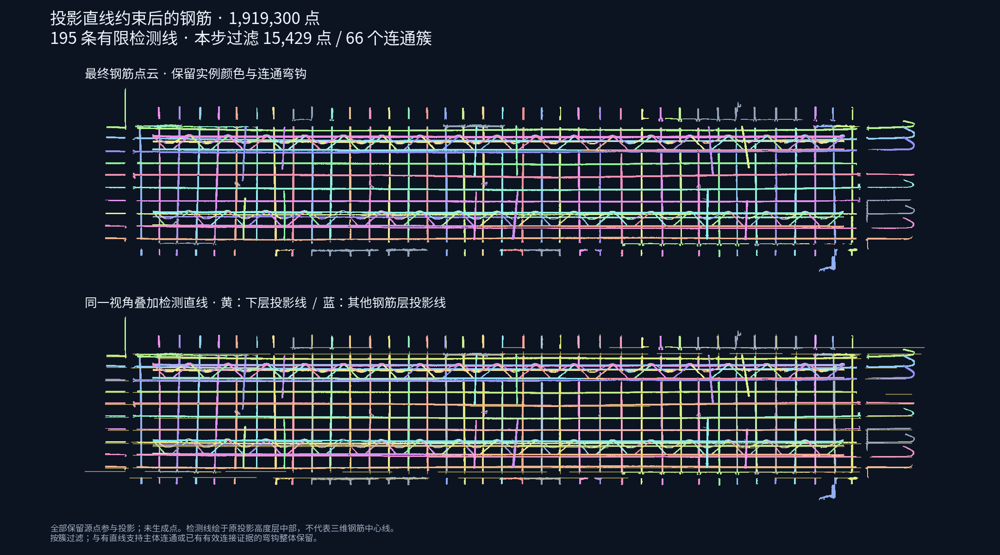

# 最后一步投影直线约束（已撤回）

> 2026-09-10：按用户反馈撤回本实验。当前生产算法与逐步调试均止于整簇接续；下文仅保留当时的试验记录。

在整簇钢筋接续之后增加 `07-projection-line-constraint`，用于过滤缺少原始投影线证据的悬浮簇。保留原有内部实例和外部簇边界；不会按直线逐点裁切弯钩。

## 证据与保留规则

原来的 02B 输出是分层投影细结构掩膜，没有保存显式 Hough 线段。本步复用其原始掩膜，检测有限长度的直线段，不从最终钢筋结果反推检测线。

- 采用原投影的像素尺寸、原点和高度层。支持点须同时满足线段范围、横向距离与高度带约束，避免只看 XY 投影而接纳悬空点。
- 三维连通簇至少有 20 个支持点，且支持比例不低于 2%，才直接保留。原有外部簇作为不可拆分单元参与连通分析。
- 已有外部接续簇可以复用第 06 步记录的连接位置：只有该位置附近同实例的内部点属于直接获得线证据的簇，才保留整个外部簇。不会仅因浮点与某钢筋实例 ID 相同就保留。
- 没有投影直线证据时保留上一步结果，不清空钢筋。

检测线在图中绘制于原高度层中部，用于解释二维投影证据，不代表恢复出的三维钢筋中心线。线段数也不是钢筋实例数。

## 本次实测

源资产：`95b6b41c5857d9eb3407b155/source.las`，9,216,369 点。运行：`20260909T162108-02b32b74`。基线：`20260909T155836-8c7844af`。

| 项目 | 结果 |
| --- | ---: |
| 检测线段 | 195 |
| 本步连通簇 | 358 |
| 本步过滤簇 | 66 |
| 本步过滤点 | 15,429 |
| 最终钢筋点 | 1,919,300 |
| 最终噪音点 | 80,218 |
| 台面点（不变） | 5,310,049 |
| 夹具点（不变） | 1,906,802 |
| 本步计算时间 | 3.36 秒 |
| 全流程时间 | 23.12 秒 |

图像用所有保留的源点生成，没有补造遮挡点。保留实例颜色，右端连通弯钩继续整簇保留。

## 调试页面与导出

调试服务默认运行到第 07 步（`throughStep=8`），载入此类结果后默认打开最终钢筋页。支持：

- 切换最终钢筋、约束前、本步过滤簇、全部四类；约束前视图将本步过滤点标红。
- 实例颜色 / 直线支持颜色，检测线开关及检测线高度层选择。
- 效果图缩略图与原图入口。
- 下载 `final-steel.las`、`final-noise.las`、`projection-line-constraint.json`。

新增 `final_class`、`final_instance`、`final_component`、`final_line_support` 属性，同时保留全部历史属性。历史运行缺少本步时仍可打开原有页面。调试服务保持现有的 `0.0.0.0:8766` 绑定和 `10.0.0.4` Host 白名单。

## 验证与限制

37 项相关算法测试和 3 项调试服务测试通过；前端 Node/Three 测试覆盖筛选、过滤点、检测线开关、高度层、图片入口、历史结果与异常数据，并核对本次实际 1,000,000 点预览。HTTP 校验确认最新运行、页面代码和 PNG 可访问；当前没有可连接的浏览器自动化会话，未进行真实浏览器点击验收。

全量校验通过：源文件 SHA-256 和原始 LAS 字段不变；基线 29 列 NPY 逐元素一致；新增属性在 NPY、全量 LAS、预览和各子集导出间一致；类别、实例和报告计数一致；全部原外部簇保持整簇归类。

这是保守的整簇约束：与有效钢筋粘连的杂点仍可能留下；真实钢筋若既没有投影支持也没有有效连接证据，仍可能被误删。当前结果没有人工真值标注，不能据此宣称已去除全部噪音。
