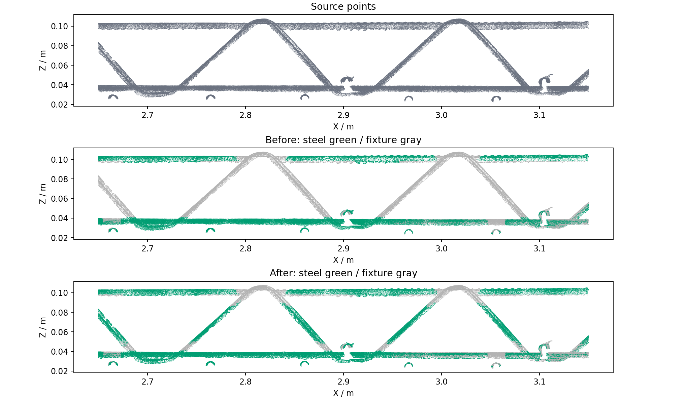

# 02B 多视角腹杆保留

02B 的原实现只使用全局 XY 投影和 Z 直方图峰值高度带。斜腹杆跨越层间区，俯视与夹具重叠后容易归为夹具；水平高度带又会把腹杆截成短段。新增 `projection-geometry-v3-multiview-webs`，保留原始 XY/Z 分类，再恢复有侧视和三维实测支持的腹杆点。

## 本次实现

- 增加 XZ、YZ、45°、135° 四个侧向投影。每个方向使用 60 mm 深度切片，步长 30 mm，避免切片边界截断和远处夹具叠影。本样本共处理 467 个有效切片。
- 侧向细长轮廓只作为候选。在全部非台面点的 3 mm 占用体素上独立建立小型 KD 树，检查未经切片的三维邻域。该树不读取 02A 的树、标签或几何特征。
- 使用 25 mm 与 15 mm 两档邻域，线性度至少 0.78，横向宽度不超过 14 mm，主方向竖向分量至少 0.15；支持点数和局部长度也必须达标。小邻域减少临近弦杆对腹杆拟合的干扰。宽板和竖直夹具面不能仅凭侧面薄轮廓恢复。
- 只允许原 02B 夹具点改为钢筋；保留源点、不补造坐标，也不改变原有台面、钢筋标签或高度层 ID。`source_web_recovered` 按源记录保存，合并到 `source_recovered` 供后续融合使用。
- 工作台新增四个侧向诊断图，灰色表示非台面原始点，绿色表示本轮恢复点。统计区显示视角数、切片数及恢复点数。历史结果缺少对应图时，按钮禁用。
- 原 XY 掩膜和 `layer_images` 继续表示 XY 阶段的原始证据；最终源点类别及分类俯视图包含新增恢复。共享流水线版本更新为 `shared-segmentation-v3-multiview-webs`。

## 全量验证

源资产 `95b6b41c5857d9eb3407b155/source.las`，9,216,369 点。

| 项目 | 结果 |
| --- | ---: |
| 基线运行 | `20260910T160635-8159e73b` |
| 新版运行 | `20260910T161801-c8f3516a` |
| 原 02B 钢筋点 | 1,640,493 |
| 新 02B 钢筋点 | 1,736,419 |
| 新恢复的原始点 | 95,926 |
| 原钢筋降为其他类别 | 0 |
| 台面标签变化 | 0 |
| 02B 分支耗时 | 1.329 → 11.427 s |

两次运行的源 SHA-256、XYZ、法向量、有效标记、02A 类别及恢复标记、02B 高度层 ID 一致。逐块核对源 LAS 全部原始维度与导出 LAS 一致；LAS、NPY、预览分类按源记录对应一致。新版运行包含当前工作台的后续设计整理步骤，因此总流程耗时不与基线直接比较。

局部图使用 X=2.65–3.15 m、Y=−1.60–−1.49 m、Z=0.02–0.12 m 内全部源点，不抽样：



恢复点数不等于人工真值召回率。细长斜向非钢筋物体仍可能成为候选，部分弯折顶部、交点和贴近夹具的腹杆仍会保守地归为夹具；没有声称所有腹杆均已完整恢复。

## 检查与复现

59 项相关 Python 测试通过，覆盖新增四种杆件朝向、投影遮叠、宽斜板与竖墙排除、单/多线程和源记录乱序一致性，以及融合、区域分类、后续内部钢筋处理和 LAS 往返。工作台 6 项 Python 测试、语义筛选与去噪视图 Node 检查通过。新增 PNG 已通过 HTTP 读取及图像解码检查。当前会话无可用浏览器，未进行交互点击验证。

使用项目环境执行验证：

```bash
.cloudbim/mesh-venv/bin/python scripts/pointcloud-projection-web-check.py \
  backend/data/assets/95b6b41c5857d9eb3407b155/pointcloud-steps/20260910T160635-8159e73b \
  backend/data/assets/95b6b41c5857d9eb3407b155/pointcloud-steps/20260910T161801-c8f3516a \
  docs/research/assets/projection-webs-2026-09-11 \
  --roi 2.65 3.15 -1.60 -1.49 .02 .12
```

详细机器核对结果见 [validation.json](assets/projection-webs-2026-09-11/validation.json)。本地集成服务已通过 `scripts/cloudbim-dev.sh stop/start` 更新，并保持运行。工作台地址为 [http://127.0.0.1:8766](http://127.0.0.1:8766)。
