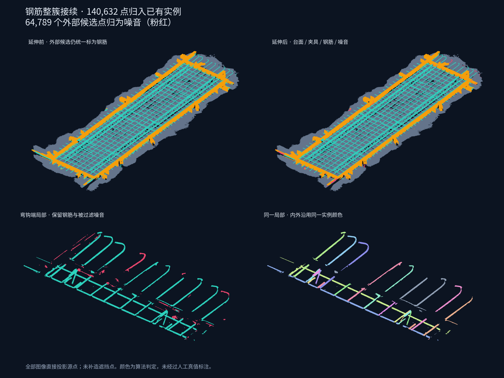

# 外部钢筋按原始连通簇整体归并

针对上一版弯钩末端被直线圆柱逐点裁掉的问题，将归并单位改为延伸前的外部连通簇。轴向圆柱只判断簇的连接位置，不再决定簇内哪些点可以留下。

调试入口仍为 8766，选择 **06 钢筋整簇归并与噪音过滤**。版本 `rebar-cluster-extension-v2`，最新运行 `20260909T154559-d4661358`。

## 规则

前置分割没有持久化外部簇编号，因此在本步骤最开始，仅对原 `refined_class=3 AND refined_zone!=1` 的点按几何连通关系建立簇：2 mm 体素汇总、4.5 mm 邻接半径，然后固定全部源点的簇号。此过程不使用内部轴线、圆柱残差或法向量筛选。

内部实例的端部轴向搜索继续提供连接证据；每个簇自己的连接点必须在至少三个 10 mm 轴向箱中提供支持，每箱至少三个点。匹配成功后，整个簇的全部点统一归入同一内部实例，包括弯钩、偏离圆柱表面的点和法向量较弱的点。每个簇只有一个语义类别和一个实例编号，不剥离其中的一部分。

- 唯一归属：整簇归并。
- 没有匹配：整簇标记噪音。
- 多个内部实例竞争同一簇：按每个实例最强的连接证据比较；第二候选支持量达到第一候选的 35% 时，整个簇保留为钢筋、实例待定，不切簇，也不擅自合并内部实例。

同一实例的多个局部拟合段不构成实例冲突。台面、夹具以及内部点和内部实例维持原结果。缺少种子或有效双框时仍保守停用过滤。

## 当前源文件结果

| 项目 | 数量 |
| --- | ---: |
| 外部源点 / 冻结连通簇 | 258,827 / 384 |
| 整簇匹配 | 87 簇，140,632 点 |
| 多实例冲突，整簇保留待定 | 10 簇，53,406 点 |
| 整簇未匹配，归为噪音 | 287 簇，64,789 点 |
| 通过整簇关联带回、未作为获胜轴向连接证据的点 | 39,572 |
| 内部原有实例待定点 | 9,417 |
| 最终钢筋 / 噪音 | 1,934,729 / 64,789 点 |
| 新步骤耗时 | 0.369 s |

已有 240 个内部实例及原内部属性不变。最终钢筋实例待定共 62,823 点，其中新增的 53,406 点是完整保留的归属冲突簇。

与上一版逐点延伸 `20260909T152415-8180c10f` 比较，63,855 个曾标为噪音的点恢复为钢筋；另有 8,043 个曾逐点接受的点，因其所在簇自身缺少充分的轴向连接支持，随整簇归为噪音。净增加钢筋 55,812 点。这些是算法统计，不代表人工标注准确率。



## 属性及显示

新增 `complete_cluster`，记录归并前已固定的外部簇编号；内部或停用处理时为 0。属性同时写入 LAS、NPY 和预览。JSON 新增簇列表、簇状态、候选实例、连接证据点数和最终归属，可核对整簇处理。

页面增加“延伸前外部簇”着色，以及匹配簇、待定簇、随簇保留点统计。选择已有实例即可查看连同弯钩在内的归并点云；灰色外部钢筋是完整保留的归属冲突簇。

`complete_segment` 对外部点表示簇关联的内部连接段，不保证每个弯钩点拟合该圆柱；`complete_confidence` 是簇的连接分数，不是弯钩逐点圆柱拟合分数。当前轴线和长度仅表达内部跨度与直线连接证据，没有拟合弯钩中心线，也不计弯钩弧长。

## 验证与复现

- 45 个相关 Python 测试通过，其中 9 个延伸测试覆盖弯钩整簇保留、弱法向量保留、未匹配整簇过滤、多实例冲突整簇待定，以及原有轴向、间隔和静态类别约束。
- Node 测试覆盖簇着色、旧结果缺省兼容、非法簇号拒绝，以及原有筛选、实例选择和轴线生成。最新实际运行的全部 100 万预览点通过加载和属性关系检查。
- 全量验证检查每个簇只有一个类别和一个实例编号，簇点数与 JSON 一致；LAS、NPY、预览、钢筋/噪音子集的簇号和归属一致。
- 与内部基线 `20260909T123517-778039f3` 比较，此前 24 个 NPY 列完全相同；源 LAS 哈希、所有原始字段和源点号一致。
- 现有 8766 隔离调试器重启并从源文件重算后加载本次结果。没有启动主应用栈；沿用隔离进程是因为任务针对已有的点云调试流程。CUA 当前没有可用浏览器，画面检查使用源点投影图，未声称完成实际浏览器点击验收。

```bash
.cloudbim/mesh-venv/bin/python scripts/pointcloud-rebar-extension-check.py \
  backend/data/assets/95b6b41c5857d9eb3407b155/pointcloud-steps/20260909T154559-d4661358 \
  --baseline backend/data/assets/95b6b41c5857d9eb3407b155/pointcloud-steps/20260909T123517-778039f3 \
  --figure docs/research/assets/rebar-cluster-extension-2026-09-09.png
node scripts/test_pointcloud_rebar_extension_viewer.mjs \
  backend/data/assets/95b6b41c5857d9eb3407b155/pointcloud-steps/20260909T154559-d4661358
```

簇的连通性仍受扫描断点和邻接尺度影响。若原外部候选簇已经粘连或混有噪音，整簇保留也会保留这些部分；本次不在归并时再次剥离。后续可独立改进前置聚类或实例冲突解析。
