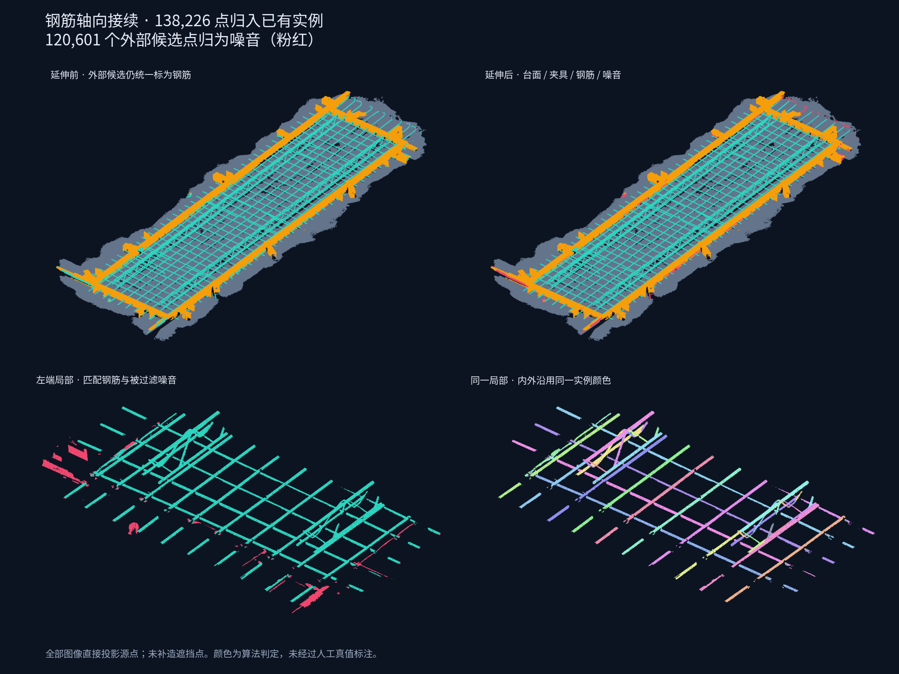

# 内部钢筋实例向外轴向延伸

> 本文记录 v1 历史结果。当前已改为[外部连通簇整体归并](pointcloud-rebar-cluster-extension-2026-09-09.md)，修复逐点裁掉弯钩的问题。

调试入口：<http://127.0.0.1:8766/>，新增 **06 整根钢筋延伸与噪音过滤**；重算选择第 7 步。算法版本 `rebar-axial-extension-v1`，运行 `20260909T152415-8180c10f`。

以 Step 05 内部钢筋实例为种子，选择每根实例两端的局部圆柱轴线，向外寻找已有外部钢筋候选。每个点检查半径表面残差、法向量兼容性和沿轴向的连续支持；竞争结果沿用内部实例和拟合段编号。没有增加点、修改坐标或重新划分内部实例。

默认单端搜索不超过 0.5 m，表面残差不超过 3.5 mm。沿轴向以 10 mm 分箱，每个有效箱至少 3 个支持点，至少 3 个有效箱才能接受延伸。普通空隙容许值为 25 mm（受分箱离散化影响）；检测到的夹具边带可跨越不超过 150 mm 的遮挡，边带以外仍受普通空隙限制。圆柱半径和方向取自对应内部末端，不向外无约束重拟合。多个实例竞争同一个源点时，取表面误差与法向量残差最低者，固定遍历顺序打破平局。

台面和夹具保持原类别。只有外部钢筋候选参与过滤，未匹配者在新属性中标为噪音；若没有内部种子或没有测得双框，则保守保留候选，不整批判为噪音。内部钢筋中实例待定的点仍属于钢筋。

| 当前全量结果 | 点数 |
| --- | ---: |
| 台面 | 5,310,049 |
| 夹具 | 1,906,802 |
| 钢筋 | 1,878,917 |
| 噪音 | 120,601 |
| 合计 | 9,216,369 |

原有 240 个实例保持不变；53 个实例在 97 个端部接续成功，共接入 138,226 个外部点。258,827 个外部候选中，其余 120,601 点归为噪音。内部仍有 9,417 点尚未确定实例。新增步骤耗时 0.222 s，包含保存和导出的全流程 21.545 s，k=32、16 工作线程。以上是单次算法输出与墙钟统计，未经过人工真值标注。



## 查看与导出

新增页面支持四类筛选、仅接续外露点、实例待定点、单实例选择、实例着色、语义着色以及延伸轴线。轴线可能穿过夹具遮挡区，不代表这些位置存在扫描点。Step 05 与历史结果继续独立显示。

新增完整源点属性：`complete_class`（1 台面、2 夹具、3 钢筋、4 噪音）、`complete_instance`、`complete_segment` 和 `complete_confidence`。后三者沿用内部编号体系，0 表示未分配或非钢筋；分数是几何拟合质量而非概率。

属性均持久化到完整 LAS、NPY 和抽样预览。新增 `complete-steel.las`、`noise-only.las` 与 `complete-instances.json`；原 `steel-only.las` 仍是 Step 04 的钢筋子集。完整实例 JSON 记录内部长度、延伸长度、更新后的拟合段端点及源点数量。

## 验证

- 48 个相关 Python 测试通过，包含新增 6 个延伸测试：跨夹具接续、同轴远端噪音、偏轴噪音、平行实例、法向量符号、多线程一致性、无种子/无双框降级与保护原类别。
- Node 测试使用实际预览函数和 Three.js 几何，验证加载、四类筛选、仅延伸点、待定点、单实例选择、轴线生成、旧结果缺省与损坏属性拒绝。JavaScript 语法与 diff 空白检查通过。
- 对比同源基线 `20260909T123517-778039f3`：此前全部 24 个 NPY 列逐点相同，包括内部实例；源 LAS SHA-256 及所有原始字段不变。
- 全量 LAS/NPY/预览/钢筋子集/噪音子集的点号和新属性一致，实例和段的归属、数量与 JSON 一致。
- 原 8766 隔离调试器已重启并载入本次结果，HTTP 状态为 complete。本任务针对已有独立点云调试流程，因此继续使用该隔离进程，没有启动主应用栈。当前 CUA 没有可用浏览器，未完成实际浏览器点击和 WebGL 画面验收；本文效果图直接由源点投影生成。

复查并重绘：

```bash
.cloudbim/mesh-venv/bin/python scripts/pointcloud-rebar-extension-check.py \
  backend/data/assets/95b6b41c5857d9eb3407b155/pointcloud-steps/20260909T152415-8180c10f \
  --baseline backend/data/assets/95b6b41c5857d9eb3407b155/pointcloud-steps/20260909T123517-778039f3 \
  --figure docs/research/assets/rebar-axial-extension-2026-09-09.png
node scripts/test_pointcloud_rebar_extension_viewer.mjs
```

## 当前边界

这是一版受内部实例约束的直线延伸。内部种子漏检或轴向偏摆会影响外部召回，明显弯钩、变形、长缺失区和超过搜索上限的端部可能被过滤。它没有恢复此前已判为台面或夹具的点，也没有补造遮挡处点云。“整根”指内外使用统一实例编号和延伸轴线，不保证每根钢筋已完整重建。内部实例优化仍是后续独立工作。
