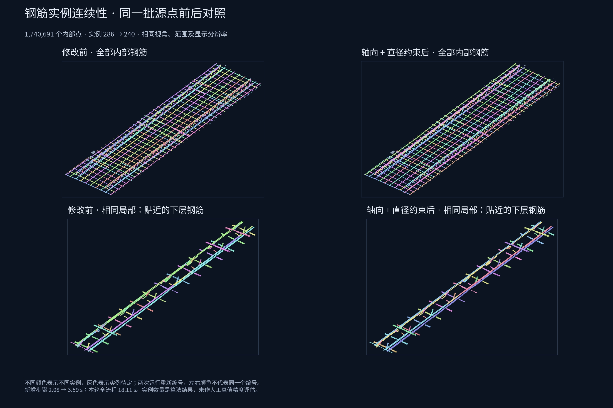

# 内部钢筋：轴向、直径与实例连续性

本轮在 Step 05 中增加局部轴向与直径联合拟合、相邻截面连续性检查、长度异常碎段检查和末端生长。仍只处理 `refined_class=3 AND refined_zone=1`；腹杆的一根实例仍是一段斜向直杆。调试入口为 `http://127.0.0.1:8766/`。

## 同一源文件重算结果

源文件包含 9,216,369 点，其中严格内框钢筋范围 1,740,691 点。对照运行 `20260908T173640-a81a78fe`，新运行 `20260908T183856-68268efb`；两次均从源 LAS 开始，k=32，16 工作线程。新版本为 `internal-rebar-tracks-v3`。

| 指标 | v2 | v3 |
| --- | ---: | ---: |
| 总实例数 | 286 | 240 |
| 水平实例数 | 137 | 93 |
| 小于 0.2 m 的水平实例数 | 59 | 20 |
| 下层 / 上层 / 腹杆实例 | 135 / 2 / 149 | 91 / 2 / 147 |
| 实例待定点 | 10,456 | 9,417 |
| 实例覆盖率 | 99.3993% | 99.4590% |
| Step 05 耗时 | 2.08 s | 3.59 s |
| 完整流程耗时 | 16.74 s | 18.11 s |

小实例数量下降约 66%，总实例数下降约 16%。这些是算法输出统计，不是人工标注准确率；不能把所有数量减少都解释为正确归并。v3 长度按整根轴向覆盖跨距统计，避免重复累加重叠拟合段；v2 使用拟合段长度之和，因此长度指标也包含计量方式修正。



## 原因与修改

1. 原来的细长种子、残余补建和局部圆柱独立工作，缺少统一的整根连续性判断。现在先把局部模型建立为小规模图，在重叠位置比较轴线，同时用附近截面中心缓解带肋表面造成的局部轴向偏摆。重叠区出现明显分开的轴线时禁止跨轨合并。
2. 邻近钢筋的混合表面可能产生异常大或异常小的圆柱。现在从质量与长度加权的直径分布提取有限候选值，排除拟合边界值对候选的污染，再固定候选直径联合优化局部中心和轴向。同一层允许多个有足够支持的直径，不能把层号当作直径型号。
3. 源点竞争增加法向量与径向的一致性，以及局部细长方向与模型轴向的一致性。方向来自已有特征缓存；只有局部线性较强时才增加轴向约束，法向量和轴向翻转不改变判断。
4. 长度众数用于提议可疑碎段。只有其至少 80% 拟合种子能由更长的同向圆柱表面解释，才删除重复碎段模型并让源点重新竞争。本轮消除了 2 个这样的轨迹。真实短筋有独立表面支持，会继续保留。
5. 沿每根水平钢筋两端的局部轴向查询直径走廊，只有连续点云支持才延伸，连续空白会终止生长。最大延伸限制为 15–30 mm。本轮 105 个端部延伸超过 1 mm，总延伸约 1.13 m；未制造新点。

## 直径和长度依据

关联 IFC 为 `YB-1.ifc`，上传标识 `419278dd32c37508da3af8bd`。关联要求源 LAS 和 IFC 的 SHA-256 都匹配，避免把别的项目尺寸套进当前点云。读取实际圆截面几何，不依赖 IFC 产品类别名称（这些钢筋几何被保存为 `IfcPlate`）。

IFC 解析出 50 个直圆杆几何，直径均为 8 mm，长度为 280 mm × 12、1150 mm × 38。该文件的这些几何没有覆盖全部上层、纵向和腹杆，因此不能强制所有钢筋使用 8 mm。

本轮点云直径众数为下层约 7.89 mm、上层约 10.23 mm、腹杆约 5.93 mm；约束后分别为 8 / 10 / 6 mm。下层使用兼容的 IFC 值，其余使用点云众数。其他数据若同层出现多个可信直径峰，会保留多个候选。

目前界面提供纵向、横向整长、短筋、腹杆直段四个族，代表**内框内可见跨距**约 3.73 / 0.90 / 0.38 / 0.108 m。IFC 设计长度另列显示。内框截断、分支几何和模型关联范围都会造成二者不等；本轮未把点云长度直接拉齐到 IFC 长度。

## 效率与缓存

Step 05 的层检测 0.017 s、水平拟合 0.707 s、腹杆拟合 0.135 s、直径细化 1.012 s、残余补建 0.500 s、轨迹整理 0.223 s、全量源点归属 0.669 s。该步骤外还包含 IFC 先验加载等开销，所以这些子项之和略小于 3.59 s。

拟合按局部模型并行，源点归属按块并行和向量化；固定半径优化使用解析雅可比，避免逐参数差分。模型对比只发生在约七百个局部模型之间，不对百万源点做两两计算。复用残余 KD 树、源法向量与局部轴向；端部支持树和圆柱候选树保存在上下文中供后续使用。IFC 解析和文件摘要按路径、大小、修改时间缓存，新的调试运行仍从源 LAS 重算法向量和所有点云步骤。

新运行全流程 CPU 累计 135.99 s、进程峰值 RSS 2610 MB；累计 CPU 时间不可与墙钟耗时相加。加入约束后本机全流程墙钟增加约 8%，单次测量不构成跨机器性能保证。

## 验证与剩余问题

- 84 个相关测试通过，覆盖近邻平行杆、轻微弯曲、虚假桥接、弱种子中段、真实短筋、同层混合直径、交点轴向竞争、末端空隙终止、法向量翻转、多线程、无残余支持及 IFC 单位/形状解析。
- 源 LAS SHA-256 和所有原始字段保持一致；此前步骤的源坐标、法向量、几何/投影/融合/双框标签保持一致。
- 全量 LAS、NPY、预览二进制和内部钢筋子集的点号及四个实例属性逐项一致；JSON 点数、段归属及实例归属一致。全部 147 个腹杆实例均只有一个直段。
- 浏览器验证了新族筛选、实例选择冲突处理、轴线显示、直径与长度信息，以及 v2 历史结果兼容。最新结果保留在调试页面。

仍有 9,417 个内部点未确定单根归属，部分局部串扰和长度异常仍存在。它们保留为钢筋点，没有删除或凭空强派实例。长度族来自当前主方向和可见跨距，并不是钢筋生产编号或设计构件匹配。

验证由两个 worker（IFC 先验、调试界面）和一个 verifier 协助，均使用 `gpt-5.6-sol / high`。verifier 发现的同层少数直径丢失、轨迹统计滞后已修复并复查；三个子智能体均已关闭。

重现效果图：

```bash
.cloudbim/mesh-venv/bin/python scripts/pointcloud-rebar-tracks-figure.py \
  backend/data/assets/95b6b41c5857d9eb3407b155/pointcloud-steps/20260908T173640-a81a78fe \
  backend/data/assets/95b6b41c5857d9eb3407b155/pointcloud-steps/20260908T183856-68268efb \
  docs/research/assets/rebar-tracks-comparison-2026-09-09.png
```
