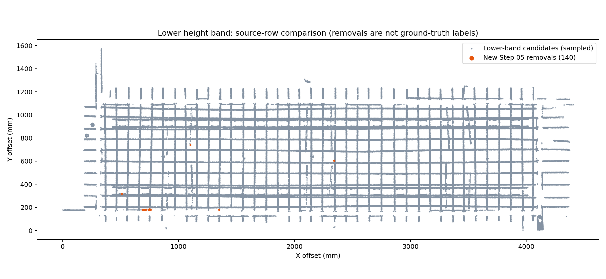

# 02A/02B 保留退化与下层带内去噪修正

用户反馈：02B 的上下层钢筋、02A 的近邻钢筋和末端保留变差；下层高度带内杂点漏删，弯钩出现局部被删。本文记录对上一轮评分改动的纠正。

## 已确认的原因

上一轮把 A 的 52,975 个保留点和 B 的 370,789 个保留点改成类别 0“待定候选”。这改变了分支输出和可视化；虽然当时融合分类集合没变，但分支的保留语义已经退化。

同时，B 的上下层高度保留没有计入 B 路评分证据。部分同时受到 A 几何规则和 B 高度规则支持的钢筋只有 0.65 分，未进入高分保护。第 05 步另有相反的问题：整个下层高度带直接判为有支撑，带内点绕过空间审查，分数无法影响这个决策。

第 05 步原有的“几何拟合分数”和第 03 步“融合支持分数”是不同字段。颜色接近或拟合分数高，并不意味着实际达到了融合保护阈值。因此必须比较同一源点的数值和最终类别。

## 分类与评分修正

- 恢复 A 原有几何、圆柱、近邻、端部和腹杆恢复输出，以及 B 投影、多视角和上下层高度保留输出。
- 保留分类与评分证据分开；B 的形态或有效上下层高度保留均算 B 路支持。
- 共享 XY 区域只计共享候选证据，不能因 A/B 都使用同一区域而重复投票。
- 两路支持为 1.0，单路支持为 0.65，轴线恢复为 0.5，仅共享候选为 0.25。分数是规则支持值，不是概率。
- 高分阈值保持 0.9；后续去噪不重写融合分数。

以退化前 `20260911T061129-e1d0d51e` 为保留基线，9,216,369 个源记录的逐点比较结果如下：

| 输出 | 钢筋点数 | 相对保留基线的变化行数 |
| --- | ---: | ---: |
| 02A | 1,911,428 | 0 |
| 02B | 2,022,895 | 0 |
| 03 融合 | 2,009,509 | 0 |

高分点从 1,520,479 增至 1,797,560。上一轮第 06 步的 3,183 个噪音点，由于 B 高度证据恢复计分，现在达到高分阈值。

## 去噪与可追溯性

带分数运行不再豁免整个下层高度带。非高分点需要实际有限钢筋表面或邻近高分观测支撑。高分观测集合冻结，保留的低分点不会再作为新锚点向杂点传播。缺少模型时保守处理，避免按缺失证据删除整层。

第 06 步的未归属外部点也检查所有非高分候选；0.65 分的远离结构孤点不再自动存活。检查可以使用子集以外的高分实测点，避免传入少量候选时失去弯钩、末端的邻近支撑。

第 05、06 步增加“03 融合支持分数”着色，使用与第 03 步相同的分数；噪音显示删除前的分数。单点检查同时列出 03→05→06 的类别和保护状态。分数着色的绿色仅用于达到保护阈值的点。

## 验证与提交

分类恢复检查点：`22b48b8`。该提交保存此前未提交的共享算法及生产接入，并恢复分支保留。提交前 180 项 Python 测试通过。

新增混合分数弯钩测试：贴近夹具、同一根杆上的分数为 1.0 / 0.65 / 0.25，验证整根保留为同一实例且原分数不变。

最终运行：`20260911T071010-9c7637a2`，全流程 36.00 秒。原始 LAS 的 15 个字段、全部源记录索引、恢复掩码、NPY/LAS/预览属性，以及去噪后的实例点数与引用均通过校验。1,797,560 个高分点在 05/06 中被标为噪音的数量均为 0。

第 05 步在原生下层高度带内新增删除 140 点；计入上下各 3 mm 检查余量时为 164 点。整个 05/06 流程在原生下层带内新增删除 974 点。第 05 步总噪音从 8,656 降至 5,242，因为邻近实测高分表面的保护同时恢复了 3,616 个此前删除的点；不能用总删除数变大作为优化标准。

第 06 步最终噪音为 114,891 点，相对上一轮新增删除 2,357 点、恢复 7,848 点。其中 3,183 个恢复点来自 B 高度证据恢复后进入高分保护的集合。没有新增源点，也没有修改分数来制造保护。

修正后相关去噪、实例及生产适配的 77 项 Python 测试通过；工作台 10 项测试和 Tiles 属性 4 项测试通过；6 个 Node 工作台检查通过。旧、新运行的真实 HTTP 预览各完成 300,000 点加载及全部渲染前校验。未使用浏览器进行人工视觉验收。

删除数量用于追踪规则变化，不能当作有人工标注的去噪准确率。距高分实测点 8 mm 内的候选仍保守保留；这能避免切断弯钩、端部，但不代表所有贴近钢筋的杂点已经清除。

复现工具：[逐点保留与去噪对比](../../scripts/pointcloud-retention-regression-check.py)、[全量源属性与保护校验](../../scripts/pointcloud-shared-scene-check.py)。本轮数据：[逐点比较](assets/pointcloud-retention-and-lower-band-2026-09-11/comparison.json)、[完整校验](assets/pointcloud-retention-and-lower-band-2026-09-11/validation.json)。

