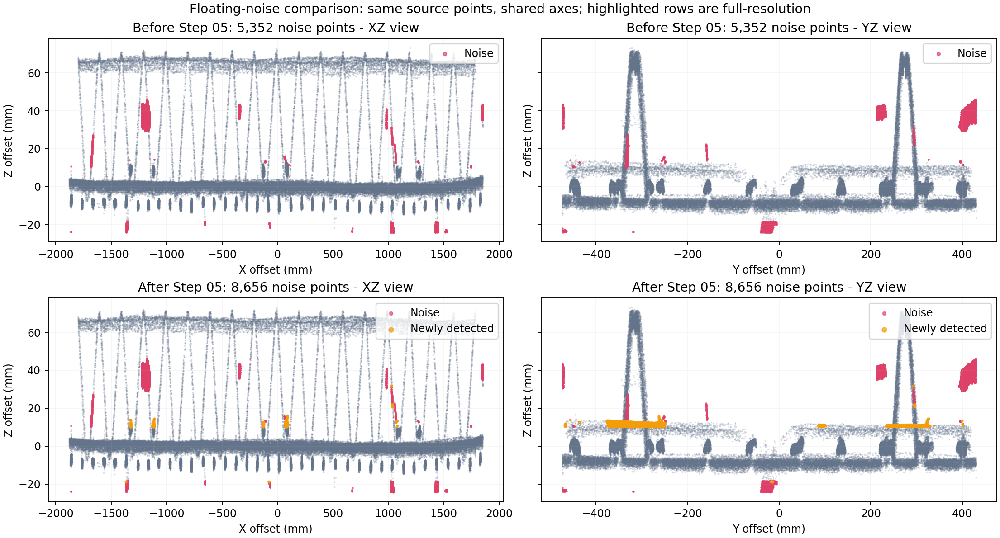

# 融合支持分与空间去噪调整

本次运行：`20260911T063516-740da715`。对照运行：`20260911T061129-e1d0d51e`。同一源 LAS，共 9,216,369 点，32 邻点、16 线程，设计辅助模式为 topology。

## 调整原因

旧第四步执行同体素多数投票及同表面邻域投票，共改动 2,201 点；没有新增悬浮噪音的空间判据。本次新流程取消该独立步骤，融合后直接进入第五步。已有分区继续复用；`refined_*` 为兼容产物字段，类别与融合结果一致，变化标记为零。历史运行仍可查看第四步。

旧运行中 1,871,082 个点在 A/B 界面都显示为钢筋，但只有 1,520,479 个点具有两路独立实测证据。其余 350,603 个点至少一路来自区域或高度保留规则，显示与评分含义不一致。现在 02A/02B 的类别 3 只表示独立实测钢筋；仅区域或高度保留的点显示为类别 0“待定候选”，在融合中保留并计低分。本次融合类别逐点与对照完全一致，候选没有因为显示调整而消失。

## 去噪规则

| 融合分数 | 处理方式 |
| --- | --- |
| 1.00，两路实测钢筋 | 硬保护，后续噪音判定不能删除 |
| 0.65，单路实测 | 检查结构支撑；有限圆柱表面外余量 12 mm |
| ≤ 0.50，区域／高度／轴线候选 | 优先审查；有限圆柱表面外余量收紧到 6 mm |

分数为规则支持值，不是概率。低分不能单独构成删除理由：贴近实测钢筋的低分点、短弯钩及部分可见圆弧仍可保留。

第五步不再豁免已经分配实例的低分点。点必须位于下层观测高度带内，或接近有实测点支持的上层／腹杆有限圆柱，否则进入噪音。下层高度带仍有 3 mm 余量；每段圆柱使用自身半径和有限端点，避免全局最大半径扩大保护范围。缺少某一类模型时仍检查现有证据；全部空间证据缺失时保留待定。仅先验点拟合出的模型不能为自身提供可靠支撑。

第六步的夹具残留检查对低分点使用更严格的证据门槛，并单独检查尚未归属的低分外露点是否接近幸存的实测钢筋。设计线本身不构成物理支撑。现用设计辅助流程及兼容延伸流程均保留高分保护。

已分配点被去噪后，重新计算实例和分段点数，同步清理空实例／空段和引用；段编号可保留空缺。源点坐标及其原始属性不修改。

## 全量结果

| 指标 | 对照 | 本次 |
| --- | ---: | ---: |
| 第五步噪音点 | 5,352 | 8,656 |
| 第六步累计噪音点 | 109,897 | 120,382 |
| 双路实测高分点 | 1,520,479 | 1,520,479 |
| 高分点被后续去噪删除 | 0 | 0 |
| 全流程含导出耗时 | 32.39 秒 | 33.33 秒 |

第五步新增 3,304 个噪音点，其中 3,290 个之前已有实例归属。第六步相对对照新增判噪音 11,538 点，同时有 1,053 个原噪音点被新流程保留；这是第四步取消与去噪规则共同作用的结果，不能把全部变化归因于单一门槛。

原始坐标、法向量、共享台面掩码、钢筋分区及融合类别均与对照逐点相同。A/B 的待定候选分别为 52,975 和 370,789 点；两路最终类别均为 3 的点集，与得分 1.00 的点集严格一致。



灰色为相同源点的内部点云抽样，红色为当轮全部噪音，橙色为新增判定的噪音。图中距离均相对同一原生坐标原点。该图及上述数量反映规则变化，不能代替人工标注准确率；下层高度带边缘、局部弯曲和交点仍需三维复核。

## 验证记录

- 46 项分类／融合测试、72 项内部钢筋／浮点去噪／设计辅助／生产适配／兼容延伸测试、36 项 API 与 BIM 测试通过，共 154 项。
- 5 个 Node 界面测试通过。旧、新 HTTP 运行均通过生产 `viewer.js` 的实际下载和全部渲染前校验，实际渲染预览上限为当前界面设置的 300,000 点；本次未完成真实浏览器交互验收。
- 全量校验覆盖源 LAS 哈希、15 个原始字段、源点顺序、恢复标记类别约束、分区复用、双路高分集合、各去噪出口、实例点数与引用、NPY／LAS／预览和子集导出。
- 使用开发管理器更新服务，前端、API、mesh、数据库及工作台均健康。
- 两位 `gpt-5.6-sol / high` 子智能体分别完成空间去噪及界面迁移；主智能体负责独立候选语义、融合、流程衔接、实例统计及全量验证。
- 一位 `gpt-5.6-sol / high` 独立复核类别迁移与产物完整性，80 项针对性测试通过（与上述测试重叠，不累加）；另对全量源属性、候选去向、高分集合、恢复掩码、实例点数和空缺编号引用逐点复核，未发现阻断问题。

产物：[完整校验](assets/pointcloud-score-priority-2026-09-11/validation.json)、[前后对比数据](assets/pointcloud-score-priority-2026-09-11/comparison.json)。

```bash
.cloudbim/mesh-venv/bin/python scripts/pointcloud-shared-scene-check.py \
  backend/data/assets/95b6b41c5857d9eb3407b155/pointcloud-steps/20260911T063516-740da715
node scripts/test_pointcloud_manifest_loading.mjs \
  http://127.0.0.1:8766/runs/20260911T063516-740da715/manifest.json
```
