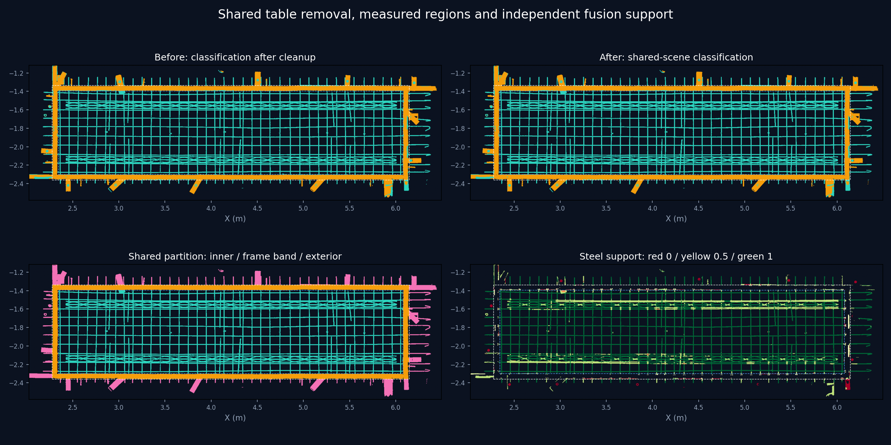

# 共享台面移除、钢筋分区与融合评分

后续调整见[融合支持分与空间去噪调整](pointcloud-score-priority-2026-09-11.md)：新流程取消独立第四步，明确 A/B 待定候选，并加强低分空间去噪。本页保留首次重构及恢复标记修复的历史验证记录。

2026-09-11。最终全量运行：`20260911T055629-188e0c10`，原始点数 9,216,369。

## 流程与计算复用

界面现在依次提供：01 法向量 → 01B 台面移除 → 01C 钢筋分区 → 02A/02B 并行分类 → 03 评分融合 → 04 边带与类别整理 → 05 内部钢筋分层与悬浮去噪 → 06 设计辅助整理。

`throughStep` 的原有 1–7 数值含义保留，01B/01C 在运行分类前自动完成，并可单独查看。历史结果缺少新字段时，相应入口和评分功能不可用，不伪造分区或分数。

- 台面拟合、源点移除掩码、XY 栅格和高度统计提到共享前处理。两条路线共用同一份结果；主流程不再分别拟合台面。
- 参考投影路线的宽构件方法，从去台面后的俯视图检测四条围框横梁。采用 30 mm 宽构件筛选，减少紧邻钢筋对横梁宽度的干扰；横梁内外缘确定双框。
- 严格内框中的非台面点归钢筋。A 路线跳过这些区域的夹具面搜索；B 路线跳过对应三维夹具面和二维夹具范围搜索。跨边界体素、像素保留外侧判断空间，最后逐源点应用准确分区。
- 共享前处理数组只读。两路各自生成分类和实测钢筋证据，互不读取对方标签。B 的层名、统计等可变元数据单独复制。
- 融合、类别整理复用已定位的分区，不再次检测围框。第四步保留同表面类别整理，同时保护高分钢筋。
- 钢筋形状、多尺度邻域和三维轴线证据仍然计算：这些用于不同分类和实例判断，不能仅因位于钢筋区就省略，否则无法得到有效的独立评分。

本次还修正了横梁直方图边缘的闭运算问题：峰值被边界侵蚀后，背景连通域曾可能被当成横梁宽度。补齐边界后再做闭运算，并拒绝背景标签。

“移除台面”指排除后续处理和默认结果显示中的台面点；完整产物仍保存全部原始记录和属性。

## 评分与后续保护

新增 `fused_steel_score`（float32）及 `fused_steel_evidence`（uint8）。评分是规则支持值，不是校准概率。

| 钢筋证据 | 分数 |
| --- | ---: |
| 两路都有实测钢筋证据 | 1.00 |
| 一路有实测钢筋证据 | 0.65 |
| 仅融合轴线恢复 | 0.50 |
| 仅内框区域归属 | 0.25 |
| 无上述支持／非钢筋 | 0.00 |

证据位 1、2、4、8 分别表示 A 实测、B 实测、融合轴线恢复、区域归属。A/B 的实测证据在区域强制归属之前保存；B 的高度范围保留规则也不会制造实测支持。仅因两路都接受同一个空间先验，不会获得双路高分。

分数达到 0.9 的已分类钢筋受到保护：第四步不能将其改为夹具；第五步悬浮去噪、第六步各噪音判定出口不能将其改为噪音。保护不自动生成实例，也不将其它类别改成钢筋。生产适配器的类别置信度结合融合支持，实例置信度仍保留几何拟合含义。

框内非台面归钢筋仍是当前场景先验；未来若框内存在真实夹具或杂物，需要调整这个前提。没有可靠双框时不启用内框归属。双路评分不能替代人工准确率评估。

## 全量验证

[验证 JSON](assets/pointcloud-shared-scene-2026-09-11/validation.json) 记录了以下结果：

- 原始 LAS 的 15 个字段、源点顺序及 SHA-256 保持一致。
- 新台面掩码、分区、评分和证据在 NPY、LAS、预览、子集导出中一致。
- 台面拟合、XY 栅格构建、围框检测各执行一次；分类分支的台面拟合次数均为 0。
- 1,520,479 个高分点在第四、第五、第六步均保持钢筋，无高分点进入噪音或夹具导出。
- 第四步保护了 4 个原拟改为夹具的点；第五步阻止 63 个高分候选进入噪音。
- 本次最终台面 5,315,996 点，第四步钢筋 2,009,168 点，第六步钢筋 1,899,271 点。这是分类数量，不是人工标注准确率。

在同一台机器、16 线程下，改动前计算到第五步约 32.64 秒；最终实现对应计算约 20.95 秒，减少约 36%。新流程包含第六步和文件输出共 32.47 秒。两种口径不要混用。

| 阶段 | 改动前（秒） | 最终实现（秒） |
| --- | ---: | ---: |
| 原始 KD 树 | 1.81 | 1.81 |
| 法向量 | 5.20 | 5.32 |
| 共享台面与分区 | — | 1.05 |
| A 分支 | 5.86 | 6.02 |
| B 分支 | 20.77 | 8.26 |
| 两分支墙钟 | 20.77 | 8.26 |
| 融合 | 0.77 | 0.76 |
| 融合后的区域映射 | 0.22 | 0.03 |
| 类别整理 | 0.21 | 0.16 |
| 第五步 | 3.66 | 3.54 |

提速还包括线程分配从 14/2 改成 8/8，以及 B 路线邻域分析按独立批次并行，不能把全部收益归因于共享台面。两分支时间重叠，不应相加；这是单次全量对照，未清除操作系统文件缓存。



图中采用相同坐标范围，按全量非台面源点投影。右下显示评分；图像不能替代三维接触处的人工复核。

## 检查与协作记录

评分/去噪、生产/API 与共享流程相关的 118 项测试通过；主智能体另验几何、围框、类别整理等 33 项，以及更新后的共享分区/投影 18 项。它们存在重叠，不累计成唯一用例总数。所有相关 Node 界面测试、语法检查和差异空白检查通过。

独立复核针对共享缓存并发、边界归属、评分伪一致、全部去噪出口和产物迁移进行了检查，未发现阻断问题。本次使用三位 `gpt-5.6-sol / high` 子智能体，分别负责评分与去噪、工作台界面、独立验证，均已完成；主智能体负责共享前处理、流程重排、集成和全量校验。

通过 `scripts/cloudbim-dev.sh stop/start/status` 更新本地栈，前端、API、mesh、数据库及点云工作台均健康。HTTP 校验确认工作台加载最终运行，新预览端点与磁盘数据逐字节一致。当前 CUA 没有可用浏览器，因此真实页面交互与历史结果加载的浏览器验收尚未完成。

可重跑全量产物核验：

```bash
.cloudbim/mesh-venv/bin/python scripts/pointcloud-shared-scene-check.py \
  backend/data/assets/95b6b41c5857d9eb3407b155/pointcloud-steps/20260911T061129-e1d0d51e
```

## 台面恢复标记修复

后续运行 `20260911T060504-ab8ae1ce` 触发前端“恢复掩码无效”校验：276 个台面源点与已恢复钢筋点共用体素。共享台面掩码已将这些源点归回台面，但体素恢复标记仍直接复制到了这些点。先前的全量核验遗漏了恢复标记与最终源点类别的一致性。

修复在体素映射回源点时，仅为最终类别为钢筋的点保留恢复标记；前端严格校验保持不变。新增共体素回归测试先复现失败，修复后相关 30 项测试通过。全量核验脚本也增加了两路恢复标记的类别约束及 NPY、LAS、预览一致性检查。

修复后的最新运行是 `20260911T061129-e1d0d51e`，共 9,216,369 点。[修复验证 JSON](assets/pointcloud-shared-scene-2026-09-11/recovery-mask-validation.json) 的全部检查通过。与报错运行逐属性对比，仅清除了上述 276 个台面点的恢复标记，其余保存的属性值完全一致，包括坐标、分类、评分和去噪结果。

新增 `scripts/test_pointcloud_manifest_loading.mjs` 从生产 `viewer.js` 提取实际数据加载与渲染前校验逻辑，通过 HTTP 读取工作台产物：旧运行复现同一报错，新运行的 1,000,000 个预览点通过全部渲染前校验。此检查在 Node 中执行，不代表浏览器交互验收。

```bash
node scripts/test_pointcloud_manifest_loading.mjs \
  http://127.0.0.1:8766/runs/20260911T061129-e1d0d51e/manifest.json
.cloudbim/mesh-venv/bin/python scripts/pointcloud-shared-scene-check.py \
  backend/data/assets/95b6b41c5857d9eb3407b155/pointcloud-steps/20260911T061129-e1d0d51e
```
