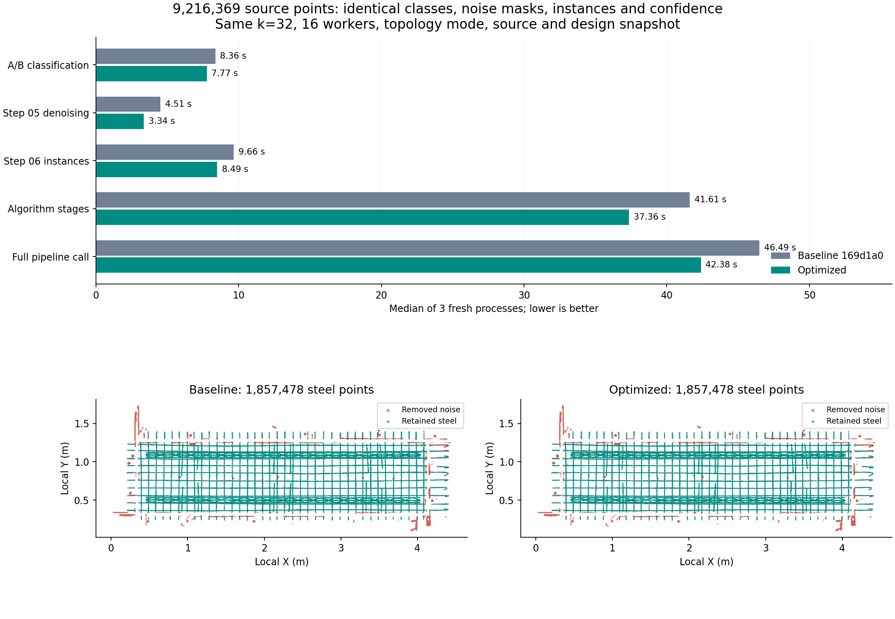

# 去噪与分类性能优化及等价验收

## 基准与范围

本次先把用户工作区完整保存为基准提交 `169d1a0`，并推送到远端。由于 `dev-hong` 远端已有其他提交，使用独立分支 `codex/denoise-classification-speed-20260912` 保留双方历史；没有强推或覆盖远端。固定标签为 `baseline/pointcloud-denoise-20260912`。

- 基准提交：[169d1a0](https://github.com/Zeemo-Tech/cloudBIM-viewer/commit/169d1a0)。
- 输入：9,216,369 点的原始 LAS；SHA-256 `eb229b7c514e918c03534184eb56ceabdfd850c57b1b3503172bd8f290ebab52`。
- 固定 k=32、16 workers、topology 模式，运行到页面第 06 步（`through_step=7`）。
- 设计模型及粗配准使用同一份 `prepare_snapshot` 快照；每轮从原始 LAS 重算，不加载旧分类或去噪结果。
- 算法版本取自刚保存的当前工作区。旧的《点云去噪流程性能审查》涉及另一版实验代码，其耗时不能直接当作本次基准。

## 实际修改

1. **侧视分类缩小栅格计算范围。** 每个深度切片只计算占用像素包围盒及零值边缘。边缘保留 `2r+4` 像素，覆盖闭运算、开运算和两次膨胀的完整作用范围，并裁到原图实际边界。连通分量仍包含该切片的全部占用点，长宽、质量和连通性判据不变，返回结果按源点顺序映射。
2. **复用夹具面配对。** 一次有界配对计算同时返回宽度/方管联合掩码及独立方管掩码，代替原来的两次相同几何扫描。
3. **体素分组采用已有整数稳定排序。** 分层、悬浮噪声、夹具体素和外筋连通簇复用 `unique_integer_rows`。它保持词典序、每组第一个源点、逆映射以及后续质心累加顺序，不更改体素大小。
4. **弯筋包络复用三角形几何。** 三角形法向量和重心坐标分母移到查询批次外；用恒等式 `a·(b×c) = a·(edge1×edge2)` 复用有向平面距离，避免每个三角形和查询点组合都构造一次叉积。显示三角网、表面容差和绕数判据不变。
5. **跳过不会参与拆分决策的重拟合。** 只有分裂候选恰好为两部分时才运行拆分验证圆柱拟合；原先单部分拟合的结果会被紧接着的数量条件直接丢弃。

没有减少源点、改变邻域 k、放宽阈值、移除末端清理或关闭设计辅助。此次优化针对现有生产/工作台共享流程。

## 计时结果

以下为同一真实扫描的三轮中位数。

| 指标 | 基准 / s | 优化 / s | 耗时缩短 |
|---|---:|---:|---:|
| 两路分类（共同墙钟） | 8.36 | 7.77 | 7.1% |
| 第 05 步悬浮去噪计算 | 4.51 | 3.34 | 25.8% |
| 第 05 步全部处理 | 7.79 | 6.60 | 15.3% |
| 第 06 步实例整理 | 9.66 | 8.49 | 12.2% |
| 算法阶段合计 | 41.61 | 37.36 | 10.2% |
| 完整调用（含最终发布） | 46.49 | 42.38 | 8.8% |

完整调用逐轮秒数：基准 46.60, 46.49, 46.48；优化 42.24, 53.47, 42.38。优化第二轮的 `persistS=13.34` 秒已保留；结果并非每一轮都更快。

CPU 总时间中位数 185.32 → 186.01 秒，基本持平；峰值 RSS 3589 → 3670 MiB，约增加 80 MiB。本次主要收益是墙钟时间，不声称 CPU 总量或内存也降低。

计时使用独立 Python 进程，顺序为基准/优化、优化/基准、基准/优化。开发栈在基准期间停止，OS 页缓存不清空；所有结果保存到独立目录。A/B 分类分支并行，因此表中采用两者的共同墙钟时间，不能把分支时间相加。

“算法阶段”是建树、法向量、预处理、两路分类共同墙钟、融合、分区、兼容属性、第 05 步和第 06 步的计时之和，不含读写和预览。“完整调用”还包括最终 manifest 发布；原 manifest 的 `totalS` 在发布 manifest 前记录，所以本次额外测量 `pipelineCallWallS`。原始 `totalS`、完整进程时间、CPU、峰值 RSS 及逐轮明细均保留在结果 JSON。

写盘时间存在波动，不能把一次最快运行或某个子函数的倍数当成整条流水线的加速。最初一版优化已降低计算耗时，但落盘波动使其三轮完整调用中位数未改善；最终版进一步缩小分类栅格范围后，重新进行完整的三轮验收。

## 输出比较

**六次运行全部通过：35 个属性列、每列 9,216,369 个源点，差异行数均为 0；浮点属性最大绝对差为 0。**

包含法向量、共享分层、设计噪声掩码、A/B 类别、融合类别、第 05 步类型/实例/分段/置信度、第 06 步类别/实例/分段/簇/置信度以及原始 XYZ 和颜色。8 类非计时语义报告也全部一致。

最终钢筋均为 1,857,478 点，最终噪声均为 152,031 点；源点归属没有发生交换。

比较器逐块读取每个 manifest 声明的全部 NPY 列，检查形状、类型和每个源点的值；不只比较类别总数。另比较前处理、分类、融合、去噪、实例和最终几何报告，仅归一化运行目录 URL 并排除明确的计时字段。类别列保存完整混淆矩阵，浮点列记录最大绝对误差。两侧都独立重算，基准重复运行也参加一致性检查。



图片采用相同源点步长和相同视角，展示最终钢筋和移除噪声；等价判定使用全部原始点。结果说明本次优化保持了基准行为，不构成基准算法绝对准确率或其他扫描场景速度的保证。

## 回归与复现

相关测试共 198 项通过：去噪、包络、实例和末端回归 121 项；分类、局部栅格、共享场景、分层、设计边界、v6 生产适配和文件导出集成 75 项；基准比较器 2 项。测试使用项目 `.cloudbim/mesh-venv`，没有使用系统 Python。

日志：`.cloudbim/speed-review-20260912/regression.log`、`integration-tests.log`。

新增测试覆盖：完整栅格与局部栅格在边缘、角点、稀疏/密集片段、大开运算半径、重复/乱序点上的一致性；弯筋包络在顶点、三角形边、端盖、凹腔、内外表面以及百万级坐标平移下与旧公式的一致性；体素首点/法向量及连通簇编号；比较器能发现总数相同但源点标签交换的错误。

```bash
# 已冻结的快照位于项目忽略目录，离线基准不启动服务。
.cloudbim/mesh-venv/bin/python scripts/pointcloud-speed-benchmark.py \
  --baseline-ref 169d1a0 \
  --snapshot .cloudbim/speed-review-20260912/snapshot.json \
  --output .cloudbim/speed-review-20260912/reproduce \
  --rounds 3 --workers 16
```

基准工具将基准提交和当前 Python 源码各自冻结到输出目录，再启动独立进程，保留所有属性、LAS 和预览产物。输出目录必须为新路径，需预留每轮数 GB 空间。

- 可提交结果：[results.json](assets/pointcloud-speed-2026-09-12/results.json)。
- 可复现绘图：[plot.py](assets/pointcloud-speed-2026-09-12/plot.py)。
- 完整验收数据：`.cloudbim/speed-review-20260912/final/`。
- 首轮热点剖析：`.cloudbim/speed-review-20260912/baseline-profile.prof` 及对应文本。
- 初版试验和修正比较器前的原始日志：`.cloudbim/speed-review-20260912/alternating/`。其中最初的报告差异是运行 URL 和计时，不是逐点属性变化；最终验收使用修正后的比较器。

## 仍有空间的部分

法向量邻域查询、多尺度局部几何以及第 06 步真实圆柱拟合仍占用时间。当前原始点 KD 树和若干共享前处理已被复用；进一步减少 k、下采样、删去几何验证或降低迭代次数会改变判据，需要另外设计精度验收，未纳入此次等价优化。落盘耗时也值得单独优化，但应与算法计算收益分别衡量。

本次使用一名分类 worker（请求模型 `gpt-5.6-terra`、medium），负责重复配对扫描及侧视栅格方案；已完成任务，状态为 completed。主代理负责去噪改动、局部栅格方案整合、冻结输入、全量对比和最终验证，没有额外子代理。

工作台已通过开发管理器重新构建并启动（前端 5173、API 8090、工作台 8766）。通过实际 `/api/run` 从源文件完成运行 `20260912T104455-24892901`，包括瓦片属性发布，再次与基准逐点及几何报告对比通过。现场重新准备快照的 `totalS/modelS` 仅为计时，按相同规则排除。结果可在 [本地工作台](http://127.0.0.1:8766) 查看；[集成验证记录](assets/pointcloud-speed-2026-09-12/workbench-validation.json)。
