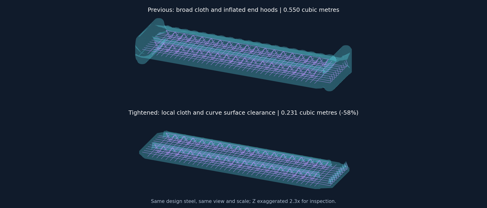

# 练武场：收紧外包络与弯筋表面保护

> 后续用户确认要贴合设计弯头，现已采用独立三维弯头管壳并继续收紧。当前实现见 [贴设计表面的三维弯头保护](pointcloud-3d-bend-envelope-2026-09-11.md)。

用户认为上一轮整体布面仍过于保守，并要求弯筋也沿表面保护。本轮保留整体连续外壳，收紧局部余量，取消两端鼓起的罩体。

## 变化

| 参数或行为 | 前一轮 | 本轮 |
| --- | --- | --- |
| 普通横向余量 | 85 mm | 40 mm |
| 普通高度余量（另加实际钢筋半径） | 16 mm | 10 mm |
| 腹杆高度余量 | 22 mm | 10 mm |
| 外露直筋长度余量 | 120 mm | 50 mm |
| 曲面局部支撑范围 | 横向余量 + 网格步长，约 109 mm | 独立 25 mm + 网格步长，约 41 mm |
| 网格目标步长 | 24 mm | 16 mm，曲线附近另加局部节点 |
| 向外平滑次数 | 4 | 1 |
| 弯筋保护 | 半径 120 mm 的端部罩 | 沿实际弯曲中心线、实际半径 + 10 mm 的局部表面保护 |

弯筋每 4 mm 或更细采样，按圆截面在节点位置的竖直截线计算上下范围，向侧方逐渐变薄，不再用普通横向余量把弯筋铺成宽平台。曲线周围加入半半径和全半径采样环，避免粗网格削掉真实钢筋表面。曲线端不额外外推长端帽；同根钢筋的直端也不再被当成弯头膨胀。该局部曲面与主布面连续衔接，笼内体积仍按整体外包络保留。

01D、02A、02B、05 的界面会显示当前横向、高度和弯筋表面余量。显示的三角曲面和硬去噪判定一致。

## 验证与实际差异

最新运行 `20260911T152403-18879cf2`，9,216,369 点，重跑至第五步，耗时 30.54 秒。设计模型照常参与禁飞区构建；`priorMode=off` 对应独立的后续设计引导模式，不关闭前置禁飞区。

| 指标 | 结果 |
| --- | ---: |
| 包络体积 | 0.549844 → 0.231439 m³，缩小 57.91% |
| 硬禁飞命中 | 228,144 → 411,276 |
| 05 残余复核候选 | 219,728 |
| 05 新增去噪 | 21,582 |
| 设计中心线采样未覆盖 | 0 / 16,200 |
| 设计钢筋物理表面采样未覆盖 | 0 / 77,760 |
| 上轮已拟合内部钢筋被新硬规则命中 | 1,029 / 1,729,609 |
| 上轮最终内部钢筋标签被命中 | 528 / 1,730,179 |
| 上轮最终外部钢筋标签被命中 | 11,067 / 134,478 |

这些对照使用 `20260911T150658-1cbf6a3c` 的阶段标签，不是人工真值。收紧后确实会排除更多偏离设计的实测点，尤其外部弯筋；不能将设计表面采样全部保留等同于所有真实钢筋都没有误删。红色命中保留原始点，便于检查偏移和倾斜较大的弯筋。所有源记录继续保存。

通过 166 项相关算法测试；曲线圆截面细化后再次通过 11 项几何/共享去噪测试。7 组前端检查通过；实际 300,000 点预览经局域网地址加载通过；四场景的 50,178 顶点网格构造与销毁通过。实际网格所有边均有两个邻面，从发布 JSON 重建的 9,216,369 点硬掩码与 NPY 完全一致，02A、02B、融合、05 都保留硬删除。机器可读证据见 [validation.json](assets/pointcloud-tight-envelope-2026-09-11/validation.json)。

根智能体完成实现、数据对照与集成；复用 `gpt-5.6-terra / medium` 几何子智能体做只读复核，其任务已完成。最后的曲线截面细化由根智能体通过物理表面采样、全量运行和几何测试验收。当前没有可连接的 CUA 浏览器，上图为实际导出网格的投影，并非浏览器截图。
