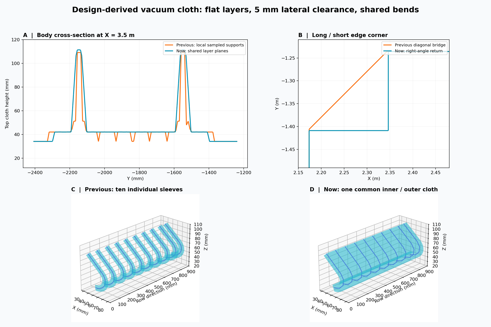

# 练武场：平整主体、直角收边与共用弯头布面

> 删除策略后续改为全域包络外强制排除，详见 [计算输入剔除修复](pointcloud-hard-envelope-input-2026-09-12.md)。本文保留包络形状优化的历史指标。

本轮修正用户明确的三个问题：横向表面余量 5 mm，长短边凹角用直角折回；内部同层钢筋的布面应平整；同排弯头共同支撑内、外曲面。

## 最终形状

以前的主体逐网格选择附近钢筋最高、最低支撑点，在两根钢筋之间切换支撑时出现锯齿凹陷。现在，同层平行钢筋组在行间形成共享平面，上表面为设计钢筋中心高度加实际半径，再上移 4 mm；下表面对称处理。分散的短筋组按间距分开，不把远处短筋撑成整块高台。

腹杆组件由腹杆和相邻长弦杆共同形成连续张紧面；两排腹杆之间仍回到网片平面。有长弦杆支撑时沿组件形成平整斜面；没有长弦杆的独立波形腹杆仍沿原折线起伏。几何高度不再取决于最近采样点和网格步长。主体使用平面法向着色，避免跨折边平均法向产生视觉鼓包。

XY 外边界沿设计长、短边方向做正交收边，保留凹角，横向按钢筋物理表面外扩 5 mm。关键边界精度为 1 nm，非整毫米边界也不会因栅格取整丢掉整格。端部总长度余量保持 12 mm，不再叠加横向 5 mm。

同排弯头按相同曲线形状及曲线平面法向平移关系分组，使用内、外偏移曲线之间的连续曲面，跨过行间空隙，保留回弯内侧的空腔。当前设计模型的 10 根弯头合为 1 块闭合布面。弯曲轮廓表面余量仍为 2 mm，排两侧从最外钢筋表面外扩 5 mm。显示和点级判定使用同一份三角面。

对于不能构成平面曲线的输入、共线或两点尾段，明确回退到已有三维管壳，并记录原因；当前模型没有触发回退。不同形状的弯头不强行跨排连接。主体和弯头仍以两个闭合组件取并集，连接处可重叠，未做全局布尔重网格化。

图 A 为相同位置剖面：青线消除橙线在钢筋间的锯齿凹陷；图 B 为长短边凹角；图 C、D 为同排弯头从逐根套筒改成共用曲面。图来自实际导出网格，不是浏览器截图。

## 发布与验证

已发布运行 `20260911T160716-67a12906`（UTC 编号，本地时间 9 月 12 日），共 9,216,369 点，重跑至界面第五步，耗时 31.07 秒。服务通过 `scripts/cloudbim-dev.sh stop/start` 管理，局域网页面及 viewer.js 均返回 HTTP 200。

| 验证项 | 结果 |
| --- | ---: |
| 算法测试 | 183 项通过 |
| 练武场服务测试 | 10 项通过 |
| 前端协议、过滤与显示检查 | 7 组通过 |
| 实际预览 | 300,000 点加载通过 |
| 四场景包络网格 | 98,020 顶点，构建约 679 ms |
| 设计物理表面采样 | 77,760 / 77,760 覆盖 |
| 主体正交边界 | 1,124 条边全部沿长短轴 |
| 主体上表面三角面判定 | 96,838 个面中心在内，向上 2 μm 在外 |
| 弯头曲面判定 | 108 个面中心和内侧 1 μm 在内，外侧 1 μm 在外 |
| 硬禁飞命中 | 524,605 点 |
| 05 残余多视角复核 | 197,711 个候选，新增去噪 20,627 点 |
| 上轮拟合点被新硬规则命中 | 2,582 / 1,644,987 |

所有组件均验证为每条边恰有两个相反方向的邻面，闭合且体积为正。发布 JSON 重新计算的全量禁飞掩码与 NPY 一致；02A、02B、融合、细化与 05 均保留硬去噪结果，05 全部硬命中点均为噪声类型 5。原始点记录及顺序保留。

本轮主体体积约 0.135208 m³，弯头布面体积约 0.000917 m³，组件合计约 0.136125 m³。此前组件合计为 0.093287 m³。本轮虽然收窄横向边界，但修补了主体钢筋之间不应存在的凹陷，并将弯头行间纳入同一布面，因此总体积增加；组件合计未扣除连接重叠。实测与设计偏差仍按用户指定的严格设计边界处理，旧拟合标签不是人工真值。

机器可读证据：[流水线验证](assets/pointcloud-vacuum-cloth-2026-09-12/validation.json)、[几何验证](assets/pointcloud-vacuum-cloth-2026-09-12/geometry-validation.json)。

根智能体负责主体平面、集成、显示和全量验收；两位 `gpt-5.6-terra / medium` 子智能体分别完成直角边界模块及弯头共用曲面模块，均已完成并停止写入。既有工作区改动保留，未提交 Git。
