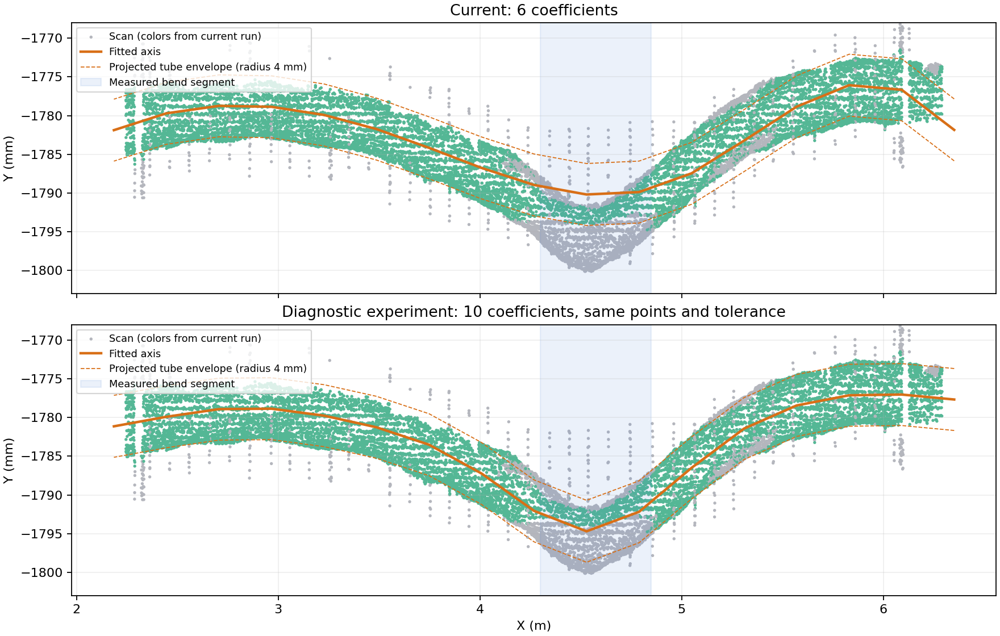

# v20 长筋局部弯曲拟合排查

> 后续已完成 v21 正式修复，见 [实现与全量验证](../development/rebar-control-net.md)。本文保留修复前的隔离诊断结论；`check_bow.py` 比较固定容量，完整自适应修复由 `test_rebar_control_bending.py` 和 `test_rebar_control_full_surface.py` 验证。

2026-09-15。基线为 `20260914T163600-043c4c6a`，算法 `design-control-net-v20`，控制网 16.02 s、全流程 25.83 s，与本次截图计时相符。本次只做诊断与隔离实验，未修改生产算法、分类阈值或替换练武场结果。

## 结论

不是单纯的分类距离阈值偏小。在这批实际数据中，确认存在“长筋局部弯曲尺度小于当前曲线模型表达能力”的问题。代表实例 #11 的 4.166 m 主体已经使用样条，仍不能充分跟随中部集中弯曲。固定使用 6 个三次 B 样条系数、仅在归一化长度 1/3 与 2/3 放内部节点，使其能跟随整体起伏，却把局部弯曲抹平。

只把该模型的系数数目从 6 改为 10、内部节点均匀加密，保留同一批拟合点、半径、平滑强度、模型选择规则、固定长度和 17 个输出顶点，局部误差明显下降。#11 的原算法最小复现输出与保存的 v20 中心线一致，绝对坐标差不超过 1e-9 m。

截图没有选中的实例编号，无法凭二维截图严谨地把每支箭头绑定到 #11；这里使用相同运行中可复现的同类故障作为证据。#62、#137 等另有管面偏差，增加样条参数不是通用修复。

## 实测对照

先固定原始评价点：非台面点、距原中心线小于半径加 6 mm、排除两端各 60 mm，要求有效法向且与轴向绝对余弦小于 0.5。保留原始记录，不随新模型重新筛选评价点。评价走真实三维点到折线的管面残差 `abs(distance - radius)`。

#11 局部弯曲段取原始 X 坐标 4.30–4.85 m，共 10,006 个评价点。另以源点编号模 5 等于 0，且完全未进入原候选拟合集合的点作为独立验证集，共 1,251 点。它们也不会进入扩大参数模型的拟合。

| 单变量实验 | 弯曲段管面误差中位数 | 落入原 1.44 mm 容差的比例 |
|---|---:|---:|
| v20 基线，6 系数 | 2.483 mm | 25.8% |
| 输出折线从 17 点增至 65 点 | 2.455 mm | 26.6% |
| 平滑惩罚缩小至 1/10 | 2.444 mm | 26.6% |
| 关闭平滑惩罚 | 2.437 mm | 26.7% |
| 初始管面分带由 12 增至 24 | 1.943 mm | 38.3% |
| 样条由 6 增至 10 系数 | 0.615 mm | 93.0% |
| 样条由 6 增至 14 系数 | 0.460 mm | 95.6% |

独立验证集结果：6 系数时误差中位数 **2.523 mm**、支持率 **26.46%**；10 系数时为 **0.616 mm**、**92.49%**。同一根完整主体的独立留出点支持率从 **76.6%** 升至 **94.8%**。这证实改善不是只发生在拟合用过的点上。

这里的“支持率”是符合几何距离门槛的比例，不是运行完整多实例竞争后最终新增的分类点数，也不是有人工真值的召回率。评价集合仍可能含交叉筋及少量杂点。



图中点的颜色均沿用当前 v20 分类；实验图没有把点重新染色。虚线是半径 4 mm 的投影包络，数值判据仍使用三维管面距离。

## 为什么不像阈值问题

该筋设计直径 8 mm，当前管面容差是 `max(0.9 mm, 0.36 × 半径)`，即 1.44 mm。在相同的 1,251 个独立点上，保持错误轴线、仅放宽容差：

| 容差 | 几何支持率 |
|---|---:|
| 1.44 mm | 26.5% |
| 2 mm | 36.8% |
| 3 mm | 59.4% |
| 4 mm | 76.1% |
| 5 mm | 89.8% |

10 系数模型用原 1.44 mm 容差已经达到 92.5%。容差放宽会改变归属范围，却不会把橙色模型移到实际弯曲的位置。因此应先纠正模型表达，避免靠放宽距离掩盖轴线误差。

## 其他已排查因素与剩余问题

- 对全部 16 根超过 2 m 的直筋主体做了候选数、分带数及取消弓形简化的隔离试验。增加近邻上限 768→1536/3072 不能统一解决问题，#11 反而触发平行支撑歧义拒绝。部分实例单独重放不能还原流水线的分层/端部修正，因此不把其差异当成已确认原因；#11、#62、#137 的基础重放均与保存模型一致。
- #11 本来就是 `supported-spline`，所以不是被误选成直线或弓形。关闭二次弓形选择对它无改善。
- 显示折线加密效果极小，排除本例主要由显示采样过粗造成。
- #62、#137 原模型为二次弓形；只增加样条参数改善有限。用更完整的原始管面点训练，#62 留出支持率由 67.7% 提高至约 77.2%，仍有未解释偏差。这部分不能据本次试验断言已解决，也不能据残差就认定设计半径错误。
- v20 的 `_refine_body_samples` 明确跳过长度大于 2 m 的主体，因为它们初始已取 768 近邻。这个条件意味着长筋的成功但偏轴拟合也跳过了原始管面复核。采样密度足够与曲线表达足够是不同条件。
- 当前模型选择与 RMSE 主要依赖前面选中的管面点；没有足够反映整段原始管面中成片漏掉的外侧点。因此“整体通过拟合、局部明显偏离”可以稳定出现，并非必须由随机因素造成。

## 建议修复方向

1. 保持分类距离门槛，给长筋也加入沿长度分带的原始管面复核。
2. 只对连续若干分带出现系统残差的主体尝试更丰富的曲线。把 10/14 系数作为有界候选，最终应按长度、残差集中区域和证据密度选择，不能无条件让每根筋更自由。
3. 使用未参与拟合的原始点比较改善，同时限制其他分带退化，保留固定半径、固定长度、邻筋竞争及歧义拒绝。
4. 只有几何候选通过上述验证，再重跑归属；保留现有快路径，避免拖慢大部分正常实例。

本次确认了修复方向，尚未做完整生产改动与全量性能/误分回归；不能把这里的 92.5% 当作已经上线的分类结果。

## 复现与证据

资产目录 `docs/research/assets/rebar-bow-audit-2026-09-15/`：

- `probe.py` / `probe.json`：16 根长筋的初步隔离对照。需要本机原始运行数据；中间大数组写入 `/tmp/cloudbim-bow-audit-20260915/`。
- `capacity.py` / `capacity.json`：#11、#62、#137 的参数容量、平滑、原始管面重拟合对照。在 `probe.py` 后运行。
- `make_fixture.py`：从实际数据提取最小复现输入，验证原中心线一致。
- `fixture-11.npz`：压缩的实际拟合输入和独立弯曲段验证点，可直接运行以下快速检查，无需加载 900 万点。
- `check_bow.py`：运行真实轴线拟合入口。无参数为当前 6 系数，应失败；参数 `10` 只在进程内替换模型容量，应通过。85% 是本复现捕获大面积管面偏离的诊断验收线，不是生产分类参数。

```bash
.cloudbim/mesh-venv/bin/python docs/research/assets/rebar-bow-audit-2026-09-15/check_bow.py
# coefficients=6, validationPoints=1251, medianMm=2.5230, surfaceSupport=0.2646
# AssertionError: locally bowed surface falls outside unchanged cylinder tolerance

.cloudbim/mesh-venv/bin/python docs/research/assets/rebar-bow-audit-2026-09-15/check_bow.py 10
# coefficients=10, validationPoints=1251, medianMm=0.6159, surfaceSupport=0.9249
```

代码证据：`services/mesh-service/rebar_prior_axis.py:103`（固定 6 系数和两处内部节点）、`:113`（平滑）、`:140`（模型选择）；`services/mesh-service/algorithms/rebar_control_net.py:958`（17 顶点）、`:965`（距离容差）、`:1235`（管面复核跳过长筋）。
