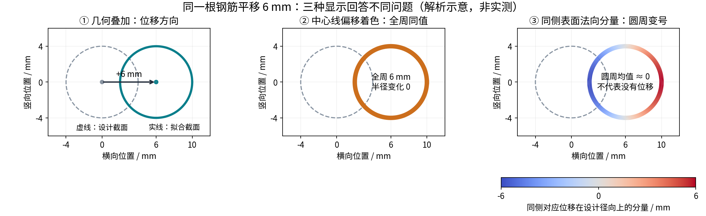

# 钢筋控制网：实例分割、去噪与 Scan-vs-BIM 的统一表达

日期：2026-09-15。基于本次工作区现状（含任务开始前已有的未提交修改）。本文是调研与架构建议，不是新算法已实现或精度已验收的声明。

## 1. 结论

控制网适合作为当前钢筋场景的共同几何基础：保存物理身份、设计和观测中心线、局部截面、逐点归属及证据，支撑分割、保守去噪、逐筋几何偏差与三维着色。但当前还不能宣称“完整分割与去噪已解决”，也不能把所有拟合曲线直接当作独立实测。

建议让比较器主要比较有身份、有对应关系的钢筋几何；网格继续承担显示和必要的表面检查。评价中心线偏移不再需要先把设计模型 remesh 成大量查询点；生成用于着色的显示网格仍然完全可行。

单次扫描相对 BIM 测到的是**几何偏差**。其中混合了制造形状、安装位姿、模型简化、配准误差以及真实变形。若要说“某根钢筋发生了多少形变”，需要明确基线；时间变化优先比较同根钢筋的多期扫描，仍需稳定基准与可辨识对应。

## 2. 当前项目已有基础与限制

| 当前证据 | 对新方案的意义 |
| --- | --- |
| `fit_control_net` 返回报告和保持全源顺序的逐点状态/归属，实例有 `designUnitId`、`designBarId`、`centerlineM`、`axisEvidenceRangeM` 等 | 已具备身份、曲线与源点追溯的基础 |
| 当前开发文档记录 v24 有 210 个确认主体、125 个确认弯段；1,836,747 个匹配点、2,063,597 个待定点 | 已可作为主要实验路径，但待定点不能一概称为噪声；这些数量不等于准确率或召回率，也不等于物理钢筋根数 |
| 普通初始主体拟合调用 `_exact_length(curve, length)`；半径来自设计；后续部分短筋/尾腿允许观测证据驱动的长度调整 | 必须逐参数记录约束来源；不能用锁长/定半径的结果检验实际长度/直径 |
| 初始 `observedLengthM` 来自内点轴向位置的 1%–99% 分位跨度 | 它是观测跨度，不能直接更名为整根实测弧长；遮挡、弯曲、分箱和去极值均影响它 |
| 弯段有 `inferredCenterlineM`、`connectionStatus` 与局部支持区间；主体另有显示裁剪中心线 | 不能将显示补接和裁剪结果未经说明地用于测长与偏差统计 |
| Scan-vs-BIM v3 已有实例内同侧表面匹配、`offsetVectorM`、半径差、截面质量、残余弓高 | 新架构可复用指标、报告和证据规则，不需要从普通最近点重新开始 |
| 当前生产 `compute_instance_comparison` 仍读取 analysis-mesh 和实例 LAS 并重新测量截面 | 控制网直接驱动完整生产比较链还需要明确产物适配与坐标变换契约 |
| 练武场已按中心线生成批量管段并区分推断曲线；前端已支持网格顶点偏差数组 | 着色载体已有。需新增曲线站点/周向坐标到显示顶点的绑定和不同指标语义 |

源码与文档：

- [主体拟合与输出](../../services/mesh-service/algorithms/rebar_control_net.py)：`_fit_unit`、`fit_control_net`。
- [弯段与推断](../../services/mesh-service/algorithms/rebar_control_curves.py)：`fit_curved_pieces`。
- [当前逐筋比较](../../services/mesh-service/rebar_comparison.py)：`compute_instance_comparison`。
- [截面与弓高](../../services/mesh-service/rebar_metrics.py)、[前端指标契约](../../src/api/backend-c2m.ts)。
- [控制网现状](../development/rebar-control-net.md)、[同侧表面 v3](../development/rebar-same-side-deviation.md)、[逐筋链路](../development/scan-vs-bim-instances.md)。
- [管段显示](../../scripts/pointcloud-debug/viewer.js)：控制网 overlay 的 `addTubes` / `addCurve`。

本次未重跑上述历史全量实验，数值引用开发记录；源码行为则检查了当前文件。

## 3. 先分清三种距离

### 3.1 扫描点到观测管面的残差：分割/拟合质量

在有限侧面、有明确曲段归属的前提下：

`e_fit(p) = distance(p, observed_centerline) - observed_or_prior_radius`

它解释原始点是否支持观测钢筋曲面。端面用单独的有限圆盘模型；肋纹、交叉点和非圆局部不能只靠这一个数拒绝。若半径固定，明确标为相对设计半径管面的残差。

### 3.2 观测中心线到设计中心线的对应位移：几何检验主指标

设设计弧长为 s，设计中心线为 C_d(s)，观测曲线为 C_o(u)，单调对应为 u = φ(s)，T 为冻结并记录的扫描到设计变换：

`Δ(s) = T(C_o(φ(s))) - C_d(s)`。

这是有对应约定的几何位移场，不自动等于材料点位移。它可以分解为构件坐标分量或沿筋局部分量。

### 3.3 同侧表面的法向偏差：局部表面诊断

`d_n(s, θ) = (S_o(φ(s), θ) - S_d(s, θ)) · n_d(s, θ)`。

对于局部截面方向一致、半径差可测的情况，近似为 `Δ(s) · n_d(s, θ) + Δr(s)`。弯曲、截面转动明显时使用完整的表面对应该式，不能普遍套用近似。实际扫描版还必须有该轴向、该周向的真实扫描支持；中心线推导版应标为“拟合模型预测”。



解析例：直径 8 mm 的钢筋整体横移 +6 mm，中心线位移始终为 6 mm，半径差为 0；同侧表面法向分量沿周向从 −6 到 +6 mm，均匀全周平均为 0。普通最近表面还可能错误地对应到另一侧，出现局部 2 mm 之类的值。三者回答的问题不同。

**分割残差阈值、身份搜索范围、工程合格容差和显示色域应分别存储，不能互相替代。** 偏离设计很多的真钢筋依然应该被分割并报告超差。

## 4. 如何描述每根钢筋

### 4.1 两套坐标各有用途

**构件固定坐标**：纵向、横向、竖向。固定于构件/项目基准，并明确竖向是重力方向还是构件厚度方向。用于用户提出的三向最大、最小、平均偏差。不能从每根钢筋的拟合方向重新推导整套构件坐标，否则整体偏斜可能被吸收。

**沿筋局部坐标**：切向 t(s) 及两个连续的垂向基 e1(s)、e2(s)。用于侧弯、翘曲、弯钩转动等。采用以设计曲线为基准的平行运输/最小旋转标架；直段的 Frenet 法向不确定，不宜直接用它作稳定的着色坐标。局部标架沿曲线转动并不代表钢筋发生了材料扭转。

`δt = Δ·t`，`δ1 = Δ·e1`，`δ2 = Δ·e2`，`δperp = sqrt(δ1²+δ2²)`。

只在轴向对应可信时解释 δt；若采用设计截面交会求中心，轴向分量往往被定义为零，那是测量约定，不是证明没有轴向滑移。

### 4.2 推荐指标

| 类别 | 保存指标 | 注意事项 |
| --- | --- | --- |
| 三向位置 | 分量 min/max、有符号均值、均绝对值、RMS、P95 绝对值、最大值站点与坐标 | 正负均值会抵消；沿有效弧长加权，不按点密度或显示网格顶点数加权 |
| 综合偏移 | `max‖Δ‖`、P95、RMS；局部横向 `max δperp`；超差连续区间与长度占比 | 仅覆盖区间的最大值，不能声称全根未观测部分也受其约束 |
| 整体安装姿态 | 参考点位移、轴线/弯曲平面方向差；可辨识的刚体旋转分量 | 笔直圆筋绕自身轴旋转不可由中心线辨识；不要无条件报完整六自由度 |
| 自身弯曲 | 保留绝对偏差，同时报告扣除受限刚体姿态后的残余曲线、弓高、弓高位置 | 直段可用去常数/线性趋势；弯筋要相对设计形状去刚体，不应把设计弯钩当缺陷 |
| 局部方向 | 切线夹角、端部上翘/侧偏量、影响长度、端部角度 | 角度以固定物理窗口估计，避免用相邻噪声点求导 |
| 曲率 | 设计与观测曲率、曲率差、最大曲率位置 | 需指定平滑尺度和置信度；当前 `curvatureMInv` 为 null，不应先填形式上的数 |
| 长度与端部 | 中心线总弧长、端点弦长、共同覆盖段弧长、两端三向偏差、切口/尾腿长度 | 区分完整实测、部分覆盖和设计补全；缺少可靠端点时总长可未知 |
| 弯钩/折弯 | 弯曲半径、转角、弯曲平面方向、切点位置、尾腿长度、钩口开度 | 使用物理连续的母筋顺序，防止主体与弯段重叠计长 |
| 截面 | 有效半径/直径差、截面残差；有充分观测时的椭圆度 | 带肋钢筋表面包络直径不等同于名义直径；不能用固定设计半径的拟合结果认证实测直径 |
| 网间关系 | 相邻筋中心距/净距、层间距、交叉夹角、已知连接位置偏差 | 投影交点不必是物理接触；保护层还需要可信混凝土外表面和构件内外定义 |
| 数据质量 | 轴向覆盖率、周向覆盖、最长缺口、身份可信度、端点状态、拟合残差、约束来源与不确定度 | 实测支持、插值、设计推断、冲突、未观测需分别表达 |

若用户关注时间变化，再加入 `Δ_t2 - Δ_t1`、变化速率和可检测性；前提是相同基准、身份及对应关系。单帧 BIM 偏差不能区分加工弯曲与后期受力变形。

### 4.3 不宜直接承诺的量

- **材料轴向滑移/局部应变**：光滑直圆柱在轴向平移后局部表面不变。需要端部、可识别肋纹/标记或跨期材料点对应；对应算法输出一个数并不代表它可观测。
- **材料扭转**：圆截面绕自身轴转动可以不改变中心线和理想表面。三维曲线的几何挠率也不等于材料扭转角。
- **应力/承载能力**：不能仅凭几何偏差推导；需材料、荷载、边界条件等力学模型。
- **绝对全长/直径变化**：参数由设计锁定时只能说明满足约束，不能作为独立观测结论。

## 5. 最关键的工程环节：对应、配准和先验偏差

### 对应关系

按 `physical bar → segment → station` 建立身份与单调对应；先锚定端部、弯钩切点和可靠的几何事件，再匹配事件之间的区间。对称、重复平行钢筋允许候选歧义，不能只因离另一个设计槽更近就换号。图上的连接还应区分“同一钢筋的连续段”和“不同钢筋交叉/接触”。

不要对整根曲线任意找最近点；相邻腿、回弯和自靠近区很容易串段。也不要把两根曲线都压缩到 0–1 后逐点相减来测长：这种归一化会吸收长度差。应分别保存独立弧长、端点事件和对应映射，报告映射的约束与歧义。

### 配准

冻结全场基准变换，保存源坐标、方向、单位、设计版本和变换链；防止控制网自动定位变换和现有 scan→BIM 矩阵被重复应用。若只依靠整笼钢筋反求基准，其共同位移可能被解释为扫描姿态，绝对安装偏差需独立基准支持。

逐筋刚体对齐只能生成另一个“自身形状”视图，原始绝对偏差必须保留。实际钢筋没有足够几何约束时，不能声称每根均恢复唯一的刚体姿态。

### 去噪与测量不能形成自证闭环

先用设计先验帮助找身份和候选，再用原始局部观测测量形状。用于计量的候选池应包含窄去噪壳层外的、仍可能属于该筋的点；否则真实大偏差会先被删除，随后得到虚假的好看误差。

保留原始坐标及逐点来源，去噪主要输出标签/掩码。若另做表面平滑或投影，明确标为重建数据，并且不代替计量观测。将控制网外连续剩余结构作为未知钢筋/模型遗漏候选；没有设计槽不自动等于噪声。

量测阶段按证据选择哪些参数可以放开，保留宽松物理边界和身份限制；对设计半径、长度和平滑强度做敏感性检查。训练/留出按空间条带、扫描站或独立复扫分组，避免相邻点随机拆分造成虚高独立性。留出残差能够反驳过拟合，却不能独立证明身份正确。

## 6. 如何保留并改进可视化

### 默认视图：中心线偏移着色的管体

从设计曲线或观测曲线扫掠圆截面，得到轻量显示管体。每个顶点保存 `barId/segmentId/station/theta/evidenceMask`，颜色由站点指标插值取得。可在设计管上着色并叠加观测中心线，也可给观测管着色并叠加半透明设计管。

当展示 `‖Δ(s)‖`、横向或竖向偏移时，同一站点的一整圈使用同一颜色。这表达该截面的中心线偏差，不声称全周表面都已扫描。旁侧显示轴线依据的观测覆盖；观测证据不足的站点灰色，设计推断区间虚线/网纹，不能涂成零偏差。

### 辅助视图

1. **双曲线/双管叠加 + 稀疏位移箭头**：表达方向，最大值位置和端部单独标记。夸张形变只改变显示，明确 ×1/×5/×10，数值和容差仍为实际量。
2. **三向沿程剖面**：横轴为设计弧长，纵轴为 mm。容差带、可信度/不确定度带和缺测断线；点击与三维站点联动。
3. **截面切片**：同时显示设计圆、观测拟合圆和原始点，能看到单侧扫描、半径假设与中心偏移。
4. **同侧表面诊断**：保留现有 v3 真实点比较。也可输出管面展开图（弧长 × 周向角），分别显示观测偏差和周向覆盖；角度源于约定标架，不冒充材料纹理对应。
5. **容差利用率**：若业务明确三向或正负方向有不同限值，可展示偏差相对对应限值的比例，同时保留 mm；规则须来自本项目要求。

显示中心线偏差不依赖扫描法向正负，也不需要查询对面的设计网格。表面着色仍需要同侧与覆盖判断，但可用曲线的轴向/周向坐标和宏观径向组织匹配。复杂截面与真实肋纹仍保留专门表面检查。

“向内/向外”必须明确参照：钢筋自身截面径向与混凝土构件内外是两个不同方向。保护层风险应相对混凝土边界计算，不能直接沿钢筋圆周套用内外容差。

统计应从曲线有效弧长计算；显示细分只影响平滑度。周向表面统计则使用有观测的面积/角度权重。增加显示网格密度不应改变中心线合格率。

## 7. 建议数据链和最小迁移步骤

```text
设计钢筋目录/曲线 ──┐
原始扫描与冻结配准 ─┴→ 控制网拟合与身份竞争 → 逐点归属 + 未决证据
                                           ↓
                              有证据区间的逐筋观测几何
                                           ↓
                    对应/可观测性检查 → 沿程偏差场 + 质量场
                                           ↓
                   显示管体 / 原始点 / 剖面 / 截面 / 逐筋报告
```

建议新增独立的 `rebar-deformation` 产物契约（名称暂定），而非把中心线偏移塞进现有表面 `distances` 并继续沿用旧标签：

- 输入指纹：源扫描、设计版本、控制网版本、归属哈希、变换链、测量参数和算法版本。
- 实例层：物理钢筋、几何片段顺序/方向、连续/接触关系、身份状态。
- 几何层：原始设计曲线、观测模型、显示补全分别保存；长度、半径等参数的来源和约束状态。
- 站点层：`designStationM`、`observedStationM`、两中心、位移向量、局部标架、支持区间、质量及不确定度；未知用 null。
- 汇总层：指标名、单位、坐标系、加权方式、有效长度与覆盖率、极值位置、容差规则。
- 显示层：几何资源与站点映射，可独立重建与重着色；历史报告若要求三维复现，须保留对应原始产物，当前历史 JSON 本身不保证旧网格存在。

分三步落地：

1. **中心线 MVP**：适配当前控制网到物理钢筋，规范坐标变换；先输出可支持区间的横向/竖向位移、最大值位置、覆盖率、灰色缺测和管体着色。直段截面方案默认不报告材料轴向位移。并行保留现有 v3 对照。
2. **独立量测与形状分解**：明确先验来源与轴向对应；加端点、独立长度、绝对姿态/自身弯曲分解、弯钩参数、质量和固定窗口曲率；无法测的指标保持未知。
3. **网络和跨期**：相邻净距、层间距、额外/缺失钢筋复核、稳定基准下的跨期变化，再扩展复杂截面表面检查。

这里的“统一”是共享身份、几何和证据，不必把所有功能塞进一个不可检查的拟合步骤。

## 8. 验证门槛

下列为建议的后续验证矩阵，本次未实施生产算法改造：

| 已知真值情景 | 应检查的结果 |
| --- | --- |
| 纯平移/纯倾斜，包括位移超过直径 | 正确中心线偏移；自身弯曲接近零；同侧不翻面 |
| 局部弓形、短端翘起、回弯与尾腿变长 | 位置、范围、方向和长度变化恢复；主体/连接段不重复计数 |
| 改长度和半径，使用不同先验强度 | 测量能够发现变化或明确不可测，不能总被设计约束拉回零 |
| 半圆/窄弧、遮挡、缺端点、不同站扫描密度 | 误差和不确定度随证据变化合理；不伪造背面和全长 |
| 肋纹、相邻/交叉筋、额外筋、错配设计槽 | 不误删真钢筋、不串实例；身份不清保持未决 |
| 整体基准扰动、同笼共同位移、逐筋重配准 | 区分基准误差、安装偏差与自身形状；不吸收应报告的误差 |
| 笔直圆柱轴向平移/绕轴旋转，端部不可见 | 报告轴向/扭转不可辨识，不能输出虚假材料位移 |
| 更换显示网格密度、源点排列、增加重复密集点 | 沿程统计基本不变；真实测量不由渲染资源决定 |

用人工逐点标签衡量实例分割精度/召回及噪声误收/钢筋误删；用已知几何的合成数据、标定件和独立复扫衡量中心线/端点/长度误差。二者分开验收。不要用“拟合支持点更多”替代真值验证。

不确定度至少考虑扫描噪声/系统误差、局部拟合条件性、配准、对应与模型假设。若各项独立才可直接方差相加；配准误差通常沿整根相关，不能当成许多独立点平均消掉。当前 `centerUncertaintyM` 是质量估计，不能直接包装为 95% 置信区间。

## 9. 外部研究与证据边界

外部一手资料及逐项证据见 [原始资料调研](rebar-control-net-primary-sources-2026-09-15.md)。本文的产物契约、迁移路线和 UI 组合是针对本项目的建议；解析例来自几何推导，并非论文或本项目实测结果。图像脚本包含纯平移的数值断言，本次执行通过并进行了目视检查。

与本项目最直接相关的是 Wang 等 2026 年的 [Elastic Cylindrical Growth 钢筋重建研究](https://doi.org/10.1016/j.autcon.2026.106974)：公开预览描述“钢筋提取—B-spline 中心线—广义圆柱—BIM 尺寸比对”。这支持总体方向，不代表其算法与当前控制网相同，也不能移植其测试精度。Cheng 等的 [弯曲钢筋实例分割与重建](https://doi.org/10.1002/suco.202200897) 使用人工标签评估分割，提示本项目应分别验收实例归属与几何计量。两篇本次均仅核查出版商公开内容。

[NIST 圆柱拟合参数方差研究](https://doi.org/10.6028/jres.117.015) 支持将拟合参数不确定度与设计公差共同考虑；[M3C2 作者公开稿](https://arxiv.org/abs/1302.1183) 表明表面比较也可以不依赖网格，并强调局部尺度与置信区间。它们分别服务于局部拟合质量和辅助表面检测，不替代钢筋身份/曲线对应，也不是本项目现成的精度保证。
