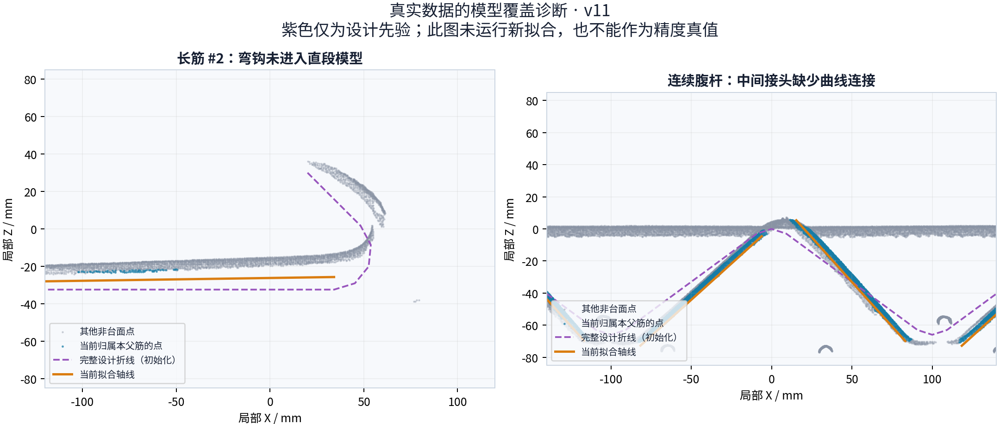

# 控制网弯端拟合：诊断与最小改进方案

日期：2026-09-14。对象：CloudBIM 当前 `design-control-net-v11`，真实运行 `20260914T084630-1abadfc7`。本轮为代码审查、原始资料调研和只读数据诊断；未替换拟合器，也未产生新算法的精度结论。

## 1. 判断

应增加**有结构的局部自由度**。优先补齐“直段—弯段—尾段”的几何表达，然后允许这些结构在点云支持下调整；不应先全局增加控制点或降低平滑强度。

目前有两个不同问题：

- **模型覆盖缺失**：腹杆圆弧接头、长筋弯钩没有成为当前求解的几何段。增加直段的样条节点不能完整解决。
- **观测与约束不匹配**：已经进入求解的长筋受到固定轴向截面、连续支持区间、长度和模型选择等约束。部分约束有明确的抗噪作用；需要有针对性地改换局部坐标和证据，而非直接撤销保护。

推荐的最小框架是：**现有主体定位 → 同父筋局部曲段拟合 → 统一证据检查和点归属**。设计提供结构、直径和形状起点；点云决定有证据的位置与局部形变；缺乏证据的部分保持“设计推断/待定”。

## 2. 当前代码与真实样本证据

### 2.1 已有保护为何产生这种观感

当前开发记录明确说明：腹杆只拟合主体直线，使用主体 12%–88% 的点减弱弯端和交叉干扰，尚未联合求解相邻直段的圆弧接头。普通长筋已有直线、二次曲线和受支持区间限制的样条选择；区间外延续切线，防止稀疏端部噪点把样条拉弯。[项目开发记录](../development/rebar-control-net.md)

因此不能把所有“硬”都归因于控制点太少。已有保护曾抑制 #1 的噪声外推，同时保留 #6 的连续弯曲。新方案需要保留这两种行为。

代码检查确认了具体路径：

| 边界 | 当前机制 | 定位 |
| --- | --- | --- |
| IFC 曲线提取 | 圆弧以约 1 mm 弦高容差离散，向下游只传点序列 | `rebar_bim.py:85,218` |
| 设计库存 | 保留父筋折线，将短钩端排除于匹配直段 | `rebar_design_prior.py:203,214` |
| 控制网输入 | `_unit_rows` 只使用起点、方向、长度、直径 | `algorithms/rebar_control_net.py:36` |
| 腹杆主体 | 12%–88% 区间、强制直线、仅两个输出点 | `algorithms/rebar_control_net.py:577,584,617` |
| 长筋表达 | 固定主轴上的横向样条；普通输出统一采样 17 站 | `rebar_prior_axis.py:103`、`algorithms/rebar_control_net.py:617` |
| 长度处理 | 对输出折线整体缩放到原设计单元长度 | `algorithms/rebar_control_net.py:494` |

上述路径均相对 `services/mesh-service/`。完整父筋几何目前主要留在报告中，未参与本轮控制网曲段求解。新曲段的求值采样也应摆脱统一 17 站，按局部几何误差决定。

### 2.2 直接从 v11 结果重算

| 项目 | 当前结果 | 含义 |
| --- | ---: | --- |
| 物理父筋 / 匹配单元 | 70 / 210 | 210 不是完整连续钢筋数量 |
| 腹杆直段 / 普通直筋 / 短筋 | 144 / 54 / 12 | 控制网以直段单元为主 |
| 固定直线模型 | 156 | 腹杆与短筋 |
| 普通筋选择直线 / 二次弯曲 / 样条 | 14 / 21 / 19 | 并非所有普通长筋都只能直线拟合 |
| 带弯钩的父筋 | 10 | 各保留 9 个设计折线点，均标记排除 1 个钩端直段 |
| 连续腹杆父筋 | 4 | 各有 177 个设计折线点、36 个匹配直段 |

10 根带钩长筋各自的父折线长度约 4.252442 m，匹配直段长度约 4.165998 m，相差约 **86.444 mm/根**，包括尾直段及采样弯段。4 根连续腹杆各自父折线约 4.414103 m，匹配直段之和约 3.736584 m，相差约 **677.519 mm/根父筋**，分布于多个连接与端部区域。

这些差值是**设计几何进入匹配模型的覆盖差**，不是扫描误差、漏检点数或已确认的实测钢筋长度。父折线包含圆弧离散误差。



图左是 #2 钩端，橙色拟合轴线没有覆盖弯钩；图右是连续腹杆中段，拟合直段之间没有曲线连接。紫色是完整设计初始化，不能当作真值；灰色包括其他父筋和待定点，不全部是噪声。图中主体与设计位置也有差异，后续必须沿已拟合主体传递局部位姿，不能直接拼接原设计钩端。

### 2.3 一个容易遗漏的精度瓶颈：设计圆弧离散过粗

从代表性设计采样点恢复圆的诊断得到：长筋钩端与腹杆接头的圆半径分别约 20 mm、15 mm。现有折线相对这些圆弧的最大弦高约 **0.861 mm、0.802 mm**。这是设计采样几何的计算结果，尚非读取 IFC 原始圆参数的核验。

所以“把 `bars[].points` 全部接回来”只能恢复结构，不能直接保证毫米以下的表面精度。应优先保留 IFC 解析直线/圆弧信息；无法取得时，对设计采样段恢复几何并记录来源。用于距离计算的离散误差应单独受控：

`弦高 = R - sqrt(R² - h²/4)`

其中 R 是中心线弯曲半径，h 是圆弧采样弦长。以 0.1 mm 为纯数值离散误差示例，上述两种圆弧的弦长需分别不超过约 3.995 mm、3.458 mm；这不是扫描精度承诺，也不是工程验收容差。增加曲线求值采样不增加模型拟合自由度。

数据和可重放脚本：[geometry-coverage.json](assets/rebar-control-net-flex-2026-09-14/geometry-coverage.json)、[inspect_geometry.py](assets/rebar-control-net-flex-2026-09-14/inspect_geometry.py)。

## 3. 推荐的几何表达

### 3.1 保留完整父筋，按结构分段

保留 `designBarId` 和现有直段单元身份，在其上表达有序的直段、弯段和尾段。新弯段是现有物理父筋的一部分，不新增一根“观测钢筋”；同父筋相邻连接与不同父筋的空间交叉必须区分。

只需要两类基础几何：**直线和圆弧**。普通主体继续沿用现有受约束弯曲模型；局部圆弧确实不能解释观测时，才增加小规模样条修正。无需第一版引入全局自由变形图、通用骨架重建或学习模型。

### 3.2 自由度具体放在哪里

| 区域 | 优先允许的变化 | 保留的约束 |
| --- | --- | --- |
| 腹杆直段主体 | 已有位置、方向；以后仅在连续证据下允许低频弯曲 | 主体不能被接头点整体拉弯 |
| 腹杆接头 | 两侧切点位置、弯曲半径；必要的局部空间姿态 | 同父筋连接、位置连续、切向连续 |
| 长筋弯钩 | 从已拟合主体末端继承位置和切向，局部调整弯曲平面、半径、角度 | 固定截面半径、结构顺序、合理长度 |
| 钩后尾段 | 随弯段末端切向连接；有可见端点时估计尾长 | 不由孤立远点推断延长 |
| 有证据的非圆弧变形 | 只在局部增加少量平滑横向位移 | 局部边界连续、形变量受控 |

参数不能重复释放：例如两个可靠切向已确定圆弧转角时，不再独立优化同一个转角；已知两端位置、两端切向和圆弧半径通常不能任意组合。通过构造满足连接的曲线减少未知量，避免堆很多大权重罚项。

锚点应取自靠近接头的**可靠主体观测区间**，不能把现有切线外推出来的末端当成精确测量值。主体在可靠区间外的姿态只作初始化；曲段有充分支持时，允许局部连接处共同微调，避免把原来的端部偏差原封不动传给新弯钩。主体其余可靠区域保持稳定，不由钩端优化整体平移。

直线与圆弧通常只需 G1（位置与切向）连续，没必要强求曲率也连续。若两侧观测切线明显不共面，先检查对应身份和观测不确定性；证据可靠时允许小段空间曲线，不把真实空间偏转强压到设计平面。

### 3.3 样条修正应平滑“形变”，不是抹平设计弯曲

可把局部中心线写成 `C(s) = C_param(s; θ) + δ(s)`：`C_param` 是经局部定位和形状参数调整后的设计曲线，`δ` 是少量局部基函数表达的修正。s 采用沿父曲线的有序参数，不能继续把所有弯钩都表示成同一根直轴上的单值横向偏移。

对 `δ` 的幅值及变化率施加约束，避免直接用绝对曲率惩罚把设计上本来就有的弯钩拉直。用固定局部参考标架表示位移，第一版避免自由优化切向位移，以减少参数重叠。

第一版可令 `δ=0`，先验证完整参数化曲段；只有留出数据表明圆弧模型不足，再启用局部修正。这能区分“缺了曲段”和“曲段自由度不足”各自带来的收益。

## 4. 一个求解目标，三项接受条件

### 4.1 拟合管面，不拟合点云质心

点云来自钢筋表面，局部常只看见一侧。把截面质心当圆心、把扫描点直接拉向中心线，都会造成偏差。截面半径先固定为现有设计半径，使用局部曲线的正交投影和点到管面的残差：

`e_i = distance(point_i, centerline) - rebar_radius`

弯段投影需要沿曲线更新局部切向，不能继续使用一根直轴的固定截面。曲线端点附近还要区分侧面与真实端面：最近点裁剪到中心线端点后套用上式，会产生球形封头效果；不能用它来证明平切钢筋末端的位置。缺少端面证据时，尾长或端点保持推断状态。

建议统一目标为：**按弧长窗口平衡的鲁棒管面残差 + 参数设计先验 + 可选局部形变正则**。固定候选集合和噪声尺度用于模型比较；按可信窗口限制权重，不能把只有几颗噪点的窗口提升到与主体等权。法向使用与局部径向的绝对一致性，允许方向翻转；法向不可靠时降低置信度或保留歧义。

设计先验应表达“结构与尺寸大致可信”，而不是把实测坐标硬拉回 BIM。特别是位置错位、实际弯曲和设计几何误差不能被正则项隐藏。

### 4.2 接受条件一：连续、可辨识的局部支持

曲段需要跨越连续弧长区间的表面证据。点多、残差低仍可能来自夹具平面、同侧很窄的一条扫描带、相邻筋或密集污染。应检查局部法向/截面覆盖、拟合稳定性与竞争候选；对多个同样合理的圆心/曲线保留待定。

可在研发验证阶段利用小型拟合雅可比的奇异值、不同初始化和遮挡扰动检测不可辨识方向。不要一开始把这些都变成新的用户参数；只有证明能解决实际失败模式后才加入运行时判据。

### 4.3 接受条件二：更复杂的模型能预测留出区间

先比较参数化曲段，再比较增加局部修正后的模型。按空间/弧长连续块留出数据，并留出隔离带；不能只随机拆点，因为相邻扫描点高度相关。

在相同候选、相同可见范围和固定评分口径下比较局部残差、覆盖与稳定性。复杂模型只有在留出区间也稳定改善、没有增加邻筋误归属时才接受；否则回退到简单曲段或设计推断。不要只在各自筛出的“内点”上比较 RMSE，也不要让长主体的海量点掩盖短弯钩的失败。

留出验证用于模型选择，另设独立合成真值和人工核查样本用于最终验证；不能反复用同一留出集调参后再将其称作独立测试。

### 4.4 接受条件三：连接、长度和唯一归属一致

只沿明确的同父筋连接约束相邻段。延续现有不同钢筋间的候选竞争、重复模型拒绝和唯一归属；新增弯段不得借走相邻筋的可靠主体点来凑出曲线。

长度需区分设计父筋总弧长、直段名义长度、当前模型弧长、可见观测范围。当前每个拟合直段都被归一到设计长度；添加弯段时，不得把完整弯曲中心线再次缩放到原直段长度，也不能因拟合残差下降就放开尾部自动加长。

第一版保持名义尺寸保护和现有长度核查策略。确有证据需要调整切点或实际长度时，应在新曲段报告中明确表达并版本化，而不是静默改变旧 `designLengthM` / `centerlineM` 的含义。设计未被观测覆盖的部分可用于预测，但不计为已测得、已确认或尺寸合格。

## 5. 最小落地顺序

1. **补齐设计曲段与精确求值。** 复用现有父筋、单元与连接信息，保留解析弧参数和来源。证明导出的全父筋结构/长度没有重复、遗漏，设计弧采样误差受控。
2. **先完成两种局部拟合。** 以当前可靠主体为锚，求长筋钩端与腹杆接头。只使用局部候选、统一管面残差和现有抗噪/归属机制。暂不改变所有主体样条的自由度。
3. **按失败证据启用局部修正。** 仅对参数化圆弧稳定欠拟合的区域增加少量样条形变。直主体、圆弧、局部形变共享候选/评分/输出路径，不另建并行分类流水线。

建议新增一个职责集中的局部曲段拟合模块，由当前控制网调用；设计段提取、管面距离与支持判断尽量复用已有公共能力。共享 `fit_prior_axis` 的其他消费者应默认维持原行为。

可直接利用的边界是 `algorithms/rebar_shape_templates.py:104` 的 `build_unit_shape_templates`：它已经按父筋弧长对相邻单元之间的材料分区，避免重复分配。其几何输入应升级为可保留解析精度的曲段。现有 `algorithms/rebar_shape_fit.py:26` 的 `fit_bent_shape` 有局部钩端取证和管面残差实现，但不能原样接入：它会把已接受主体随钩端整体平移，并分别拟合相邻单元，存在接头断裂/重叠风险。复用清楚的几何与证据函数，不再复制一套钩端特判。

## 6. 怎样判断值得替换当前版本

至少比较三组：当前 v11；完整参数化曲段；参数化曲段加局部修正。全局直接加密样条仅作为必要的对照实验，不进入默认流程。

| 样本/反例 | 必须观察的结果 |
| --- | --- |
| 真实 10 根钩端、4 根连续腹杆的代表性接头 | 曲段覆盖、局部管面残差、身份/归属与人工局部检查 |
| 已知真值的空间管面：不同弧半径、角度、尾长、低频主体弯曲 | 中心线位置误差、切点误差、弯曲半径/端点误差；避免仅统计管面 RMSE |
| 单侧窄弧、端部遮挡、稀疏尾部、完整缺失曲段 | 未观测区域不伪装成测量结果；不随噪声延长 |
| 密集切向污染、交叉筋、平行邻筋、结构相似夹具 | 不把低残差误判为正确对应；保留歧义 |
| 故意错误的设计位姿、弯曲平面或半径 | 先验冲突能够暴露，不强行贴回错误设计 |
| 当前 #1、#6、#33、#49/#51/#56/#58、v11 九根补充法向腹杆 | 分别保留抗噪、真实弯曲、歧义恢复与长度核查行为 |
| 全量原始数据与输出 | 台面/来源索引/原始坐标属性不变，逐点唯一归属；曲段细分不虚增物理钢筋数 |

报告主体、弯段、尾段的独立指标和最坏局部情况；支持点增加及 210/210 拟合成功不能作为精度提高的证据。运行时单列新增候选、投影与局部求解成本，使用同机同源对照。

本轮重新运行 `test_rebar_control_net.py`、`test_rebar_prior_axis.py`、`test_rebar_web_evidence.py`，**46 项通过，4.849 s**。这只验证当前代码基线，不验证尚未实现的方案。几何诊断脚本已运行，并检查了实际生成的图像。
## 7. 原始文献依据与适用边界

以下资料支持组成机制，不意味着本文组合方案已经在当前钢筋上得到验证。

| 来源 | 可借鉴的证据 | 本任务中的边界 |
| --- | --- | --- |
| Hodge & Gattas, 2022，[Geometric and semantic point cloud data for quality control of bridge girder reinforcement cages](https://doi.org/10.1016/j.autcon.2022.104334)；[作者机构记录](https://espace.library.uq.edu.au/view/UQ:8125a42) | 钢筋笼实测研究，将几何段与语义信息结合以恢复钢筋形状 | 支持利用钢筋结构知识；未独立验证本方案的弯钩局部形变机制 |
| Cheng, Zheng & Qiu, 2023，[Reconstruction of tunnel lining rebars from terrestrial laser scanning data](https://doi.org/10.1002/suco.202200897) | 真实隧道弯曲钢筋的语义、实例分割与重建 | 支持按实际弯曲钢筋结构重建；场景和采样条件与当前不同 |
| Nurunnabi 等, 2017，[Robust cylinder fitting in three-dimensional point cloud data](https://isprs-archives.copernicus.org/articles/XLII-1-W1/63/2017/) | 直接研究单侧、不完整圆柱扫描及离群点；鲁棒轴向/截面估计优于普通方法 | 是圆柱研究；不能直接证明短弯钩的可辨识性或亚毫米精度 |
| Wang, Pottmann & Liu, 2006，[Fitting B-Spline Curves to Point Clouds by Curvature-Based Squared Distance Minimization](https://www.microsoft.com/en-us/research/publication/fitting-b-spline-curves-point-clouds-curvature-based-squared-distance-minimization/) | 从给定初始形状迭代优化 B 样条，重视几何距离与曲率变化 | 原方法拟合平面曲线；本文需改成空间管面残差，不能照搬点到曲线目标 |
| Eilers & Marx, 1996，[Flexible smoothing with B-splines and penalties](https://doi.org/10.1214/ss/1038425655) | 用相邻样条系数差分惩罚控制平滑度，将节点数量与有效自由度区分 | 支持局部样条加正则的方向；不提供本项目激活阈值 |
| Kégl 等, 2000，[Learning and Design of Principal Curves](https://doi.org/10.1109/34.841759) | 在长度约束下逐步增加折线顶点，控制模型复杂度 | 单侧管面点分布的“中间曲线”不等于物理钢筋轴线，不能直接作为主方法 |
| Myronenko & Song, 2010，[Point-Set Registration: Coherent Point Drift](https://arxiv.org/abs/0905.2635) | 概率对应、离群分量和连续变形正则 | 解决点集配准，不直接编码直径和弯钩；当前局部问题不值得引入其整套变形变量 |
| Sumner, Schmid & Pauly, 2007，[Embedded Deformation for Shape Manipulation](https://doi.org/10.1145/1276377.1276478)；[作者全文](https://infoscience.epfl.ch/bitstreams/a0995d1a-bfe3-4209-94e9-cf58b0eb8ddf/download) | 图节点局部变换与邻接一致性可以表达平滑形变 | 原任务为交互形状编辑；空间影响易触及邻近对象，逐筋一维参数更简洁 |

因此，主张“完整参数曲线 + 按证据启用局部修正”属于结合现有代码和这些方法的工程推断。尚无检索到的论文直接给出当前场景下的最终精度、自由度数目或可直接照搬的接受阈值。

访问范围：Cheng 论文依据出版商摘要，未取得正文；Hodge 论文读取了出版商正文页面及作者机构记录。检索时的网页内容未保存为仓库附件，来源可通过上表链接追溯。本文不把其他数据集报告的精度迁移为 CloudBIM 指标。

## 8. 本轮交付与执行记录

只新增本研究文档、真实数据诊断图、诊断 JSON 与可重放脚本；未修改生产算法、当前历史运行或已有未提交改动。工作区继续使用 `dev-hong`。

两位 `gpt-5.6-sol / high` 子智能体分别完成代码审查和原始资料研究，均已结束任务并报告无遗留后台进程。运行时没有关闭子智能体的工具，故记录为已完成且不再复用，未声称确认释放槽位。交接与生命周期记录保存在 `.cloudbim/research/control-net-flex-20260914/`。子智能体另运行了含形状模板的 51 项现有检查，全部通过；与根智能体的 46 项基线检查有重叠，不能相加为独立测试数量。

重放真实数据诊断：

```bash
.cloudbim/mesh-venv/bin/python docs/research/assets/rebar-control-net-flex-2026-09-14/inspect_geometry.py
```

该脚本依赖本机保存的 v11 运行；可用 `--run` 指定其他具有相同报告及 NPY 数据的运行目录。默认诊断窗口及弧段选取针对当前样本，不是通用自动评测器。
