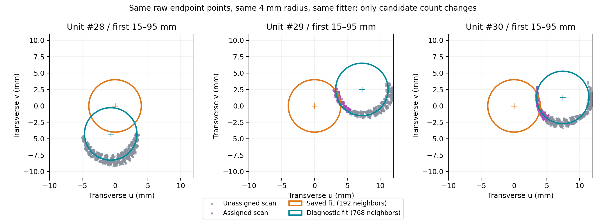

# 控制网局部不贴合与漏分诊断

日期：2026-09-15。对象：`design-control-net-v19`，练武场运行 `20260914T155930-098fe029`，9,216,369 个源点。保存的控制网耗时 15.39 s、全流程 24.99 s，与用户截图一致。本次进行了全量回放、源码跟踪、空间距离审计和隔离变量实验；仅新增调研材料，没有修改生产算法或替换页面结果。

## 判断

**存在可复现的算法设计缺口，至少包含两类，不能统一解释为随机波动或距离阈值过严。**

1. 部分直杆的候选采样偏向截面一侧，偏轴模型仍被判为成功；成功模型缺少面向完整局部点云的复核和重试。
2. 弯段的整段几何确认与逐点归属强绑定。整段不够稳定时，即使局部已有贴合的表面点，仍整段禁止新增归属。

同时，确有一些灰点是正常的模型身份竞争、法向不符或端部侧面限制。不能把所有灰点都直接收进钢筋簇。

“偶发”在本次数据中体现为**少数位置稳定出错**。使用相同全量坐标、法向、台面掩码、设计清单，以 8 和 4 个工作进程分别重跑实际 `fit_control_net`，两次输出的逐点状态和实例编号均与保存结果完全相同。没有发现这批异常由并发随机性造成的证据；这不等于证明所有数据、所有运行环境均无随机问题。

## 1. 已证实：直杆候选采样可以产生“成功但偏轴”的结果

实际链路为：沿设计线查询近邻 → 截面圆心投票 → 选择局部管面 → 拟合轴线 → 原始点按轴线与设计半径分配。

普通直筋默认每个查询站取最近 **192 点**；长度超过 2 m 的直筋才默认取 768 点。近邻是相对设计查询站的距离排序，不保证覆盖完整截面。局部位姿偏移、单侧扫描或密度不均时，选中的点可以集中在可见管面的一侧。

进一步的管面选择只保留这些候选中支持某个圆心的点。轴线模型选择和报告 RMSE 又基于这批选中的证据，因而可能出现“选中一条窄弧 → 错误圆柱可以解释窄弧 → 小残差判为成功”的闭环。未被选中的真实管面不会反过来否决这个成功结果。

源码中已有 192→768 重试，但触发条件是 `model is None` 且失败原因为 `ambiguous-parallel-support`。已经输出模型的局部偏轴不会触发；已有端部修正也只覆盖长度至少 2 m 的 straight，1.15 m 的横向直筋不进入该修正。

定位：

- [近邻选择与上限](../../services/mesh-service/algorithms/rebar_control_net.py) 中 `_candidate_indices`，约第 302–319 行。
- `initial_candidates` / `fit_one`，第 1304–1362 行：长度条件、192/768 与失败重试。
- `_fit_unit`，第 915–972 行：选择管面后交给 `fit_prior_axis`，输出 RMSE 和径向门槛。
- `_refine_straight_ends`，第 513–532 行：长度小于 2 m 直接返回。
- `services/mesh-service/rebar_prior_axis.py:32–180`：在传入的已筛选点集上选择直线/弯曲模型和计算拟合残差。

### 隔离变量实验

对同一结果中的 #28、#29、#30、#34，用生产 `_candidate_indices` 和 `_fit_unit` 原样重放。192 点版本的轴线与保存结果一致；仅将查询近邻数改成 768，其他输入、查询范围、设计半径、拟合器和判定阈值不变。

评价点固定为原轴线端部 15–95 mm 范围的原始非台面点，排除明显轴向法向点，使用较宽空间走廊；两版评价同一批点，不按改进后的残差重新挑选。表中是这批点到最终折线管面的绝对距离中位数，**不是全杆真值误差，也不是独立留出验证**。

| 单元 | 192 点候选：误差中位数 | 768 点候选：误差中位数 | 原模型门槛内比例 → 扩大候选后 |
| --- | ---: | ---: | ---: |
| #28 | 3.776 mm | 0.145 mm | 0.9% → 100% |
| #29 | 3.887 mm | 0.172 mm | 30.6% → 100% |
| #30 | 3.924 mm | 0.168 mm | 32.9% → 100% |
| #34 | 0.995 mm | 0.258 mm | 66.2% → 100% |

原模型都被选为 `evidence-selected-straight`，扩大候选后均选为 `evidence-selected-bow`。这说明当前表达已有能力改善这些案例，主要缺口在证据输入与成功后的复核，不必先增加任意控制点。

#28 的可靠轴向区间原为约 0.479–1.145 m，扩大候选后为约 0.029–1.132 m。原先遗漏的前端证据可重新进入拟合。#29、#30 原模型报告 RMSE 只有 0.577 / 0.533 mm，却无法代表端部完整管面的贴合程度。



灰色为当前未归属点，紫色为已归属点；橙圆为保存模型，青圆为仅扩大候选后的诊断模型。各圆取端部 55 mm 处截面，点为相邻 80 mm 范围的横向投影，少量厚度包含局部倾斜与弯曲。这里的青色仅用于实验图，与练武场“推断补接”的配色语义不同。

另做了独立局部圆心诊断：沿轴向每 10 mm 交替划分训练/留出组，仅调整固定半径圆的两个横向参数。#28、#29、#30 在留出点上的误差中位数分别由 3.725 / 4.057 / 3.762 mm 降至 0.266 / 0.225 / 0.162 mm。这支持端部确有可解释的管面，而非单纯杂点；这个局部试验不能替代整杆身份、连续性和全长验证。

本次没有逐像素将全部截图箭头映射到单元编号。以上编号是在同一份结果中定位并定量复现的实例，不声称每根恰好对应某个箭头。

## 2. 已证实：青色弯段的几何展示与点归属使用不同置信度

当前共有 150 个弯段：124 个点云确认，26 个含推断补接。后者包括 20 个连续曲面不足、5 个复拟合不稳定、1 个形状歧义。

#2、#7、#10 的弯钩有观测参与参数调整，但仍为 `pending` / `design-inferred`；保存报告中的新增归属数均为 0。

| 弯钩所属单元 | 原因 | 距离、有限侧面和法向条件同时通过的未归属点 |
| --- | --- | ---: |
| #2 | `unstable-held-out-curve` | 1,595 |
| #7 | `insufficient-continuous-curved-surface` | 733 |
| #10 | `unstable-held-out-curve` | 1,432 |

这些点由全量记录直接计算，不是截图估数。使用与 `_evidence` 相同的局部点条件：距离门槛、有限侧面位置、有效法向绝对夹角余弦至少 0.75。**通过这些局部条件不等于已经通过身份与局部连续性验证，更不证明这些点全部应立即归属。**

机制是：`_fit_piece` 对整个弯段做连续覆盖、复拟合稳定性和尾腿支持检查；一旦只能形成 `scanGuidedInference`，`fit_curved_pieces` 在第 982–984 行直接保存推断结果并跳过后续分点。末尾的推断补接不写 `owner/status`。前端第 1723–1724 行仍会绘制青色半透明管体。

这项保护有合理目的：不把不确定的完整形状当成实测。但是它缺少“局部扫描确认、缺测部分继续推断”的中间状态，导致可靠局部点被整段置信度连带拒绝。圆弧缺测、局部姿态约束不足时，推断管体本身也允许不贴合；展示完整管体不代表全长实测通过。

## 3. 其他近管面灰点：可解释的判据，并非全部漏查

8 mm 直径钢筋使用 `max(0.9 mm, 0.36 × 半径)`，即 **1.44 mm** 管面误差门槛。应比较点到中心线的距离与半径之差，而不是屏幕距离或到轴线的距离。

- **直杆模型竞争：**对最终所有待定点重新计算同阶段模型的最佳、次佳归一化残差。有 1,310 个不同源点处于某条直杆管面门槛内，全部满足 `second <= best + 0.18` 的歧义条件；本次重算没有剩余无法解释的唯一支持点。不能把它们自动分给离得稍近的一根。
- **已确认弯段：**逐段统计共有 2,302 个“未归属点—曲段”配对通过纯距离门槛，但没有一个同时通过有限侧面位置和法向条件。该数字是配对数，不能当作去重后的钢筋漏检点数。
- **有限侧面与端面：**弯段 `_project` 排除伸到开放端点外的球形包络证据；`_evidence` 检查法向。端面测长可以成功，同时端面本身仍不属于侧面归属。直杆使用的折线径向规则与此不同。
- **没有发现预览索引错位：**100 万预览点的状态与实例编号，按保存的源索引回查全量数组完全相同。前端按编号着色时，有 owner 的点取得实例颜色，无 owner 的点回落原色，灰色本身不是独立诊断原因。

以上审计针对当前输出几何与当前候选空间，不证明所有灰点都是真实钢筋，也不排除台面掩码外的其他问题。截图的 01B-X 展示非台面输入，因此本轮主要分析非台面点。

## 4. 改进次序

**优先补“成功模型的独立复核”，再拆分弯段置信度。**

1. 对已确认直筋增加轻量、轴向分区的完整管面覆盖检查。发现连续区间残差明显偏大、截面选择偏侧或可靠区间异常短时，按需扩大候选或改为截面均衡采样，再交给现有拟合器。以未参与选壳的点复核，避免用同一小片点证明自身正确。
2. 扩大候选应是自适应路径。此次四个单元的实验不支持全局直接把所有查询改为 768，也没有证明这种全局更改不影响耗时、误收率和其他 206 个单元。
3. 将弯段输出拆成局部确认区间和推断区间。局部点归属仍检查连续管面、法向、身份唯一性和局部重拟合稳定性；缺测区间保持推断。不要通过简单放宽全段稳定性阈值或给全部青色管体吸点来实现。
4. 报告增加可见局部质量：每个区间的候选数量、角向覆盖、全量支持率、留出残差及拒绝原因。界面按点或区间解释“超距 / 法向 / 身份冲突 / 整段未确认”，避免只给一个整杆 `fitted`。

先修正证据选择，再讨论容差。把 1.44 mm 全局放宽到 4 mm 可能掩盖偏轴，同时把夹具、交叉筋和邻筋带入；本次无需放宽阈值就能改善的案例已提供反证。

## 5. 外部方法核对与证据边界

PCL 的圆柱分割官方示例同时使用圆柱模型、法向、距离阈值和半径约束；“离表面近”并非圆柱分割中唯一的判定依据。[PCL 圆柱分割文档](https://pointclouds.org/documentation/tutorials/cylinder_segmentation.html)、[法向分割参数](https://pointclouds.org/documentation/classpcl_1_1_s_a_c_segmentation_from_normals.html)

Open3D 官方文档说明法向由局部平面估计，邻域与法向朝向需要单独考虑。[Open3D 表面重建文档](https://open3d.org/docs/release/tutorial/geometry/surface_reconstruction.html) 当前代码使用绝对点积，因此不能把法向正负翻转直接当成本次原因。边界/交叉处法向误差是否合理，仍需针对点的邻域核对；本次只确认它们触发了判据，没有证明所有被法向拒绝的点都是噪声。

上述资料支持常规判据的背景；本项目根因判断主要依据本地代码与同源实验，不从其他库的示例阈值推导本项目参数。

## 6. 复现材料

全部脚本仅用于诊断，输出到 `/tmp/cloudbim-fit-audit-20260915/`。从仓库根目录执行，使用规定的 Python 3.11 环境：

```bash
.cloudbim/mesh-venv/bin/python docs/research/assets/rebar-fit-audit-2026-09-15/audit.py
.cloudbim/mesh-venv/bin/python docs/research/assets/rebar-fit-audit-2026-09-15/ends.py
.cloudbim/mesh-venv/bin/python docs/research/assets/rebar-fit-audit-2026-09-15/trace.py
.cloudbim/mesh-venv/bin/python docs/research/assets/rebar-fit-audit-2026-09-15/competition.py
.cloudbim/mesh-venv/bin/python docs/research/assets/rebar-fit-audit-2026-09-15/replay.py
.cloudbim/mesh-venv/bin/python docs/research/assets/rebar-fit-audit-2026-09-15/plot.py
```

`audit.py` 写出统计后有意以断言退出 1：`REPRODUCED: displayed tube has >=24 geometrically and normally compatible unassigned points`。它用于捕获用户可见症状，不是声称所有管面点都应归属的生产回归规则；本次实跑约 2.94 s。其余脚本正常完成。运行 `plot.py` 前应先完成 `ends.py` 与 `trace.py`。

全量回放 8 / 4 进程分别约 15.24 / 22.64 s，仅包含控制网和诊断调用，不包含法向计算与全流程导出；不用于宣称改进方案提速。两次各对 9,216,369 点比较，状态差异数和编号差异数均为 0。

资料：[逐段审计](assets/rebar-fit-audit-2026-09-15/audit.json)、[生产采样隔离实验](assets/rebar-fit-audit-2026-09-15/trace.json)、[独立端部留出诊断](assets/rebar-fit-audit-2026-09-15/ends.json)、[归属竞争审计](assets/rebar-fit-audit-2026-09-15/competition.json)、[全量回放](assets/rebar-fit-audit-2026-09-15/replay.json)、[预览核验与源码哈希](assets/rebar-fit-audit-2026-09-15/verification.json)。报告基于当前工作区代码，包括任务开始前已有的未提交修改；不等同于某个已提交版本。
