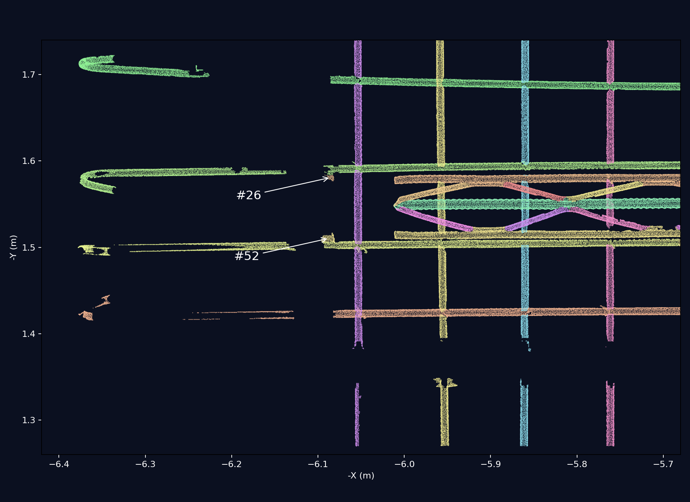

# 截图中弯钩旁两个小点簇的定位

已在当前运行 `20260912T104455-24892901` 中定位。用工作台实际实例调色公式对照截图颜色，并用全部源点重绘相同局部，确认两个箭头指向的对象：

| 截图位置 | 最终实例 | 全量点数 | 同实例其余点最近距离 | 点簇自身 X 向跨度 |
| --- | ---: | ---: | ---: | ---: |
| 上方橙色小点簇 | #26 | 63 | 70.39 mm | 10.36 mm |
| 下方浅黄色小点簇 | #52 | 214 | 47.26 mm | 14.64 mm |

下方浅黄色 #52 点簇在画面上贴近黄绿色 #44 长筋。#44 是旁边的含弯钩钢筋，不能因为投影上接近就把两者当成同一实例。下图使用当前结果的真实源点和实例色，俯视重绘；视角、点密度与用户截图不完全相同。



## 接入来源

两簇的全部点在第 05 步均为 `internal_instance=0`，位于框架带 `refined_zone=2`，原外部簇编号均为 242。

- 上方 63 点在早期轴向接续时接给原实例 #76，之后 #76 合并进 #26。最终段号为 862，接续置信度为 0.55。操作记录中，簇 242 早期共接入 193 点，归属 #52、#76。
- 下方 214 点中，130 点在早期接续，84 点在后续圆柱竞争中接入 #52。最终段号为 861，分别保留 0.55 和 0.45 的接续置信度。

这些来源由前后实例列、最终段号、接续操作记录共同确认，不能仅凭颜色或置信度推断。当前标签确实来自向外延伸接续；尚未通过人工真值确定它们原本属于夹具还是其他钢筋。

全量源点坐标包络，单位米：

- #26 小簇：X `[6.081753, 6.092108]`，Y `[-1.583768, -1.577148]`，Z `[0.036303, 0.039339]`。
- #52 小簇：X `[6.081234, 6.095870]`，Y `[-1.516779, -1.506189]`，Z `[0.033172, 0.041570]`。

逐点源行号已保存于 [#26 点簇](assets/rebar-hook-tip-satellites-2026-09-12/instance-26-components.json) 和 [#52 点簇](assets/rebar-hook-tip-satellites-2026-09-12/instance-52-components.json)。使用现有外部连通尺度分别检查，两个目标都是独立于其最终实例其他观测点的小连通块。

## 当前过滤器为何没有触发

两根关联的设计长度均为 3,600 mm。当前整根触发阈值为 `1.15 × 3600 + 20 = 4160 mm`：

- #26 当前轴向跨度约 3,668.81 mm，超设计约 1.91%。
- #52 当前轴向跨度约 3,670.30 mm，超设计约 1.95%。

因此它们没有进入异常超长二次复核。这次截图对应的是长筋末端小卫星簇问题；此前检查的八根原主干超长短筋并不能解释这两处。

从位置看，#26 同实例主体最大 X 约 6.01144 m；#52 主体最大 X 约 6.01153 m，此外还有原有 28 点与单点延伸到 X=6.03399 m。故 #52 的 47.26 mm 是到“同实例所有其他点”的最小间距，到大块主体约有 70 mm，不能混用两个口径。

## 后续修复方向

给已经接入的外部末端小簇增加局部检查入口：利用已有主干端点、接入来源、簇自身尺寸和与主体的断档证据，不再要求整根长筋先超过百分比长度阈值。这样可检查占整根长度不到 2% 的远端小块，同时保留现有弯钩和可靠原始主干保护。不需要重新寻找设计钢筋。

本次仅定位和追溯，未改生产参数、点标签或算法。

复现：在仓库根目录，使用项目 Python 环境运行：

```bash
OPENBLAS_NUM_THREADS=1 .cloudbim/mesh-venv/bin/python docs/research/assets/rebar-hook-tip-satellites-2026-09-12/locate.py
```
