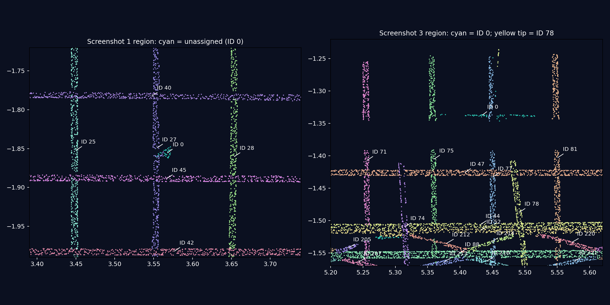

# 钢筋实例视图中的碎片：排查结果

> 后续处理已按用户要求落地：最终未形成实例的钢筋候选点直接归为噪音，不再进行额外归属判断。新运行 `20260912T094935-22406573` 清理 3,278 点，未分配钢筋点为 0；53 项相关测试和预览、LAS、354 个瓦片核验通过。详见文末“最终残点清理”。下文诊断保留原截图运行的历史事实。

核查运行：`20260912T092723-e388d613`（用户确认与截图一致）。源点数 9,216,369；HEAD `b247581`，工作区另有其他任务的未提交修改。本次只新增排查文档和证据，不修改算法、前端或已有运行结果。

## 结论

截图中的碎片包含两类情况，并非统一的“显示错色”。

1. 第一张图的青色小团、第三张图的青色横条，是 `complete_class=3, complete_instance=0` 的**未分配钢筋候选点**。它们没有钢筋实例编号，因此不计入 210 个实例，也不参与逐实例长度/直径统计。实例视图把它们按青色类别色一并显示，容易误认为另一根钢筋的实例颜色。
2. 第三张图蓝色竖筋上方的黄绿色短段，确实属于 **#78**。第 06 步将 101 个原来未分配的外部点接给了短筋 #78，形成与主体相隔约 139 mm 的卫星点簇。该接续缺少足够的连续性约束，是实质性的可疑归属；目前没有证据确定这 101 个点实际属于哪一根钢筋或夹具，不能直接改归相邻 #77。



左图复现第一张截图区域；右图复现第三张截图区域。图中坐标为源点米制坐标。图像使用同一运行的预览抽样，不是示意图。右图顶部黄绿色细段为 #78；青色横条为 ID 0。

## 显示链路核验

- 预览 1,000,000 个点：按 `source_indices.bin`（uint64）对照 `complete_instance.npy`，标签差异 **0**；坐标减预览原点后的最大浮点误差约 `1.19e-7 m`。
- 全部 354 个 PNTS 瓦片、2,302,885 个点：用源坐标匹配重查附属属性，`complete_class`、`complete_instance`、`complete_cluster` 差异均为 **0**。
- `scripts/pointcloud-debug/viewer.js` 的 `stepSemanticData` 把未编号钢筋标成语义类别 9；`resultDisplayColors` 只为 ID > 0 的点覆盖实例色，ID 0 保留类别色 `#2dd4bf`。类别为“全部钢筋（去噪后）”时也包含待定类别 9。
- Tiles 分支的 ID 0 使用灰色，预览分支使用青色，存在显示语义不一致；但源标签本身没有发生错位。截图中青色残点与预览分支相符。

证据：[sidecars.json](assets/rebar-instance-fragments-2026-09-12/sidecars.json)。

## 青色碎片为何没有被清除

该运行共有 **3,147 个未分配钢筋候选点**，其中 2,460 个融合分数为 1.0，622 个为 0.65，65 个为 0.25。按现有 `exterior_clusters` 连通规则形成 94 个组件；组件数受连接尺度影响，不能解释为 94 根钢筋。

| 截图区域 | 源点证据 | 最终归属 | 观测范围 |
|---|---|---|---|
| 第一张图紫色 #27 旁青色小团 | 行 8817763、8817899；原簇 99、101 | ID 0 | 主要两个组件共 305 点，约在 X=3.56、Y=-1.86 m |
| 第三张图蓝色 #77 右侧青色横条 | 行 679269；原簇 192 | ID 0 | 218 点，横向跨度约 39.3 mm |
| 第三张图蓝色 #77 左侧青色横条 | 行 607005；原簇 169 | ID 0 | 199 点，横向跨度约 34.9 mm |

这些点从前面的几何分类/融合阶段就被保留为钢筋候选。第 06 步无法为其提供可靠圆柱实例归属，但高分保护和最终过滤门槛让部分候选继续存活：

- `_high_confidence_steel` 对融合分数 ≥ 0.9 的钢筋候选设置保护。
- 夹具残留过滤的候选还要排除 `protected_high`；靠近夹具的可疑点仍可能因旧分数而被保留。
- `final_fragment_filter` 要求整组件所有点分数 ≤ 0.5，并满足很小的空间跨度和与保留钢筋的间距条件。当前运行有效最大跨度仅约 **9.61 mm**，上述 35–39 mm 高分横条不符合删除条件。该运行此步骤删除 **0 点**。
- 另一整簇过滤器允许删除高分点，但要求可用设计候选和长度、点数双重不足证据；并不能兜底处理所有未分配残片。

“融合分数很高”表示前面分类证据，不等于“已完成实例归属”或“几何上已验证为完整钢筋”。不能把 3,147 点全部无条件删除，其中也可能包含真实钢筋的观测残段。

证据：[逐点追溯](assets/rebar-instance-fragments-2026-09-12/point-traces.json)、[待定组件清单](assets/rebar-instance-fragments-2026-09-12/pending.json)。第二张截图未单独定位到唯一原始点集合，不以颜色相似作为确定归属的依据。

## #78 的碎片接续与长度变化

| 量 | 值 |
|---|---:|
| 第 05 步 #78 点数 | 5,347 |
| 第 06 步 #78 点数 | 5,448 |
| 额外接入的顶部碎片 | 101 点 |
| 碎片自身 Y 向跨度 | 36.56 mm |
| 碎片与 #78 主体最近点距离 | 139.37 mm |
| 第 05 步长度摘要 | 322.76 mm |
| 第 06 步长度摘要 | 485.28 mm |
| 最终点云包络长度 | 498.07 mm |
| 关联设计单元长度 | 280.00 mm |

顶部碎片源实例 ID 为 0、原簇为 169，最终实例 ID 为 78、段 ID 为 822。40 点的置信度为 0.55，对应 `_early_exterior_support`；61 点为 0.45，对应后续圆柱竞争接续。

`GuidedParameters.exterior_reach=0.5 m`：第 06 步沿实测短筋末端的圆柱轴向外搜索最多半米。#78 本体略倾斜，外推后经过蓝色长筋旁的这批点。早期接续并不接收设计长度约束，后续也没有把该卫星组件作为独立的归属质量问题拦截。

局部重放使用相同源点、法线、夹具参考和附近 7 根候选实例，共 96,737 点：

```text
exteriorReachM=0.50 -> 顶部 101 点中，40 点在早期阶段接给 #78
exteriorReachM=0.08 -> 同一批点，早期接给 #78 的数量为 0
```

这复现并定位了外推接续路径。缩短到 80 mm **仅作为单变量诊断对照**，不是可直接上线的修复；全局缩短搜索距离会影响其他被夹具遮挡的正常钢筋接续。

最终 `lengthM` 使用拟合段端点在主轴上的极差；`shapeReview.observedLengthM` 使用全部归属点的包络极差。两者都可能把中间空隙包含在长度里，均不等于各个可见连通段的长度之和。故“碎片很短”与“该 ID 的长度仍很长”完全可以同时发生。

此外，#78 主体与其关联设计单元的位置有明显偏移，属于短筋设计关联质量的另一项问题，不能单靠数量一一对应就视为正确配对。

证据：[重放结果](assets/rebar-instance-fragments-2026-09-12/replay_extension.json)。

## 与已有统计的关系

已有统计笔记对应 `20260912T091923-1f27b275`，不是本次截图的 `092723`。两个运行结论接近，但不可混用精确数字。对本次运行重新计算：

- 210 个实例对应 210 个设计匹配单元；该数量经过设计先验参与整理，不是独立盲测结果。
- 长度整体 MAPE **8.96%**，193/210 在 ±20% 内；短筋 MAPE **34.76%**，仅 3/12 在 ±20% 内。
- 13 个实例标记 `too_wide`；旧笔记对应运行是 16 个。
- 207/210 个拟合直径在 0.01 mm 内等于设计值，但拟合使用了设计直径候选正则化，不能作为独立验证。
- 未编号残点没有包含在以上逐实例统计中；有编号的错误卫星点也不增加实例数量。

## 版本范围

同一批源点在现存全部 8 次运行（`20260912T080021-ebdf47b7` 至 `20260912T092723-e388d613`）里，最终类别和 ID 均一致：青色示例一直是 ID 0，顶部黄绿色示例一直是 ID 78。至少在 **9 月 12 日北京时间 16:00** 的运行中已存在，不是最后一次运行才产生。

Git blame 将半米外推和高分保护逻辑追到 **`22b48b8`（9 月 11 日 15:01）**；只处理低分小残片的末尾过滤器追到 **`fc78d63`（9 月 12 日 10:52）**。这是相关逻辑进入仓库的提交，不等于已通过历史重放证明的首次引入缺陷提交。现有结果不足以精确认定首次回归版本。

## 修复方向与本次边界

1. 实例视图将“已编号实例”与“未分配候选”明确分开，统一预览与 Tiles 的待定颜色，明确显示未分配点数。显示开关不能替代分割修复。
2. 接续同时检查短筋已观测长度、终端外推距离、局部连续性及竞争归属；对 #78 这种少量远端卫星点保留独立复核状态，而非自动视为有效接续。
3. 最终质量统计增加未分配残点、异常卫星组件、实测连续覆盖长度和间隙指标。避免用“总 ID 数相符”表达分割完成。
4. 去噪复核需要结合实测圆柱支持、局部方向和夹具表面证据处理高分残片，保留真正短筋、弯钩及遮挡断段。

本次完成诊断与原始证据核验，未实施生产修复。不能把全部断开组件或所有青色点当作噪音删除，也不能将 #78 顶部碎片直接改归 #77。

复现命令（在仓库根目录，使用项目 Python 3.11 环境；均为隔离诊断，不启动服务）：

```bash
OPENBLAS_NUM_THREADS=1 .cloudbim/mesh-venv/bin/python docs/research/assets/rebar-instance-fragments-2026-09-12/replay_extension.py
OPENBLAS_NUM_THREADS=1 .cloudbim/mesh-venv/bin/python docs/research/assets/rebar-instance-fragments-2026-09-12/verify_sidecars.py
```

## 最终残点清理（已实施）

用户随后明确要求不再逐簇检查归属，直接处理最终剩余残点。因此第 06 步在全部接续、合并和打磨结束后，统一将 `complete_class=3 && complete_instance=0` 改为噪音类 4，并清零残留段编号和置信度。不受早期融合分数或临时保护状态豁免。原始点坐标、源 LAS 及前序阶段属性不变；噪音点仍可查看和导出。

算法版本为 `design-guided-instances-v13-final-unassigned-noise`；结果新增 `designReview.finalUnassignedNoise` 清理统计，工作台显示“最终未成实例残点归噪音”。

重跑前最新运行已是 `20260912T094236-39c1e620`，包含其他任务同期修改，原有实例数为 206、未编号点为 3,278。这与最初截图运行的 210 个实例、3,147 个未编号点属于不同基线。

新运行 `20260912T094935-22406573` 相对该最新基线：

- 恰好 3,278 个点从钢筋候选改为噪音，其中高分点 2,463 个；最终未编号钢筋点 0。
- 所有实例标签逐点相同，206 个实例的数量没有因本次清理改变。
- 第一张及第三张截图中已定位的青色残点均为噪音类 4。
- 已编号的 #78 卫星点不属于“最终未编号残点”，本次没有修改其归属。
- 100 万预览点与源标签一致；全部 354 个瓦片、2,302,885 个瓦片点中未编号钢筋点为 0。
- `complete-steel.las` 与 `resolved-steel.las` 均为 1,563,956 点；`pending-steel.las` 为 0 点；`noise-only.las` 为 445,553 点；完整 LAS 保留全部 9,216,369 点。
- 53 项 Python 测试通过，包括最终高分残点归噪音、钢筋接续、短弧、弯钩、终端打磨及计数一致性；工作台实例显示测试、JS 语法和 diff 检查通过。

该规则定义的是最终实例结果的残点处理口径，不宣称每个残点都已通过独立几何鉴定为物理噪声。

[完整核验结果](assets/rebar-instance-fragments-2026-09-12/final-unassigned-noise-validation.json)
