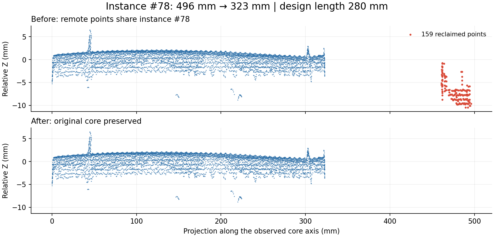

# 异常超长尾部回收：实现与验证

已接入第 06 步的全部合并和夹具打磨之后，默认启用。版本为 `design-guided-instances-v15-overlength-tail-recovery`。新运行 `20260912T101509-17e6a074` 已在本地工作台发布。

## 真实结果

固定源点云为 9,216,369 点，源 SHA-256 见原始验证 JSON。对照运行 `20260912T100054-e6470275`，第 05 步归属和分类数组相同，坐标相同。

| 项目 | 回收前 | 回收后 |
| --- | ---: | ---: |
| #78 轴向点云跨度 | 495.94 mm | 322.67 mm |
| #78 点数 | 5,701 | 5,542 |
| 设计长度依据 | 280 mm | 280 mm |
| 钢筋实例总数 | 210 | 210 |

只将 #78 的 159 个远端接入点归为噪音，其余全部点的最终类别、归属、段号、置信度均相同；所有点的原簇编号保持一致。该尾块与主干间断档为 138.37 mm，远大于此例的 30 mm 断档门槛。主干完全保留，未按设计长度硬切到 280 mm。

匹配中有三个可信短筋候选，均长 280 mm、直径 8 mm；全局数量分配选中的候选与局部前两名不同。实现从已有主干候选中验证长度共识，并不把编号分配强行视作精确位置匹配，也不新增设计搜索。不同长度候选冲突仍然跳过。

本次 159 点对应当前固定基线；历史排查中的 101 点属于更早的运行，不能混用。159 点中有 10 点融合分数不低于 0.9；分类高分不替代实例接续证据。



## 耗时

固定第 05 步输入、16 workers、BLAS 单线程，预热一次后进行 20 次开关配对测量：

| 测量范围 | 中位数 | P95 |
| --- | ---: | ---: |
| 关闭过滤器：保留末尾共享分组 | 0.0271 s | 0.0280 s |
| 开启过滤器：含同一共享分组 | 0.0773 s | 0.0780 s |

配对新增耗时中位数 **0.0499 s**。分组从原有质量统计提取后复用，没有把这部分成本隐瞒为新增性能收益。一次实际过滤中的已有设计候选检查约 0.0008 s；新增设计空间查询次数为 0。

同一第 05 步输入的完整第 06 步开关对照：关闭 9.570 s，开启 9.592 s。这只有一组，差异含调度噪声；以 20 次配对结果衡量新增模块更合适。

随后通过开发栈管理器重新加载代码，经工作台从原始 LAS 完整重算，流水线耗时 45.26 s，第 06 步 9.56 s，过滤器含共享分组 0.0786 s。该完整运行没有同时进行另一个完整的关闭版本，因此不将历史总时间差宣称为精确整流程增幅。瓦片附属数据生成发生在流水线计时之外。

额外持久到步骤末尾的接入来源数组为每源点 1 字节，本例 9,216,369 字节（约 8.79 MiB）。投影、掩码、分箱按实例临时使用，最大每实例 100 万点、10 万箱、128 块；超过预算保持原结果。未做独立进程的额外峰值 RSS 配对测量，不能将来源数组大小当作全部额外峰值内存。

## 实现与保护

- `rebar_overlength_tails.py`：复用设计候选；以可靠内部轴和实际归属点测量跨度；只对异常实例执行一维断档判断。
- `design_guided_instances.py`：早期和后期接入时记录直接命中/整簇搭带来源，末尾调用过滤器；记录统计与操作日志。
- `rebar_cluster_quality.py`：复用最终实例分组，避免重复全场分组；被回收实例的有限段端点和点数同步刷新。
- 工作台摘要新增“异常超长尾部回收”，显示实例数、点数及耗时。

原有独立内部点、没有接入来源的可靠外部观测、受保护弯钩、明显弯曲主干不会因此被裁剪。主干本身已超长、连续超长、设计覆盖不完整或长度冲突时保留并记录原因。本例另有 8 个主干自身超长实例保留；此功能不把所有长度异常强行修成设计尺寸。

## 验证范围

- 18 项新增测试覆盖：左右/双尾、单个远点、连续超长、容差内超长、主干过长、未居中的部分主干、跨边界完整组件、弯钩、原始归属保护、低密度、大坐标旋转、设计共识与冲突、缺失设计、陈旧段端点、幂等、源点顺序及资源预算。
- 相关 Python 测试总计 78 项通过；包含内外筋合并、终端打磨、弯钩、最终过滤及 V6 适配器。
- 实际 100 万预览点的类别、实例、段号、置信度、簇编号与源索引一一对应。
- 完整 LAS 的 9,216,369 条最终属性逐点一致；钢筋/噪音子集数量与报告一致，未编号钢筋为 0。
- 全部 354 个瓦片、2,302,885 个瓦片点的类别、实例、簇属性与最终点云一致。
- 工作台预览加载、过滤、轴段及瓦片协议检查通过；没有进行逐根人工真值标注，本次验证不能代替全模型的人工质量验收。

## 可复现证据

- [第 06 步配对重放与计时](assets/rebar-overlength-tails-2026-09-12/replay-results.json)
- [已发布运行的逐点/导出核验](assets/rebar-overlength-tails-2026-09-12/published-run-validation.json)

在仓库根目录执行；前两条是隔离测试工具，不启动服务或改写已有运行：

```bash
OPENBLAS_NUM_THREADS=1 .cloudbim/mesh-venv/bin/python docs/research/assets/rebar-overlength-tails-2026-09-12/replay.py
.cloudbim/mesh-venv/bin/python docs/research/assets/rebar-overlength-tails-2026-09-12/verify_run.py 20260912T101509-17e6a074
.cloudbim/mesh-venv/bin/python docs/research/assets/rebar-overlength-tails-2026-09-12/plot.py
```

测试从 `services/mesh-service` 执行：

```bash
../../.cloudbim/mesh-venv/bin/python -m unittest test_rebar_overlength_tails test_design_guided_instances test_rebar_terminal_polish test_rebar_cluster_quality test_rebar_final_filter test_rebar_hook_clusters test_rebar_geometric_v6
```
