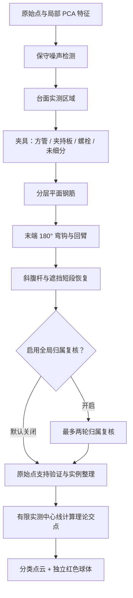

# V5 分类调试（算法修订 2）

本次调试数据为资产 5：`YB-1mesh2.0.las`，原始记录共 9,216,369 点。该扫描没有人工逐点标注；合成几何回归中的召回率不能当成这份扫描的准确率。

## 当前流程



`ownership_review_enabled` 是严格布尔参数，默认 `false`。关闭时保留台面、夹具和钢筋阶段掩码，最终分类评分不能反过来覆盖它们。原始点支持验证仍执行，以免没有实际点支持的模型被发布。

## 几何判断

- **方管**：共用长轴、沿边相接的矩形面，并有第三面和相对面支持。只看到两个 L 形相邻面时，不直接断言为空心方管。稀疏的相对面先保留为未细分夹具，再在原始点上恢复有实测支持的其他面；不填充空心内部。
- **夹持板**：确认方管外侧的较小平面片，可以使用较窄的板宽门槛，仍须通过实测宽度、填充、平面残差和法向一致性检查。普通板件保留原有宽度门槛。法向检查使用未裁剪表面的邻域，防止把圆弧截成一条平面带后误判为板。
- **螺栓**：沿用已有有限几何模型检测，新增独立标签和显隐。未形成可靠子类证据的夹具保留为未细分。
- **平面筋**：分层后用局部轴向、二维投票和圆柱表面拟合建立有限中心线。
- **斜腹杆**：局部倾斜轴向产生条带内投票，再使用投票附近的完整表面观测拟合共同轴线。局部 PCA 不稳定的点也能参与圆柱拟合；被遮挡的短段在共同轴线上连接，缺失部分仍是推断段。孤立短段不能绕过实例长度门槛。
- **180° 弯钩**：只在已确认平面筋末端搜索，利用圆管表面支持拟合竖向平面内的半圆与反向回臂；不要求一定先识别出两层钢筋网。逐角度检查观测覆盖，缺失的半弧不能凭空补成实测弧线。拟合后截短原直线的过度延伸，保持同一物理实例。

这里的向量仍是可解释的几何特征，例如表面法向、轴向切线、线性度和平面度，不是训练得到的神经网络嵌入向量。

## 输出与前端

| 属性 | 值 |
|---|---|
| `SCENE_CLASS` | 0 未知，1 台面，2 钢筋，3 噪声，4 夹具 |
| `FIXTURE_KIND` | 0 未细分，1 方管，2 夹持板，3 螺栓；仅夹具点有效 |
| `REBAR_ROLE` | 0 待判定，1 平面筋（包含所属弯钩），2 斜腹杆；仅钢筋点有效 |

原始标签、显示瓦片和统计都携带子类。显示采样邻域出现冲突时保持待判定，不强行选择子类。旧产物缺失新属性时按原有大类读取。

调试面板按场景、夹具、钢筋分组控制显隐，适用于各种着色方式和后来加载的瓦片。全显状态不逐点创建过滤索引，重复材质更新复用过滤结果。中心线和理论交点是独立辅助图层。

重新运行时保留上次结果并显示已用时间，分类显隐仍可操作。针对全量扫描的长计算，后端和算法请求等待上限统一为 60 分钟，前端为 62 分钟；延长等待并不代表算法已满足 15 分钟性能目标。

交点使用有限的实测中心线计算，保留原来的距离与夹角检查；不把推断缺口当作实测钢筋，也不生成“交点点云类”。Three.js 红色球体可拾取，选择状态单独高亮。

## 复验命令

```bash
# 前端
npm run build
node --experimental-strip-types --test src/features/rebar-visualization/*.test.ts

# mesh-service：在该服务目录中运行
../../.cloudbim/mesh-venv/bin/python -m unittest discover -p 'test_rebar*.py'

# 集成服务统一由管理脚本启动或重建
scripts/cloudbim-dev.sh start
```

关键回归包括：窄夹持板与邻近圆柱、L 形件、半密度方管、原始标签到 PNTS 的子类传输、关闭复核的阶段掩码、默认特征下的遮挡斜杆、平滑圆管表面的跨层 U 形弯钩，以及 16 mm 邻杆不被吸收。

## 本轮验证记录（2026-09-07）

- mesh-service 的 224 项钢筋回归测试通过；前端 15 项可视化测试、生产构建与 Go 钢筋相关测试通过。
- 真实组件浏览器验证通过：1100 px 与 390 px 视口下逐项切换 10 个类别，运行请求默认携带 `ownership_review_enabled: false`。
- 真实 PNTS 解码与 Three.js 组件验证通过：先隐藏部分类别，再加载第二块瓦片，后加载的瓦片沿用显隐状态；重复材质更新复用索引，恢复全显后还原原始索引。该项使用已知标签的合成瓦片测试，不是扫描准确率测试。
- 独立交点图层验证通过：关闭中心线后球体仍可见、可拾取；关闭交点后球体移除，几何与材质正常释放。

浏览器测试记录与截图保存在忽略目录 `.cloudbim/v5-ui-review/`，测试日志保存在 `.cloudbim/rebar-v5-validation/`。

全量运行曾暴露夹具面反复扫描不相交点块的开销，因此补充了空间范围剔除和阶段掩码复用。剔除范围沿用原来精确掩码的边界，局部实测格点、表面距离、置信度计算与原始支持验证保持不变。旋转面、边界点、非有限输入及完整分类属性的等价测试均通过。

在同一份 LAS 的 30 个空间分块、1,923,026 点上，优化前后的基础特征、边界更新和原始标签全部逐数组精确相等（包括浮点置信度和候选 CSR）。首末分块落盘间隔由 462.37 秒降为 260.11 秒；这是该批分块的局部对照，不是全量耗时。记录见 `.cloudbim/rebar-v5-validation/spatial-pruning-equivalence.json`。

## 性能优化交接：全量验证已中止

用户要求先提交当前成果、在新窗口继续优化。最后一次运行在 **2042.63 秒（约 34 分钟）**时主动中止，尚未完成全量产物；峰值 RSS 为 **734,871,552 字节（约 701 MiB）**，运行期间算法源码未变化。不能把本轮记录当作全量准确率或性能验收通过，也没有更新资产的最新结果。

已记录阶段耗时：原始特征 221.56 秒、夹具 461.49 秒、平面筋 14.50 秒、弯钩 4.59 秒、腹杆 81.24 秒、原始支持验证 5.67 秒。最终原始归属仍是主要开销；中止时保存了 132 个基础特征分块、125 个原始标签分块和 115 个边界更新分块。

同一工作区下的交接材料均在忽略目录中，不随 Git 提交：

- `.cloudbim/rebar-v5-validation/real-full-spatial.log`：完整阶段日志与中止位置。
- `backend/data/rebar-v5-validation/debug-20260907-v2-spatial.performance.json`：源码校验和、参数、耗时与内存。
- `.cloudbim/rebar-v5-validation/interrupted-runtime-v2-spatial/`：约 1.3 GB 的空间记录、原始特征及已完成标签快照，附 `snapshot.json`。内存中的拟合模型未序列化，**不是可以直接恢复 CLI 的完整检查点**；可用于分块分析和性能采样。
- `.cloudbim/rebar-v5-validation/before-spatial-pruning/` 与 `after-spatial-pruning/`：30 个分块的等价对照材料。

下一步优先测量 `pipeline.stage_features`、`pipeline.classify`、`pipeline.finalize_raw_ownership` 以及 `scene.refine_fixture_faces` 的分项耗时。空间范围剔除已实现；不要通过跳过原始支持验证、边界特征或改变置信度来伪装成等价优化。局部测试与构建已通过，真实扫描的完整结果及末端/腹杆效果仍需继续验证。

中止时捕获的调用栈为 `finalize_raw_ownership → raw_chunk → stage_features → bolt_mask`，停在 `bolts.py` 的 `head_keys = [tuple(cell) for cell in ...]`。这只是一个采样位置，但说明应同时优先检查螺栓掩码是否也在对每个螺栓重复扫描整块点、构造 Python 元组列表；不要仅继续优化夹具面。

为交接工作区，开发栈已通过 `scripts/cloudbim-dev.sh stop` 停止；继续开发时使用同一脚本的 `start`。
