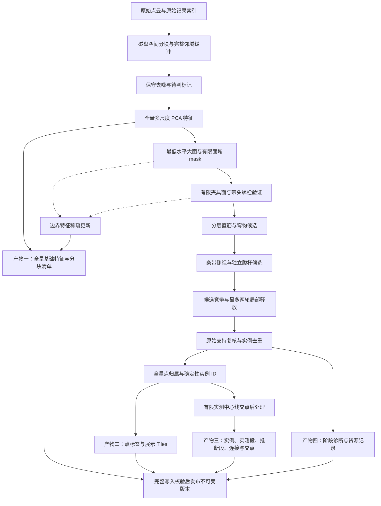

# 钢筋分割 V5

V5 的入口是 `GeometricV5Adapter`，只使用点云证据。坐标单位为米，Z 已校正；台面按最低合格大平面识别。点云实例与派生几何分开保存，交点不占用点分类、方向或实例编码。

当前实现仍在量化和真实扫描验收中。单个开发场景通过不代表完整验收通过；发布依据是固定多场景报告、真实区域复核和完整产物性能报告。

2026-09-06 续作：四类已知开发错误已修复并加入回归，三个开发场景全部通过；首次冻结留出验收仍有弯钩实例一致性失败。随后按用户明确要求将 V5 设为默认，并修复夹具原始点复核超出邻域预算所导致的 `provider_failed`。默认切换不代表验收通过，未进行新的真实扫描性能验收。历史指标见 [续作记录](rebar-v5-recovery-2026-09-06.md)，本次修复见 [运行故障记录](rebar-v5-provider-fix-2026-09-06.md)。

原始文件不修改。明确噪声退出几何检测，但仍有特征和标签记录；特征无效用有效性字段说明。台面、夹具的检测 mask 只描述观测面域。全局复核可根据更强的实测圆柱证据释放局部 mask，最终仍无法确定的点保留未知或实例候选。

## 数据合同

| 对象 | 合同 | 内容 |
|---|---|---|
| 发布清单 | `rebar-artifact-manifest-v2` | 算法、版本、参数、特征入口、产物哈希与统计 |
| 几何结果 | `rebar-analysis-v2` | 台面、夹具、层、实例、连接、独立 intersections |
| 原始标签 | `rebar-raw-labels-v2` | 全部有限坐标记录的场景、实例、方向、置信分与不确定性 |
| 特征 | `rebar-features-v1` | 全量多尺度 PCA 与按原始索引保存的边界更新 |
| 展示 | `rebar-visualization-v3` | 五种场景类别、独立实例和方向着色 |

`source_index` 是原始记录的 uint64 索引。非有限坐标记录不进入产物，之后的记录不重新编号；重复坐标仍是不同记录。每个空间核心区域只输出一次。LAS/LAZ 按文件流读取后再建立空间索引，读取块不是空间邻域。

场景值固定为 `0=未知/其他、1=台面、2=钢筋、3=噪声、4=夹具/围挡`。`rebar_class` 仅为 0/1，`rebar_instance=0` 表示没有确定实例。`rebar_flags & 2` 表示归属不确定，未使用交点位。置信分是几何证据强弱，不是校准概率。

分块 NPZ 的每个数组都有明确 dtype 和形状。清单声明块点数、最小/最大原始索引、SHA-256；索引范围是查找边界，不表示该块索引连续。候选实例用 `candidate_point_indices / candidate_offsets / candidate_instance_ids` 保存稀疏 CSR，行号相对于同块 `source_index`。特征包含 `surface_*` 与 `axis_*` 的 normal、tangent、linearity、planarity、spacing、neighbor_count、neighborhood_radius 和 valid；normal_valid 与 tangent_valid 分别说明法向量和主方向是否可用。

基础特征只排除确认噪声。`boundaryUpdates` 指向台面、夹具移除后附近原始点的稀疏特征块，按 table、fixture 的顺序应用；基础特征不会被覆盖。基础和标签清单共享源记录指纹。前端不默认下载特征，受资产鉴权保护的 features 路由提供独立读取。

实例 `role` 为 planar 或 web。`observedSegments` 是原始支持验证后的有限实测段；`inferredSegments` 只用于关联和虚线展示。推断段不招募扫描点、不扩大 mask、不生成交点。折线存在无法唯一排序的分叉时保留观测段并记录 `associationPending`，避免编造闭环。腹杆连接保存候选钢筋 ID，不合并实例。

交点输出 `id`、position、instanceIds、segmentRefs、angleDegrees、residual 和 evidence。算法只比较不同实例的有限实测段，无向夹角至少 5°，最近距离最多 0.001 m。两个最近点的中点是交点位置；残差另存。折线重复交点按共同位置一致性去重，交点为空是有效结果。交点函数不接收或修改点标签。

## 参数与资源

有效参数由描述符和 `Params` 统一生成。以下为主要默认参数，精确值以每次产物记录为准。

| 参数 | 默认值 | 用途 |
|---|---:|---|
| block_size | 0.25 m | 磁盘空间网格；过密核心继续细分 |
| block_point_limit | 300,000 | 单核心点数上限 |
| neighbourhood_point_limit | 1,000,000 | 单邻域物化上限，超限明确失败 |
| query_batch_size | 4,096 | PCA 查询批大小 |
| surface_radius / axis_radius | 0.012 / 0.032 m | 表面与轴向特征尺度 |
| feature_max_neighbors | 64 | 每尺度邻域采样上限；轴向支持先空间均匀取样 |
| detection_voxel_size | 0.0035 m | 候选生成格距，不减少全量特征或标签行数 |
| detection_point_limit | 1,000,000 | 候选云的明确内存预算 |
| min_radius / max_radius | 0.0025 / 0.012 m | 圆柱物理半径范围 |
| table_distance | 0.004 m | 台面残差范围，仍要求有限观测面域 |
| fixture_fit_distance | 0.0015 m | 夹具平面拟合残差尺度 |
| axial_gap / join_gap | 0.070 / 0.090 m | 观测分段与有唯一证据的断段关联 |
| web_strip_width / overlap | 0.16 / 0.064 m | 腹杆条带及邻域缓冲 |
| intersection_tolerance | 0.001 m | 交点硬上限，不按钢筋半径放宽 |

PLY/PCD 沿用整体解码，仅允许头部声明不超过 200 万点；头部按格式解析，注释和重复声明不能绕过限制。LAS/LAZ 全量特征计算不拼接原始坐标云。查询预算和迭代次数有硬上限，超限失败不会发布残缺结果。小矩阵计算使用一个 BLAS 线程，退出分析后恢复原设置。

输入文件描述符在整个流程中固定，bootstrap 后和发布前校验文件身份。V5 版本目录不可覆盖，完整写入并校验后重命名发布，后端再更新 latest；失败保留上一成功引用，也不自动清理旧成功目录。

## 复核与展示

验收 CLI、门槛和报告状态见 [rebar-v5-validation.md](rebar-v5-validation.md)。真实样本的七个区域在结果运行前按原始扫描固定在 [rebar-v5-review-regions.json](rebar-v5-review-regions.json)，区域名称中的 candidate 是复核假设，不是真值。

真实产物试跑使用 `scripts/rebar-v5-benchmark.py`，每次必须提供新的 output 目录。报告保存源 SHA-256、源码指纹、规范化参数、块大小、耗时、峰值 RSS 和产物磁盘量。该工具不更新资产 latest。`scripts/rebar-v5-review.py` 读取原始 LAS 和标签分块，按原始索引连接，生成固定区域的俯视/侧视分类和实例叠加图；没有人工标注时不能称为现场准确率。

点云、实测/推断中心线、交点标记是独立展示对象。交点开关默认开启，即使隐藏中心线也可显示交点。点击标记展示坐标、关联钢筋、线段、夹角和残差；切换资产/结果及关闭视图会释放对象并清除旧选择。
